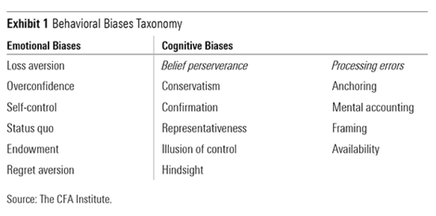

## Table of Contents

## What is cognitive bias in investing?

Cognitive bias in investing refers to the common mistakes people make when they are thinking about money and making choices about investments. These mistakes happen because of the way our brains work. For example, people often feel more pain from losing money than they feel happiness from gaining the same amount. This can make them afraid to take risks, even when those risks might lead to good results.

Another example of cognitive bias is when people pay too much attention to recent events or news. They might think that because the stock market went up last month, it will keep going up. But this isn't always true. This kind of thinking can lead people to make bad investment choices, like buying stocks at high prices just because they've been doing well lately.

Understanding cognitive biases can help investors make better decisions. By knowing about these common mistakes, people can try to avoid them. For example, instead of just following the latest trends, investors can do more research and think about the long-term value of their investments. This can help them build a stronger and more successful investment plan.

## What is emotional bias in investing?

Emotional bias in investing happens when people let their feelings guide their investment choices instead of using facts and logic. For example, if someone feels really excited about a company because it's popular or new, they might invest a lot of money in it without doing enough research. This can lead to bad decisions, like buying stocks at a high price just because everyone else is doing it.

Another common emotional bias is fear. When the stock market goes down, people might feel scared and sell their investments quickly, even if it's not the best time to do so. This fear can make them miss out on potential gains if the market goes back up. Emotional biases like excitement and fear can cause investors to make choices that aren't based on careful thinking, which can hurt their investment returns over time.

## How do cognitive and emotional biases differ?

Cognitive biases and emotional biases both affect how people make investment choices, but they come from different places. Cognitive biases happen because of the way our brains naturally think. For example, we might remember recent news about the stock market and think it will keep going in the same direction, even though that's not always true. These biases are about how we process information and can lead us to make mistakes without realizing it.

Emotional biases, on the other hand, are driven by our feelings. For instance, if we feel excited about a new company, we might invest in it without doing enough research, just because it feels good. Or, if we're scared when the market goes down, we might sell our investments quickly, even if it's not the best time. Emotional biases make us act based on how we feel in the moment, rather than what might be best for our long-term goals.

Understanding the difference between cognitive and emotional biases can help investors make better choices. While cognitive biases are about how we think and process information, emotional biases are about how our feelings influence our decisions. By being aware of both types of biases, investors can work to make more rational and well-informed choices, leading to better investment outcomes.

## Can you give examples of common cognitive biases in investing?

One common cognitive bias in investing is called confirmation bias. This happens when investors look for information that supports what they already believe and ignore information that doesn't. For example, if someone thinks a certain stock will do well, they might only read news articles that say good things about the company and ignore any warnings or negative reports. This can lead them to make bad investment choices because they're not seeing the full picture.

Another common cognitive bias is the anchoring bias. This is when people rely too much on the first piece of information they get. For example, if an investor hears that a stock is worth $100, they might keep thinking of it as a $100 stock, even if the price changes a lot later on. This can make them miss out on buying the stock at a lower price or selling it at a higher price because they're stuck on that first number.

A third cognitive bias is the overconfidence bias. This happens when investors think they know more than they really do. They might believe they can predict the stock market better than others and take big risks without enough research. This can lead to big losses because the market is hard to predict, and overconfidence can make investors ignore important information and make risky choices.

## Can you provide examples of typical emotional biases in investing?

One typical emotional bias in investing is called loss aversion. This happens when people feel the pain of losing money much more than the happiness of gaining the same amount. For example, if someone sees their investment go down in value, they might panic and sell it quickly to avoid more loss, even if holding onto it could be better in the long run. This fear of losing money can make people miss out on potential gains because they're too scared to take any risk.

Another common emotional bias is the herd mentality. This is when people follow what everyone else is doing without thinking for themselves. For instance, if a lot of people are buying a certain stock because it's popular, others might jump on the bandwagon too, even if they don't understand the company well. This can lead to buying at high prices and then losing money when the trend changes. Following the crowd without doing your own research can be risky and lead to poor investment decisions.

A third emotional bias is the endowment effect. This happens when people value something more just because they own it. For example, an investor might hold onto a stock that's not doing well just because they feel attached to it. They might think it's worth more than it really is because they own it, which can stop them from making smarter choices like selling it and investing in something better. Emotional attachment can cloud judgment and lead to keeping investments that aren't performing well.

## How do cognitive biases affect investment decisions?

Cognitive biases can mess up investment decisions by making people think in certain ways that aren't always right. One example is confirmation bias, where investors only look for information that agrees with what they already think. If someone believes a stock will do well, they might only read good news about it and ignore any bad news. This can make them miss important signs that the stock might not be a good investment. Another example is anchoring bias, where people get stuck on the first piece of information they hear. If an investor hears a stock is worth $100, they might keep thinking of it as a $100 stock, even if the price changes a lot later. This can make them miss chances to buy low or sell high because they're too focused on that first number.

Another cognitive bias that affects investment decisions is overconfidence bias. This happens when investors think they know more than they really do. They might believe they can predict the stock market better than others and take big risks without doing enough research. This overconfidence can lead to big losses because the market is hard to predict, and ignoring important information can make risky choices. By understanding these cognitive biases, investors can try to think more clearly and make better decisions. Instead of just following their first thoughts or what they want to believe, they can look at all the information and think about the long-term value of their investments.

## How do emotional biases impact investment choices?

Emotional biases can really mess up investment choices because they make people act based on how they feel instead of what the facts say. One common emotional bias is loss aversion. This happens when people feel the pain of losing money much more than the happiness of gaining the same amount. For example, if someone sees their investment going down, they might panic and sell it quickly to avoid more loss, even if holding onto it could be better in the long run. This fear of losing money can make people miss out on potential gains because they're too scared to take any risk.

Another emotional bias is the herd mentality. This is when people follow what everyone else is doing without thinking for themselves. For instance, if a lot of people are buying a certain stock because it's popular, others might jump on the bandwagon too, even if they don't understand the company well. This can lead to buying at high prices and then losing money when the trend changes. Following the crowd without doing your own research can be risky and lead to poor investment decisions.

A third emotional bias is the endowment effect. This happens when people value something more just because they own it. For example, an investor might hold onto a stock that's not doing well just because they feel attached to it. They might think it's worth more than it really is because they own it, which can stop them from making smarter choices like selling it and investing in something better. Emotional attachment can cloud judgment and lead to keeping investments that aren't performing well.

## What are the psychological roots of cognitive biases in investing?

Cognitive biases in investing come from the way our brains naturally work. Our minds are always trying to make quick decisions and save energy, so we use shortcuts to think. These shortcuts can lead to mistakes because they don't always give us the full picture. For example, confirmation bias happens because we feel more comfortable when things match what we already believe. It's easier to ignore information that makes us doubt ourselves. Another example is anchoring bias, where we get stuck on the first piece of information we hear because it's hard for our brains to let go of that first impression and consider new information.

Overconfidence bias is another common cognitive bias in investing. It comes from our natural tendency to think we're better at things than we really are. This can make us feel like we can predict the stock market or make smart investment choices without doing enough research. Our brains like to feel in control, so we might ignore important information that tells us we're wrong. Understanding these psychological roots can help investors be more aware of their thinking patterns and make better, more informed decisions. By knowing about these biases, people can try to avoid them and think more clearly about their investments.

## What are the psychological origins of emotional biases in investing?

Emotional biases in investing come from our feelings and how they affect our choices. One big emotional bias is loss aversion, which happens because people feel the pain of losing money much more than the happiness of gaining the same amount. This comes from a natural fear of losing things, which goes back to when humans needed to protect what they had to survive. In investing, this fear can make people sell their investments too quickly when the market goes down, even if holding onto them could be better in the long run.

Another emotional bias is the herd mentality, where people follow what everyone else is doing without thinking for themselves. This comes from our need to belong and feel safe in a group. If a lot of people are buying a certain stock, others might do the same just to fit in, even if they don't understand the company well. This can lead to buying at high prices and then losing money when the trend changes. Emotional biases like these show how our feelings can cloud our judgment and lead to bad investment choices.

## How can investors mitigate cognitive biases in their decision-making process?

Investors can reduce cognitive biases by first becoming aware of them. For example, knowing about confirmation bias can help them look for information that goes against what they believe, not just what supports it. If they think a stock will do well, they should also read news that says it might not. This way, they can see the full picture and make better choices. Another way to fight cognitive biases is by setting clear rules for making decisions. For instance, they can decide to always do a certain amount of research before buying or selling a stock. This helps them avoid quick decisions based on the first piece of information they get, which is called anchoring bias.

Another important way to reduce cognitive biases is by keeping a journal of their investment decisions. Writing down why they made a choice can help them see if they were influenced by biases like overconfidence. If they look back and see they often thought they knew more than they did, they can be more careful in the future. Also, talking to other people about their investment ideas can help. Other people might see things they missed and point out where biases might be affecting their thinking. By being aware of these biases and using these strategies, investors can make smarter choices and improve their chances of success.

## What strategies can be employed to manage emotional biases when investing?

To manage emotional biases when investing, it's important to take a step back and not let feelings control choices. One good strategy is to set clear rules for buying and selling investments. For example, deciding ahead of time when to sell a stock can help avoid panic selling just because the market goes down a little. This can stop loss aversion from making bad decisions. Another helpful thing is to take breaks from watching the market all the time. Checking investments too often can make people feel more emotional, so looking at them less often can help stay calm and think clearly.

Another way to handle emotional biases is to talk to other people about investment choices. Friends, family, or a financial advisor can give a different view and help see things more clearly. They might point out when emotions are getting in the way of good choices. Also, keeping a journal of investment decisions can help. Writing down why a choice was made can show if feelings like excitement or fear were the main reasons. Looking back at the journal can help learn from past mistakes and make better choices in the future. By using these strategies, investors can keep their emotions in check and make smarter decisions.

## How do advanced investors differentiate and address both cognitive and emotional biases in complex investment scenarios?

Advanced investors know that both cognitive and emotional biases can mess up their investment choices. They understand that cognitive biases come from how their brains naturally think, like when they focus too much on recent news or get stuck on the first piece of information they hear. To deal with these, they make sure to look at all kinds of information, not just what supports their ideas. They also set clear rules for making decisions, like always doing a certain amount of research before buying or selling a stock. By writing down their thoughts and talking to others, they can see if they're being too sure of themselves or missing important information.

Emotional biases, on the other hand, come from feelings like fear or excitement. Advanced investors know that these feelings can make them want to follow the crowd or hold onto a stock just because they own it. To manage these biases, they set rules for when to buy and sell, so they don't make quick choices based on how they feel. They also try not to check their investments too often, which can help them stay calm and think clearly. By talking to others and keeping a journal of their decisions, they can see if their feelings are getting in the way and make better choices in the future.

## What are some strategies for mitigating investment biases?

Recognizing and understanding one's biases are the initial steps in minimizing their impact on investment decisions. By increasing awareness of these biases, investors can begin to implement strategies to counteract them effectively. One effective strategy is the use of objective trading rules. Establishing clear, predefined parameters for trading can significantly reduce the influence of emotional and cognitive biases. For instance, using spreadsheets to calculate and analyze risk/reward ratios for each trade can provide a structured approach that emphasizes quantitative rather than qualitative decision-making.

The calculations involved in risk/reward analysis can be straightforward:

$$
\text{Risk/Reward Ratio} = \frac{\text{Potential Loss}}{\text{Potential Gain}}
$$

A low risk/reward ratio indicates a favorable trade setup, helping investors make more informed decisions aligned with their financial goals.

Maintaining a diversified portfolio is another strategy that can buffer against the impacts of biased decision-making. Diversification, which involves spreading investments across different asset classes, sectors, or geographies, mitigates risk by ensuring that poor performance in one area can be offset by gains in another. This approach helps investors avoid over-concentration in particular investments, which can often be a result of biases like overconfidence or endowment bias.

In addition, consulting with financial advisors can provide an external perspective that helps minimize biases. Financial advisors can offer objective assessments of investment strategies and keep investors grounded, particularly during volatile markets when emotional biases tend to be more pronounced.

Finally, back-testing investment strategies against historical data can further assist in reducing biases. By evaluating how a particular strategy would have performed in the past, investors can gain insights into its potential effectiveness, helping to shift focus from emotionally-driven reactions to evidence-based decisions.

Incorporating these strategies in investment practices can empower investors to recognize and mitigate biases, ultimately leading to more rational and successful investment outcomes.

## References & Further Reading

[1]: Bergstra, J., Bardenet, R., Bengio, Y., & Kégl, B. (2011). ["Algorithms for Hyper-Parameter Optimization."](https://dl.acm.org/doi/10.5555/2986459.2986743) Advances in Neural Information Processing Systems 24.

[2]: ["Advances in Financial Machine Learning"](https://www.amazon.com/Advances-Financial-Machine-Learning-Marcos/dp/1119482089) by Marcos Lopez de Prado

[3]: ["Evidence-Based Technical Analysis: Applying the Scientific Method and Statistical Inference to Trading Signals"](https://www.amazon.com/Evidence-Based-Technical-Analysis-Scientific-Statistical/dp/0470008741) by David Aronson

[4]: ["Machine Learning for Algorithmic Trading"](https://github.com/stefan-jansen/machine-learning-for-trading) by Stefan Jansen

[5]: ["Quantitative Trading: How to Build Your Own Algorithmic Trading Business"](https://books.google.com/books/about/Quantitative_Trading.html?id=j70yEAAAQBAJ) by Ernest P. Chan