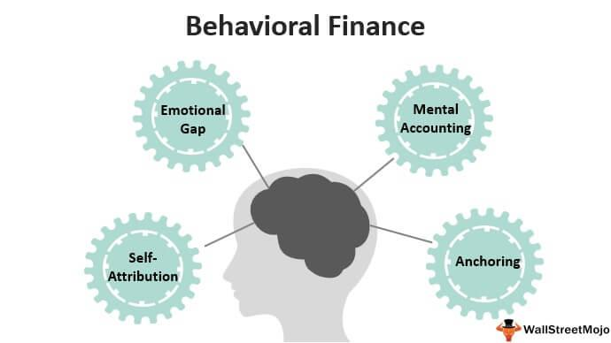

In the world of investing, biases can significantly impact decision-making processes. This article explores the complexities of cognitive and emotional biases, paying particular attention to their implications in algorithmic trading. Cognitive biases in investing often stem from established beliefs that are not always factual, affecting how information is interpreted and decisions are formed. On the other hand, emotional biases arise from personal feelings and experiences, leading to real-time decision-making swayed by emotions.

Understanding these biases is vital for investors as they can result in irrational decision-making and less than optimal investment choices. For instance, cognitive biases such as confirmation bias compel investors to seek out information that aligns with their preconceived notions, disregarding data that might contradict their beliefs. Emotional biases such as loss aversion can also lead an investor to irrationally hold onto losing investments due to an emotional attachment, with the hope of an eventual turnaround.



Algorithmic trading, which relies on programmed strategies to execute trades, presents a unique context in which these biases are observed and analyzed. While algorithms themselves are designed to be unbiased, the data and rules they are based on can still be influenced by the biases of their human creators. Therefore, recognizing and addressing these biases is crucial for investors seeking to maximize their investment returns. This article aims to provide insights into how investors can identify and mitigate these biases to enhance investment performance.

## Table of Contents

## Understanding Cognitive and Emotional Biases

In investing, biases significantly affect decision-making processes. Cognitive biases arise from established yet potentially inaccurate concepts, shaping how individuals perceive information and make decisions. Examples include anchoring bias, where reliance on the first piece of information encountered influences subsequent judgments, and confirmation bias, which leads investors to favor information supporting their preconceptions.

Emotional biases, conversely, emerge from personal feelings and experiences, shaping immediate decision-making. These biases often result in impulsive actions driven by emotional states rather than logical assessment of information. For instance, an investor might refuse to sell a losing stock due to loss-aversion bias, letting emotions override rational analysis.

Both cognitive and emotional biases can lead to judgment errors, particularly in high-stakes environments like trading and investing. These errors occur because biases can cause perceptions to deviate from objective reality, leading to decisions that are not optimally informed by available data. Recognizing and addressing these biases is crucial for investors aiming to make rational, well-informed decisions. Understanding the distinction between cognitive and emotional biases helps in identifying the root cause of these errors, enabling the development of strategies to mitigate their impact. This understanding can ultimately enhance decision-making processes and lead to improved investment outcomes.

## Common Cognitive Biases in Investing

Cognitive biases can significantly impact investment decisions, often leading individuals to make suboptimal choices that do not align with objective data. One of the most prevalent biases is confirmation bias. This bias occurs when investors unconsciously seek out information that confirms their pre-existing beliefs or hypotheses, while neglecting evidence that might contradict them. For instance, an investor who believes a particular stock will perform well might focus only on positive news about the company and ignore any negative reports, thus maintaining an incomplete understanding of the investment's potential risks.

Another common cognitive bias in investing is the gambler's fallacy. This bias involves the mistaken belief that past random events can influence the probability of future independent events. For example, if a stock has been rising steadily, an investor influenced by the gambler’s fallacy might erroneously believe that the trend must soon reverse, despite no statistical evidence supporting this expectation. This can lead to premature selling or holding positions based on false assumptions of market behaviors.

Beyond these, several other cognitive biases can influence investment strategies. The status quo bias leads investors to prefer existing conditions or investments rather than seeking new opportunities, often resulting in an unoptimized portfolio. This bias can cause resistance to change, even when shifts in market conditions suggest that adjustments might be beneficial.

Risk-averse bias describes the tendency of investors to prefer avoiding losses over acquiring equivalent gains. This bias can lead to excessively cautious investment strategies that potentially limit returns. An overly conservative approach might prevent an investor from taking advantage of high-return opportunities due to an irrational fear of losses.

Lastly, the bandwagon effect can cause investors to make decisions based on the actions and beliefs of others rather than their own independent analysis. This can result in market behaviors such as asset bubbles, where the price of an investment inflates due to widespread enthusiasm rather than intrinsic value.

Understanding and mitigating these cognitive biases is crucial for making rational investment decisions that reflect reality, rather than illusions shaped by psychological predispositions.

## Common Emotional Biases in Investing

Emotional biases in investing often lead to decisions that deviate from logical reasoning, driven by the investor's personal feelings and attachments. One of the most significant emotional biases is loss-aversion bias. This bias occurs when investors exhibit an irrational tendency to hold onto losing assets due to an emotional discomfort associated with realizing a loss. This often results in missed opportunities to reallocate capital towards more profitable investments or strategies. The emotional pain from losses is typically more powerful than the satisfaction from equivalent gains, a phenomenon that can impede rational investment decision-making.

Overconfidence bias is another common emotional bias where investors display an excessive belief in their investment knowledge and decision-making capabilities. This misplaced confidence can lead to taking undue risks, underestimating potential challenges, or overtrading, resulting in inferior investment outcomes. Overconfidence can manifest in behaviors such as setting overly optimistic forecasts or underestimating market [volatility](/wiki/volatility-trading-strategies), often neglecting the importance of thorough analysis.

Endowment bias occurs when investors assign greater value to assets they currently own compared to those they do not. This emotional bias leads to an overvaluation of owned assets, often resulting in inefficient market behavior such as holding onto underperforming assets or dismissing potentially lucrative opportunities. Endowment bias is fueled by the emotional attachment to possessions, distorting the investor's perception of an asset's true market value.

Mitigating these emotional biases requires a structured approach to investment, often involving strategies that enforce discipline and sound judgment. Awareness and acknowledgment of these biases can be the first step towards minimizing their impact on investment decisions.

## Impact of Biases on Algorithmic Trading

Algorithmic trading has emerged as an effective tool in reducing the impact of human biases in investment decision-making. These algorithms function by adhering to pre-defined rules and data analyses, significantly reducing the influence of cognitive and emotional biases that often affect human traders.

The core advantage of [algorithmic trading](/wiki/algorithmic-trading) lies in its inherently unbiased nature. Unlike human traders, who might succumb to cognitive biases such as confirmation bias or emotional biases such as loss aversion, algorithms operate strictly on factual data and established parameters. For instance, when executing trades, algorithms can process a vast array of market data and make split-second decisions based on logical patterns and quantitative models. This computational ability helps eliminate subjective judgment and emotion-driven decision-making, which can lead to errors and inconsistency.

By implementing trading strategies that are automated, investors can achieve more consistent investment outcomes. Algorithmic trading systems are designed to seek opportunities in the market and execute trades based on a programmed set of rules such as timing, price, or [volume](/wiki/volume-trading-strategy). These rules can include complex calculations and simulations incorporated in the following Python code snippet for a moving average crossover strategy:

```python
import pandas as pd

def moving_average_crossover(prices, short_window, long_window):
    signals = pd.DataFrame(index=prices.index)
    signals['price'] = prices
    signals['short_mavg'] = prices.rolling(window=short_window, min_periods=1, center=False).mean()
    signals['long_mavg'] = prices.rolling(window=long_window, min_periods=1, center=False).mean()
    signals['signal'] = 0.0
    signals['signal'][short_window:] = np.where(signals['short_mavg'][short_window:] 
                                                > signals['long_mavg'][short_window:], 1.0, 0.0)
    signals['positions'] = signals['signal'].diff()

    return signals

# Example usage
prices = pd.Series([1, 2, 3, 4, 5, 6, 7, 8, 9, 10])
signals = moving_average_crossover(prices, short_window=3, long_window=5)
print(signals)
```

In this example, a simple moving average (SMA) crossover strategy is implemented, where the algorithm generates buy or sell signals based on short-term and long-term moving averages without any emotional influence.

Furthermore, algorithmic trading enables [backtesting](/wiki/backtesting), a process where strategies are tested against historical data to assess their viability without imposing any forward-looking bias. This critical aspect ensures a data-driven investment approach, optimizing strategy performance before actual deployment in live markets.

Investors who leverage algorithmic trading systems can benefit from increased speed and efficiency, as well as greater discipline in trade execution. As these systems operate based on statistical and technical inputs rather than emotional impulses, they are instrumental in achieving a robust investment strategy that is less susceptible to the fluctuating whims of human psychology. This strategic advantage contributes to more reliable investment outcomes, reinforcing the trader's ability to foster successful trading practices in a highly dynamic financial environment.

## Strategies for Mitigating Investment Biases

Recognizing and understanding one's biases are the initial steps in minimizing their impact on investment decisions. By increasing awareness of these biases, investors can begin to implement strategies to counteract them effectively. One effective strategy is the use of objective trading rules. Establishing clear, predefined parameters for trading can significantly reduce the influence of emotional and cognitive biases. For instance, using spreadsheets to calculate and analyze risk/reward ratios for each trade can provide a structured approach that emphasizes quantitative rather than qualitative decision-making.

The calculations involved in risk/reward analysis can be straightforward:

$$
\text{Risk/Reward Ratio} = \frac{\text{Potential Loss}}{\text{Potential Gain}}
$$

A low risk/reward ratio indicates a favorable trade setup, helping investors make more informed decisions aligned with their financial goals.

Maintaining a diversified portfolio is another strategy that can buffer against the impacts of biased decision-making. Diversification, which involves spreading investments across different asset classes, sectors, or geographies, mitigates risk by ensuring that poor performance in one area can be offset by gains in another. This approach helps investors avoid over-concentration in particular investments, which can often be a result of biases like overconfidence or endowment bias.

In addition, consulting with financial advisors can provide an external perspective that helps minimize biases. Financial advisors can offer objective assessments of investment strategies and keep investors grounded, particularly during volatile markets when emotional biases tend to be more pronounced.

Finally, back-testing investment strategies against historical data can further assist in reducing biases. By evaluating how a particular strategy would have performed in the past, investors can gain insights into its potential effectiveness, helping to shift focus from emotionally-driven reactions to evidence-based decisions.

Incorporating these strategies in investment practices can empower investors to recognize and mitigate biases, ultimately leading to more rational and successful investment outcomes.

## Conclusion

Biases, whether cognitive or emotional, play a significant role in the world of investing, often leading to irrational decision-making and potentially diminishing investment returns. Cognitive biases are systematic patterns of deviation from norm or rationality in judgment, while emotional biases arise from feelings and personal experiences which can cloud judgment. These biases can create hurdles in achieving optimal investment outcomes. 

By leveraging algorithmic strategies, investors can effectively identify and mitigate these biases. Algorithms are designed to operate purely on data-driven rules, thereby minimizing the potential distortions caused by human biases. For instance, trading algorithms can process vast amounts of data to execute trades systematically based on pre-defined criteria, without the interference of emotions or skewed perceptions. This method facilitates more objective and disciplined trading, reducing the likelihood of making decisions influenced by psychological biases.

Continued learning and adaptation to new information remain vital in overcoming these biases and achieving long-term investment success. Investors are encouraged to consistently educate themselves on market dynamics, biases, and evolving technologies that can assist in mitigating such biases. Moreover, incorporating feedback from investment decisions allows for the refinement of strategies, ensuring a more robust approach to future investments. Through these efforts, investors can bolster their decision-making processes, ultimately enhancing their investment performance and achieving their financial objectives.

## References & Further Reading

[1]: Bergstra, J., Bardenet, R., Bengio, Y., & Kégl, B. (2011). ["Algorithms for Hyper-Parameter Optimization."](https://dl.acm.org/doi/10.5555/2986459.2986743) Advances in Neural Information Processing Systems 24.

[2]: ["Advances in Financial Machine Learning"](https://www.amazon.com/Advances-Financial-Machine-Learning-Marcos/dp/1119482089) by Marcos Lopez de Prado

[3]: ["Evidence-Based Technical Analysis: Applying the Scientific Method and Statistical Inference to Trading Signals"](https://www.amazon.com/Evidence-Based-Technical-Analysis-Scientific-Statistical/dp/0470008741) by David Aronson

[4]: ["Machine Learning for Algorithmic Trading"](https://github.com/stefan-jansen/machine-learning-for-trading) by Stefan Jansen

[5]: ["Quantitative Trading: How to Build Your Own Algorithmic Trading Business"](https://books.google.com/books/about/Quantitative_Trading.html?id=j70yEAAAQBAJ) by Ernest P. Chan