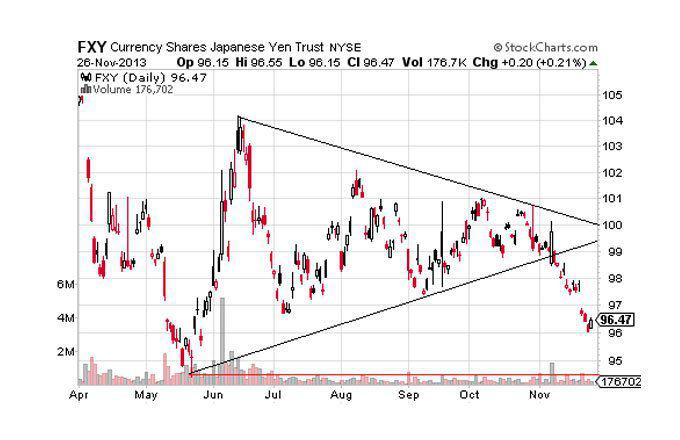

Financial markets operate as complex ecosystems where various forces interplay to dictate prices and trends. One of the intriguing phenomena within these markets is the concept of coiled markets. A coiled market is akin to a compressed spring, where prices are under pressure due but wait for the right conditions to release energy and potentially lead to significant market movements. Understanding these markets involves scrutinizing the dynamics at play, including the influence of market pressures and fundamental factors, and the role of algorithmic trading, which has revolutionized how market phenomena are analyzed and exploited.

Algorithmic trading, or "algo-trading," utilizes computer algorithms to execute trades at speeds and frequencies that are impossible for a human trader. These algorithms analyze a complex set of market indicators to make decisions about buying or selling assets. In markets where conditions suggest a potential coiling, algorithms can be programmed to recognize patterns or signals that indicate an impending shift. Their ability to process vast amounts of data makes them invaluable in identifying and exploiting opportunities presented by coiled markets.



Market pressures that contribute to the coiling effect include macroeconomic factors, geopolitical events, and investor sentiment. These pressures can cause significant deviations from an asset’s intrinsic value, creating a squeeze akin to the tension in a coiled spring. Moreover, market fundamentals, such as supply and demand dynamics, corporate earnings, and interest rates, also play a pivotal role. When the disparity between an asset’s market price and its perceived real value becomes unsustainable, it creates potential for a powerful release, often resulting in sharp market movements.

Financial markets thus involve the constant interaction of forces that can create conditions ripe for significant price changes. Recognizing these dynamics requires sophisticated analysis, often aided by algorithmic trading strategies, to mitigate risks and capitalize on the opportunities created by market coilings. As we progress in understanding these markets, ongoing monitoring and research remain crucial for staying ahead in financial investments.

## Table of Contents

## What is a Coiled Market?

A coiled market can be likened to a coiled spring, wherein market prices are compressed within a narrow range due to a balance in buying and selling pressures. This tension builds up over time, waiting for an external trigger to cause a significant price movement, akin to a spring releasing its stored energy. This phenomenon often occurs when market participants are uncertain about future price directions leading to a lack of dominant trends.

Characteristics of coiled markets include relatively low volatility and trading volumes, suggesting indecision among traders. These markets exhibit strong support and resistance levels, confining price movements within a tight range. The longer this range-bound activity persists, the more pronounced the subsequent breakout could be. 

Indicators of coiled markets frequently involve technical analysis patterns such as triangles and pennants, which signify the potential for increased [volatility](/wiki/volatility-trading-strategies) upon [breakout](/wiki/breakout-trading). Traders often watch for a contraction in volatility and Bollinger Bands narrowing as a signal for a coiled market ready to spring.

Examples of markets prone to this phenomenon include commodities and foreign exchange. In commodities, factors like supply constraints or geopolitical tensions can lead to the buildup of pressure. Similarly, in foreign exchange markets, economic indicators or central bank policies might cause currencies to trade sideways, anticipating a future event or data release impacting exchange rates significantly. 

Understanding the dynamics and indicators of coiled markets allows traders to anticipate potential breakouts and prepare strategies to capitalize on these crucial market movements efficiently.

## Market Dynamics and Coiled Markets

Financial markets are complex systems influenced by a multitude of factors, including external pressures from government policies and market interventions. A coiled market resembles a compressed spring ready to release pent-up energy, and it often surfaces when these pressures build up over time without immediate resolution.

Governments and central banks play pivotal roles in shaping market dynamics through monetary and fiscal policies. Policies such as [interest rate](/wiki/interest-rate-trading-strategies) adjustments, quantitative easing, and regulatory changes can significantly impact investor sentiment and market behavior. For instance, a long period of low interest rates might fuel asset bubbles, forcing markets into a coiled state as they wait for an anticipated correction or rate hike. Conversely, unexpected interventions, such as tariffs or geopolitical tensions, can also trigger quick adjustments, winding the spring even tighter.

Fundamental analysis is crucial for predicting coiled market behavior. This approach involves evaluating an asset's intrinsic value based on economic indicators, financial statements, and industry trends. Metrics like GDP growth, unemployment rates, and inflation are vital in assessing market conditions and potential coilings. For example, a persistent divergence between stock valuations and fundamental indicators may point to an overvalued market poised for a correction. Analysts keenly observe these metrics to forecast potential breaks in the coiling pattern, allowing for informed decision-making.

Technical analysis complements fundamental approaches by identifying potential coiling through chart patterns and indicators. Patterns such as triangles are quintessential signals of a coiled market. Triangles occur when the price of an asset converges within a narrowing range, indicating decreasing volatility and potentially explosive moves once the tight range breaks. Ascending, descending, and symmetrical triangles suggest market sentiment and possible trajectory, though they require careful interpretation in conjunction with [volume](/wiki/volume-trading-strategy) data and broader market trends.

Other technical indicators like Bollinger Bands and moving averages also help in assessing coiled markets. Bollinger Bands, for instance, measure volatility and can signal tightening conditions when bands converge, hinting at imminent volatility spikes. Traders often use these tools in tandem with patterns to strategize entries and exits, aiming to capitalize on the predicted market movement once the tension in the coiled spring releases.

In summary, understanding and analyzing market dynamics that lead to coiled markets necessitates a mix of governmental policy insight, [fundamental analysis](/wiki/fundamental-analysis), and technical chart interpretations. By integrating these perspectives, investors and traders can better predict and respond to the challenges and opportunities that coiled markets present.

## Algorithmic Trading in Coiled Markets

Algorithmic trading refers to the use of computer algorithms to automate trading decisions and execute trades at speeds and frequencies that are impossible for human traders. In the context of coiled markets, where potential for significant market movement exists due to accumulated pressure akin to a compressed spring, [algorithmic trading](/wiki/algorithmic-trading) can play a vital role. Algorithms can quickly analyze vast amounts of data, enabling traders to identify coiled market conditions and react promptly to their unwinding.

### Advantages of Using Algorithms in Volatile Markets

The primary advantage of algorithmic trading in volatile or coiled markets is its speed and precision. Algorithms can process real-time data much faster than human operators, allowing traders to enter and [exit](/wiki/exit-strategy) trades at the most opportune moments. This can be especially beneficial in coiled markets, where sudden, large movements could occur once the market unwinds. By using algorithms, traders can systematically analyze historical price patterns, volatility metrics, and other indicators to anticipate these movements.

Algorithms can also mitigate emotional decision-making, which is often a challenge for human traders, especially in high-pressure environments. By adhering to predefined rules and parameters, algorithms ensure consistency in execution. Moreover, they can operate continuously without fatigue, analyzing and trading in response to market changes around the clock.

Furthermore, algorithmic trading enables the implementation of complex strategies such as statistical [arbitrage](/wiki/arbitrage), [momentum](/wiki/momentum) trading, and mean reversion, which may be difficult to manage manually. These strategies can further exploit the potential of a coiled market by identifying profitable trading opportunities that arise from market inefficiencies.

### Case Studies of Algorithmic Trading in Coiled Markets

One notable example of algorithmic trading effectively anticipating coiled market scenarios comes from the commodity markets. In instances where supply chain disruptions or geopolitical tensions suggested potential for a significant price surge, algorithms were employed to adjust trading strategies based on predicted market shifts. Algorithms could rapidly respond to price signals indicating the unwinding of these markets, thus capitalizing on the movements.

A specific case study is the use of algorithmic models during the 2008 financial crisis. Certain levels of price and volatility were indicative of coiled conditions, and algorithms enabled traders to swiftly adapt their portfolios to mitigate potential losses or secure gains as the markets unwound. By constantly analyzing real-time data and adjusting to market developments, these algorithms were able to exploit the eventual release of pent-up market forces.

In foreign exchange markets, algorithmic trading systems have been employed extensively to manage the high volatility and rapid changes characteristic of coiled markets. For instance, during the period leading to and following the announcement of major policy changes by central banks, trading algorithms have been used to simulate various scenarios, thus improving the responsiveness and profitability of trades once the anticipated movements occur.

Algorithmic trading, with its ability to process large datasets and execute trades at high speeds, proves to be an invaluable tool in coiled markets. By identifying subtle indicators and rapidly adjusting to market dynamics, algorithmic systems can effectively anticipate and exploit the unique opportunities presented by these market conditions.

## Case Studies and Examples

Historically, coiled markets have emerged in various sectors, manifesting as periods of suppressed volatility that eventually lead to significant price movements once the accumulation of pressures becomes unsustainable. One of the most well-documented examples of a coiled market is the 1992 Black Wednesday event, which highlighted the susceptibility of currency markets to speculatory actions and economic fundamentals.

### Black Wednesday: A Classic Coiled Market in Currency

On September 16, 1992, Black Wednesday exposed the vulnerabilities of the British pound within the European Exchange Rate Mechanism (ERM). Leading up to this event, market pressures were mounting as the UK economy struggled with recession and high interest rates. The British government was committed to maintaining the pound within the narrow ERM bands, but the underlying economic indicators suggested that the pound was overvalued. This created a classic coiled market scenario, as the tension between policy commitments and economic realities increased.

International investors, most notably George Soros, saw the potential for unwinding. They executed large-scale short positions against the pound, betting that the UK would be unable to sustain its currency's value. The eventual result was a massive sell-off, forcing the British government to withdraw from the ERM and devalue the pound. This unwinding of the coiled market had far-reaching consequences, including significant financial losses for the UK government and substantial profits for the hedge funds that anticipated the move.

### Upcoming Coiled Markets: Preparation Strategies

As financial markets continue to evolve, new coiled market conditions are likely to emerge. One potential area is the commodities market, currently experiencing suppressed volatility due to a combination of geopolitical tensions and policy changes related to environmental regulations. Another area is the technology sector, where stock valuations have soared, creating the possibility of a sharp correction.

Investors and traders aiming to prepare for potential coiled markets should adopt a multi-faceted approach:

1. **Technical Analysis**: Monitoring chart patterns such as triangles or head-and-shoulders formations can provide early warning signals of a market coil.

2. **Fundamental Analysis**: Keeping abreast of economic indicators, government policies, and geopolitical developments can help anticipate the pressures building in a market.

3. **Algorithmic Trading**: Utilizing algorithms designed to detect anomalies in trading data can enhance the ability to exploit coiled market conditions. Algorithms can process vast amounts of data and identify patterns that are imperceptible to human traders.

4. **Diversification and Hedging**: Engaging in diversified portfolios and using hedging strategies such as options and futures can mitigate the risks associated with unexpected market movements.

By considering these strategies, investors can better navigate the complexities inherent in coiled markets and potentially capitalize on the volatility that follows their unwinding.

## Implications and Strategies

Coiled markets present distinct risks to investors and traders, primarily due to their inherent volatility and the sudden nature of potential market movements. In such scenarios, prices may remain compressed within a narrow range for extended periods before a significant breakout or breakdown occurs. This unpredictability can lead to substantial financial losses if not properly managed. To mitigate these risks, traders must adopt specific strategies, including a robust risk management system, technical analysis, and the integration of algorithmic trading.

**Risk Identification and Mitigation**

One of the primary risks in coiled markets is the abrupt price movement that can result in slippage and increased trading costs. To mitigate this, traders should employ stop-loss orders to limit potential losses and ensure trades are automatically exited once a certain loss threshold is reached. Moreover, position sizing becomes crucial; allocating only a small portion of the capital to each trade helps manage risk regardless of market direction.

**Leveraging Technical and Algorithmic Trading Strategies**

Technical analysis plays a pivotal role in identifying potential breakout points in coiled markets. Traders use various chart patterns, such as triangles and flags, to anticipate these movements. Technical indicators like the Relative Strength Index (RSI) and Moving Averages can provide additional confirmation of emerging trends, aiding in decision-making.

Algorithmic trading offers significant advantages in trading coiled markets by allowing for the rapid execution of trades in response to real-time market data. Algorithms can be programmed to identify technical patterns indicative of a coiled market and automatically execute trades based on predefined criteria. This reduces human error and emotional decision-making, providing a consistent approach to exploiting market movements. For example, using Python, a basic algorithm to trade a breakout could look like this:

```python
import talib
import numpy as np

# Historical price data
prices = np.array([/* Historical price data */])

# Calculate moving average
short_mavg = talib.SMA(prices, timeperiod=20)
long_mavg = talib.SMA(prices, timeperiod=50)

# Buy signal: Short moving average crosses above long moving average
buy_signals = np.where(short_mavg > long_mavg, 1, 0)

# Sell signal: Short moving average crosses below long moving average
sell_signals = np.where(short_mavg < long_mavg, -1, 0)
```

**Exploring Future Trends**

As financial markets evolve, the likelihood of coiled market conditions may increase due to geopolitical uncertainties, rapid technological advancements, and shifts in monetary policy. Traders and investors must remain vigilant, continually updating their strategies to adapt to these changes. The growing influence of [machine learning](/wiki/machine-learning) and [artificial intelligence](/wiki/ai-artificial-intelligence) in trading strategies holds promise for more sophisticated prediction models that can identify coiled markets with greater accuracy. Additionally, as algorithmic trading becomes more accessible, even small-scale investors can leverage these technologies to gain an edge.

In conclusion, understanding and managing the risks associated with coiled markets require a comprehensive approach incorporating both traditional technical analysis and modern algorithmic trading techniques. Staying abreast of future market trends and technological advancements will be crucial for investors and traders aiming to successfully navigate and capitalize on coiled market conditions.

## Conclusion

Coiled markets represent a compelling concept in financial trading, characterized by periods of compressed volatility that eventually lead to significant price movements. Understanding the dynamics that trigger the coiling and subsequent uncoiling of markets is crucial for investors and traders aiming to maximize returns while managing risk. Coiled markets, akin to a compressed spring, hold latent energy that, once released, can lead to dramatic and accelerated shifts in market prices.

The intricacies of market dynamics, particularly in coiled scenarios, necessitate a profound comprehension of various influencing factors. These include geopolitical events, government policies, market interventions, and changes in fundamental data. Modern traders must be proficient in analyzing these elements to anticipate potential market movements effectively. Algorithmic trading has emerged as a vital tool in this context, leveraging mathematical models and data analysis to identify patterns and execute trades with speed and precision that human traders cannot match.

The role of algorithms cannot be understated, as they enable traders to react swiftly to market signals, minimizing losses and capitalizing on opportunities presented by coiled markets. As these markets can rapidly transition from periods of low to high volatility, algorithms provide a strategic edge in executing trades based on pre-set criteria and real-time data analysis.

Ongoing research and continuous monitoring of financial indicators are imperative to staying ahead in financial markets. Traders and investors must be vigilant, using both fundamental and technical analysis to identify potential coiled market conditions. Embracing technological advancements and maintaining an open mindset towards learning and adapting to market evolutions will ensure that market participants can effectively navigate the complexities of coiled markets. By doing so, they can optimize their strategies and succeed in an ever-changing financial landscape.

## References & Further Reading

[1]: ["Advances in Financial Machine Learning"](https://www.amazon.com/Advances-Financial-Machine-Learning-Marcos/dp/1119482089) by Marcos Lopez de Prado

[2]: ["Evidence-Based Technical Analysis: Applying the Scientific Method and Statistical Inference to Trading Signals"](https://www.amazon.com/Evidence-Based-Technical-Analysis-Scientific-Statistical/dp/0470008741) by David Aronson

[3]: ["Machine Learning for Algorithmic Trading"](https://www.amazon.com/Machine-Learning-Algorithmic-Trading-alternative/dp/1839217715) by Stefan Jansen

[4]: ["Quantitative Trading: How to Build Your Own Algorithmic Trading Business"](https://www.amazon.com/Quantitative-Trading-Build-Algorithmic-Business/dp/1119800064) by Ernest P. Chan

[5]: Bergstra, J., Bardenet, R., Bengio, Y., & Kégl, B. (2011). ["Algorithms for Hyper-Parameter Optimization."](https://dl.acm.org/doi/10.5555/2986459.2986743) Advances in Neural Information Processing Systems 24.

[6]: "The Black Wednesday UK Crisis." ["Investopedia"](https://www.investopedia.com/terms/b/black-wednesday.asp)

[7]: ["Technical Analysis Explained: The Successful Investor's Guide to Spotting Investment Trends and Turning Points"](https://www.amazon.com/Technical-Analysis-Explained-Fifth-Successful/dp/0071825177) by Martin J. Pring