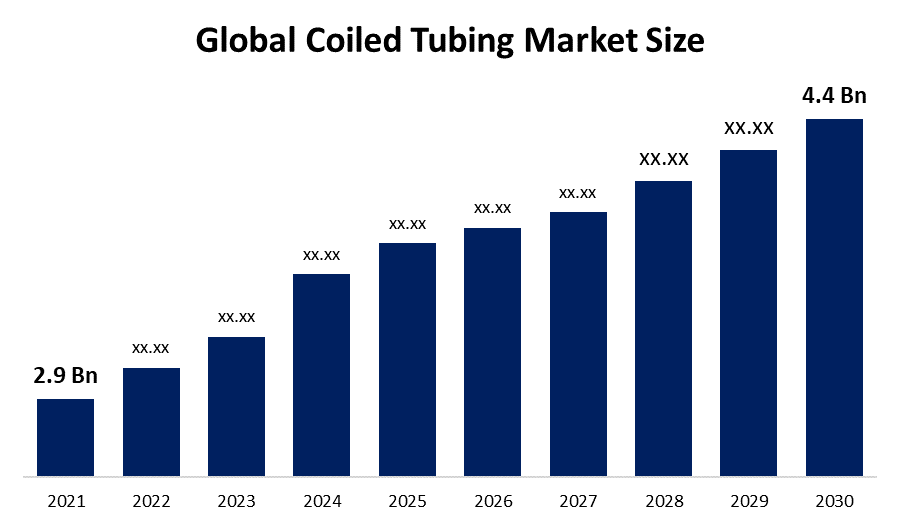

## Table of Contents

## What is the Coiled Market?

The Coiled Market is a type of financial market where traders buy and sell coiled products. These products are usually metals like steel or aluminum that are rolled into coils. This market helps companies that need these materials for making things like cars, buildings, and appliances. Traders in the Coiled Market work to find the best prices and make sure there is enough supply to meet the demand.

The Coiled Market is important because it helps keep the economy running smoothly. When companies can easily get the coiled materials they need, they can keep making their products without delays. This market also helps set prices fairly, so everyone knows what to expect. By keeping a good balance between supply and demand, the Coiled Market supports many industries and helps them plan for the future.

## How does the Coiled Market function?

The Coiled Market works by bringing together buyers and sellers of coiled metal products like steel and aluminum. Companies that make things like cars and appliances need these coils to produce their goods. They go to the Coiled Market to find the best prices and make sure they have enough materials. On the other side, companies that produce these coils sell them in the market to make money. The market helps match these buyers and sellers, making sure that everyone can get what they need at a fair price.

To keep the market running smoothly, there are traders who help find the best deals and make sure there is enough supply to meet the demand. These traders use their knowledge of the market to predict what will happen next, helping companies plan for the future. The Coiled Market also helps set prices that everyone agrees on, which makes it easier for businesses to budget and plan their production. By keeping a good balance between supply and demand, the Coiled Market supports many industries and helps the economy stay stable.

## What are the key characteristics of the Coiled Market?

The Coiled Market is a place where companies buy and sell coils of metal like steel and aluminum. These coils are important for making things like cars and appliances. The market helps match buyers with sellers, making sure there is enough supply of coils to meet the demand. Traders in the market work hard to find the best prices for both buyers and sellers. They use their knowledge to predict what will happen next, helping companies plan for the future.

Another key characteristic of the Coiled Market is that it helps set fair prices for coils. When everyone knows what the prices are, it makes it easier for companies to budget and plan their production. The market keeps a good balance between supply and demand, which is important for keeping the economy stable. By doing this, the Coiled Market supports many industries and helps them run smoothly.

## Can you provide examples of products or services typically found in the Coiled Market?

In the Coiled Market, you can find coils of steel and aluminum. These coils are big rolls of metal that companies use to make things like cars, trucks, and appliances like refrigerators and washing machines. Steel coils are often used to make car bodies and parts of buildings, while aluminum coils are used for things like airplane parts and cans.

There are also services in the Coiled Market that help companies buy and sell these coils. Traders work in the market to find the best prices for coils. They help companies figure out how much they need to buy or sell and at what price. This helps keep the market running smoothly and makes sure there is enough supply to meet the demand.

Some companies in the Coiled Market offer additional services like cutting the coils into smaller pieces or coating them with special materials to prevent rust. These services make it easier for companies to use the coils in their products. By offering these services, the Coiled Market helps companies save time and money, making it a key part of many industries.

## What are the benefits of participating in the Coiled Market for consumers?

Participating in the Coiled Market helps consumers because it makes products cheaper. When companies can buy coils of steel and aluminum at good prices, they can make things like cars and appliances for less money. This means that when you go to the store, you can buy these products for less. The Coiled Market helps keep prices fair, so you don't have to pay too much for the things you need.

The Coiled Market also helps make sure there are enough products available. When companies can easily get the coils they need, they can keep making their products without running out. This means that when you want to buy a car or a new refrigerator, you can find one at the store. The market helps keep everything running smoothly, so you can get what you need when you need it.

## How do businesses benefit from the Coiled Market?

Businesses benefit from the Coiled Market because it helps them get the materials they need at good prices. When companies can buy coils of steel and aluminum for less, they can make their products like cars and appliances without spending too much money. This helps them keep their costs down and make more profit. The market also helps businesses find the best deals by having traders who work to match buyers and sellers at fair prices.

The Coiled Market also helps businesses plan for the future. Traders in the market use their knowledge to predict how much demand there will be for coils, so companies can order the right amount of materials. This helps businesses avoid running out of supplies or having too much stock, which can save them money. By keeping a good balance between supply and demand, the Coiled Market helps businesses run smoothly and stay prepared for what's coming next.

## What are the challenges faced by newcomers in the Coiled Market?

Newcomers to the Coiled Market often find it hard to understand how everything works. The market has a lot of rules and ways of doing things that can be confusing at first. They need to learn about the different types of coils, like steel and aluminum, and how they are used in making things like cars and appliances. They also need to figure out how to find the best prices and work with traders who know a lot about the market.

Another challenge is getting to know the people in the market. Newcomers have to build relationships with buyers and sellers, which can take time. They need to show that they can be trusted and that they know what they're doing. It can be hard to start making deals when everyone else already knows each other. But once they learn the ropes and make some friends in the market, it gets easier to buy and sell coils and make money.

## How has technology influenced the Coiled Market?

Technology has made the Coiled Market a lot easier to use. With computers and the internet, people can buy and sell coils of steel and aluminum without having to meet in person. They can see prices and make deals from anywhere, which saves time and money. Special software helps traders keep track of how much coils are being bought and sold, so they can make better guesses about what will happen next in the market. This makes it easier for companies to plan how much they need to buy or sell.

Technology also helps with making the coils. Machines can cut and shape the metal faster and more accurately than people can. This means that companies can make more coils and make them better, which helps keep the Coiled Market running smoothly. New technology also helps with things like keeping the coils from rusting and making them stronger. All these improvements make the Coiled Market more efficient and help businesses make more money.

## What are the regulatory considerations for the Coiled Market?

The Coiled Market has rules that everyone needs to follow to make sure it works fairly and safely. Governments and special groups make these rules to stop people from cheating and to protect the environment. For example, there are rules about how much pollution companies can make when they produce coils. There are also rules about how to safely move and store the coils, so no one gets hurt.

These rules help keep the Coiled Market honest and safe for everyone. Companies have to follow the rules or they can get in trouble. Sometimes, the rules change, so businesses need to keep up with the new ones. This helps keep the market running smoothly and makes sure that everyone can trust the prices and the quality of the coils they buy and sell.

## How do economic cycles affect the Coiled Market?

Economic cycles can make the Coiled Market go up and down. When the economy is doing well, more people want to buy things like cars and appliances. This means companies need more coils of steel and aluminum to make these things, so the demand for coils goes up. Prices can go up too because everyone wants to buy coils. The Coiled Market can get busy and exciting during these good times.

But when the economy is not doing well, fewer people want to buy big things. Companies don't need as many coils, so the demand goes down. Prices can go down too because there are not as many buyers. The Coiled Market can slow down during these tough times. Companies in the market need to be ready for these ups and downs and plan carefully to keep their business going strong.

## What strategies can be used to succeed in the Coiled Market?

To succeed in the Coiled Market, it's important to understand how it works and keep up with what's going on. You need to know about the different types of coils, like steel and aluminum, and how they are used to make things like cars and appliances. Watching the prices and seeing how much people want to buy can help you decide when to buy or sell. Making friends with other people in the market can also help because they can give you good advice and help you find the best deals.

Another important strategy is to use technology to your advantage. Computers and the internet can make it easier to buy and sell coils without having to meet in person. Special software can help you keep track of prices and demand, so you can make smart guesses about what will happen next. Staying ready for changes in the economy is also key. When times are good, you might want to buy more coils because people want more products. But when times are tough, you might need to sell at lower prices to keep your business going. By planning carefully and using these strategies, you can do well in the Coiled Market.

## What future trends are anticipated in the Coiled Market?

In the future, the Coiled Market is expected to see more use of technology. Computers and the internet will make buying and selling coils even easier. People might use special software to predict what will happen in the market, helping them make better choices about when to buy or sell. This can make the market more efficient and help companies save time and money. Also, new technology might help make coils stronger and last longer, which can be good for the environment.

Another trend is that the Coiled Market might become more focused on being green. Companies might start using more recycled materials to make coils, which can help reduce waste. There could be new rules about how to make coils in a way that is better for the environment. This can make the market more sustainable and help it grow in a way that is good for everyone. As the economy changes, the Coiled Market will need to keep up with these trends to stay strong and successful.

## References & Further Reading

[1]: ["Advances in Financial Machine Learning"](https://www.amazon.com/Advances-Financial-Machine-Learning-Marcos/dp/1119482089) by Marcos Lopez de Prado

[2]: ["Evidence-Based Technical Analysis: Applying the Scientific Method and Statistical Inference to Trading Signals"](https://www.amazon.com/Evidence-Based-Technical-Analysis-Scientific-Statistical/dp/0470008741) by David Aronson

[3]: ["Machine Learning for Algorithmic Trading"](https://www.amazon.com/Machine-Learning-Algorithmic-Trading-alternative/dp/1839217715) by Stefan Jansen

[4]: ["Quantitative Trading: How to Build Your Own Algorithmic Trading Business"](https://www.amazon.com/Quantitative-Trading-Build-Algorithmic-Business/dp/1119800064) by Ernest P. Chan

[5]: Bergstra, J., Bardenet, R., Bengio, Y., & Kégl, B. (2011). ["Algorithms for Hyper-Parameter Optimization."](https://dl.acm.org/doi/10.5555/2986459.2986743) Advances in Neural Information Processing Systems 24.

[6]: "The Black Wednesday UK Crisis." ["Investopedia"](https://www.investopedia.com/terms/b/black-wednesday.asp)

[7]: ["Technical Analysis Explained: The Successful Investor's Guide to Spotting Investment Trends and Turning Points"](https://www.amazon.com/Technical-Analysis-Explained-Fifth-Successful/dp/0071825177) by Martin J. Pring