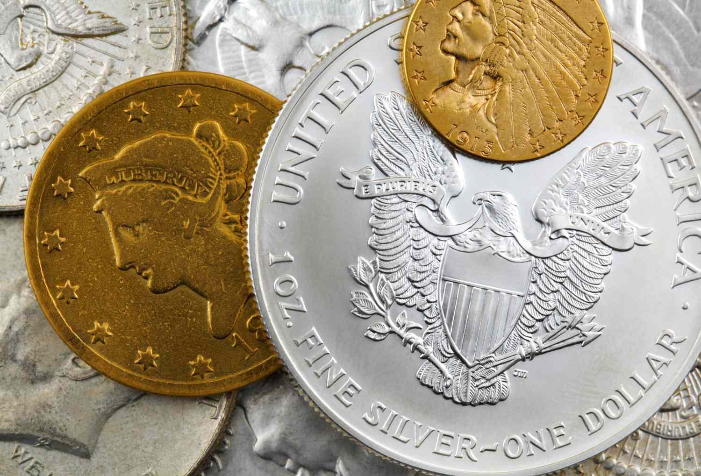

## Table of Contents

## What is the Coinage Act of 1792?

The Coinage Act of 1792 was a law passed by the United States Congress that set up the country's first national mint. This law was important because it created a system for making and managing money in the new country. The mint was set up in Philadelphia, and it started making coins that were used all over the United States. The Act also decided what metals would be used to make the coins, like gold, silver, and copper.

The Act also set the values for the different coins. For example, it said that a dollar would be made of a certain amount of silver. This helped make sure that money had a real value and that people could trust it. The Coinage Act of 1792 was a big step in building a strong economy for the United States because it gave the country its own money system.

## When was the Coinage Act of 1792 passed?

The Coinage Act of 1792 was passed on April 2, 1792. This was an important law for the United States because it set up the country's first national mint. The mint was built in Philadelphia, and it was the place where the country's coins were made.

The Act decided what metals would be used to make the coins. These metals were gold, silver, and copper. It also set the values for the different coins. For example, it said that a dollar would be made of a certain amount of silver. This helped make the money system stable and trustworthy.

## Who signed the Coinage Act of 1792 into law?

The Coinage Act of 1792 was signed into law by President George Washington. He was the first president of the United States and played a big role in setting up the country's early systems, including the money system.

This Act was important because it set up the first national mint in Philadelphia. The mint made coins from gold, silver, and copper. The Act also decided how much each coin was worth, which helped make the money system stable and trustworthy for people to use.

## What were the main objectives of the Coinage Act of 1792?

The Coinage Act of 1792 had several important goals. One main objective was to create a national mint in the United States. This mint was set up in Philadelphia and was responsible for making the country's coins. By having its own mint, the United States could control its money supply and not rely on foreign coins.

Another key goal was to establish a standard for the value of money. The Act decided what metals, like gold, silver, and copper, would be used to make coins. It also set the value of each coin, such as saying that a dollar would be made from a certain amount of silver. This helped make the money system stable and trustworthy, which was important for the growing economy of the new country.

## What types of coins were authorized by the Coinage Act of 1792?

The Coinage Act of 1792 authorized several types of coins for the United States. These coins were made from gold, silver, and copper. The gold coins included the eagle, which was worth ten dollars, the half eagle worth five dollars, and the quarter eagle worth two and a half dollars. The silver coins were the dollar, half dollar, quarter dollar, disme (which is what they called a dime back then), and half disme. The copper coins included the cent and half cent.

These coins were important because they helped set up a money system for the new country. The Act decided how much of each metal should be used in each coin, which helped make sure that the money had real value. People could trust the coins because they knew what they were worth. This was a big step in building a strong economy for the United States.

## How did the Coinage Act of 1792 establish the U.S. dollar?

The Coinage Act of 1792 helped set up the U.S. dollar by making it the main unit of money in the country. The Act said that a dollar should be made from a certain amount of silver, which was 371.25 grains of pure silver or 416 grains of standard silver. This gave the dollar a real value that people could trust. By deciding how much silver should be in a dollar, the Act made sure that the money system was stable and people knew what their money was worth.

The Act also set up the national mint in Philadelphia, where these dollars and other coins were made. This was important because it meant the United States could make its own money instead of using foreign coins. The mint started making dollars and other coins like the half dollar, quarter dollar, and smaller silver coins, as well as gold and copper coins. By having its own money system, the United States could grow its economy and become more independent.

## What was the role of the mint established by the Coinage Act of 1792?

The mint set up by the Coinage Act of 1792 had a big job. It was the place where all the country's coins were made. This mint was in Philadelphia, and it was the first time the United States had its own place to make money. Before this, people used foreign coins or other things to trade. Having a mint meant the U.S. could control its own money and not rely on other countries.

The mint's other important job was to make sure the coins were worth what they said they were worth. The Act said that coins should be made from certain amounts of gold, silver, and copper. For example, a dollar had to be made from a specific amount of silver. This made the money system stable and trustworthy. People knew what their money was worth, and this helped the country's economy grow strong.

## What were the penalties for debasing coins under the Coinage Act of 1792?

The Coinage Act of 1792 had strict rules about debasing coins. Debasing means making coins worth less by using less valuable metal than they should have. The Act said that if someone debased coins, they could be punished very seriously. The punishment could be death if the person was found guilty.

This law was meant to make sure that the money in the United States was trustworthy. By setting such a harsh penalty, the Act showed how important it was to keep the value of the money stable. People needed to trust that the coins they used were worth what they said they were worth, and this rule helped make that happen.

## How did the Coinage Act of 1792 influence the American economy?

The Coinage Act of 1792 was very important for the American economy because it set up the country's first national mint in Philadelphia. This mint made coins that were used all over the United States. Before the Act, people had to use foreign coins or other things to trade. Having its own mint meant that the U.S. could control its money supply and not rely on other countries. This helped the country become more independent and grow its economy.

The Act also decided what metals like gold, silver, and copper should be used to make the coins. It set the value of each coin, like saying a dollar should be made from a certain amount of silver. This made the money system stable and trustworthy. People knew what their money was worth, which helped them trade and do business more easily. By making sure the money was reliable, the Coinage Act of 1792 helped build a strong economy for the United States.

## What were the long-term effects of the Coinage Act of 1792 on U.S. currency?

The Coinage Act of 1792 had a big impact on U.S. currency that lasted a long time. It set up the first national mint in Philadelphia, which meant the U.S. could make its own money instead of using foreign coins. This was important because it helped the country become more independent. The Act also decided what metals like gold, silver, and copper should be used to make the coins. By setting these rules, the Act made sure that the money had real value and that people could trust it. This helped the economy grow strong and stable.

Over time, the Coinage Act of 1792 shaped how money worked in the United States. It established the U.S. dollar as the main unit of money, and it set the value of the dollar with a specific amount of silver. This made the money system clear and reliable for everyone. The Act also had strict rules about debasing coins, which means making them worth less by using less valuable metal. These rules helped keep the value of the money stable, which was important for the country's economy. Even though the Act was changed and updated over the years, it laid the foundation for the U.S. currency system that we still use today.

## How did the Coinage Act of 1792 compare to coinage systems in other countries at the time?

The Coinage Act of 1792 was different from the coinage systems in other countries at the time because it set up a national mint in the United States. Many other countries, like Britain and France, already had their own mints and money systems. But the U.S. was a new country and needed to make its own money. The Act decided that the U.S. would use gold, silver, and copper to make coins, just like many other countries. But it also set the value of the U.S. dollar with a specific amount of silver, which was different from what other countries were doing.

Another way the Coinage Act of 1792 was different was that it had very strict rules about debasing coins. Debasing means making coins worth less by using less valuable metal. In some other countries, like Britain, there were also rules against debasing coins, but the punishment in the U.S. was much harsher. The Act said that if someone debased coins, they could even be put to death. This was much stricter than in other countries, where the punishments might be fines or jail time. By setting such a strong rule, the U.S. made sure that its money stayed trustworthy and valuable.

## What amendments or repeals have affected the Coinage Act of 1792 over time?

The Coinage Act of 1792 has been changed and updated many times since it was first passed. One important change came with the Coinage Act of 1834, which changed the amount of gold in U.S. coins. This was done because people were sending their gold coins to other countries where they were worth more. The Coinage Act of 1853 also made changes by reducing the amount of silver in some coins. This was to stop people from melting down U.S. coins to sell the silver.

Another big change happened with the Coinage Act of 1873, which stopped making silver dollars and started using the gold standard. This meant that the value of money was based on gold instead of silver. Over the years, other laws like the Gold Standard Act of 1900 and the Coinage Act of 1965 continued to change how U.S. money worked. The 1965 Act, for example, changed the metal in dimes and quarters from silver to a mix of copper and nickel. All these changes helped the U.S. keep its money system working well as the country and the world changed.

## References & Further Reading

[1]: Breen, D., Glosten, L. R., & Jagannathan, R. (1989). ["Economic Significance of Predictable Variations in Stock Index Returns."](https://www.scholars.northwestern.edu/en/publications/economic-significance-of-predictable-variations-in-stock-index-re) The Journal of Finance, 44(5), 1177-1189.

[2]: Friedman, M. (1992). ["The Crime of 1873."](https://www.jstor.org/stable/2937754) Journal of Political Economy, 100(4), 885-917.

[3]: Nogues-Marco, P. (2013). ["Competing bimetallic ratios: Amsterdam, London and Bullion Arbitrage in mid-Eighteenth Century."](https://www.cambridge.org/core/journals/journal-of-economic-history/article/abs/competing-bimetallic-ratios-amsterdam-london-and-bullion-arbitrage-in-mideighteenth-century/D5AE36A5F6FF18EF08D7A71B31573363) The Economic History Review, 66(2), 556-577.

[4]: Redish, A. (2000). ["The Evolution of the Gold Standard in England."](https://www.jstor.org/stable/2122455) 1717-1914. Routledge.

[5]: ["Coinage Act of 1792"](https://en.wikipedia.org/wiki/Coinage_Act_of_1792) - Primary source text of the Act from which an understanding of its historical context can be gleaned.

[6]: Officer, L. H., & Williamson, S. H. ["Six Ways to Compute the Relative Value of a U.S. Dollar Amount, 1790 to Present."](https://delong.typepad.com/egregious_moderation/2009/07/lawrence-h-officer-and-samuel-h-williamson-measures-of-worth.html)

[7]: ["A Nation of Counterfeiters: Capitalists, Con Men, and the Making of the United States,"](https://www.jstor.org/stable/j.ctvjghtbv) by Stephen Mihm. Harvard University Press.

These references provide historical context, scholarly analysis, and broader perspectives on the significance and impact of the Coinage Act of 1792 within the financial and economic landscape.