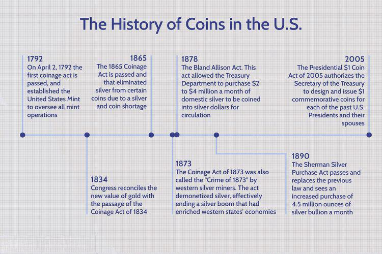

## Table of Contents

## What is the Coinage Act of 1873?

The Coinage Act of 1873 was a law passed by the United States Congress that changed the country's monetary system. Before this act, the U.S. used both gold and silver as money. The act stopped the minting of silver dollars and made the country use only gold for its money. This change was important because it moved the U.S. away from using two metals to just one, which is called the gold standard.

Some people were unhappy with the Coinage Act of 1873. They called it the "Crime of '73" because they thought it hurt farmers and workers who needed more money in circulation. These people wanted to keep using silver because they believed it would help the economy by making more money available. The debate over this act continued for many years and played a big role in American politics during the late 1800s.

## When was the Coinage Act of 1873 passed?

The Coinage Act of 1873 was passed by the United States Congress on February 12, 1873. This law changed how money worked in the U.S. Before this act, people used both gold and silver as money. But after the act, the country started using only gold. This big change meant that the U.S. moved to what is called the gold standard.

Some people did not like the Coinage Act of 1873. They called it the "Crime of '73" because they thought it was bad for farmers and workers. These people wanted to keep using silver because they believed it would help the economy by putting more money into circulation. The debate about this act lasted a long time and was very important in American politics during the late 1800s.

## What were the main goals of the Coinage Act of 1873?

The main goal of the Coinage Act of 1873 was to change the U.S. money system from using both gold and silver to using only gold. Before the act, people could use both metals as money. But the act stopped the minting of silver dollars and made gold the only metal used for money. This change was important because it helped the U.S. move to what is called the gold standard. The government thought this would make the money system more stable and easier to manage.

Some people did not like the Coinage Act of 1873. They called it the "Crime of '73" because they thought it was bad for farmers and workers. These people wanted to keep using silver because they believed it would help the economy by putting more money into circulation. They thought that having more money available would help people buy things and grow the economy. The debate about this act lasted a long time and was very important in American politics during the late 1800s.

## How did the Coinage Act of 1873 change the U.S. monetary system?

The Coinage Act of 1873 changed the U.S. monetary system by stopping the minting of silver dollars and making gold the only metal used for money. Before the act, people could use both gold and silver as money. This change meant that the U.S. moved to what is called the gold standard. The government thought this would make the money system more stable and easier to manage. By using only gold, they believed it would help keep the value of money steady.

Some people did not like the Coinage Act of 1873. They called it the "Crime of '73" because they thought it was bad for farmers and workers. These people wanted to keep using silver because they believed it would help the economy by putting more money into circulation. They thought that having more money available would help people buy things and grow the economy. The debate about this act lasted a long time and was very important in American politics during the late 1800s.

## What was the impact of the Coinage Act of 1873 on silver?

The Coinage Act of 1873 had a big impact on silver. Before the act, people could use both gold and silver as money. But after the act, the government stopped making silver dollars. This meant that silver was no longer used as money in the same way. The value of silver went down because it was not used as money anymore.

Some people were very unhappy about this change. They called the Coinage Act of 1873 the "Crime of '73." They thought that stopping the use of silver hurt farmers and workers. These people wanted to keep using silver because they believed it would help the economy by putting more money into circulation. The debate over silver and the Coinage Act of 1873 was important in American politics for many years.

## Why is the Coinage Act of 1873 sometimes referred to as the 'Crime of '73'?

The Coinage Act of 1873 is sometimes called the "Crime of '73" because some people thought it was very bad for the economy. Before the act, people could use both gold and silver as money. But the act stopped the government from making silver dollars, so only gold was used for money. People who liked silver thought this was unfair. They believed that using only gold hurt farmers and workers because it made money harder to get.

These people wanted to keep using silver because they thought it would help the economy. They believed that having more money, like silver, would make it easier for people to buy things and help the economy grow. The debate over the Coinage Act of 1873 lasted a long time and was very important in American politics during the late 1800s. That's why some people called it the "Crime of '73."

## How did the Coinage Act of 1873 affect the gold standard?

The Coinage Act of 1873 helped the U.S. move to the gold standard. Before the act, people could use both gold and silver as money. But after the act, the government stopped making silver dollars and only used gold for money. This change made the U.S. money system more stable and easier to manage because it used only one metal, gold.

Some people did not like the Coinage Act of 1873. They called it the "Crime of '73" because they thought it was bad for farmers and workers. These people wanted to keep using silver because they believed it would help the economy by putting more money into circulation. They thought that having more money available would help people buy things and grow the economy.

## What were the economic consequences of the Coinage Act of 1873?

The Coinage Act of 1873 had big effects on the economy. Before the act, people could use both gold and silver as money. But after the act, the government stopped making silver dollars and only used gold. This change meant that there was less money in circulation because silver was no longer used. Some people thought this made it harder for farmers and workers to get money and buy things they needed. They believed that having more money, like silver, would help the economy grow.

The debate over the Coinage Act of 1873 was very important in American politics for many years. People who wanted to keep using silver called the act the "Crime of '73." They thought it hurt the economy by making money harder to get. On the other hand, the government thought using only gold would make the money system more stable and easier to manage. This disagreement about money and the economy lasted a long time and played a big role in how people thought about money and politics in the late 1800s.

## How did the Coinage Act of 1873 influence political debates in the late 19th century?

The Coinage Act of 1873 had a big impact on political debates in the late 19th century. Before the act, people could use both gold and silver as money. But after the act, the government stopped making silver dollars and only used gold. This change made some people very unhappy. They called the act the "Crime of '73" because they thought it hurt farmers and workers by making money harder to get. These people wanted to keep using silver because they believed it would help the economy by putting more money into circulation.

The debate over the Coinage Act of 1873 lasted for many years and was very important in American politics. People who wanted to use silver again formed a big part of the political movement called Populism. They thought that having more money, like silver, would help people buy things and grow the economy. On the other hand, people who supported the gold standard believed that using only gold would make the money system more stable and easier to manage. This disagreement about money and the economy played a big role in how people thought about politics in the late 1800s.

## What were the international reactions to the Coinage Act of 1873?

The Coinage Act of 1873 had some effects on other countries too. When the U.S. stopped using silver as money, it changed how much silver was worth around the world. Other countries that used silver for money saw the value of their silver go down. This made some countries think about changing their own money systems to use only gold, like the U.S. did.

Some countries were not happy with what the U.S. did. They thought the U.S. should have kept using silver because it helped keep silver valuable everywhere. The change made it harder for countries that relied on silver to trade with the U.S. and other countries. This led to more talks about money and trade between countries in the late 1800s.

## How did the Coinage Act of 1873 compare to previous coinage acts in the United States?

The Coinage Act of 1873 was different from earlier coinage acts in the United States because it stopped the use of silver dollars and moved the country to the gold standard. Before this act, the U.S. had used both gold and silver as money, a system called bimetallism. Earlier acts, like the Coinage Act of 1792, set up this bimetallic system and allowed people to use both metals for money. The Coinage Act of 1834 tried to fix the problem of people using more gold than silver by changing the weight of gold coins, but it still kept both metals in use.

The Coinage Act of 1873 was a big change because it ended the use of silver dollars, which made some people very unhappy. They called it the "Crime of '73" because they thought it hurt farmers and workers by making money harder to get. Earlier acts had not caused such strong reactions because they did not change the money system as much. The debate over the Coinage Act of 1873 lasted a long time and was very important in American politics during the late 1800s, unlike the earlier acts which did not cause as much controversy.

## What long-term effects did the Coinage Act of 1873 have on U.S. monetary policy?

The Coinage Act of 1873 had big long-term effects on U.S. monetary policy. Before the act, people could use both gold and silver as money. But after the act, the government stopped making silver dollars and only used gold. This change helped the U.S. move to the gold standard, which meant that the value of money was based only on gold. The government thought this would make the money system more stable and easier to manage. Using only gold helped keep the value of money steady for a long time.

The act also started a big debate that lasted for many years. Some people were very unhappy with the change and called it the "Crime of '73." They thought it hurt farmers and workers by making money harder to get. These people wanted to keep using silver because they believed it would help the economy by putting more money into circulation. The disagreement over the Coinage Act of 1873 played a big role in American politics during the late 1800s and early 1900s. It showed how important money and the economy were to people and how they could affect political decisions for a long time.

## References & Further Reading

[1]: ["The Crime of 1873: The Comstock Connection"](https://www.amazon.com/Crime-1873-Robert-Van-Ryzin/dp/0873418735) - An article providing historical context on the Coinage Act of 1873.

[2]: ["Stock Market Liquidity: Implications for Market Microstructure and Trading"](https://archive.org/details/isbn_9780470181690) by Thierry Foucault, Marco Pagano, and Ailsa Roell - A book discussing market dynamics relevant to algorithmic trading.

[3]: ["High-Frequency Trading: A Practical Guide to Algorithmic Strategies and Trading Systems"](https://www.ahmetbeyefendi.com/wp-content/uploads/2020/07/High-Frequency-Trading-Irene-Aldridge.pdf) by Irene Aldridge - A resource on the technical aspects and strategies of algorithmic trading.

[4]: Frydman, Carola, and Eric Hilt. ["Predators or Watchdogs? Bankers on Corporate Boards in the Age of Finance Capitalism"](https://web.williams.edu/Economics/nafziger/Hilt.pdf) - An article examining economic policies that may give insight into financial regulations and trading.

[5]: ["Historical Statistics of the United States, Earliest Times to the Present"](https://archive.org/details/historicalstatis0000unse) - A comprehensive resource for historical economic data including monetary standards.