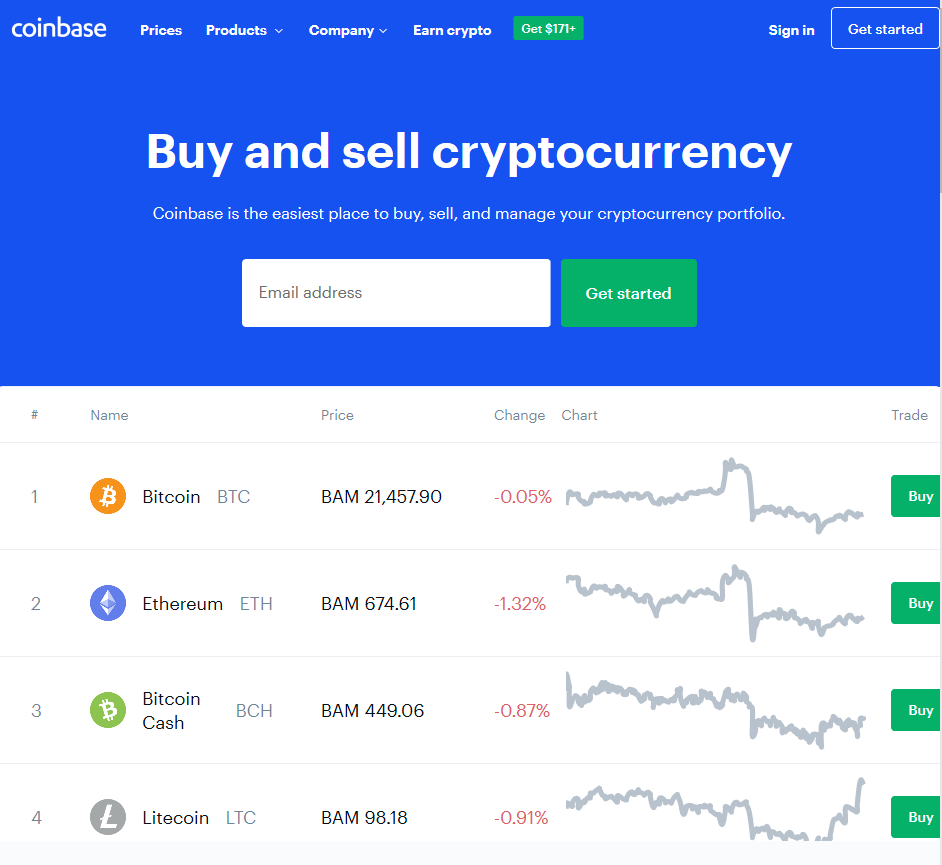

## Table of Contents

## What is the Coinbase API and what can it be used for?

The Coinbase API is a tool that lets developers connect their programs to Coinbase, a popular place to buy and sell cryptocurrencies. It's like a bridge that allows software to talk to Coinbase's system, so you can do things like check your account balance, send money, or buy and sell digital currencies without having to go to the Coinbase website or app.

With the Coinbase API, you can create your own apps or websites that work with Coinbase. For example, you could build a budgeting app that tracks your crypto spending, or a trading bot that automatically buys and sells cryptocurrencies based on certain rules. It's a powerful tool for anyone who wants to build new ways to use cryptocurrencies, making it easier and more fun to manage and trade digital money.

## How do I sign up for a Coinbase account to use the API?

To sign up for a Coinbase account and use their API, first go to the Coinbase website. Click on the "Sign Up" button, usually found at the top right corner of the page. You'll need to enter your email address, create a password, and agree to their terms of service. After that, you'll need to provide some personal information like your name, date of birth, and address. Coinbase will ask you to verify your identity, which might involve uploading a photo of your ID and taking a selfie. This is to keep your account safe and follow the rules.

Once your account is set up and verified, you can start using the Coinbase API. Go to the Coinbase developer portal on their website. There, you can create an API key, which is like a special password that lets your app talk to Coinbase. Follow the instructions to generate your API key and secret. Make sure to keep these safe because they let others access your account if they get them. With your API key, you can start building your app or connecting it to Coinbase to do things like check your balance or make trades.

## What are the basic steps to get started with the Coinbase API?

First, you need to sign up for a Coinbase account if you don't have one already. Go to the Coinbase website, click on "Sign Up," and enter your email address and a password. You'll need to provide some personal information like your name, date of birth, and address. Coinbase will ask you to verify your identity, which might involve uploading a photo of your ID and taking a selfie. Once your account is set up and verified, you're ready to move on to using the API.

Next, visit the Coinbase developer portal on their website. There, you'll create an API key, which is like a special password that lets your app talk to Coinbase. Follow the instructions to generate your API key and secret. It's important to keep these safe because they allow access to your account. With your API key, you can start building your app or connecting it to Coinbase. This lets you do things like check your balance, make trades, or send money, all from within your own program.

## How do I generate and manage API keys in Coinbase?

To generate API keys in Coinbase, first go to the Coinbase website and log into your account. Once you're in, find the developer section or the API settings page. There, you'll see an option to create a new API key. Click on it, and you'll be asked to name your key and maybe add a note about what it's for. After you confirm, Coinbase will give you an API key and a secret key. Make sure to copy and save these keys somewhere safe because you won't be able to see the secret key again.

To manage your API keys, go back to the API settings page where you created them. You can see all your keys listed there. If you need to, you can rename a key, see when it was last used, or delete it if you don't need it anymore. It's a good idea to check your keys regularly and remove any that you're not using. This helps keep your account safe. Remember, if someone gets your API key and secret, they could access your account, so always keep them secure.

## What are the different types of endpoints available in the Coinbase API?

The Coinbase API has different types of endpoints that let you do different things with your account. There are endpoints for checking your account balance, which is like looking at how much money you have. You can also use endpoints to send and receive money, which is like moving money from your account to someone else's or getting money into your account. Another type of endpoint helps you buy and sell cryptocurrencies, which means you can trade your money for digital money or the other way around.

There are also endpoints for getting information about different cryptocurrencies, like their current prices or how much they've gone up or down. This can help you decide when to buy or sell. Another set of endpoints lets you see your past transactions, which is like looking at your spending history. Lastly, there are endpoints for managing your API keys, which means you can create new keys, see when they were last used, or delete them if you don't need them anymore. All these endpoints work together to make your app do different things with Coinbase.

## How can I use the Coinbase API to check my account balance and transaction history?

To check your account balance using the Coinbase API, you need to use the "GET /v2/accounts" endpoint. This endpoint will give you a list of all your accounts on Coinbase, along with their current balances. You'll need to use your API key to make this request. Once you get the response, you can look at the data to see how much money or [cryptocurrency](/wiki/cryptocurrency) you have in each account. It's like checking your wallet to see how much money you have, but you're doing it through your app instead of going to the Coinbase website.

To see your transaction history, you use the "GET /v2/accounts/{account_id}/transactions" endpoint. This endpoint lets you see all the transactions for a specific account. You'll need to replace "{account_id}" with the actual ID of the account you want to check. The response will show you a list of transactions, including when they happened, how much was involved, and what type of transaction it was, like a buy, sell, or transfer. It's like looking at your bank statement but for your Coinbase account, and you can do it right from your app.

## What are some common errors I might encounter when using the Coinbase API and how can I resolve them?

When using the Coinbase API, you might run into some common errors. One error you might see is the "Invalid API Key" error, which happens if you use the wrong API key or if your key is no longer valid. To fix this, make sure you're using the right key and that it hasn't been deleted or changed. Another common issue is the "Rate Limit Exceeded" error, which means you're making too many requests to the API in a short time. To solve this, you can slow down your requests or use a delay between them to stay within the limits set by Coinbase.

Another error you might come across is the "Insufficient Funds" error, which happens when you try to make a transaction but don't have enough money or cryptocurrency in your account. To fix this, you need to add more funds to your account before trying the transaction again. Lastly, you might see a "Network Error" if there's a problem with your internet connection or if Coinbase's servers are down. To resolve this, check your internet connection and try again later if the issue is on Coinbase's side. Keeping track of these errors and knowing how to fix them can help you use the Coinbase API more smoothly.

## How can I implement trading strategies using the Coinbase API?

To implement trading strategies using the Coinbase API, you first need to understand what you want your strategy to do. For example, you might want to buy a cryptocurrency when its price drops to a certain level or sell it when it reaches a specific high. Once you know your strategy, you can use the Coinbase API to check the current prices of cryptocurrencies and make trades based on those prices. You'll use endpoints like "GET /v2/prices" to see the current price of a cryptocurrency and "POST /v2/accounts/{account_id}/buys" or "POST /v2/accounts/{account_id}/sells" to buy or sell.

After setting up your strategy, you'll need to write code that uses the API to execute it. This code will keep an eye on the market, making decisions based on the rules you set. For instance, if your strategy is to buy Bitcoin when its price falls below $30,000, your code will check the price often and send a buy order when it hits that level. It's important to handle errors well and make sure your code can run smoothly without hitting rate limits. By using the Coinbase API in this way, you can automate your trading and potentially make better decisions based on the market's movements.

## What are the rate limits and how can I handle them when using the Coinbase API?

When using the Coinbase API, you need to know about rate limits. These limits stop you from making too many requests to the API in a short time. Coinbase sets different limits for different types of requests. For example, you might be able to check prices 100 times per minute but only make 10 trades per minute. If you go over these limits, you'll get a "Rate Limit Exceeded" error. To avoid this, you can slow down your requests or add a delay between them. This helps keep your app running smoothly without hitting the limits.

Handling rate limits is important for keeping your trading strategies working well. You can do this by keeping track of how many requests you've made and waiting a bit before making more if you're close to the limit. Another way is to use a queue system, where your requests wait in line if the rate limit is reached. This way, your app won't crash when it hits the limit. By managing rate limits carefully, you can make sure your app keeps working without interruptions and follows Coinbase's rules.

## How can I secure my API interactions with Coinbase, including authentication and data encryption?

To keep your API interactions with Coinbase safe, you need to use strong authentication. When you create an API key and secret, make sure to keep them very secret. Don't share them with anyone and store them in a safe place, like an encrypted file or a secure environment variable. Coinbase uses a method called HMAC (Hash-based Message Authentication Code) to check that your requests are coming from you. You'll need to include a special signature in your API requests, which you create using your secret key. This helps make sure that only you can use your API key to access your account.

Another important part of securing your API interactions is using data encryption. When you send data to Coinbase or get data back, it should be encrypted so that no one else can read it. Coinbase uses HTTPS, which means your data is protected while it travels over the internet. Make sure your app also uses HTTPS for all communications. By using strong authentication and keeping your data encrypted, you can protect your Coinbase account and keep your trading strategies safe from anyone trying to steal your information or money.

## What advanced features does the Coinbase API offer, such as websocket streams and batch requests?

The Coinbase API has some cool advanced features that can make your app even better. One of these is websocket streams. Websocket streams let your app get real-time updates from Coinbase without having to ask for them all the time. This is super helpful if you're making a trading app that needs to know the latest prices right away. Instead of checking the price every few seconds, your app can just listen to the stream and get the new prices as soon as they change. It's like having a live feed of what's happening in the market, which can make your trading decisions faster and more accurate.

Another advanced feature is batch requests. With batch requests, you can send multiple requests to Coinbase in one go, instead of sending them one at a time. This can save time and help you stay under the rate limits. For example, if you need to check the balance of several accounts or make a few trades, you can put all those requests together and send them at once. This way, your app can work more efficiently and handle more tasks without running into problems. Using these advanced features can really boost how well your app works with Coinbase.

## How can I integrate the Coinbase API with other services or platforms to create a more comprehensive financial tool?

To make a better financial tool, you can connect the Coinbase API with other services or platforms. For example, you could link it with a budgeting app like Mint or YNAB. This way, you can track your cryptocurrency spending along with your regular money spending all in one place. It's like having a complete picture of your finances, including your digital money. You can also connect it to trading platforms like TradingView to get real-time market data and use it to make smarter trading decisions. By combining Coinbase with these other tools, you can create an app that helps you manage all parts of your money life more easily.

Another way to use the Coinbase API with other services is to connect it to a notification system like Pusher or Twilio. This lets you get instant alerts on your phone or computer whenever something important happens with your Coinbase account, like a big price change or a new transaction. It's like having a personal assistant that keeps you updated on your crypto activities. You could also integrate it with data analysis tools like Google Sheets or Excel to keep track of your trading history and analyze your performance over time. By linking Coinbase with these other platforms, you can build a powerful tool that helps you stay on top of your finances and make better decisions.


## Integrating the Coinbase API into Trading Strategies

Integrating the Coinbase API into trading strategies requires a strategic approach and technical expertise to harness its full potential. The first step involves a clear understanding of your trading objectives and how the API's functionalities align with these goals. By knowing what you aim to achieve—be it maximizing profits, minimizing losses, or simply maintaining a balanced portfolio—you can tailor your strategy accordingly.

One popular method of utilizing the Coinbase API is the creation of trading bots. These bots can operate based on various market signals and conditions, including technical indicators, market trends, or opportunities for arbitrage. For instance, a simple moving average (SMA) crossover strategy could be implemented using Python to automate trades:

```python
import pandas as pd
import requests

# Define the API endpoint and parameters
api_url = "https://api.coinbase.com/v2/exchange-rates"
params = {"currency": "BTC"}

# Fetch data
response = requests.get(api_url, params=params)
data = response.json()
prices = pd.Series(data['data']['rates']).astype(float)

# Calculate moving averages
short_window = 40
long_window = 100
signals = pd.DataFrame(index=prices.index)
signals['signal'] = 0.0

signals['short_mavg'] = prices.rolling(window=short_window, min_periods=1, center=False).mean()
signals['long_mavg'] = prices.rolling(window=long_window, min_periods=1, center=False).mean()

# Generate signals
signals['signal'][short_window:] = \
    np.where(signals['short_mavg'][short_window:] > signals['long_mavg'][short_window:], 1.0, 0.0)   
signals['positions'] = signals['signal'].diff()
```

Backtesting forms an essential component of algorithmic trading strategies with the Coinbase API. By rigorously testing trading algorithms against historical data, traders can assess the viability and potential profitability of their strategies before live deployment. This process helps in fine-tuning the strategy parameters and understanding potential pitfalls.

Integration of the Coinbase API also demands attention to security and compliance with relevant trading regulations. APIs, by their nature, involve data exchange between systems, making them susceptible to security vulnerabilities. Therefore, implementing robust security measures, such as encryption and secure key storage, is necessary to safeguard sensitive information. Moreover, aligning with compliance requirements not only protects against regulatory breaches but also ensures the reliable functioning of the trading system.

In conclusion, the integration of the Coinbase API into trading strategies requires a blend of strategic foresight and technical prowess. By clearly defining trading goals, leveraging automation through trading bots, and conducting thorough [backtesting](/wiki/backtesting), traders can optimize their strategies for better outcomes. Coupled with stringent security and compliance measures, these practices pave the way for effectively capitalizing on the dynamic cryptocurrency market.

## References & Further Reading

[1]: Coinbase. ["API Documentation"](https://docs.cdp.coinbase.com/) - Access comprehensive guidance for setting up and integrating the Coinbase API.

[2]: Krekel, H. (2004). ["Trading Systems That Work: Building and Evaluating Effective Trading Systems"](https://www.amazon.com/Trading-Systems-That-Work-Evaluating/dp/007135980X) by Thomas Stridsman

[3]: McKinney, W. (2012). ["Python for Data Analysis"](https://wesmckinney.com/book/) - This book covers data manipulation and analysis using Python, which can be relevant for algorithmic trading.

[4]: Focardi, S. M., & Fabozzi, F. J. (2004). ["The Mathematics of Financial Modeling and Investment Management"](https://www.semanticscholar.org/paper/The-Mathematics-of-Financial-Modeling-and-Focardi-Fabozzi/9ef7cbeee77cf22e2ee62cfef22f466a27aec6c8) - This book provides the mathematical background for modeling financial markets, which can be applied to algorithmic trading.

[5]: Narang, R. K. (2009). ["Inside the Black Box: The Simple Truth About Quantitative Trading"](https://onlinelibrary.wiley.com/doi/book/10.1002/9781118267738) - A book providing insights into quantitative trading strategies and processes.