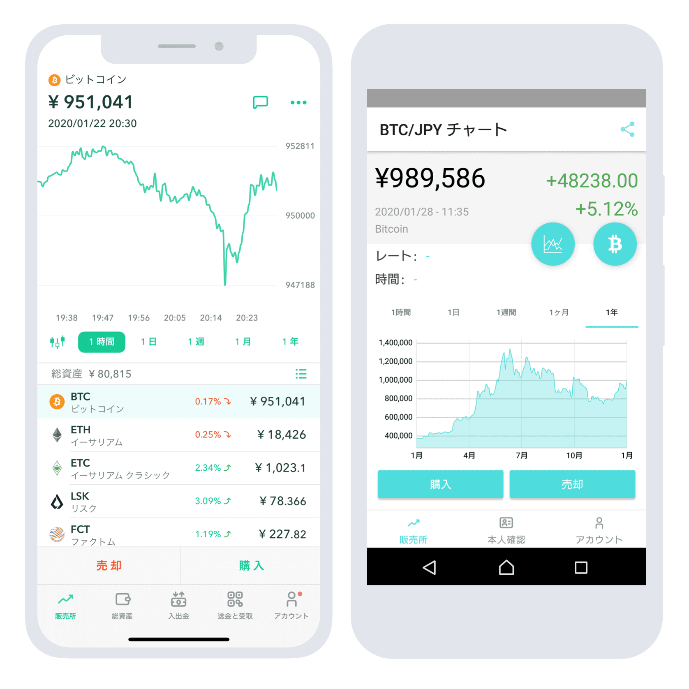

The financial technology sector is witnessing unprecedented growth, largely driven by the proliferation of cryptocurrencies and the advancement of digital trading platforms. These innovations are reshaping traditional financial landscapes, offering new opportunities and challenges. Coincheck, a leading cryptocurrency exchange headquartered in Tokyo, Japan, exemplifies this shift. Since its inception, Coincheck has carved out a significant presence in the increasingly competitive crypto industry by offering a user-friendly trading platform and a wide array of cryptocurrency options.

In parallel, algorithmic trading, commonly known as algo trading, has gained substantial traction in financial markets. This approach utilizes sophisticated algorithms and computer software to execute trades at speeds and frequencies unachievable by human traders. This method is particularly advantageous in volatile markets such as cryptocurrencies, where rapid changes in market conditions can be effectively navigated through automation.



This article aims to explore the convergence of financial technology, cryptocurrency exchanges, and algorithmic trading, with a specific emphasis on Coincheck. As these domains intersect, they promise to enhance trading efficiency, broaden market accessibility, and redefine the future of digital finance.

## Table of Contents

## What is Coincheck?

Coincheck is a prominent cryptocurrency exchange headquartered in Tokyo, Japan. Established in 2012, Coincheck has garnered a reputation for its user-friendly interface and extensive range of cryptocurrency offerings, making it one of the largest exchanges by trading [volume](/wiki/volume-trading-strategy) worldwide. The platform allows its users to trade an array of major cryptocurrencies, including Bitcoin (BTC), Ethereum (ETH), and others, catering to a diverse and global customer base.

Coincheck's journey has not been devoid of challenges. In 2018, the exchange faced a significant hacking incident, which resulted in the loss of approximately $530 million worth of NEM tokens (XEM). This event marked one of the largest security breaches in cryptocurrency history, raising concerns about the security measures within crypto exchanges. However, Coincheck's recovery from this setback underscores its resilience and capability to adapt to the evolving crypto landscape.

Following the hacking incident, Coincheck was acquired by the Monex Group, a leading financial services company in Japan. This acquisition played a pivotal role in revitalizing the platform, with a focus on enhanced security protocols and operational transparency. Under the Monex Group's management, Coincheck implemented rigorous security enhancements and compliance measures to safeguard user assets and data privacy.

Today, Coincheck continues to expand its services, leveraging its robust infrastructure and strategic backing. The acquisition by Monex not only restored user confidence but also positioned Coincheck as a reliable and innovative player in the [cryptocurrency](/wiki/cryptocurrency) market. The exchange remains committed to providing a secure and efficient trading environment, continually adapting to the dynamic market demands.

## Understanding Algorithmic Trading

Algorithmic trading is a sophisticated method in the financial sector that uses computers to execute trades based on pre-defined criteria. This approach relies on algorithms, which are sets of rules or calculations designed to make trading decisions. The key components of algo trading include speed, efficiency, and the capability to swiftly process substantial data volumes and transactions.

One of the primary advantages of [algorithmic trading](/wiki/algorithmic-trading) is its ability to perform trades at speeds that are virtually impossible for human traders. Algorithms can analyze market data and execute trades in milliseconds, significantly faster than manual trading. This speed not only allows traders to capitalize on short-term market opportunities but also reduces the impact of market conditions changing between the decision-making and execution phases.

Efficiency is another crucial benefit of algorithmic trading. Algorithms can operate continuously without pauses or distractions, ensuring consistent application of trading strategies. This feature minimizes human error and emotional decision-making, which can be detrimental in volatile markets.

Algorithmic trading is particularly prevalent in volatile markets like cryptocurrencies, where prices can fluctuate rapidly. The algorithms are designed to respond to specific market signals, such as price movements or trading volumes, by executing trades automatically. This capability is invaluable in the fast-paced cryptocurrency market, where delays in execution can lead to significant differences in trading outcomes.

Additionally, algorithmic trading allows for the simultaneous management of multiple trades, a task that would be daunting and inefficient for human traders. This is particularly beneficial in high-frequency trading, a subset of algorithmic trading, where large numbers of orders are executed in fractions of a second.

To illustrate, a simple Python example of a trading algorithm might be based on moving averages. The algorithm could be designed to buy a cryptocurrency when the short-term moving average exceeds the long-term moving average and sell when the opposite occurs. Here's a basic framework for such an algorithm:

```python
import numpy as np
import pandas as pd

def moving_average_strategy(prices, short_window=40, long_window=100):
    # Calculate moving averages
    signals = pd.DataFrame(index=prices.index)
    signals['price'] = prices
    signals['short_mavg'] = prices.rolling(window=short_window, min_periods=1).mean()
    signals['long_mavg'] = prices.rolling(window=long_window, min_periods=1).mean()

    # Generate signals
    signals['signal'] = 0.0
    signals['signal'][short_window:] = np.where(signals['short_mavg'][short_window:] > signals['long_mavg'][short_window:], 1.0, 0.0)
    signals['positions'] = signals['signal'].diff()

    return signals

# Example use case
# Assume prices is a DataFrame of historical cryptocurrency prices
# signals = moving_average_strategy(prices)
```

The above example demonstrates a basic use of algorithmic trading, where pre-defined rules are applied consistently and accurately to maximize trading efficiency. This capability to efficiently process information and execute trades is why algorithmic trading has gained significant traction, especially in fast-moving markets such as cryptocurrencies.

## Coincheck's Approach to Algo Trading

Coincheck has established itself as a progressive platform by integrating algorithmic trading tools to enhance the trading experience for its users. By offering these tools, Coincheck enables traders to automate their trading strategies, which can lead to increased efficiency and improved market execution.

Automation in trading allows for executing trades at optimal speed and precision based on predefined criteria set by the trader. These criteria can include variables such as market conditions, price [volatility](/wiki/volatility-trading-strategies), or specific trade patterns. The ability to harness algorithmic trading is particularly beneficial in the cryptocurrency market, where conditions can fluctuate rapidly and unpredictably.

A distinguishing feature of Coincheck's approach is the availability of Coincheck Tradeview, a professional-grade version of its trading platform. Tradeview is designed to cater to more sophisticated trading strategies, supporting the needs of experienced traders who require comprehensive tools to implement complex algorithms. This version of the platform provides advanced charting capabilities, technical indicators, and customizable interfaces, all of which are crucial for executing and monitoring algorithmic strategies effectively.

Coincheck’s emphasis on algorithmic trading represents a strategic move to attract both novice and experienced traders by offering a versatile and adaptable platform. By integrating these tools, Coincheck not only enhances user experience but also encourages the adoption of algorithmic strategies, promoting higher speed and precision in trade executions. This adaptability is key in maintaining a competitive edge in the rapidly evolving financial tech landscape.

## Benefits of Using Coincheck for Algo Trading

Coincheck has established itself as a robust platform for algorithmic trading, offering a multitude of advantages to its users. One of the primary benefits lies in its extensive offerings and [liquidity](/wiki/liquidity-risk-premium). Liquidity is essential for algorithmic trading as it ensures that trades can be executed swiftly without causing significant price changes. This is particularly critical in the cryptocurrency market, known for its volatility and rapid price fluctuations. Coincheck's ability to maintain high liquidity levels allows traders to execute large trades efficiently, enabling them to capitalize on market opportunities without substantial market impact.

The platform's user-friendly interface is another significant benefit, particularly for traders who are new to algorithmic strategies. Coincheck's design emphasizes ease of use, providing intuitive navigation and seamless integration of trading tools. This accessibility ensures that traders, regardless of their experience level, can engage with algorithmic trading strategies effectively. The platform's interface facilitates the setting up and monitoring of complex trading algorithms, making it an attractive choice for both novice and experienced traders.

Security is a paramount concern in the cryptocurrency industry, and Coincheck has implemented rigorous security measures post-2018 breach, enhancing its trustworthiness among traders. These measures include advanced encryption techniques, multi-[factor](/wiki/factor-investing) authentication, and stringent compliance with regulatory requirements. By prioritizing security, Coincheck provides traders with the confidence that their funds and personal information are safeguarded against potential threats. This focus on security is crucial for traders employing algorithmic strategies, as it ensures that both their trading algorithms and assets remain protected in a secure trading environment.

In summary, Coincheck's extensive offerings and liquidity, coupled with its user-friendly interface and robust security measures, make it an ideal platform for algorithmic trading. These features enable traders to execute their strategies efficiently while ensuring a secure and accessible trading experience.

## Regulatory Environment and Challenges

Japan has established a comprehensive regulatory framework for cryptocurrency exchanges, providing a secure environment for trading digital assets. This framework is overseen by the Financial Services Agency (FSA), which has implemented thorough regulations to govern cryptocurrency activities within the country. Coincheck, a major cryptocurrency exchange based in Tokyo, adheres to these stringent regulatory requirements, greatly enhancing its operational trustworthiness.

Among the key regulations Coincheck complies with are Know Your Customer (KYC) and Anti-Money Laundering (AML) policies. KYC policies require exchanges to verify the identity of their users, reducing the risk of fraudulent activities. AML measures, on the other hand, are designed to prevent and detect money laundering activities, ensuring that the cryptocurrency exchange environment remains secure and transparent.

In terms of challenges, the evolving regulatory landscape presents both obstacles and opportunities for Coincheck and other cryptocurrency exchanges. As Japan leads with robust regulatory standards, international expansion for platforms like Coincheck may be hindered by differing regulations across countries. Navigating these varying legal environments requires continuous adaptation and compliance updates, posing a significant operational challenge.

However, this rigorous regulatory environment also presents an opportunity for Coincheck to enhance its reputation and competitive edge. By adhering to stringent regulations, Coincheck can offer increased assurance to its users, fostering greater trust and attracting a broader customer base. This strategic compliance can serve as a strong foundation for international growth as Coincheck aims to expand its services globally, despite the complexities of varying international regulations.

Overall, while the regulatory environment in Japan creates certain operational challenges for Coincheck, it also acts as a catalyst for the exchange to strengthen its competitive position through enhanced security measures and trustworthiness.

## The Future of Coincheck and Algo Trading

As the cryptocurrency market continues to evolve, Coincheck is strategically positioned to expand its services and product offerings. The company's planned initial public offering (IPO) on Nasdaq illustrates its ambition to grow and capture a larger market share. This move is expected to increase its visibility among global investors, thereby attracting additional capital to support its expansion plans. The anticipated Nasdaq listing underscores Coincheck's strategy to leverage its accomplishments and reputation in the cryptocurrency space to enter more traditional financial markets.

Integration of more advanced trading features is likely to play a critical role in shaping Coincheck’s future growth. By enhancing its algorithmic trading capabilities, the platform aims to offer sophisticated tools that meet the demands of both retail and institutional traders. Algorithmic features could include enhanced market prediction algorithms, high-frequency trading capabilities, and automated [arbitrage](/wiki/arbitrage) strategies, thereby providing traders with improved efficiency and potential profitability.

Furthermore, partnerships in the technology sector are anticipated to be a significant driver of Coincheck's expansion. Collaborations with leading tech companies could lead to the development of innovative trading solutions and improvements in platform security, a critical consideration following past security breaches. Such partnerships may also facilitate the adoption of cutting-edge technologies like blockchain-based smart contracts, [artificial intelligence](/wiki/ai-artificial-intelligence), and [machine learning](/wiki/machine-learning) in trading operations.

By proactively addressing emerging trends and opportunities within the cryptocurrency market, Coincheck aims to maintain its competitive edge. Its focus on expanding both technical capabilities and market reach ensures that it remains a formidable player in the dynamic landscape of cryptocurrency trading. Continued investment in technology and strategic alliances will likely position Coincheck to exploit the growing importance of algorithmic trading as it navigates future market challenges and opportunities.

## Conclusion

Coincheck exemplifies how traditional financial techniques, such as algorithmic trading, are being effectively integrated into the continuously evolving cryptocurrency market. By leveraging sophisticated algorithms, Coincheck enhances the speed and efficiency of transactions, thereby transforming the trading experience for users. The fusion of financial technology and cryptocurrencies holds immense potential to offer enhanced efficiency and greater accessibility, broadening the scope for traders globally.

Coincheck's persistent innovation plays a crucial role in sustaining its competitive advantage. It offers a user-friendly platform that caters to both novice and seasoned traders, facilitating the broader adoption of algorithmic trading strategies. Moreover, its stringent adherence to regulatory standards underscores its commitment to providing a secure and reliable trading environment. Ensuring compliance with regulatory frameworks not only fortifies the trust of its user base but also prepares Coincheck for potential international expansion, where regulatory adherence is key to entering new markets.

As the cryptocurrency landscape continues to shift, Coincheck is well-positioned to harness emerging opportunities. With plans for further integration of advanced trading features and strategic partnerships in the tech industry, Coincheck is poised for future growth. This ability to adapt and innovate will likely ensure its relevance and leadership in the global cryptocurrency exchange market.

## References & Further Reading

[1]: Bergstra, J., Bardenet, R., Bengio, Y., & Kégl, B. (2011). ["Algorithms for Hyper-Parameter Optimization."](https://papers.nips.cc/paper/4443-algorithms-for-hyper-parameter-optimization) Advances in Neural Information Processing Systems 24.

[2]: ["Advances in Financial Machine Learning"](https://www.amazon.com/Advances-Financial-Machine-Learning-Marcos/dp/1119482089) by Marcos Lopez de Prado

[3]: ["Evidence-Based Technical Analysis: Applying the Scientific Method and Statistical Inference to Trading Signals"](https://books.google.com/books/about/Evidence_Based_Technical_Analysis.html?id=MeoJAQAAMAAJ) by David Aronson

[4]: ["Machine Learning for Algorithmic Trading"](https://github.com/stefan-jansen/machine-learning-for-trading) by Stefan Jansen

[5]: ["Quantitative Trading: How to Build Your Own Algorithmic Trading Business"](https://www.amazon.com/Quantitative-Trading-Build-Algorithmic-Business/dp/1119800064) by Ernest P. Chan