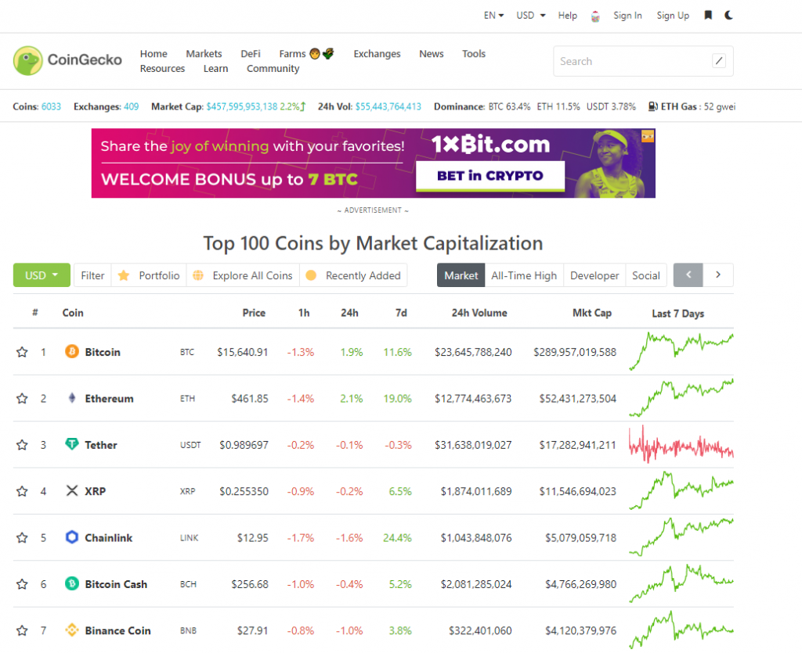

## Table of Contents

## What is CoinGecko and what does its API offer?

CoinGecko is a website that helps people learn about different cryptocurrencies. It shows information like the price, how much it's used, and other details about these digital currencies. People use CoinGecko to keep track of their favorite cryptocurrencies and make smart choices about buying or selling them.

The CoinGecko API is a tool that lets developers get this information and use it in their own projects. With the API, you can pull data like current prices, market trends, and more. This is useful for people who want to make apps or websites that need up-to-date information about cryptocurrencies. It makes it easier for them to build tools that help others understand and use cryptocurrencies better.

## How do I get started with the CoinGecko API?

To get started with the CoinGecko API, first you need to visit their website and go to the developer section. There, you'll find all the information you need about the API, including how to use it and what kind of data you can get. You don't need to sign up or get an API key to use it, which makes it easy to start right away. Just follow the instructions on their site to learn how to make requests to the API.

Once you're ready to use the API, you can start by making simple requests to get data like the current price of a [cryptocurrency](/wiki/cryptocurrency). You can do this by using a tool like Postman or by writing code in a programming language like Python or JavaScript. The CoinGecko API has a lot of different endpoints, which are like different doors you can knock on to get different kinds of information. Start with the basic ones and then explore more as you get comfortable.

## What are the different types of data I can retrieve using the CoinGecko API?

With the CoinGecko API, you can get a lot of different kinds of information about cryptocurrencies. You can find out the current prices of different coins, how much they've gone up or down over time, and even how much people are trading them. This is really helpful if you want to know what's happening with a specific cryptocurrency right now or if you want to see how it's been doing over the last week or month.

The API also lets you look at more detailed stuff like how much of a cryptocurrency is out there (its total supply), how much of it is actually being used (its circulating supply), and even how much energy it takes to run the cryptocurrency's network. You can also get information about the people and companies behind the cryptocurrencies, like who started them and what they're trying to do. This can help you understand more about why a cryptocurrency might be worth paying attention to.

## How do I authenticate and make requests to the CoinGecko API?

The CoinGecko API is easy to use because you don't need to sign up or get an API key to start making requests. This means you can jump right in and start getting data about cryptocurrencies without any extra steps. All you need to do is find the right web address (or endpoint) that gives you the information you want, and then you can use tools like Postman or write code to ask for that data.

When you make a request to the CoinGecko API, you just send a simple message asking for the information you need. For example, if you want to know the current price of Bitcoin, you would use a specific endpoint like `/simple/price` and include Bitcoin in your request. The API will then send back the price information in a format that's easy for your computer to understand, like JSON. This makes it simple to use the data in your own apps or websites.

## What are the rate limits and how can I manage them effectively?

The CoinGecko API has rules about how often you can ask for information. You can make up to 50 requests every second, and you can ask for up to 100,000 requests every day. If you ask for information too quickly, the API might tell you to slow down. This is to make sure everyone can use the API fairly and to keep the service running smoothly.

To manage these limits, you should think about how often you really need to get new information. If you don't need the latest data every second, you can wait a bit longer between your requests. Another good idea is to use something called "caching." This means you save the information you get from the API for a little while, so you don't have to ask for it again right away. By doing this, you can make fewer requests and still have the information you need.

## How can I use the CoinGecko API to fetch real-time cryptocurrency prices?

To fetch real-time cryptocurrency prices using the CoinGecko API, you start by choosing the right endpoint. The endpoint you want is `/simple/price`. You can ask for the price of one cryptocurrency or many at once. Just include the names of the cryptocurrencies in your request, like 'bitcoin' or 'ethereum'. The API will send back the current prices in a format called JSON, which is easy for your computer to read and use.

When you make your request, you can also ask for prices in different currencies, like USD or EUR. This makes it flexible for people all over the world. Remember, you can make up to 50 requests every second, so you can keep checking the prices often if you need to. But try not to ask too quickly, or you might hit the limit and have to wait.

## What are some common use cases for the CoinGecko API in applications?

One common use for the CoinGecko API is in cryptocurrency tracking apps. These apps help people keep an eye on how their favorite cryptocurrencies are doing. By using the API, these apps can show real-time prices, how much a cryptocurrency has gone up or down over time, and other important information. This helps users make better decisions about when to buy or sell their cryptocurrencies. It's like having a personal assistant that keeps you updated on the crypto market all the time.

Another use is in financial websites and tools that want to include cryptocurrency data. For example, a website that normally talks about stocks and bonds might want to add a section about cryptocurrencies. The CoinGecko API lets them easily add this information without having to build everything from scratch. They can show current prices, market trends, and even details about the people behind the cryptocurrencies. This makes their website more useful and interesting to people who are curious about the world of digital money.

Some developers also use the CoinGecko API to build tools for analyzing the cryptocurrency market. These tools can help people understand big trends and patterns in the market, like which cryptocurrencies are growing the fastest or which ones are losing value. By pulling in data from the API, these tools can offer insights and predictions that help users make smarter choices about their investments. It's like having a crystal ball that gives you a peek into the future of cryptocurrencies.

## How can I integrate the CoinGecko API with other data sources for enhanced analysis?

To enhance your analysis of cryptocurrencies, you can combine the data from the CoinGecko API with other data sources. For example, you might want to use financial news APIs like the News API or Alpha Vantage to get the latest news and market trends that might affect cryptocurrency prices. By pulling in this news data and matching it with the price information from CoinGecko, you can see how news events might be driving changes in the market. This can help you understand why prices are moving the way they are and make better predictions about what might happen next.

Another way to enhance your analysis is by integrating social media data. Platforms like Twitter have APIs that let you see what people are saying about cryptocurrencies in real-time. By using the CoinGecko API to get price data and the Twitter API to see what people are talking about, you can look for patterns and connections between what's being said online and how prices are changing. This can give you a fuller picture of the market, showing not just the numbers but also the human reactions and opinions that might be influencing those numbers.

## What advanced features does the CoinGecko API offer for market analysis?

The CoinGecko API offers some advanced features that can help you do a deeper analysis of the cryptocurrency market. One cool feature is the ability to get historical data, which means you can see how prices have changed over time. This is useful if you want to look for patterns or trends that might help you guess where prices are going next. You can also get data about how much a cryptocurrency is being traded, which can tell you if it's becoming more or less popular.

Another advanced feature is the ability to get detailed information about the people and projects behind the cryptocurrencies. This includes things like who started the project, what they're trying to do, and how much money they've raised. By understanding more about the teams and their goals, you can make better guesses about which cryptocurrencies might be worth paying attention to. Plus, the API lets you pull in data about how much energy different cryptocurrencies use, which can be important if you care about the environmental impact of your investments.

## How can I optimize my API calls for better performance and efficiency?

To make your API calls work better and faster, you should think about how often you really need to get new information. If you don't need the latest data every second, you can wait a bit longer between your requests. This helps you stay within the rate limits and keeps your app running smoothly. Another good idea is to use something called "caching." This means you save the information you get from the API for a little while, so you don't have to ask for it again right away. By doing this, you can make fewer requests and still have the information you need.

You can also make your API calls more efficient by asking for less information at once. Instead of getting all the data about a cryptocurrency in one go, you can break it up into smaller pieces. For example, if you only need the current price, you can use the `/simple/price` endpoint instead of a bigger one that gives you more details. This makes your requests quicker and uses less of your daily limit. By thinking carefully about what data you really need and when, you can make your app run better and keep the API happy.

## What are the best practices for handling and storing data retrieved from the CoinGecko API?

When you get data from the CoinGecko API, it's a good idea to store it in a way that's easy to use later. You can save the data in a database like SQLite or MongoDB, which let you keep track of things like prices and market trends over time. This way, you can quickly look up information without having to ask the API again and again. Also, think about using something called "caching," where you keep a copy of the data for a little while. This helps you use less of your daily limit of API requests and makes your app run faster.

It's also important to keep your data safe and correct. Make sure you check the data you get from the API to see if it makes sense. For example, if a price suddenly jumps up a lot, you might want to double-check it before you use it in your app. You can also use something called "data validation" to make sure the numbers and other information are what you expect. By taking these steps, you can make sure your app works well and gives people the right information about cryptocurrencies.

## How can I contribute to or request new features for the CoinGecko API?

If you want to help make the CoinGecko API better or ask for new features, you can start by joining their community. They have a place on their website where people can talk about what they like and don't like about the API. You can share your ideas there and see what other people think. If a lot of people agree with your idea, it might get added to the API. It's like being part of a team that's always trying to make things better.

Another way to contribute is by using their GitHub page. CoinGecko has a space on GitHub where they share the code for their API. If you know how to code, you can look at this code, make changes, and suggest them to the CoinGecko team. They might use your changes if they think it's a good idea. And if you have a new feature you want, you can ask for it there too. It's a great way to help out and make the API even more useful for everyone.


## API Endpoints and Their Functionality

The CoinGecko API consists of various endpoints, each serving specific data retrieval functions:

- **/ping:** Check API server status.
- **/coins/{id}:** Fetch comprehensive data for a specific cryptocurrency, including market pricing, historical data, and status updates.
- **/simple/price:** Retrieve simple price information for multiple coins in specified currencies.
- **/exchanges:** Lists all supported cryptocurrency exchanges, providing insights into where trading pairs are listed.
- **/events:** Get information about cryptocurrency-related events that could affect market trends.

Each endpoint allows users to customize their requests according to currency preferences, localization, and other parameters, enabling fine-tuned data acquisition.

## Key Features and Benefits

The CoinGecko API offers numerous advantages for developers and traders:

1. **Real-Time and Historical Data:** Access to live market data as well as historical trends helps in comprehensive market analysis.
2. **Scalability:** The API supports a significant number of concurrent data requests, making it suitable for both individual and institutional use.
3. **Wide Cryptocurrency Coverage:** With data on over 6,000 cryptocurrencies, the API offers one of the broadest coverages available.
4. **Open and Transparent:** Unlike many other data providers, CoinGecko does not require subscription fees, providing free access to essential market data.
5. **Community and Sentiment Analysis:** Developers can incorporate social data to analyze market sentiment and influence.
6. **Developer-Friendly Documentation:** Detailed documentation and responsive technical support enhance user experience and integration efficiency.

Through these features, CoinGecko API significantly aids developers and traders by streamlining access to crucial market data, facilitating the development of strategic tools, and enabling responsive trading strategies. By leveraging the resources provided by CoinGecko, users can better navigate the volatile cryptocurrency markets.

## Why Use CoinGecko API in Algorithmic Trading?

Algorithmic trading relies on the efficient processing of vast amounts of data in real-time to execute trades that are both timely and profitable. One of the key advantages of using API data in [algorithmic trading](/wiki/algorithmic-trading) is the ability to access and manipulate market data rapidly and programmatically. CoinGecko, a leading provider of cryptocurrency market data, offers a comprehensive API that is particularly useful for traders looking to enhance their strategies with reliable and real-time information.

The CoinGecko API provides numerous benefits that can significantly improve trading strategies. Firstly, its real-time data capabilities allow traders to monitor market conditions closely and make data-driven decisions swiftly. This immediacy is crucial in the cryptocurrency market, where high [volatility](/wiki/volatility-trading-strategies) can present both opportunities and risks within short periods. The API provides access to live prices, trading [volume](/wiki/volume-trading-strategy), market cap, and more, enabling traders to build algorithms that react to market movements as they happen.

Another significant advantage of the CoinGecko API is its reliability and comprehensiveness. CoinGecko aggregates data from a wide range of exchanges and provides consistent updates, making it a dependable source of information for traders. This reliability is essential for maintaining the integrity of trading algorithms, which require a stable data feed to function effectively. The API's wide coverage includes data from thousands of cryptocurrencies, allowing traders to diversify their portfolios and devise strategies for a range of different assets.

Comparing the CoinGecko API with other market data providers highlights several distinctions. Unlike some competitors, CoinGecko does not impose subscription fees for basic access, making it an accessible option for traders at all levels. Furthermore, while other providers may limit the scope of data provided or focus on a narrower range of assets, CoinGecko's extensive database ensures a broader perspective on the market. Additionally, the API's documentation and community support are well-regarded, often cited as more user-friendly and comprehensive compared to alternatives.

In conclusion, the CoinGecko API stands out in algorithmic trading due to its ability to provide real-time, reliable, and comprehensive market data. Its accessibility and broad coverage empower traders to develop advanced strategies and react promptly to market changes, which are essential in the volatile cryptocurrency landscape. By integrating the CoinGecko API into trading systems, traders can enhance their ability to execute informed, data-driven trades.

## Integrating CoinGecko API with Algorithmic Trading Systems

To successfully integrate the CoinGecko API into an algorithmic trading system, it is essential to follow a series of methodical steps. The process ensures efficient data retrieval, processing, and utilization within trading algorithms. Here, we outline the steps involved, accompanied by practical examples and best practices.

1. **API Access and Authentication:**
   Begin by obtaining access to the CoinGecko API. Unlike some APIs, CoinGecko does not require authentication with a key, simplifying initial access. Confirm the latest API documentation by visiting the [CoinGecko API Documentation](https://www.coingecko.com/en/api).

2. **Identifying API Endpoints:**
   Determine the specific endpoints required for your trading strategy. CoinGecko offers various endpoints, including current price data, market charts, and historical data. Identify endpoints such as `/simple/price` for current prices or `/coins/{id}/market_chart` for historical data.

3. **Fetching Data:**
   Utilize HTTP requests to fetch data from the chosen endpoints. Below is an example using Python and the `requests` library:

   ```python
   import requests

   def fetch_price(coin_id):
       url = f"https://api.coingecko.com/api/v3/simple/price"
       params = {
           'ids': coin_id,
           'vs_currencies': 'usd'
       }
       response = requests.get(url, params=params)
       if response.status_code == 200:
           return response.json()
       else:
           return None

   price_data = fetch_price('bitcoin')
   print(price_data)
   ```
   This example retrieves the current price of Bitcoin in USD.

4. **Data Parsing and Structuring:**
   Once data is fetched, parse the JSON response into a usable format. In Python, this can be achieved using `response.json()`. Ensure your system can handle data appropriately, whether streaming real-time prices or bulk historical data.

5. **Integrating with Trading Logic:**
   With structured data, integrate it into your trading algorithms. This integration could involve using current prices to trigger buy/sell signals or processing historical data for [backtesting](/wiki/backtesting) strategies.

## References & Further Reading

[1]: Bergstra, J., Bardenet, R., Bengio, Y., & Kégl, B. (2011). ["Algorithms for Hyper-Parameter Optimization."](https://papers.nips.cc/paper/4443-algorithms-for-hyper-parameter-optimization) Advances in Neural Information Processing Systems 24.

[2]: ["Advances in Financial Machine Learning"](https://www.amazon.com/Advances-Financial-Machine-Learning-Marcos/dp/1119482089) by Marcos Lopez de Prado

[3]: ["Evidence-Based Technical Analysis: Applying the Scientific Method and Statistical Inference to Trading Signals"](https://www.amazon.com/Evidence-Based-Technical-Analysis-Scientific-Statistical/dp/0470008741) by David Aronson

[4]: ["Machine Learning for Algorithmic Trading"](https://github.com/PacktPublishing/Machine-Learning-for-Algorithmic-Trading-Second-Edition) by Stefan Jansen

[5]: ["Quantitative Trading: How to Build Your Own Algorithmic Trading Business"](https://books.google.com/books/about/Quantitative_Trading.html?id=j70yEAAAQBAJ) by Ernest P. Chan