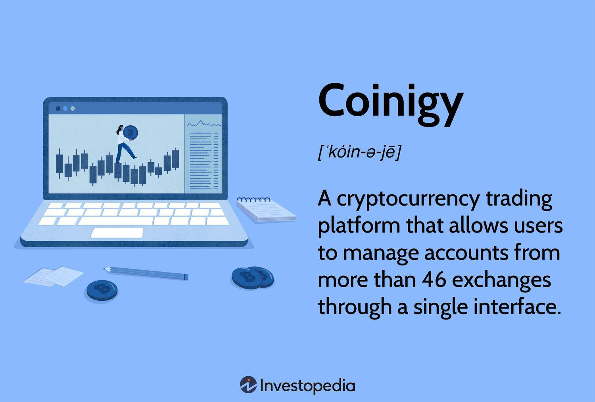

Cryptocurrency trading has experienced substantial advancements with the rise of algorithmic trading, a methodology that enables traders to execute automated trading strategies. In this landscape, Coinigy emerges as a prominent platform for digital asset trading. It allows users to manage and trade assets across multiple exchange accounts through a single, streamlined interface. The platform supports users by offering a comprehensive range of tools and features designed to facilitate efficient and effective trading experiences. Coinigy’s capabilities are further amplified through its integration with AlgoTrader, permitting advanced automated trading strategies that leverage quantitative methods across various cryptocurrency markets. This article explores the essential features of Coinigy and how its integration with AlgoTrader enhances trading efficiency, positioning Coinigy as a strong option for cryptocurrency traders seeking to automate their strategies in the dynamic cryptocurrency market.

## Table of Contents



## What is Coinigy?

Coinigy is a comprehensive platform in the cryptocurrency trading sector that facilitates the integration of wallets and accounts from 46 different exchanges into a single, unified interface. Established in 2014, Coinigy was created to solve the complex challenges associated with navigating multiple cryptocurrency exchange platforms. By centralizing trading activities, it empowers users to track and trade a wide variety of digital currencies efficiently.

The platform is specifically designed to accommodate both novice and seasoned traders, intending to simplify and enhance the overall cryptocurrency management experience. Coinigy achieves this by offering a wide array of features that streamline the trading process. Users can access their portfolios across various exchanges without the need to log into each one separately, thus saving time and reducing the potential for errors in managing multiple accounts.

Coinigy's interface is intuitive and user-friendly, making it accessible to traders with varying levels of expertise. New traders can benefit from the platform's straightforward navigation and easy-to-use tools, easing their entry into the cryptocurrency market. Meanwhile, experienced traders can take advantage of advanced features and analytics to refine their strategies and optimize performance.

Overall, Coinigy provides a centralized trading solution that enhances efficiency and oversight for users engaging in digital currency transactions, positioning itself as a valuable tool in the rapidly evolving landscape of cryptocurrency trading.

## Key Features of Coinigy

Coinigy offers a suite of key features that make it a popular choice for [cryptocurrency](/wiki/cryptocurrency) traders seeking a streamlined and efficient trading experience. One of its primary advantages is the ability to link multiple exchange accounts through a unified Coinigy interface. This capability eliminates the need for traders to log into multiple platforms individually, simplifying the process of trading and portfolio monitoring. By offering a centralized hub for managing assets, users can track and manage their cryptocurrency investments across 46 different exchanges more effectively, saving both time and effort.

In addition to its multi-exchange connectivity, Coinigy provides access to over 75 technical indicators designed to assist traders in making informed decisions. These indicators enable users to analyze market trends, evaluate price movements, and execute strategies with greater precision. The inclusion of such a wide range of analytical tools positions Coinigy as a valuable resource for both novice and experienced traders aiming to optimize their trading outcomes through data-driven insights.

Coinigy also offers real-time data, ensuring that traders are consistently updated with the latest market information. This feature is crucial in the fast-paced world of cryptocurrency trading, where timely data can significantly impact decision-making processes. Alongside real-time data, Coinigy provides live exchange rates, which are essential for tracking price fluctuations across different markets.

Furthermore, Coinigy's platform is equipped with advanced data visualization options and customizable trading indicators. These features allow traders to tailor their interface to suit individual trading strategies and preferences, enhancing the overall user experience. Customizable indicators enable traders to focus on specific metrics that are most relevant to their strategies, thereby improving analytical efficiency and effectiveness.

Overall, Coinigy's key features cater to the diverse needs of cryptocurrency traders by offering a centralized trading experience, comprehensive analytical tools, real-time data access, and customizable interface options. These capabilities collectively contribute to more informed trading decisions, streamlined portfolio management, and a more interactive trading environment.

 to AlgoTrader and Coinigy Integration

AlgoTrader 4.0 has integrated Coinigy's API, providing traders with the ability to automate complex strategies in the cryptocurrency market. The integration enables users to execute [quantitative trading](/wiki/quantitative-trading) strategies, significantly enhancing trading efficiency and effectiveness. By utilizing Coinigy's capabilities, AlgoTrader allows users to access and trade on over 45 popular cryptocurrency exchanges.

This synergy between Coinigy and AlgoTrader enables traders to unlock advanced trading functionalities. Through the use of Coinigy’s API, AlgoTrader offers a seamless experience where traders can automate trading strategies, manage their portfolios, and execute trades without manual intervention. This enhances the capability to swiftly react to market fluctuations, which is crucial in the volatile cryptocurrency market.

Quantitative trading strategies rely on mathematical computations and numerical models to identify trading opportunities. With AlgoTrader's integration, these strategies can be implemented programmatically. For example, a common quantitative method is implementing moving averages to generate buy or sell signals based on crossover points. Here's a Python example using a simple moving average strategy:

```python
import pandas as pd
import numpy as np

# Sample market data
data = pd.DataFrame({
    'close_price': [100, 102, 101, 105, 110, 115, 117, 116, 120, 118]
})

# Calculate Short and Long moving averages
data['Short_MA'] = data['close_price'].rolling(window=2).mean()
data['Long_MA'] = data['close_price'].rolling(window=5).mean()

# Generate signals
data['Signal'] = np.where(data['Short_MA'] > data['Long_MA'], 1, 0)

print(data)
```

In this example, the `Short_MA` (short moving average) is compared to the `Long_MA` (long moving average) to generate trading signals. The integration with Coinigy facilitates executing such strategies across multiple exchanges in real-time.

Overall, the melding of AlgoTrader with Coinigy's API offers traders a powerful toolset for automating and optimizing their trading strategies, providing a significant edge in the digital asset market.

## Benefits of Using Coinigy for Algo Trading

Coinigy offers substantial benefits for traders implementing algorithmic strategies, notably through its ability to automate trading processes. Automation is crucial for reducing manual workloads and minimizing transaction costs, providing traders with more efficient and effective trading operations. By leveraging automated strategies, traders can execute orders faster and capitalize on market movements that might be missed with manual execution. This is especially valuable in the fast-paced cryptocurrency markets where price fluctuations are frequent and rapid.

One of Coinigy’s standout features is its seamless connection to multiple cryptocurrency exchanges. This connectivity enables traders to manage and execute trades across various exchanges without the hassle of logging into each platform separately. This not only saves time but also enhances the user experience by centralizing operations within a single interface. Traders can monitor their portfolios and adjust strategies as needed, all within one cohesive system.

Additionally, Coinigy provides the ArbMatrix tool, which is designed to identify [arbitrage](/wiki/arbitrage) opportunities across different trading pairs and exchanges. Arbitrage is the practice of taking advantage of a price difference between two or more markets, buying low on one and selling high on another. This tool scans multiple exchanges and trading pairs to pinpoint such opportunities, offering traders the potential to earn profits with minimal risk. By automating this process, Coinigy allows traders to systematically capitalize on arbitrage opportunities, which might be too subtle or fleeting for manual trading.

The implementation of these features underscores Coinigy’s utility in the field of algo trading, where efficiency and speed are critical. By reducing the transactional and operational burden, Coinigy empowers traders to focus more on strategy development and market analysis, rather than the logistics of managing accounts and executing trades.

## Security and Subscriptions

Coinigy places a strong emphasis on ensuring the security of its users' data. The platform employs AES 256-bit encryption, a symmetric encryption algorithm widely regarded for its robustness and used by governments and financial institutions around the world. This level of encryption is designed to protect sensitive information from unauthorized access, ensuring that user data, including transaction and personal information, remains secure. Additionally, Coinigy utilizes SSL (Secure Sockets Layer) protocol to establish an encrypted link between the client and server. This further ensures that all data transmitted over the network is shielded from potential threats.

Once users complete a seven-day free trial, they can opt for various subscription plans that cater to different needs and levels of expertise. These plans range from basic to professional tiers, offering flexibility to traders based on their trading [volume](/wiki/volume-trading-strategy), style, and need for features. Basic plans provide essential tools and functionalities for newcomers, while professional plans may include advanced analytical tools and greater access to technical indicators.

In addition to strong encryption practices, Coinigy supports two-[factor](/wiki/factor-investing) authentication (2FA), an additional layer of security that requires not only a password but also an additional code from an external device, making unauthorized access significantly more difficult.

Coinigy also provides dedicated customer support across all subscription tiers, ensuring users can resolve technical issues and inquiries efficiently. This support is particularly beneficial for professional traders who require uninterrupted access to their trading platforms. Overall, the combination of security measures and diverse subscription options makes Coinigy a reliable choice for cryptocurrency enthusiasts and professionals alike.

## Conclusion

Coinigy offers a comprehensive solution for cryptocurrency traders by seamlessly integrating portfolio management with advanced [algorithmic trading](/wiki/algorithmic-trading) capabilities. Through its integration with AlgoTrader, Coinigy enables users to automate complex trading strategies efficiently, thus providing a significant advantage for traders looking to enhance their trading operations through automation. This feature simplifies the trading process by reducing manual workloads and allowing traders to focus on strategizing and optimizing their trades.

Moreover, Coinigy's security protocols, such as AES 256-bit encryption and SSL protocol, ensure that user data remains protected. These measures, along with features like two-factor authentication, bolster user confidence in the platform's reliability and security. Subscription options that range from basic to professional tiers allow traders to select a plan that best suits their individual trading needs, with dedicated customer support available to assist users.

Coinigy's innovative features, robust security measures, and integration capabilities make it a valuable tool for navigating the ever-evolving cryptocurrency market, affirming its position as a leading choice for traders aiming to maximize efficiency and effectiveness in their trading endeavors.

## References & Further Reading

[1]: Bergstra, J., Bardenet, R., Bengio, Y., & Kégl, B. (2011). ["Algorithms for Hyper-Parameter Optimization."](https://dl.acm.org/doi/10.5555/2986459.2986743) Advances in Neural Information Processing Systems 24.

[2]: ["Advances in Financial Machine Learning"](https://www.amazon.com/Advances-Financial-Machine-Learning-Marcos/dp/1119482089) by Marcos Lopez de Prado

[3]: ["Evidence-Based Technical Analysis: Applying the Scientific Method and Statistical Inference to Trading Signals"](https://www.amazon.com/Evidence-Based-Technical-Analysis-Scientific-Statistical/dp/0470008741) by David Aronson

[4]: ["Machine Learning for Algorithmic Trading"](https://github.com/stefan-jansen/machine-learning-for-trading) by Stefan Jansen

[5]: ["Quantitative Trading: How to Build Your Own Algorithmic Trading Business"](https://www.amazon.com/Quantitative-Trading-Build-Algorithmic-Business/dp/1119800064) by Ernest P. Chan