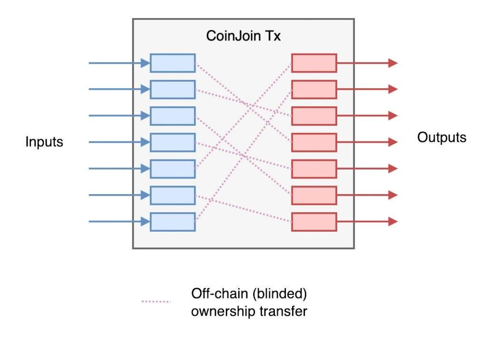

## Table of Contents

## What is Coinjoin and how does it work?

Coinjoin is a way to make Bitcoin transactions more private. It works by mixing your Bitcoin with other people's Bitcoin, so it's harder to track where the coins are going. Imagine you and your friends putting your money into a pot and then taking out the same amount of money, but you don't know whose money you're taking. That's basically what Coinjoin does with Bitcoin.

When you use Coinjoin, you join a group of other people who also want to make their transactions private. Everyone in the group sends their Bitcoin to a special address, and then the Bitcoin is mixed together. After the mixing, the Bitcoin is sent back to everyone in the group, but it's hard to tell which Bitcoin came from which person. This makes it difficult for others to trace the transactions, keeping your financial activities more private.

## Why was Coinjoin developed?

Coinjoin was developed because people wanted more privacy when using Bitcoin. When you use Bitcoin, all transactions are recorded on a public ledger called the blockchain. This means anyone can see where the Bitcoin is going and where it came from. Some people don't like this because they want to keep their financial activities private. Coinjoin helps with this problem by making it harder for others to trace where the Bitcoin is going.

The idea behind Coinjoin is to mix your Bitcoin with other people's Bitcoin. This mixing makes it difficult to follow the trail of the coins. By doing this, Coinjoin helps protect the privacy of the people using it. It's like putting your money into a big pot with other people's money, mixing it up, and then taking out the same amount. This way, it's hard to tell whose money is whose, which keeps your transactions more private.

## How does Coinjoin enhance privacy in cryptocurrency transactions?

Coinjoin helps keep your Bitcoin transactions private by mixing your coins with other people's coins. When you use Coinjoin, you join a group of people who also want to keep their transactions secret. Everyone in the group sends their Bitcoin to a special address, and then the Bitcoin gets mixed together. After the mixing, the Bitcoin is sent back to everyone, but it's hard to tell which Bitcoin came from which person. This makes it difficult for others to follow the trail of the coins.

By mixing the coins, Coinjoin makes it tough for anyone to track where the Bitcoin is going. Imagine putting your money into a big pot with other people's money, mixing it up, and then taking out the same amount. It's hard to tell whose money is whose. This way, your financial activities stay more private because the path of your Bitcoin gets lost in the mix.

## What are the basic steps involved in a Coinjoin transaction?

When you want to use Coinjoin, you first join a group of other people who also want to keep their Bitcoin transactions private. Everyone in the group sends their Bitcoin to a special address. This address is like a big pot where everyone's Bitcoin gets mixed together. It's important that everyone agrees on how the mixing will happen before they send their Bitcoin.

After everyone's Bitcoin is in the pot, it gets mixed up. Then, the mixed Bitcoin is sent back to everyone in the group, but it's hard to tell which Bitcoin came from which person. This mixing makes it difficult for others to follow the trail of the coins. By doing this, your financial activities stay more private because the path of your Bitcoin gets lost in the mix.

## What are the potential risks and limitations of using Coinjoin?

Using Coinjoin can have some risks. One big risk is that if someone in the group doesn't follow the rules, it can mess up the whole process. For example, if someone tries to cheat by not sending their Bitcoin to the special address, it can stop the mixing from happening. Also, if you're using a Coinjoin service that isn't trustworthy, they might steal your Bitcoin or share your information with others. It's important to be careful and use services you can trust.

Another thing to think about is that Coinjoin might not make your transactions completely private. Some smart people and special software can still figure out what's going on if they look closely enough. This means that while Coinjoin can make it harder for others to track your Bitcoin, it's not perfect. Also, some places might not like you using Coinjoin because they think it's used for bad things, even if you're just trying to keep your money private.

## How does Coinjoin differ from other privacy-enhancing technologies in cryptocurrencies?

Coinjoin is different from other privacy-enhancing technologies in cryptocurrencies because it focuses on mixing transactions. When you use Coinjoin, you join a group of people and mix your Bitcoin with theirs. This makes it hard for others to follow where the Bitcoin is going. Other technologies, like Monero, use different ways to keep transactions private. Monero hides the sender, receiver, and amount of the transaction right from the start, making it private without needing to mix with others.

Another technology, called Tumblebit, also mixes transactions but does it differently. Tumblebit uses a special kind of server to mix the Bitcoin, which can be faster and easier to use than Coinjoin. But, like Coinjoin, Tumblebit needs you to trust the server to keep your information safe. On the other hand, technologies like Zcash use something called zero-knowledge proofs to keep transactions private. This means the transaction is private without needing to mix with others or trust a server. Each of these technologies has its own way of making your [cryptocurrency](/wiki/cryptocurrency) transactions more private, but they all work a bit differently.

## What are the legal and regulatory considerations for using Coinjoin?

Using Coinjoin can be tricky because the laws about it are different in different places. Some countries might think using Coinjoin is okay because it helps keep your money private. But other countries might not like it because they think it could be used to do bad things, like hiding money that was gotten in a bad way. It's important to know the laws in your country before you use Coinjoin so you don't get in trouble.

Also, some banks and money services might not want to work with you if they find out you're using Coinjoin. They might think it's too risky or that it's against their rules. This can make it hard to use your Bitcoin in normal ways, like buying things or changing it into regular money. So, it's a good idea to think about these things before you decide to use Coinjoin.

## How can one participate in a Coinjoin transaction?

To join a Coinjoin transaction, you first need to find a service or software that lets you do Coinjoin. There are different tools out there, like Wasabi Wallet or Samourai Wallet, that can help you with this. Once you pick a tool, you'll need to send some of your Bitcoin to the special address that the tool gives you. This address is where all the Bitcoin from everyone in the group will go to get mixed together.

After you send your Bitcoin to the special address, you'll wait for the mixing to happen. The tool will mix your Bitcoin with other people's Bitcoin, and then it will send the mixed Bitcoin back to you. This mixing makes it hard for others to see where your Bitcoin came from or where it's going. Once the mixing is done, you'll get your Bitcoin back, but it will be harder for anyone to track it.

## What are the technical requirements for implementing Coinjoin?

To use Coinjoin, you need a computer or a smartphone with an internet connection. You also need to have some Bitcoin in a wallet that supports Coinjoin, like Wasabi Wallet or Samourai Wallet. These wallets have special software that helps you join a group of people who want to mix their Bitcoin. This software takes care of sending your Bitcoin to a special address, mixing it with other people's Bitcoin, and then sending it back to you.

The software needs to be smart enough to make sure everyone in the group follows the rules. It has to check that everyone sends their Bitcoin to the special address and that no one tries to cheat. It also needs to make sure the mixing happens correctly so that your Bitcoin stays private. This can be tricky, so it's important to use a wallet that is trusted and works well.

## How do different Coinjoin implementations (like Wasabi Wallet, JoinMarket) compare?

Wasabi Wallet and JoinMarket are two popular ways to use Coinjoin, but they work a bit differently. Wasabi Wallet is easy to use because it takes care of everything for you. When you use Wasabi Wallet, you just send your Bitcoin to the wallet, and it automatically joins a group to mix your Bitcoin with other people's. It's simple and good for people who don't want to do a lot of work. On the other hand, JoinMarket lets you have more control. You can choose to be a "maker" who offers to mix with others, or a "taker" who joins a mix that's already happening. This can be more complicated, but it gives you more choices.

Both Wasabi Wallet and JoinMarket aim to keep your Bitcoin transactions private, but they have different ways of doing it. Wasabi Wallet uses a system called Chaumian CoinJoin, which makes it hard for anyone to see who is mixing with whom. This means your privacy is protected without needing to trust other people in the group. JoinMarket, however, uses a market-based approach where people can set prices for mixing, and you can decide if you want to pay for a mix or offer your own. This can be more flexible, but it also means you need to be careful about who you're mixing with.

## What are the future developments and improvements expected in Coinjoin technology?

In the future, Coinjoin technology might get even better at keeping your Bitcoin private. People are working on making it easier to use and more effective. One idea is to make the mixing process faster so you don't have to wait as long for your Bitcoin to come back. Another idea is to make it harder for anyone to track the mixed Bitcoin, even with special software. These improvements could make Coinjoin a better tool for anyone who wants to keep their financial activities private.

Also, there might be new ways to use Coinjoin that make it more useful. For example, some people are thinking about how to mix different kinds of cryptocurrencies, not just Bitcoin. This could help more people use Coinjoin to keep their money private. Plus, as more people learn about and start using Coinjoin, the services might get better and more trustworthy. This could mean safer and more private transactions for everyone.

## How can the effectiveness of Coinjoin in enhancing privacy be measured and evaluated?

To measure how well Coinjoin works at keeping your Bitcoin private, you can look at how hard it is for others to follow where your Bitcoin goes. If the mixing makes it really tough for people to see the path of your coins, then Coinjoin is doing a good job. Researchers and developers often use special tools and software to test this. They might try to track the mixed Bitcoin and see if they can figure out where it came from. If they can't, it means Coinjoin is effective.

Another way to evaluate Coinjoin is by looking at how many people use it and what they think about it. If lots of people are using Coinjoin and saying it helps keep their transactions private, that's a good sign. You can also check if there are any problems or weaknesses that people find. If Coinjoin keeps getting better and fixing these issues, it shows that it's working well to enhance privacy.

## What is the Mechanism of CoinJoin?

CoinJoin is a technique employed to enhance the privacy of Bitcoin transactions by obscuring the direct link between inputs and outputs. This is achieved by aggregating multiple transactions from different users into a single, larger transaction. The core mechanism relies on the principle of mixing, which effectively masks the ownership of the involved coins.

At the heart of CoinJoin is the process of combining multiple inputs and outputs. Each participant provides one or more Bitcoin inputs, and the equal-value outputs are collectively included in the single transaction. This transaction appears in the blockchain as one ordinary transaction, albeit with many inputs and outputs. The equality in transaction value is crucial as it ensures that the amounts cannot be used to trace back to specific inputs. 

The operation can be described mathematically. Suppose we have $n$ participants each contributing an input $x_i$, where $i = 1, 2, ..., n$, to a CoinJoin transaction. Each participant receives an output $y_i$ such that the sum of all inputs equals the sum of all outputs, i.e., 

$$
\sum_{i=1}^{n} x_i = \sum_{i=1}^{n} y_i
$$

This equality guarantees that there are no additional coins added or lost in the mixing process, which is vital for maintaining the trust and transparency inherent to Bitcoin's design, without compromising on privacy.

By this mixing, the path from a specific input to its corresponding output is obfuscated. The output a particular input maps to is not apparent, as all outputs are indistinguishable in terms of the transaction amount. This provides enhanced anonymity since the linkage between the input and output is effectively concealed.

Despite these privacy benefits, CoinJoin has encountered regulatory scrutiny. Some authorities argue that such methods could potentially facilitate illicit activities like money laundering, as the obfuscation can be used to hide the flow of funds. As a result, jurisdictions with stringent anti-money laundering (AML) regulations might classify CoinJoin transactions as suspect, requiring financial entities to apply enhanced scrutiny or even prohibit their usage. Such legal challenges are a significant [factor](/wiki/factor-investing) to consider for users and developers employing CoinJoin, as it might impact their operation in certain regions.

## References & Further Reading

[1]: Maxwell, G., and Poelstra, A. (2013). ["CoinJoin: Bitcoin Privacy for the Real World."](https://scholar.google.com/citations?user=kmrJjoMAAAAJ) 

[2]: Narayanan, A., Bonneau, J., Felten, E., Miller, A., & Goldfeder, S. (2016). ["Bitcoin and Cryptocurrency Technologies: A Comprehensive Introduction."](https://press.princeton.edu/books/hardcover/9780691171692/bitcoin-and-cryptocurrency-technologies) Princeton University Press.

[3]: ["Mastering Bitcoin: Unlocking Digital Cryptocurrencies"](https://books.google.com/books/about/Mastering_Bitcoin.html?id=IXmrBQAAQBAJ) by Andreas M. Antonopoulos

[4]: Böhme, R., Christin, N., Edelman, B., & Moore, T. (2015). ["Bitcoin: Economics, Technology, and Governance."](https://www.aeaweb.org/articles?id=10.1257/jep.29.2.213) The Journal of Economic Perspectives, Vol. 29, No. 2.

[5]: Ruffing, T., Moreno-Sanchez, P., & Kate, A. (2014). ["CoinShuffle: Practical Decentralized Coin Mixing for Bitcoin Privacy."](https://link.springer.com/content/pdf/10.1007/978-3-319-11212-1_20.pdf) Springer, Lecture Notes in Computer Science, Vol. 8735.

[6]: Zohar, A. (2015). ["Bitcoin: under the hood."](https://dl.acm.org/doi/10.1145/2701411) Communications of the ACM, Vol. 58, No. 9.