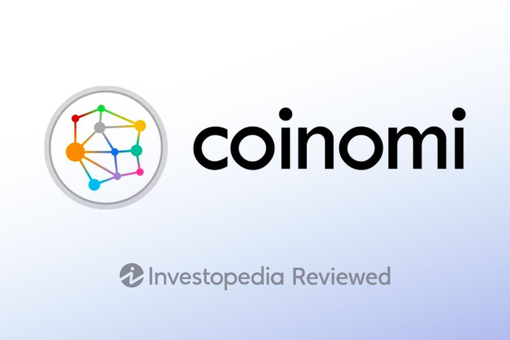

## Table of Contents

## What is Coinomi Wallet and what are its main features?

Coinomi Wallet is a popular cryptocurrency wallet that lets you store, send, and receive different types of cryptocurrencies. It was created in 2014 and is used by millions of people around the world. You can use Coinomi on your phone or computer, and it works with over 125 different blockchains and more than 1770 tokens. This means you can manage a lot of different cryptocurrencies in one place.

One of the main features of Coinomi Wallet is its focus on keeping your cryptocurrencies safe. It uses strong security measures like encryption and private keys that only you can access. This helps protect your money from hackers. Another important feature is that Coinomi lets you stay in control of your own money. You don't have to give your personal information to use it, which makes it more private. Plus, Coinomi makes it easy to swap one cryptocurrency for another right within the wallet, so you don't need to use other services.

## How do you set up and start using Coinomi Wallet?

To set up Coinomi Wallet, first download the app from the Google Play Store, Apple App Store, or Coinomi's official website for desktop use. Once installed, open the app and you'll be prompted to create a new wallet. Tap on "Create a New Wallet" and you'll be asked to choose a name for your wallet. After naming it, you'll be shown a recovery phrase, which is a list of 12 or 24 words. Write this phrase down and keep it in a safe place because it's the only way to recover your wallet if you lose access. You'll then be asked to confirm the recovery phrase by selecting the words in the correct order. Once confirmed, your wallet is set up and ready to use.

To start using Coinomi Wallet, you'll need to add cryptocurrencies to it. Tap on the "+" icon to add a new [cryptocurrency](/wiki/cryptocurrency). You can search for the cryptocurrency you want to use and then tap on it to add it to your wallet. To receive cryptocurrency, go to the specific cryptocurrency's page in your wallet, tap on "Receive," and you'll see a QR code and an address. Share this QR code or address with the person sending you the cryptocurrency. To send cryptocurrency, go to the specific cryptocurrency's page, tap on "Send," enter the recipient's address, the amount you want to send, and any additional details like a memo or transaction fee. Double-check everything before confirming the transaction. With these steps, you can easily manage your cryptocurrencies using Coinomi Wallet.

## What types of cryptocurrencies does Coinomi Wallet support?

Coinomi Wallet supports over 125 different blockchains and more than 1770 tokens. This means you can use it to store, send, and receive many different types of cryptocurrencies. Some of the popular cryptocurrencies you can use with Coinomi include Bitcoin, Ethereum, Litecoin, and Ripple. It also supports many lesser-known cryptocurrencies, so you have a lot of options.

You can add any cryptocurrency that Coinomi supports to your wallet easily. Just search for the cryptocurrency you want to use in the app and add it to your wallet. This makes it simple to manage all your different cryptocurrencies in one place. Whether you're into big names like Bitcoin and Ethereum or smaller, newer cryptocurrencies, Coinomi has you covered.

## Is Coinomi Wallet user-friendly for beginners?

Coinomi Wallet is designed to be easy for beginners to use. When you first open the app, it guides you through setting up your wallet step by step. You just need to follow the instructions to create a wallet and write down your recovery phrase, which is important for keeping your money safe. Once your wallet is set up, adding new cryptocurrencies is simple. You can search for the cryptocurrency you want and add it to your wallet with just a few taps.

The app's interface is clear and easy to navigate. Sending and receiving cryptocurrencies is straightforward. To send, you enter the recipient's address and the amount you want to send. To receive, you just show the QR code or share the address with the person sending you the cryptocurrency. Coinomi also has a feature that lets you swap one cryptocurrency for another right in the app, which can be helpful if you're new to using cryptocurrencies. Overall, Coinomi Wallet makes it easy for beginners to manage their digital money.

## How does Coinomi Wallet ensure the security of user funds?

Coinomi Wallet takes several steps to keep your money safe. It uses strong encryption to protect your private keys, which are like the secret codes that let you control your cryptocurrencies. These private keys never leave your device, so no one else can access them. Coinomi also lets you set up a recovery phrase, which is a list of words you write down and keep safe. If you lose your phone or forget your password, you can use this phrase to get your money back.

Another way Coinomi keeps your funds secure is by not asking for personal information. This means you can use the wallet without giving away details like your name or email address, which makes it harder for hackers to target you. Coinomi also works with many different blockchains, and it's always updating to support new ones, which helps keep your money safe as new security features are added.

## What are the fees associated with using Coinomi Wallet?

When you use Coinomi Wallet, you don't have to pay any fees to Coinomi itself. The wallet is free to download and use. However, when you send cryptocurrencies, you might have to pay a small fee to the network that handles the transaction. This fee is called a "network fee" or "transaction fee," and it goes to the miners or validators who process your transaction on the blockchain.

The amount of the network fee depends on the cryptocurrency you're sending and how busy the network is. For example, sending Bitcoin might cost more than sending a less popular cryptocurrency. You can choose how much you want to pay for the fee, but if you pay less, your transaction might take longer to go through. Coinomi lets you set this fee, so you can decide if you want your transaction to be faster or cheaper.

## Can you use Coinomi Wallet across multiple devices, and how?

Yes, you can use Coinomi Wallet on multiple devices. To do this, you need to set up your wallet on one device first and write down your recovery phrase. This is a list of words that you can use to get your wallet back if you lose your device or want to use it on another device. Once you have your recovery phrase, you can download Coinomi on another device, like your phone or computer, and choose the option to "Restore Wallet" when you open the app. Enter your recovery phrase in the correct order, and your wallet will be set up on the new device with all your cryptocurrencies.

Using Coinomi on multiple devices is handy because you can access your wallet from anywhere. Just make sure to keep your recovery phrase safe and never share it with anyone. If you lose your recovery phrase, you won't be able to get your money back. Also, remember that each device you use should be secure to keep your cryptocurrencies safe.

## How does Coinomi Wallet handle backups and recovery?

When you set up Coinomi Wallet, it gives you a recovery phrase. This is a list of 12 or 24 words that you need to write down and keep in a safe place. This recovery phrase is very important because it's the only way to get your money back if you lose your phone or forget your password. You should never share this phrase with anyone, and keep it somewhere secure, like a safe or a locked drawer.

If you need to recover your wallet, you can use this recovery phrase. Just download Coinomi on a new device, choose the "Restore Wallet" option, and enter your recovery phrase in the correct order. Once you do this, your wallet will be set up on the new device with all your cryptocurrencies. This makes it easy to use Coinomi on different devices or recover your wallet if something goes wrong.

## What are the advantages of using Coinomi Wallet compared to other wallets?

Coinomi Wallet has many advantages that make it a good choice compared to other wallets. One big advantage is that it supports a lot of different cryptocurrencies. You can use over 125 blockchains and more than 1770 tokens in one place. This makes it easy to manage all your digital money without needing different wallets for different coins. Another advantage is that Coinomi is very private. You don't have to give your personal information to use it, which helps keep your money safe from hackers.

Another great thing about Coinomi is its focus on security. It uses strong encryption to protect your private keys, and these keys never leave your device. This means no one else can get to your money. Coinomi also makes it easy to back up and recover your wallet with a recovery phrase. If you lose your phone or forget your password, you can use this phrase to get your money back. Plus, Coinomi lets you swap cryptocurrencies within the app, so you don't need to use other services, which can be safer and more convenient.

## Are there any known vulnerabilities or past security breaches with Coinomi Wallet?

Coinomi Wallet has had a few issues in the past, but they have worked hard to fix them. One big problem happened in 2019 when some users lost their money because of a vulnerability in the way Coinomi handled certain types of transactions. This was a big deal, but Coinomi quickly found the problem and fixed it. They also told users how to stay safe and avoid similar problems in the future.

Since then, Coinomi has been working to make their wallet even more secure. They keep updating the app to add new security features and support more cryptocurrencies. While no wallet is perfect, Coinomi has shown that they take security seriously and are always trying to improve. If you use Coinomi, it's a good idea to keep your app updated and follow their safety tips to keep your money safe.

## How does Coinomi Wallet integrate with decentralized exchanges?

Coinomi Wallet makes it easy to swap different cryptocurrencies without leaving the app. It works with many decentralized exchanges, like Changelly and ShapeShift. This means you can trade one cryptocurrency for another right inside Coinomi, without having to use another website or app. You just pick the cryptocurrency you want to trade, choose how much you want to swap, and Coinomi takes care of the rest. It's like having a mini exchange right in your wallet.

Using decentralized exchanges through Coinomi is good because it helps keep your money safe. When you trade on a decentralized exchange, you don't have to give your money to someone else to hold it. This means you stay in control of your cryptocurrencies the whole time. Plus, since you don't have to move your money to another place to trade, it's quicker and easier. Coinomi makes sure you can do all this without needing to be a crypto expert.

## What advanced features does Coinomi Wallet offer for expert users?

Coinomi Wallet has some cool features for people who know a lot about cryptocurrencies. One of these is the ability to control your own private keys. This means you can keep your money extra safe because no one else can access it. Expert users can also use Coinomi to connect to different blockchains and tokens that might not be as common. This is helpful if you want to try out new cryptocurrencies or manage a lot of different types of digital money.

Another advanced feature is the integration with decentralized exchanges like Changelly and ShapeShift. This lets you swap one cryptocurrency for another without leaving the wallet, which can be faster and safer than using other services. Plus, Coinomi supports SegWit for Bitcoin, which can make your transactions cheaper and faster. For those who like to keep their money as secure as possible, Coinomi also offers features like setting custom transaction fees and using hardware wallets like Ledger or Trezor for even more protection.

## References & Further Reading

[1]: ["Advances in Financial Machine Learning"](https://www.amazon.com/Advances-Financial-Machine-Learning-Marcos/dp/1119482089) by Marcos Lopez de Prado

[2]: Bergstra, J., Bardenet, R., Bengio, Y., & Kégl, B. (2011). ["Algorithms for Hyper-Parameter Optimization."](https://proceedings.neurips.cc/paper/2011/file/86e8f7ab32cfd12577bc2619bc635690-Paper.pdf) Advances in Neural Information Processing Systems 24.

[3]: ["Evidence-Based Technical Analysis: Applying the Scientific Method and Statistical Inference to Trading Signals"](https://www.amazon.com/Evidence-Based-Technical-Analysis-Scientific-Statistical/dp/0470008741) by David Aronson

[4]: ["Machine Learning for Algorithmic Trading"](https://github.com/stefan-jansen/machine-learning-for-trading) by Stefan Jansen

[5]: ["Quantitative Trading: How to Build Your Own Algorithmic Trading Business"](https://www.amazon.com/Quantitative-Trading-Build-Algorithmic-Business/dp/1119800064) by Ernest P. Chan