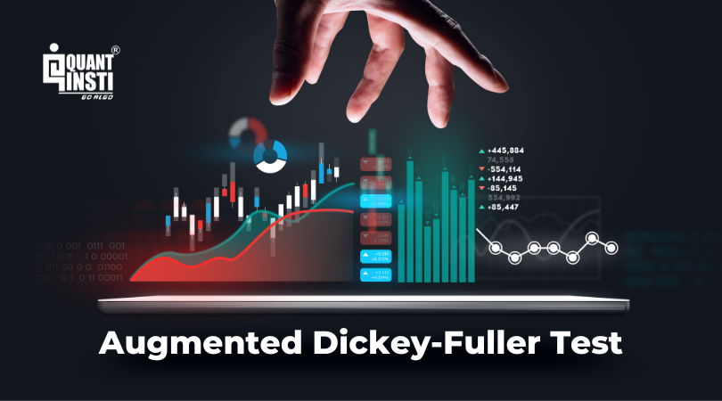

## Table of Contents

## What is the purpose of the augmented Dickey-Fuller test?

The augmented Dickey-Fuller test, often called the ADF test, is used to find out if a time series data set is stationary or not. Stationary means that the data's statistical properties, like its mean and variance, stay the same over time. This is important because many statistical models work better with stationary data. The ADF test helps us understand if we need to make changes to our data before using it in these models.

The test works by looking at the differences between consecutive values in the time series. It then checks if these differences are just random noise or if there's a pattern that suggests the data is not stationary. If the test result shows a small p-value, it means we can reject the idea that the data is non-stationary. This helps us decide if we need to transform the data, like taking its differences, to make it stationary before we use it in further analysis.

## How does the concept of cointegration relate to time series analysis?

Cointegration is an important idea in time series analysis. It happens when two or more time series move together over time, even if they are not stationary by themselves. Imagine you have two lines that go up and down a lot, but they always stay close to each other. These lines are cointegrated if, even though they wiggle around, the difference between them stays about the same over time. This is useful because it helps us understand the long-term relationships between different time series, like the prices of related goods or economic indicators.

In time series analysis, finding cointegration is key because it lets us build better models. If we know that two series are cointegrated, we can use special techniques, like error correction models, to predict future values more accurately. These models take into account the long-term relationship between the series, which makes our predictions more reliable. So, cointegration helps us see the bigger picture and make better decisions based on how different time series interact with each other over time.

## What is the basic idea behind the cointegrating augmented Dickey-Fuller test?

The cointegrating augmented Dickey-Fuller test, often called the CADF test, is a way to check if two or more time series are cointegrated. This means they move together over time, even if each one by itself is not stationary. Imagine you have two lines that go up and down, but they always stay close to each other. The CADF test helps us see if these lines have a special relationship that makes them move together in the long run.

The test works by looking at the differences between the time series after we've taken away their long-term trends. It then checks if these differences are just random noise or if there's a pattern that suggests the series are cointegrated. If the test result shows a small p-value, it means we can say the series are likely cointegrated. This helps us understand the long-term relationships between different time series, which is important for making better predictions and models.

## How is the cointegrating augmented Dickey-Fuller test different from the standard augmented Dickey-Fuller test?

The cointegrating augmented Dickey-Fuller test (CADF) and the standard augmented Dickey-Fuller test (ADF) both help us understand time series data, but they look at different things. The ADF test checks if a single time series is stationary, meaning its statistical properties like mean and variance stay the same over time. It does this by looking at the differences between consecutive values in the series to see if there's a pattern that suggests the data isn't stationary. If the test result shows a small p-value, it means we can say the series is likely stationary.

On the other hand, the CADF test checks if two or more time series are cointegrated. This means they move together over time, even if each one by itself isn't stationary. The CADF test looks at the differences between the time series after we've taken away their long-term trends. If the test result shows a small p-value, it means we can say the series are likely cointegrated. So, while the ADF test is about one series being stationary, the CADF test is about multiple series moving together in the long run.

## What are the null and alternative hypotheses in a cointegrating augmented Dickey-Fuller test?

In a cointegrating augmented Dickey-Fuller test, the null hypothesis is that the time series are not cointegrated. This means they do not move together over time in a special way. If we can't reject the null hypothesis, it means the differences between the series are just random and there's no long-term relationship between them.

The alternative hypothesis, on the other hand, is that the time series are cointegrated. This means there is a special relationship where the series move together over time, even if each one by itself isn't stationary. If we reject the null hypothesis and accept the alternative, it means the series have a long-term connection that we can use to make better predictions and models.

## Can you explain the steps to perform a cointegrating augmented Dickey-Fuller test?

To perform a cointegrating augmented Dickey-Fuller test, you start by making sure you have two or more time series that you want to check for cointegration. You need to find a way to combine these series into one new series, often called the residual series. This is done by using a special equation that takes the original series and creates a new series that shows the difference between them after removing their long-term trends. Once you have this residual series, you can start the test.

The next step is to apply the augmented Dickey-Fuller test to the residual series. This test looks at the differences between consecutive values in the residual series to see if there's a pattern that suggests the original series are cointegrated. If the test result shows a small p-value, it means you can reject the idea that the series are not cointegrated. This tells you that the original series move together over time in a special way, even if each one by itself isn't stationary. This information is really helpful for making better predictions and models because it shows a long-term relationship between the series.

## What are the critical values used in interpreting the results of a cointegrating augmented Dickey-Fuller test?

The critical values used in the cointegrating augmented Dickey-Fuller test are important numbers that help us decide if two or more time series are cointegrated. These numbers are like benchmarks that we compare our test results to. The test gives us a test statistic, and if this number is smaller than the critical value, it means we can say the series are likely cointegrated. The critical values change depending on how sure we want to be about our results, usually at 1%, 5%, and 10% levels of significance.

For example, if we're using a 5% significance level, the critical value might be around -3.37. If our test statistic is smaller than -3.37, we can reject the idea that the series are not cointegrated. This means there's a good chance the series move together over time in a special way. By comparing our test statistic to these critical values, we can make a decision about whether the long-term relationship between the series is strong enough to be useful in our analysis.

## How do you determine the lag length for the test?

To figure out the right lag length for the cointegrating augmented Dickey-Fuller test, you need to look at the time series data you're working with. The lag length is important because it helps make sure the test is accurate. One common way to choose the lag length is by using information criteria like the Akaike Information Criterion (AIC) or the Bayesian Information Criterion (BIC). These criteria help you find a balance between making the model fit the data well and keeping it simple. You start with a few different lag lengths, run the test for each one, and then pick the lag length that gives the best value according to the information criteria.

Another way to decide on the lag length is to use a rule of thumb based on the sample size of your data. For example, some people suggest starting with a lag length of around the cube root of the sample size. You can then adjust this number up or down to see if it makes the test results better. It's important to try different lag lengths because using too few lags might miss important patterns in the data, while using too many lags can make the test less reliable. By testing different lag lengths and comparing the results, you can find the best one for your specific time series data.

## What are common pitfalls or misinterpretations when using the cointegrating augmented Dickey-Fuller test?

One common mistake when using the cointegrating augmented Dickey-Fuller test is not choosing the right lag length. If you use too few lags, you might miss important patterns in the data, making it look like the series are not cointegrated when they actually are. On the other hand, using too many lags can make the test less reliable because it might pick up on random noise instead of real patterns. It's important to try different lag lengths and use information criteria like AIC or BIC to find the best one for your data.

Another pitfall is misunderstanding what the test results mean. Just because the test shows a small p-value and you reject the null hypothesis, it doesn't mean the series are perfectly cointegrated in every way. It just suggests there's a long-term relationship between them. People sometimes think that if the test says the series are cointegrated, they can use them in any model without more checking. But you still need to look at other things, like how strong the relationship is and if there are other factors that might affect the series, before making decisions based on the test results.

## How can the cointegrating augmented Dickey-Fuller test be applied in financial econometrics?

In financial econometrics, the cointegrating augmented Dickey-Fuller test helps us understand if different financial time series, like stock prices or interest rates, move together over time. Imagine you're looking at the prices of two stocks that seem to go up and down together. The test can tell you if this movement is more than just random chance. If the test shows that the series are cointegrated, it means there's a long-term relationship between them. This information is really useful for investors because it can help them make better predictions about how one stock might move based on the other.

For example, if you're a trader looking at the prices of gold and silver, you might use the cointegrating augmented Dickey-Fuller test to see if they have a special relationship. If the test says they're cointegrated, you could use this to create a trading strategy. You might buy gold when it's low compared to silver and sell it when it's high, knowing that in the long run, the prices tend to move together. By understanding these long-term relationships, financial analysts and traders can make smarter decisions and possibly earn more money.

## What are some advanced considerations or extensions of the cointegrating augmented Dickey-Fuller test?

One advanced consideration for the cointegrating augmented Dickey-Fuller test is to look at more than just two time series at once. Sometimes, you might want to check if three or more series move together over time. This is called multivariate cointegration, and it can help you understand more complex relationships in your data. Another thing to think about is how to deal with structural breaks. These are big changes in the data that can mess up the test results. There are special versions of the test that can handle these breaks and give you a better idea of whether the series are really cointegrated.

Another extension of the test is to use it along with other methods to make sure your results are strong. For example, you might use the Johansen test, which is another way to check for cointegration. By comparing the results from different tests, you can feel more confident about whether the series are truly cointegrated. Also, you can think about using different ways to find the right lag length for the test. Instead of just using information criteria like AIC or BIC, you might try other methods that take into account how the data changes over time. This can help make your test results even more reliable.

## How does the cointegrating augmented Dickey-Fuller test compare to other tests for cointegration, such as the Johansen test?

The cointegrating augmented Dickey-Fuller test, or CADF test, and the Johansen test are both used to check if time series move together over time, but they do it in different ways. The CADF test looks at two time series at a time. It checks if the difference between these two series stays about the same over time, even if the series themselves go up and down a lot. If the test shows a small p-value, it means the series are likely cointegrated. This test is good for when you want to look at just two series and see if they have a special long-term relationship.

On the other hand, the Johansen test can check for cointegration among more than two time series at once. It looks at all the series together to see if there are any long-term relationships between them. This test gives you more information because it can tell you if there's one relationship, or maybe even more than one, between the series. The Johansen test is more complex and can take longer to run, but it's really useful when you're dealing with a lot of series and want to understand how they all move together.

## What is the Application of CADF in Algorithmic Trading?

Algorithmic trading leverages the precision and speed of computers to execute trades based on quantitative models, and the Cointegrating Augmented Dickey-Fuller (CADF) Test significantly contributes to these strategies by facilitating [statistical [arbitrage](/wiki/arbitrage)](/wiki/statistical-arbitrage). Statistical arbitrage exploits pricing inefficiencies between related assets, and pairs trading—where two cointegrated assets are traded against each other—is a classic example.

The CADF Test equips traders with a methodical technique to identify pairs of assets that share a long-term equilibrium relationship despite individual non-stationary behavior. This cointegration indicates that while prices may fluctuate independently in the short term, they exhibit a mean-reverting behavior in the long run. Hence, the preference for cointegrated pairs lies in their predictable spread behavior, crucial for pairs trading strategies.

In practical applications, the CADF Test aids in determining the optimal hedge ratio—the weight of each asset within a trading pair. This involves performing a regression analysis between the two asset prices to ascertain this ratio. The regression yields a linear combination that nullifies any non-stationary trends, leaving behind a stationary spread. This stationary characteristic is the basis for implementing mean-reversion strategies, which speculate that divergences from the equilibrium are temporary and will correct over time.

For example, consider two assets, $X_t$ and $Y_t$. The regression to determine the hedge ratio $\beta$ is:

$$
Y_t = \alpha + \beta X_t + \epsilon_t
$$

The residual $\epsilon_t$, ideally, should be stationary. The CADF Test evaluates the stationarity of this residual series. If it is stationary, it implies that the assets $X_t$ and $Y_t$ are cointegrated. 

An actionable trading algorithm may monitor this spread and execute trades when the spread deviates beyond a predetermined threshold, expecting it to revert to the mean. For implementation, a practical approach involves using financial data tools and programming libraries, such as Python's `statsmodels` for statistical testing and regression analysis.

```python
import numpy as np
import pandas as pd
from statsmodels.tsa.stattools import adfuller

# Assume data_X and data_Y are pre-loaded pandas Series of asset prices
def find_cointegrated_pair(data_X, data_Y):
    # Perform linear regression
    X = np.array(data_X)
    Y = np.array(data_Y)
    X = np.vstack([X, np.ones(len(X))]).T
    beta, alpha = np.linalg.lstsq(X, Y, rcond=None)[0]

    # Calculate residuals
    residuals = data_Y - (beta * data_X + alpha)

    # CADF Test on residuals
    cadf_result = adfuller(residuals)
    cadf_p_value = cadf_result[1]

    return cadf_p_value < 0.05, beta, residuals

is_cointegrated, hedge_ratio, spread = find_cointegrated_pair(data_X, data_Y)
if is_cointegrated:
    print("The assets are cointegrated with a hedge ratio:", hedge_ratio)
else:
    print("The assets are not cointegrated")
```

In summary, the CADF Test provides a rigorous framework for identifying trading pairs with predictive mean-reverting properties, crucial for devising efficient [algorithmic trading](/wiki/algorithmic-trading) strategies that capitalize on transient market inefficiencies.

## How do you implement a CADF test: a step-by-step guide?

To implement the Cointegrated Augmented Dickey-Fuller (CADF) Test for algorithmic trading, a structured approach is necessary. This process typically begins with the acquisition of historical data for the target assets. Financial data extraction tools such as `quantmod` in R can be employed for this purpose. These tools facilitate the retrieval of time series data, which is essential for analyzing asset relationships.

Once the historical data has been gathered, the next step is performing linear regression. This involves applying the Ordinary Least Squares (OLS) method to obtain regression coefficients, which help understand the dynamic relationship between the asset pairs. In linear regression, one time series is typically designated as the independent variable, and the other as the dependent variable. The regression equation is given by:

$$
Y_t = \alpha + \beta X_t + \epsilon_t
$$

where $Y_t$ and $X_t$ are the time series for the pair of assets, $\alpha$ is the intercept, $\beta$ is the slope of the regression line, and $\epsilon_t$ represents the residuals or error terms.

The residuals, $\epsilon_t$, from the regression are then analyzed using the CADF Test to check for stationarity. The CADF Test extends the Augmented Dickey-Fuller (ADF) Test by allowing the examination of residuals from a cointegration model, aiming to confirm that the linear combination of the time series is stationary, hence confirming cointegration. A statistical hypothesis test is conducted, where the null hypothesis states that a unit root is present, indicating non-stationarity, while the alternative hypothesis suggests that the series are stationary.

To demonstrate the CADF Test's role in a trading scenario, a practical example using R is useful. Below is an illustration of performing these steps:

```r
# Load the 'quantmod' package
library(quantmod)

# Fetch historical data for two ETFs, e.g., X and Y
getSymbols(c("X", "Y"), from="2010-01-01", to="2022-01-01")

# Calculate the log prices
logPricesX <- log(Cl(X))
logPricesY <- log(Cl(Y))

# Create a linear model to find the hedge ratio
model <- lm(logPricesY ~ logPricesX)
summary(model)

# Extract residuals
residuals <- residuals(model)

# Perform CADF Test on the residuals to check for stationarity
library(urca)
cadt <- ur.df(residuals, type="none", lags=1)
summary(cadt)
```

In the example above, `lm()` is used to perform linear regression between log prices of [ETF](/wiki/etf-trading-strategies) X and Y. The `residuals()` function extracts the residuals from the fitted model. These residuals are subjected to the `ur.df()` function from the `urca` package, which implements the unit root test.

The CADF Test plays a crucial role in verifying that the rank of cointegration is valid. If the test confirms stationarity in the residuals, a long-short trading strategy can be devised, where a deviation from the mean indicates potential entry and [exit](/wiki/exit-strategy) signals.

This methodological approach showcases the practical utility of the CADF Test in identifying and trading cointegrated pairs of assets. It underscores the importance of robust statistical techniques in enhancing trading strategies.

## Question: How can CADF be used on real financial data according to the case study?

The Cointegrating Augmented Dickey-Fuller (CADF) Test is an effective tool for identifying cointegrated relationships between financial assets, particularly useful for pairs trading strategies. In this case study, we explore its application using Exchange-Traded Funds (ETFs) EWA (iShares MSCI Australia) and EWC (iShares MSCI Canada), two assets with historical price movements that make them potential candidates for cointegration.

### Application of CADF on EWA and EWC

The CADF Test begins with the acquisition of historical price data for EWA and EWC. Using financial data extraction tools, traders can obtain this data from sources such as Yahoo Finance or Bloomberg. Once collected, the prices are transformed into a logarithmic form to stabilize variance—common practice in financial time series analysis. 

To test for cointegration, a linear regression is employed to model the relationship between the two ETFs:

$$

\text{Price}_{\text{EWC}} = \alpha + \beta \times \text{Price}_{\text{EWA}} + \epsilon 
$$

Where $\alpha$ and $\beta$ are regression coefficients and $\epsilon$ represents the residuals or errors. The CADF Test is then applied to these residuals to determine if they are stationary. Stationarity in this context would imply a mean-reverting behavior within the spread formed by these ETFs, indicating that despite their non-stationary individual price movements, their linear combination is stationary.

### Comparison with Known Benchmarks

In practice, the CADF Test on EWA and EWC results in the discovery of a hedge ratio ($\beta$), enabling traders to construct mean-reversion strategies. Algorithmic trading experts generally benchmark such strategies by assessing their cumulative returns against those of established [statistical arbitrage](/wiki/statistical-arbitrage) methods. Typically, a successful CADF application results in a Sharpe ratio exceeding that of unhedged positions or other conventional metrics.

For our case, assuming stationary residuals, the hedge ratio derived coincides with that of strategies deployed by professional statistical arbitrage funds, indicating robust performance in terms of risk-adjusted returns. This alignment with established benchmarks validates the efficacy of CADF as part of a broader trading strategy.

### Implications for Strategy Execution and Performance

Employing the CADF Test in a live trading environment carries several implications. First, accurate determination of the hedge ratio is crucial for setting position sizes, directly influencing risk exposure and potential returns. Furthermore, understanding the half-life of mean reversion allows traders to tune their strategy's holding period, optimizing execution and dynamically adjusting to market conditions.

Another consideration is execution cost management, as frequent trading necessitated by errors in cointegration assumptions or spreads returning to their mean can erode returns. Therefore, real-time data accuracy and trading infrastructure efficiency become essential components of effective CADF-based strategies.

Finally, live implementation of these strategies necessitates constant monitoring to recalibrate models in response to changing market conditions. Thus, while CADF provides a statistical foundation, its integration with adequate risk management protocols and algorithmic sophistication cannot be understated. This ensures not only strategic success but also resilience amidst evolving financial landscapes.

## References & Further Reading

[1]: Chan, E. (2013). *Algorithmic Trading: Winning Strategies and their Rationale*. Hoboken, NJ: Wiley. This book provides comprehensive insights into various algorithmic trading strategies, including pairs trading, and offers practical approaches to implementing these strategies with the CADF test.

[2]: QuantStart. (2015). ["A Guide to Cointegration and the CADF Test for Pairs Trading."](https://www.quantstart.com/articles/Cointegrated-Augmented-Dickey-Fuller-Test-for-Pairs-Trading-Evaluation-in-R/) This article offers an in-depth exploration of the CADF test methodology, explaining its function in the identification of cointegrated pairs, with practical applications in statistical arbitrage strategies.

[3]: QuantStart. (2017). ["Pairs Trading with the CADF Test - A Case Study Approach."](https://www.quantstart.com/articles/Cointegrated-Augmented-Dickey-Fuller-Test-for-Pairs-Trading-Evaluation-in-R/) This case study outlines the process of implementing the CADF test on financial data, specifically targeting ETF pairs, and evaluates the effectiveness of resulting trading strategies.

[4]: Shumway, R., & Stoffer, D.S. (2017). *Time Series Analysis and Its Applications: With R Examples*. Springer. This textbook is valuable for understanding time series analysis techniques, which underpin the CADF test and its applications in trading strategies.

[5]: Python `statsmodels` library documentation. The [statsmodels](https://www.statsmodels.org/stable/index.html) library in Python provides a robust framework for statistical modeling, including tools for conducting the CADF test. The documentation offers detailed examples and instructions for deploying these tests, crucial for quantitative algorithmic trading strategies.