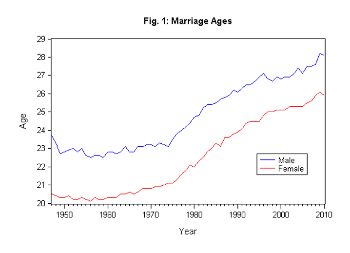

## Table of Contents

## What is cointegration in simple terms?

Cointegration is a statistical concept that helps us understand the relationship between two or more time series data, like stock prices or economic indicators. Imagine you have two friends who walk at different speeds, but they always end up at the same place at the same time. That's kind of like cointegration. Even though the individual series might move around a lot, they tend to move together in the long run, maintaining a stable relationship.

In simpler terms, if you have two time series that seem to wander off on their own but always come back to a common path, they might be cointegrated. This is useful in finance and economics because it helps predict how one series might behave if we know what the other is doing. For example, if the price of oil and the stock price of an oil company are cointegrated, changes in oil prices could help us predict changes in the stock price of the company.

## How does cointegration differ from correlation?

Cointegration and correlation both help us understand how different things are related, but they look at this relationship in different ways. Correlation measures how closely two things move together over time. If one thing goes up, the other tends to go up too, and if one goes down, the other usually follows. It's like saying, "When my friend is happy, I'm usually happy too." Correlation is about the strength and direction of this relationship, but it doesn't tell us if the relationship will last over time.

Cointegration, on the other hand, looks at whether two things that might seem to wander off on their own actually have a long-term relationship. It's like saying, "Even though my friend and I might go our separate ways during the day, we always end up meeting at the same place in the evening." Cointegration focuses on whether the difference between the two things stays stable over time, even if they each have their own ups and downs. So while correlation is about how things move together in the short term, cointegration is about whether they come back to a common path in the long term.

## Why is cointegration important in time series analysis?

Cointegration is important in time series analysis because it helps us find out if different things that change over time have a special long-term relationship. Imagine you're watching two friends who often go on different paths but always end up back together. In time series, if two things like stock prices or economic indicators do this, we say they are cointegrated. This is useful because it means we can use one thing to predict what might happen to the other, even if they don't always move in the same direction at the same time.

This long-term relationship is really helpful in fields like finance and economics. For example, if the price of oil and the stock price of an oil company are cointegrated, knowing what happens to oil prices can help us guess what might happen to the stock price. Without cointegration, we might think these two things are just randomly moving around, but cointegration shows us there's a deeper connection that we can use to make better predictions and decisions.

## What are the common methods used to test for cointegration?

One common method to test for cointegration is the Engle-Granger two-step method. This method involves first checking if the individual time series are non-stationary, meaning they don't have a constant mean and variance over time. If they are non-stationary, you then run a regression of one series on the other and check if the residuals (the differences between the actual and predicted values) are stationary. If the residuals are stationary, it means the two series are cointegrated. Think of it like checking if two friends who wander off always come back to a common path.

Another popular method is the Johansen test, which is more advanced and can check for multiple cointegrating relationships at once. This test uses a vector error correction model (VECM) and looks at the eigenvalues of the data to determine if there are any cointegrating vectors. It's like looking at a group of friends to see if they all tend to meet at the same place, even if they take different routes. The Johansen test is often used when you have more than two time series and want to understand the relationships between all of them.

Both methods are important tools in time series analysis because they help us understand if there are long-term relationships between different things that change over time. Knowing these relationships can help in making better predictions and decisions, especially in fields like finance and economics.

## Can you explain the concept of a cointegrating vector?

A cointegrating vector is like a special recipe that tells us how to mix together different time series so they balance out in the long run. Imagine you have two friends who walk at different speeds but always end up at the same place. The cointegrating vector is like figuring out the right mix of their steps so they meet up perfectly. In math terms, if you have two or more time series that seem to wander around but come back to a common path, the cointegrating vector shows the exact combination that keeps them together.

This concept is really useful because it helps us understand the long-term relationships between different things that change over time. For example, if you're looking at the price of oil and the stock price of an oil company, the cointegrating vector can tell you how to combine these two so their differences stay stable over time. By knowing this, you can make better predictions about how one might move based on the other, even if they don't always move in the same direction at the same time.

## How do you interpret the results of a cointegration test?

When you do a cointegration test, you're trying to find out if two or more things that change over time have a special long-term relationship. The test helps you see if these things, like stock prices or economic indicators, tend to come back to a common path even if they wander around a lot. If the test says they are cointegrated, it means there's a stable relationship between them over time. This is like finding out that two friends who often go different ways always end up meeting at the same place.

Interpreting the results depends on the method you used. If you used the Engle-Granger two-step method, you first check if the individual series are non-stationary, meaning they don't have a constant mean and variance over time. Then, you run a regression of one series on the other and look at the residuals, which are the differences between the actual and predicted values. If these residuals are stationary, it means the series are cointegrated. For the Johansen test, which can check for multiple cointegrating relationships, you look at the eigenvalues of the data. If the test finds significant eigenvalues, it means there are cointegrating vectors, showing that the series have a long-term relationship. Understanding these results helps you make better predictions and decisions in fields like finance and economics.

## What are the practical applications of cointegration in finance?

In finance, cointegration is super helpful for figuring out how different things like stock prices or economic indicators are connected over time. Imagine you're looking at the price of oil and the stock price of an oil company. If they're cointegrated, it means even though they might go up and down a lot on their own, they tend to come back to a common path. This is really useful because it lets you use the price of oil to guess what might happen to the stock price of the oil company. It's like knowing that if your friend who loves oil drinks more, the oil company's stock might go up too.

Another big use of cointegration in finance is in something called pairs trading. This is when you find two things that are cointegrated and then buy one while selling the other if they get too far apart. The idea is that since they're cointegrated, they'll come back together, and you can make money from the difference. For example, if the stock prices of two companies that usually move together start to drift apart, you can bet on them coming back together. It's like betting on two friends who always meet up at the same place, even if they take different paths to get there.

## How does cointegration relate to error correction models?

Cointegration and error correction models go hand in hand because they both help us understand how different things that change over time are connected. Imagine you have two friends who often take different paths but always end up meeting at the same place. Cointegration tells us that even though they wander around, they have a special long-term relationship. An error correction model (ECM) takes this idea a step further by showing us how these friends correct their paths to meet up. It's like saying, "If my friend is ahead, I'll walk faster to catch up."

In finance, this is really useful. For example, if the price of oil and the stock price of an oil company are cointegrated, an error correction model can help us predict how the stock price will adjust to changes in oil prices. If oil prices go up but the stock price doesn't follow right away, the ECM can show us how the stock price will eventually correct itself to stay in line with the oil price. It's like knowing that even if things get out of sync for a bit, they'll find their way back to each other over time.

## What are the limitations and potential pitfalls of cointegration analysis?

Cointegration analysis can be really helpful, but it's not perfect. One big problem is that it can be tricky to use with short time series. If you don't have enough data, it's hard to tell if two things are really cointegrated or if it's just a coincidence. Also, cointegration tests can sometimes give wrong answers if the data isn't quite right. For example, if there are sudden jumps or big changes in the data, it can mess up the results. This is like trying to figure out if two friends always meet up at the same place, but you only see them a few times or if they suddenly change their walking habits.

Another issue is that cointegration doesn't tell you everything. Even if two things are cointegrated, it doesn't mean you can predict exactly what will happen next. It just says they have a long-term relationship, but short-term changes can still be hard to guess. Plus, if you're looking at more than two things, it gets even more complicated. You might find cointegration between some pairs but not others, which can make it hard to understand the full picture. It's like knowing that two friends always meet up, but not knowing if a third friend will join them or not.

## How can cointegration be used in pairs trading strategies?

Cointegration is super helpful in pairs trading because it helps you find two things that move together over time. Imagine you have two friends who always end up at the same place, even if they take different paths. In pairs trading, you look for two things like stocks or commodities that are cointegrated. If one goes up and the other doesn't follow right away, you can bet that they'll come back together. So, if one stock in the pair goes up and the other stays the same, you might buy the one that's lagging behind and sell the one that's gone up. The idea is that since they're cointegrated, they'll eventually come back to their usual relationship, and you can make money from the difference.

The tricky part is figuring out when to make your move. You need to watch the two things closely to see when they start to drift apart. Once you spot that, you can start your trade. But remember, even though they're cointegrated, they might take a while to correct themselves. So, you need to be patient and have a plan for how long you're willing to wait. If you're too quick to jump in or out, you might miss out on the full benefit of their long-term relationship. It's like waiting for your friends to meet up at the same place; you need to give them time to find their way back to each other.

## What advanced statistical techniques can enhance cointegration analysis?

To make cointegration analysis even better, you can use something called vector error correction models (VECM). This is like a more detailed way of looking at how different things that change over time are connected. Imagine you have a group of friends who always meet up at the same place, but they take different paths to get there. A VECM helps you understand not just if they meet up, but also how they adjust their paths to do so. It's really useful when you're looking at more than two things because it can show you how all of them work together to stay in balance over time.

Another advanced technique is using something called the Johansen test. This test is great because it can check for multiple cointegrating relationships at once. It's like looking at a big group of friends to see if they all tend to meet at the same place, even if they take different routes. The Johansen test uses eigenvalues to figure out if there are any special combinations of these friends that always come back together. By using these advanced techniques, you can get a clearer picture of the long-term relationships between different things, which can help you make better predictions and decisions in fields like finance and economics.

## How do you handle non-linear cointegration in time series data?

Non-linear cointegration is a bit trickier than regular cointegration because it looks at relationships that aren't just straight lines. Imagine two friends who always meet up at the same place, but sometimes one friend takes a shortcut or goes around a big obstacle. Their paths are not simple, but they still end up together. In time series data, non-linear cointegration helps us understand these more complicated relationships where the connection between two things might change over time or depend on other factors.

To handle non-linear cointegration, you can use special methods like threshold cointegration or smooth transition regression. These methods let you see if the relationship between two things changes when they reach certain levels or if it smoothly shifts over time. It's like figuring out that your friends might take different routes based on the weather or how they're feeling that day. By using these advanced techniques, you can get a better understanding of the long-term relationship between two things, even if it's not a simple, straight path.

## What is Cointegration?

Cointegration is a concept used in time series analysis to identify and model long-term relationships between non-stationary data series. Typically, if a set of time series variables is individually integrated of order $d$, which means that they require differencing $d$ times to become stationary, they are said to be cointegrated if there exists a linear combination of these variables that is integrated of a lower order, typically $d-1$. Such a linear combination suggests that despite being non-stationary, these series move together over time, maintaining a steady equilibrium, and thus providing valuable insights for analysis.

The emergence of cointegration as a critical analytical tool primarily owes its development to the ground-breaking work of Clive Granger and Robert Engle. Their 1987 paper formalized the concept of the cointegrating vector, offering a methodological framework to distinguish between genuine long-term relationships and spurious correlations that are common among non-stationary series. A key aspect of their work was the introduction of the Engle-Granger two-step method to test for cointegration, fundamentally changing how economists and data scientists approach integrated time series.

To better understand cointegration, consider two variables, $X_t$ and $Y_t$, each integrated of order one, i.e., $I(1)$. If there exists a coefficient $\alpha$ such that the linear combination:

$$
Z_t = Y_t - \alpha X_t
$$

is stationary, or $I(0)$, then $X_t$ and $Y_t$ are cointegrated. This property allows the identification of deviations from equilibrium and facilitates modeling adjustments or predictions based on how far the current state is from this balance.

The role of cointegration extends beyond mere statistical theory; it provides practical methods for analyzing time series data in various fields, including finance, economics, and beyond. Its ability to reveal the underlying equilibrium relationships among variables renders it indispensable for understanding and predicting market movements and implementing sound trading strategies.

## What is the importance of cointegration in algorithmic trading?

Algorithmic trading leverages the computational power of algorithms to analyze financial markets and execute trades at speeds unmanageable by humans. Within this domain, cointegration plays a pivotal role by offering a robust statistical framework to identify and exploit relationships between asset prices. Unlike traditional correlation, which may indicate misleading relationships due to non-stationary data, cointegration provides a more reliable means to detect long-term equilibrium relationships between non-stationary series.

### Profiting from Temporary Deviations

Cointegration is vital in pairs trading, a strategy that exploits deviations from the long-term equilibrium between two or more cointegrated assets. Consider two stock prices, $X_t$ and $Y_t$, which are both non-stationary but exhibit a stable long-term relationship such that their linear combination is stationary:

$$
Z_t = X_t - \beta Y_t
$$

In this case, $Z_t$ represents the spread between the asset prices and is expected to hover around a mean of zero. When $Z_t$ deviates significantly from this mean, due to short-term market fluctuations, a trading opportunity arises. The algorithm can enter positions betting on a return to equilibrium, buying one asset and selling the other:

- If $Z_t$ is significantly positive, sell $X_t$ and buy $Y_t$.
- If $Z_t$ is significantly negative, buy $X_t$ and sell $Y_t$.

### Avoiding Spurious Correlations

Cointegration is especially useful for ensuring that trading strategies are built on legitimate economic connections rather than spurious correlations. In the context of non-stationary data, standard correlation measures can be misleading, as they may indicate a relationship where none exists. Cointegration addresses this by filtering out the noise inherent in integrated series, thus enhancing the robustness of trading models. Traders can rely on cointegration tests, such as the Engle-Granger test, to validate the relationships between their selected asset pairs before executing trades.

### Enabling Mean-Reversion Strategies

Mean-reversion is a foundational concept in statistical [arbitrage](/wiki/arbitrage), where traders expect the price of an asset to revert to its mean or a long-term trend over time. Cointegration provides a precise mathematical grounding for such expectations. In a mean-reverting system derived from cointegrated assets, traders can have higher confidence that the observed deviations will not persist indefinitely, allowing them to capitalize on these temporary imbalances.

Overall, cointegration serves as a linchpin in developing [algorithmic trading](/wiki/algorithmic-trading) strategies that are both theoretically sound and practically effective. By facilitating the detection of genuine relationships between asset prices and enabling mean-reversion strategies, it forms a cornerstone of [statistical arbitrage](/wiki/statistical-arbitrage) in financial markets.

## What are the methodologies for testing cointegration?

Cointegration testing is a vital part of constructing algorithmic trading models based on long-term equilibrium relationships between time series. Various methodologies have been developed for this purpose, each with its own strengths and considerations.

### Engle-Granger Two-Step Method
The Engle-Granger method is one of the earliest and most popular approaches for testing cointegration. It involves two steps:
1. **Regression Step**: Regress one time series against another to determine their relationship. The linear regression equation can be represented as:
$$
   Y_t = \beta_0 + \beta_1X_t + e_t

$$

   where $e_t$ is the residual.

2. **Unit Root Test on Residuals**: Perform a unit root test (e.g., the Augmented Dickey-Fuller (ADF) test) on the residuals $e_t$ to check for stationarity. If the residuals are stationary, the series are cointegrated.

The Engle-Granger method is straightforward but limited to assessing pairs of time series and is sensitive to the choice of dependent and independent variables.

### Johansen Test
The Johansen test is another widely used approach that overcomes some limitations of the Engle-Granger method, particularly for handling multiple time series. It uses Vector Autoregression (VAR) models in a system of equations to identify the number of cointegrating relationships:

- **Trace Test and Maximum Eigenvalue Test**: These are two test statistics used in the Johansen procedure to determine the presence and number of cointegrating vectors. The model is expressed as:
$$
  \Delta Y_t = \Pi Y_{t-1} + \sum_{i=1}^{k-1} \Gamma_i \Delta Y_{t-i} + \epsilon_t

$$

  where $\Pi$ contains information on the long-term relationships among the series within $Y_t$.

The Johansen test is appropriate for systems with more than two time series and does not require the pre-selection of dependent and independent variables.

### Phillips-Ouliaris Test
The Phillips-Ouliaris residual-based test is akin to the Engle-Granger method but uses a different approach to test for unit roots in residuals. It is designed to handle more general forms of serial correlation and heteroskedasticity, which makes it robust for a wide range of scenarios.

### Advanced Techniques
Additional advanced methodologies offer further refinements and flexibility in analyzing complex financial time series:

1. **Multicointegration**: This approach extends traditional cointegration methods to allow for equilibria of higher order processes, which can model more complex interrelationships among data series.

2. **Bayesian Methods**: Bayesian techniques incorporate prior information into the cointegration analysis process, which can be particularly valuable in situations where the sample size is small or the data is noisy.

3. **Regime Shift Models**: These models account for potential structural breaks in cointegration relationships, which is crucial for markets susceptible to economic policy changes or technological innovations.

The selection of a suitable cointegration test depends on numerous [factor](/wiki/factor-investing)s, including the number of variables involved, sample size, and the presence of potential regime shifts. By carefully choosing and implementing the right methodologies, traders can develop robust models that capitalize on long-term equilibrium relationships for profitable trading strategies.

## How can cointegration be implemented in trading algorithms?

To implement a cointegrated pairs trading strategy, the initial step involves accurately identifying pairs of assets that exhibit cointegration. This is typically achieved through statistical tests such as the Engle-Granger two-step method or the Johansen test. Once cointegration is established, it suggests a stable long-term relationship between the price series of these assets, allowing for the expectation of mean reversion.

The next step is to establish a trading algorithm that takes advantage of deviations in the price spread between the cointegrated pairs. The underlying premise is that any deviation from the long-term equilibrium provides a trading opportunity. The algorithm is set to enter positions when the price spread deviates beyond a certain threshold from its mean and to [exit](/wiki/exit-strategy) when it reverts to the mean. This can be expressed mathematically as:

$$
\text{Trade Signal} = 
\begin{cases} 
\text{Buy Asset 1, Sell Asset 2} & \text{if } \text{Spread} > \text{Upper Threshold} \\
\text{Sell Asset 1, Buy Asset 2} & \text{if } \text{Spread} < \text{Lower Threshold} \\
\text{Do nothing} & \text{if } \text{Lower Threshold} \leq \text{Spread} \leq \text{Upper Threshold}
\end{cases}
$$

where $\text{Spread}$ is the difference between the normalized prices of the asset pair, $\text{Upper Threshold}$ and $\text{Lower Threshold}$ represent the chosen limits beyond which trades are triggered.

In parallel to the entry and exit points, implementing robust risk management strategies is essential. The market can exhibit periods of non-stationarity where the previous relationships between assets may break down, resulting in suboptimal or even loss-making trades. Therefore, continual recalibration of the cointegration model is necessary to ensure its validity in dynamic market conditions. This involves regularly updating statistical parameters and thresholds used in the trading algorithm and applying tests for regime shifts to anticipate structural changes in the market.

Additionally, position sizing, stop-loss orders, and diversification across multiple cointegrated pairs are critical components of effective risk management. This ensures that the strategy is not overly exposed to the risk of individual pairs failing to revert to their equilibrium.

The application of cointegration in trading algorithms thus relies on methodical identification of pairs, precise execution based on statistical signals, and comprehensive risk management practices to adapt to the inherent uncertainties of financial markets.

## References & Further Reading

[1]: Engle, R. F., & Granger, C. W. J. (1987). ["Co-integration and Error Correction: Representation, Estimation, and Testing."](https://www.jstor.org/stable/1913236) Econometrica, 55(2), 251-276.

[2]: Johansen, S. (1991). ["Estimation and Hypothesis Testing of Cointegration Vectors in Gaussian Vector Autoregressive Models."](https://www.econometricsociety.org/publications/econometrica/1991/11/01/estimation-and-hypothesis-testing-cointegration-vectors) Econometrica, 59(6), 1551-1580.

[3]: Alexander, C. (2001). ["Market Models: A Guide to Financial Data Analysis."](https://www.casact.org/sites/default/files/old/marketmodels.pdf) John Wiley & Sons.

[4]: Tsay, R. S. (2010). ["Analysis of Financial Time Series (Wiley Series in Probability and Statistics)."](https://onlinelibrary.wiley.com/doi/book/10.1002/9780470644560) Wiley-Interscience.

[5]: Hamilton, J. D. (1994). ["Time Series Analysis."](https://press.princeton.edu/books/hardcover/9780691042893/time-series-analysis) Princeton University Press.