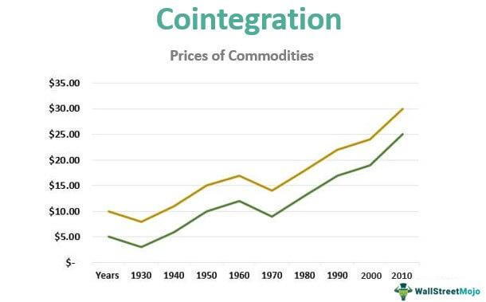

Cointegration is a critical statistical concept in time series analysis that has found profound applications in algorithmic trading. The essence of cointegration lies in identifying and utilizing statistical relationships between paired or grouped financial assets to capitalize on mean-reversion strategies. When two or more non-stationary time series variables share a stochastic trend, their linear combination may remain stationary. This relationship characterizes them as cointegrated, signaling that despite individual variabilities, they move together in the long term.

In algorithmic trading, identifying cointegrated assets allows traders to exploit deviations from this equilibrium for profit. When prices diverge from their long-term mean, traders can execute trades with the expectation that these prices will eventually revert. This concept is core to many trading strategies, offering potential for robust returns by systematically targeting these temporary imbalances.

This article will explore the significance of cointegration in algorithmic trading. It will discuss foundational theories developed by pioneers like Granger and Engle, who advanced our understanding of co-movements in financial time series. Additionally, it will examine methodologies for detecting cointegration, ranging from basic tests like the Engle-Granger method to more complex models. Finally, the article will highlight practical implications in market strategies, demonstrating how cointegration can be integrated into sophisticated trading algorithms to potentially enhance trading performance. By understanding these concepts, traders can better navigate market dynamics, leveraging statistical tools to inform strategic decisions.

## Table of Contents

## Understanding Cointegration

Cointegration is a concept used in time series analysis to identify and model long-term relationships between non-stationary data series. Typically, if a set of time series variables is individually integrated of order $d$, which means that they require differencing $d$ times to become stationary, they are said to be cointegrated if there exists a linear combination of these variables that is integrated of a lower order, typically $d-1$. Such a linear combination suggests that despite being non-stationary, these series move together over time, maintaining a steady equilibrium, and thus providing valuable insights for analysis.

The emergence of cointegration as a critical analytical tool primarily owes its development to the ground-breaking work of Clive Granger and Robert Engle. Their 1987 paper formalized the concept of the cointegrating vector, offering a methodological framework to distinguish between genuine long-term relationships and spurious correlations that are common among non-stationary series. A key aspect of their work was the introduction of the Engle-Granger two-step method to test for cointegration, fundamentally changing how economists and data scientists approach integrated time series.

To better understand cointegration, consider two variables, $X_t$ and $Y_t$, each integrated of order one, i.e., $I(1)$. If there exists a coefficient $\alpha$ such that the linear combination:

$$
Z_t = Y_t - \alpha X_t
$$

is stationary, or $I(0)$, then $X_t$ and $Y_t$ are cointegrated. This property allows the identification of deviations from equilibrium and facilitates modeling adjustments or predictions based on how far the current state is from this balance.

The role of cointegration extends beyond mere statistical theory; it provides practical methods for analyzing time series data in various fields, including finance, economics, and beyond. Its ability to reveal the underlying equilibrium relationships among variables renders it indispensable for understanding and predicting market movements and implementing sound trading strategies.

## The Importance of Cointegration in Algorithmic Trading

Algorithmic trading leverages the computational power of algorithms to analyze financial markets and execute trades at speeds unmanageable by humans. Within this domain, cointegration plays a pivotal role by offering a robust statistical framework to identify and exploit relationships between asset prices. Unlike traditional correlation, which may indicate misleading relationships due to non-stationary data, cointegration provides a more reliable means to detect long-term equilibrium relationships between non-stationary series.

### Profiting from Temporary Deviations

Cointegration is vital in pairs trading, a strategy that exploits deviations from the long-term equilibrium between two or more cointegrated assets. Consider two stock prices, $X_t$ and $Y_t$, which are both non-stationary but exhibit a stable long-term relationship such that their linear combination is stationary:

$$
Z_t = X_t - \beta Y_t
$$

In this case, $Z_t$ represents the spread between the asset prices and is expected to hover around a mean of zero. When $Z_t$ deviates significantly from this mean, due to short-term market fluctuations, a trading opportunity arises. The algorithm can enter positions betting on a return to equilibrium, buying one asset and selling the other:

- If $Z_t$ is significantly positive, sell $X_t$ and buy $Y_t$.
- If $Z_t$ is significantly negative, buy $X_t$ and sell $Y_t$.

### Avoiding Spurious Correlations

Cointegration is especially useful for ensuring that trading strategies are built on legitimate economic connections rather than spurious correlations. In the context of non-stationary data, standard correlation measures can be misleading, as they may indicate a relationship where none exists. Cointegration addresses this by filtering out the noise inherent in integrated series, thus enhancing the robustness of trading models. Traders can rely on cointegration tests, such as the Engle-Granger test, to validate the relationships between their selected asset pairs before executing trades.

### Enabling Mean-Reversion Strategies

Mean-reversion is a foundational concept in statistical [arbitrage](/wiki/arbitrage), where traders expect the price of an asset to revert to its mean or a long-term trend over time. Cointegration provides a precise mathematical grounding for such expectations. In a mean-reverting system derived from cointegrated assets, traders can have higher confidence that the observed deviations will not persist indefinitely, allowing them to capitalize on these temporary imbalances.

Overall, cointegration serves as a linchpin in developing [algorithmic trading](/wiki/algorithmic-trading) strategies that are both theoretically sound and practically effective. By facilitating the detection of genuine relationships between asset prices and enabling mean-reversion strategies, it forms a cornerstone of [statistical arbitrage](/wiki/statistical-arbitrage) in financial markets.

## Methodologies for Testing Cointegration

Cointegration testing is a vital part of constructing algorithmic trading models based on long-term equilibrium relationships between time series. Various methodologies have been developed for this purpose, each with its own strengths and considerations.

### Engle-Granger Two-Step Method
The Engle-Granger method is one of the earliest and most popular approaches for testing cointegration. It involves two steps:
1. **Regression Step**: Regress one time series against another to determine their relationship. The linear regression equation can be represented as:
$$
   Y_t = \beta_0 + \beta_1X_t + e_t

$$

   where $e_t$ is the residual.

2. **Unit Root Test on Residuals**: Perform a unit root test (e.g., the Augmented Dickey-Fuller (ADF) test) on the residuals $e_t$ to check for stationarity. If the residuals are stationary, the series are cointegrated.

The Engle-Granger method is straightforward but limited to assessing pairs of time series and is sensitive to the choice of dependent and independent variables.

### Johansen Test
The Johansen test is another widely used approach that overcomes some limitations of the Engle-Granger method, particularly for handling multiple time series. It uses Vector Autoregression (VAR) models in a system of equations to identify the number of cointegrating relationships:

- **Trace Test and Maximum Eigenvalue Test**: These are two test statistics used in the Johansen procedure to determine the presence and number of cointegrating vectors. The model is expressed as:
$$
  \Delta Y_t = \Pi Y_{t-1} + \sum_{i=1}^{k-1} \Gamma_i \Delta Y_{t-i} + \epsilon_t

$$

  where $\Pi$ contains information on the long-term relationships among the series within $Y_t$.

The Johansen test is appropriate for systems with more than two time series and does not require the pre-selection of dependent and independent variables.

### Phillips-Ouliaris Test
The Phillips-Ouliaris residual-based test is akin to the Engle-Granger method but uses a different approach to test for unit roots in residuals. It is designed to handle more general forms of serial correlation and heteroskedasticity, which makes it robust for a wide range of scenarios.

### Advanced Techniques
Additional advanced methodologies offer further refinements and flexibility in analyzing complex financial time series:

1. **Multicointegration**: This approach extends traditional cointegration methods to allow for equilibria of higher order processes, which can model more complex interrelationships among data series.

2. **Bayesian Methods**: Bayesian techniques incorporate prior information into the cointegration analysis process, which can be particularly valuable in situations where the sample size is small or the data is noisy.

3. **Regime Shift Models**: These models account for potential structural breaks in cointegration relationships, which is crucial for markets susceptible to economic policy changes or technological innovations.

The selection of a suitable cointegration test depends on numerous [factor](/wiki/factor-investing)s, including the number of variables involved, sample size, and the presence of potential regime shifts. By carefully choosing and implementing the right methodologies, traders can develop robust models that capitalize on long-term equilibrium relationships for profitable trading strategies.

## Implementing Cointegration in Trading Algorithms

To implement a cointegrated pairs trading strategy, the initial step involves accurately identifying pairs of assets that exhibit cointegration. This is typically achieved through statistical tests such as the Engle-Granger two-step method or the Johansen test. Once cointegration is established, it suggests a stable long-term relationship between the price series of these assets, allowing for the expectation of mean reversion.

The next step is to establish a trading algorithm that takes advantage of deviations in the price spread between the cointegrated pairs. The underlying premise is that any deviation from the long-term equilibrium provides a trading opportunity. The algorithm is set to enter positions when the price spread deviates beyond a certain threshold from its mean and to [exit](/wiki/exit-strategy) when it reverts to the mean. This can be expressed mathematically as:

$$
\text{Trade Signal} = 
\begin{cases} 
\text{Buy Asset 1, Sell Asset 2} & \text{if } \text{Spread} > \text{Upper Threshold} \\
\text{Sell Asset 1, Buy Asset 2} & \text{if } \text{Spread} < \text{Lower Threshold} \\
\text{Do nothing} & \text{if } \text{Lower Threshold} \leq \text{Spread} \leq \text{Upper Threshold}
\end{cases}
$$

where $\text{Spread}$ is the difference between the normalized prices of the asset pair, $\text{Upper Threshold}$ and $\text{Lower Threshold}$ represent the chosen limits beyond which trades are triggered.

In parallel to the entry and exit points, implementing robust risk management strategies is essential. The market can exhibit periods of non-stationarity where the previous relationships between assets may break down, resulting in suboptimal or even loss-making trades. Therefore, continual recalibration of the cointegration model is necessary to ensure its validity in dynamic market conditions. This involves regularly updating statistical parameters and thresholds used in the trading algorithm and applying tests for regime shifts to anticipate structural changes in the market.

Additionally, position sizing, stop-loss orders, and diversification across multiple cointegrated pairs are critical components of effective risk management. This ensures that the strategy is not overly exposed to the risk of individual pairs failing to revert to their equilibrium.

The application of cointegration in trading algorithms thus relies on methodical identification of pairs, precise execution based on statistical signals, and comprehensive risk management practices to adapt to the inherent uncertainties of financial markets.

## Challenges and Limitations

One major challenge in utilizing cointegration for algorithmic trading is the assumption that the relationship between cointegrated assets remains stable over time. However, real-world factors often induce shifts in these long-term relationships, leading to potential breakdowns in trading strategies that depend on such stability. For example, economic policy changes can lead to unexpected adjustments in market dynamics, altering the relationships between previously cointegrated assets. Technological advancements also pose a challenge, as they can change market structures and introduce new variables that affect asset behavior.

Moreover, financial crises represent another source of structural breaks. During such times, traditional relationships between assets may no longer hold due to sudden shifts in investor behavior, [liquidity](/wiki/liquidity-risk-premium) constraints, or regulatory changes. These structural breaks may invalidate previous cointegration relationships, rendering strategies based on historical data less effective or even detrimental.

To manage these challenges, traders need to employ advanced statistical methods that account for potential regime shifts. For instance, using tests that allow for structural breaks can help in identifying when a cointegration relationship no longer holds. These tests, such as the Gregory-Hansen test, are designed to detect cointegration in the presence of regime shifts. Additionally, continuously updating trading models is crucial to adapt to changing market conditions. This might involve recalibrating parameters or re-evaluating the set of assets considered for cointegration to ensure that the trading strategy remains robust over time.

Ultimately, while cointegration offers powerful insights for trading strategies, its successful application requires vigilance and a proactive approach to detect and react to changes in market conditions. Traders who can effectively adapt their models to account for these challenges are better positioned to harness the potential of cointegration in their trading strategies.

## Conclusion

Cointegration is a powerful tool in algorithmic trading, providing traders with the ability to exploit long-term equilibrium relationships between assets. By identifying pairs or groups of assets that move together over time despite short-term deviations, traders can create strategies that leverage these predictable patterns, enhancing their chances of profitability.

However, the successful application of cointegration in trading is not without challenges. It requires a comprehensive understanding of statistical tests, such as the Engle-Granger two-step method, Johansen test, or Phillips-Ouliaris test, to accurately identify cointegrated pairs. Additionally, traders must have a deep knowledge of market dynamics to anticipate and respond to shifts that may affect the stability of these relationships. Given the potential for structural breaks caused by economic policy changes, technological advancements, or financial crises, robust risk management practices are crucial.

As algorithmic trading continues to grow and evolve, the importance of cointegration is likely to persist. By focusing on long-term relationships and mean-reverting strategies, cointegration provides a framework through which traders can design sophisticated trading strategies. These strategies not only offer opportunities for profit but also add a layer of resilience in the face of market [volatility](/wiki/volatility-trading-strategies). Moving forward, traders who master the intricacies of cointegration will be well-positioned to capitalize on its benefits as part of a broader, adaptive trading approach.

## References & Further Reading

[1]: Engle, R. F., & Granger, C. W. J. (1987). ["Co-integration and Error Correction: Representation, Estimation, and Testing."](https://www.jstor.org/stable/1913236) Econometrica, 55(2), 251-276.

[2]: Johansen, S. (1991). ["Estimation and Hypothesis Testing of Cointegration Vectors in Gaussian Vector Autoregressive Models."](https://www.econometricsociety.org/publications/econometrica/1991/11/01/estimation-and-hypothesis-testing-cointegration-vectors) Econometrica, 59(6), 1551-1580.

[3]: Alexander, C. (2001). ["Market Models: A Guide to Financial Data Analysis."](https://www.casact.org/sites/default/files/old/marketmodels.pdf) John Wiley & Sons.

[4]: Tsay, R. S. (2010). ["Analysis of Financial Time Series (Wiley Series in Probability and Statistics)."](https://onlinelibrary.wiley.com/doi/book/10.1002/9780470644560) Wiley-Interscience.

[5]: Hamilton, J. D. (1994). ["Time Series Analysis."](https://press.princeton.edu/books/hardcover/9780691042893/time-series-analysis) Princeton University Press.