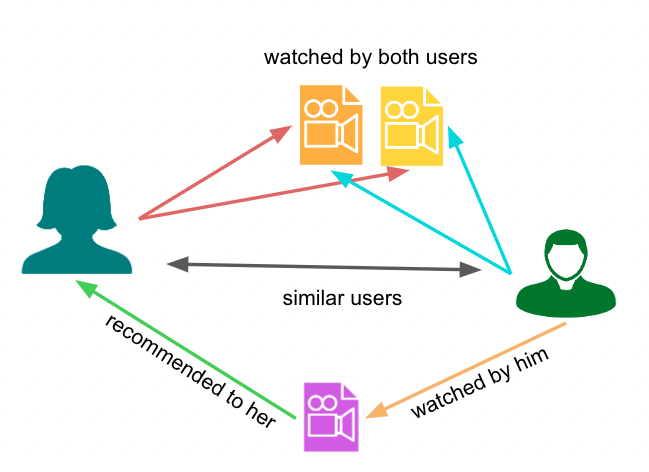

## Table of Contents

## What is Collaborative Filtering in the context of machine learning?

Collaborative Filtering is a method used in machine learning to make recommendations or predictions based on the behavior and preferences of a group of users. Imagine you're trying to decide which movie to watch next. Instead of looking at the movie's details, you could see what similar people have enjoyed in the past. This is the core idea behind Collaborative Filtering: it uses the collective data of user interactions to find patterns and make suggestions.

There are two main types of Collaborative Filtering: user-based and item-based. In user-based Collaborative Filtering, the system looks for users who have similar tastes to you and recommends items they liked. For example, if you and another user both loved the same three movies, the system might suggest other movies that the other user enjoyed. On the other hand, item-based Collaborative Filtering focuses on the items themselves. If you enjoyed a certain movie, the system will recommend other movies that are often liked by people who enjoyed the same movie you did.

Collaborative Filtering can be very powerful, but it also has its challenges. One issue is the "cold start" problem, where the system struggles to make recommendations for new users or new items because there isn't enough data yet. Another challenge is the "scalability" issue, as the system needs to handle large amounts of data efficiently. Despite these challenges, Collaborative Filtering remains a popular and effective technique in recommendation systems, widely used in platforms like Netflix, Amazon, and Spotify.

## How does Collaborative Filtering differ from other recommendation systems?

Collaborative Filtering differs from other recommendation systems mainly because it focuses on the behavior and preferences of users, rather than on the characteristics of the items themselves. For example, in a content-based recommendation system, the algorithm would look at the details of movies, like their genres or actors, to recommend similar movies. But with Collaborative Filtering, the system doesn't care about these details. Instead, it looks at what other users have watched and liked, and suggests movies based on that. This means that even if two movies are very different in content, they might still be recommended together if similar users enjoyed both.

Another key difference is how Collaborative Filtering handles new items and users. In a knowledge-based system, where recommendations are made based on explicit user preferences or rules, new items can be recommended right away if they fit the user's criteria. However, Collaborative Filtering struggles with new items or users because it relies on historical data. This is known as the "cold start" problem. If a new movie is added to the system, it might take a while before it starts getting recommended because the system needs time to gather enough user data on it. Similarly, a new user might not get good recommendations at first because the system doesn't know their preferences yet.

Despite these differences, Collaborative Filtering can be very effective and is widely used because it can uncover hidden patterns in user behavior that other systems might miss. For instance, it might find that people who enjoy action movies also tend to like certain types of music, even if there's no obvious connection between the two. This ability to find unexpected connections makes Collaborative Filtering a powerful tool in many recommendation platforms.

## What are the two main types of Collaborative Filtering?

The first main type of Collaborative Filtering is user-based. This method looks at what other people like you have enjoyed. Imagine you and another person both loved the same three movies. The system would then suggest other movies that this other person enjoyed, thinking you might like them too. It's like getting movie recommendations from a friend who has similar tastes to you.

The second main type is item-based Collaborative Filtering. This focuses on the items themselves, not the users. If you enjoyed a certain movie, the system will look at what other movies people who liked that movie also enjoyed. For example, if lots of people who liked "Movie A" also liked "Movie B," then "Movie B" might be recommended to you after you watch "Movie A." It's all about finding patterns in what people enjoy together, without needing to know anything about the movies themselves.

## Can you explain how User-based Collaborative Filtering works?

User-based Collaborative Filtering works by looking at what other people like you have enjoyed. Imagine you and another person both loved the same three movies. The system would then suggest other movies that this other person enjoyed, thinking you might like them too. It's like getting movie recommendations from a friend who has similar tastes to you. The system finds users with similar preferences by measuring how similar their ratings are to yours. If two users have rated many of the same items similarly, the system assumes they have similar tastes.

To find these similar users, the system uses a similarity metric, like the cosine similarity or Pearson correlation. Once it finds users with similar tastes, it predicts what you might like based on what those users liked. For example, if a similar user rated a movie highly, the system might recommend that movie to you. This method relies heavily on having enough data about what users have liked or disliked, so it can be tricky when there are new users or items with no ratings yet.

## How does Item-based Collaborative Filtering function?

Item-based Collaborative Filtering works by looking at how different items, like movies, are rated together by users. Imagine you watched and liked a certain movie. The system would then find other movies that people who liked that movie also enjoyed. For example, if lots of people who liked "Movie A" also liked "Movie B," then "Movie B" might be recommended to you after you watch "Movie A." The system finds these patterns by comparing how items are rated together, using a similarity metric like cosine similarity or adjusted cosine similarity.

Once the system finds these patterns, it can predict what you might like based on what you've already enjoyed. If you rate a movie highly, the system will look for other movies that are often rated highly by people who also liked that movie. This method focuses on the items themselves, not on finding users similar to you. It's like getting recommendations based on what people who enjoyed the same thing as you also enjoyed, without needing to know anything about the movies themselves.

## What are the advantages of using Collaborative Filtering for recommendations?

Collaborative Filtering is great because it can find hidden patterns in what people like. It doesn't need to know details about movies or [books](/wiki/algo-trading-books); it just looks at what other people have enjoyed. This means it can suggest things you might like even if you've never heard of them before. For example, if you and someone else both loved the same movies, the system might recommend other movies that person liked, even if they are very different from what you usually watch.

Another big advantage is that Collaborative Filtering can work well even if the system doesn't have much information about the items themselves. It focuses on what users have done in the past, so it can make good guesses about what you might enjoy next. This makes it a powerful tool for places like Netflix or Amazon, where there are millions of users and items, and it's hard to know everything about each one.

## What challenges or limitations does Collaborative Filtering face?

One big challenge with Collaborative Filtering is the "cold start" problem. This happens when the system can't make good recommendations for new users or new items because there isn't enough data yet. If you're new to a website, the system might not know what you like, so it struggles to suggest things you'll enjoy. The same goes for new movies or books; until enough people have rated them, the system can't tell if they're good or not. This can be frustrating for both new users and new content creators who want to get noticed.

Another challenge is scalability. As the number of users and items grows, the system has to handle more and more data. This can slow things down and make it harder to find good recommendations quickly. Imagine trying to compare every user with every other user to find similarities - it's a lot of work! Collaborative Filtering also has the "sparsity" problem, where most users only rate a tiny fraction of all items. This makes it hard to find enough data to make good predictions. For example, if only a few people have rated a movie, it's tough to know if it's really good or not.

Despite these challenges, Collaborative Filtering can still be very effective. It's great at finding hidden patterns in what people like and can work well even without knowing much about the items themselves. But these problems mean that sometimes other methods, like content-based filtering or hybrid systems, might be used alongside Collaborative Filtering to make better recommendations.

## How can the cold start problem be addressed in Collaborative Filtering?

One way to tackle the cold start problem in Collaborative Filtering is by using default or initial recommendations for new users. When someone first joins a website, the system can show them popular items or a mix of different things to see what they like. This helps gather data about the new user's preferences quickly. For new items, the system can encourage users to rate them or use other methods like content-based filtering to make initial recommendations. By doing this, the system can start collecting data on new items and include them in the Collaborative Filtering process sooner.

Another approach is to use hybrid systems that combine Collaborative Filtering with other recommendation methods. For example, content-based filtering can look at the details of movies or books to suggest similar ones, which helps when there's not enough user data yet. By using both methods together, the system can make better recommendations for new users and new items. Over time, as more data is collected, the Collaborative Filtering part can become more effective, reducing the impact of the cold start problem.

## What role does matrix factorization play in Collaborative Filtering?

Matrix factorization is a powerful technique used in Collaborative Filtering to make recommendations. It works by breaking down a large matrix of user-item interactions into two smaller matrices: one representing users and the other representing items. This process helps find hidden patterns in the data. For example, if you think of a table where rows are users and columns are movies, and each cell shows how much a user liked a movie, matrix factorization can find common factors that explain these ratings. These factors could represent things like user preferences for action movies or item characteristics like the genre of a movie.

By using matrix factorization, Collaborative Filtering can predict what a user might like even if they haven't rated many items yet. The technique looks for patterns in the existing data to fill in the gaps in the user-item matrix. For instance, if a user has rated a few action movies highly, the system can use matrix factorization to guess that they might also enjoy other action movies they haven't seen yet. This method helps overcome the sparsity problem, where most users only rate a small fraction of all items, making it easier to make good recommendations even with limited data.

## How can we evaluate the performance of a Collaborative Filtering model?

To evaluate a Collaborative Filtering model, you can use different metrics to see how well it's doing. One common way is to use Root Mean Square Error (RMSE), which measures how far off the model's predictions are from the actual ratings users gave. If the RMSE is low, it means the model is good at guessing what users will like. Another useful metric is Mean Absolute Error (MAE), which is similar but looks at the average difference between predictions and actual ratings without squaring the errors. Both RMSE and MAE help you understand how accurate the model's predictions are.

Another way to evaluate the model is by looking at how well it recommends new items to users. Metrics like precision and recall can be used for this. Precision tells you what fraction of the recommended items were actually liked by the user, while recall shows what fraction of the items the user liked were recommended. A good model will have high precision and recall, meaning it's good at both suggesting items users will like and not missing out on items they would have enjoyed. By using these metrics, you can get a clear picture of how well your Collaborative Filtering model is working and where it might need improvements.

## What advanced techniques can be applied to improve Collaborative Filtering?

One advanced technique to improve Collaborative Filtering is to use [deep learning](/wiki/deep-learning) methods like neural collaborative filtering. This approach uses neural networks to learn complex patterns in user-item interactions. For example, it can find out that people who like action movies also enjoy certain types of music, even if there's no obvious connection between the two. By using neural networks, the system can make better predictions about what users might like next. This can be especially helpful in overcoming the cold start problem, as the [neural network](/wiki/neural-network) can learn from existing data to make better guesses about new users or items.

Another technique is to incorporate contextual information into the Collaborative Filtering model. This means looking at things like the time of day, the user's location, or even their mood when making recommendations. For instance, if a user usually watches action movies on weekends, the system can use this information to suggest action movies on Friday evenings. By considering these extra details, the model can make more personalized and relevant recommendations. This approach can help improve the accuracy of the model and make the recommendations feel more tailored to each user's specific situation.

## Can you discuss some real-world applications of Collaborative Filtering?

One popular real-world application of Collaborative Filtering is in streaming services like Netflix. When you watch movies or shows on Netflix, the system looks at what other people who watched the same things as you also enjoyed. For example, if you and another person both loved the same three movies, Netflix might suggest other movies that the other person liked. This helps Netflix recommend new shows and movies that you're likely to enjoy, even if you've never heard of them before. It's like getting movie recommendations from a friend who has similar tastes to you.

Another common use of Collaborative Filtering is in online shopping platforms like Amazon. When you buy or rate items on Amazon, the system uses this information to suggest other products you might like. If you bought a certain book, Amazon might show you other books that people who bought the same book also enjoyed. This helps you discover new products that fit your interests, making your shopping experience more personalized and enjoyable. It's all about finding patterns in what people enjoy together, without needing to know anything about the products themselves.

## References & Further Reading

[1]: Koren, Y., Bell, R., & Volinsky, C. (2009). ["Matrix Factorization Techniques for Recommender Systems."](https://ieeexplore.ieee.org/abstract/document/5197422) Computer, 42(8), 30-37.

[2]: Sarwar, B., Karypis, G., Konstan, J., & Riedl, J. (2001). ["Item-based Collaborative Filtering Recommendation Algorithms."](https://dl.acm.org/doi/10.1145/371920.372071) Proceedings of the 10th International Conference on World Wide Web.

[3]: Su, X., & Khoshgoftaar, T. M. (2009). ["A Survey of Collaborative Filtering Techniques."](https://onlinelibrary.wiley.com/doi/10.1155/2009/421425) Advances in Artificial Intelligence.

[4]: Resnick, P., Iacovou, N., Suchak, M., Bergstrom, P., & Riedl, J. (1994). ["GroupLens: An Open Architecture for Collaborative Filtering of Netnews."](https://dl.acm.org/doi/10.1145/192844.192905) Proceedings of the 1994 ACM Conference on Computer Supported Cooperative Work.

[5]: Ricci, F., Rokach, L., & Shapira, B. (2011). ["Introduction to Recommender Systems Handbook."](https://www.researchgate.net/publication/227268858_Recommender_Systems_Handbook) In Recommender Systems Handbook.

[6]: Bell, R. M., & Koren, Y. (2007). ["Lessons from the Netflix Prize Challenge."](https://dl.acm.org/doi/10.1145/1345448.1345465) ACM SIGKDD Explorations Newsletter, 9(2), 75-79.