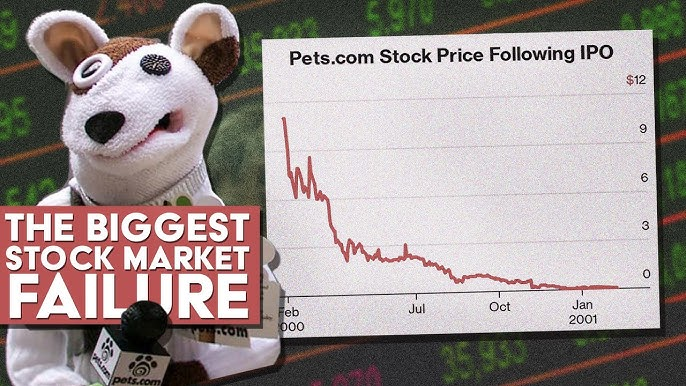

## Table of Contents

## What was Pets.com?

Pets.com was a company that sold pet supplies online. It started in 1998 during the dot-com boom, a time when many new internet businesses were being created. The company became very popular because of its funny commercials featuring a sock puppet dog. People remembered the ads, and the company grew quickly.

However, Pets.com had big problems. It was spending too much money on advertising and not making enough money from selling pet supplies. The company tried to fix this by changing how it worked, but it was too late. In 2000, just two years after it started, Pets.com had to close down. It is remembered as a famous example of the risks of starting a business during the dot-com boom.

## When did Pets.com launch and collapse?

Pets.com started in 1998. This was during a time called the dot-com boom, when many new businesses were starting online. Pets.com sold pet supplies on the internet and became well-known because of its funny commercials with a sock puppet dog.

The company grew fast but had big problems. It was spending too much money on ads and not making enough money from selling pet supplies. By 2000, just two years after it began, Pets.com had to shut down. It is remembered as an example of the risks of starting a business during the dot-com boom.

## What products did Pets.com sell?

Pets.com sold many things that people need for their pets. They had food for dogs and cats, which is very important for keeping pets healthy. They also sold things like toys, which can make pets happy and help them stay active. Another thing they sold was pet beds, which give pets a comfortable place to sleep.

Besides these, Pets.com also had things like collars and leashes, which are needed for walking dogs safely. They sold grooming products too, like shampoo and brushes, to help keep pets clean and looking good. Overall, Pets.com tried to have everything a pet owner might need, all in one place on their website.

## Who were the founders of Pets.com?

Pets.com was started by a man named Greg McLemore. He had the idea for the company in 1998. Greg wanted to make it easy for people to buy things for their pets online. He thought that if people could get pet supplies delivered to their homes, it would save them time and make their lives easier.

Greg McLemore worked with other people to make Pets.com happen. One important person was Julie Wainwright, who helped lead the company. Together, they tried to build a business that would be successful and help pet owners everywhere. Even though Pets.com did not last long, Greg and his team tried hard to make it work.

## What was the business model of Pets.com?

Pets.com wanted to make it easy for people to buy things for their pets online. They sold all kinds of pet supplies, like food, toys, beds, collars, and grooming products. People could order these things from the Pets.com website and have them delivered to their homes. This was supposed to save time for pet owners because they did not have to go to a store.

The business model had a big problem, though. Pets.com spent a lot of money on advertising to get people to know about their website. They had funny commercials with a sock puppet dog that many people liked. But, the money they made from selling pet supplies was not enough to cover the costs of the ads and running the business. In the end, Pets.com could not make enough money to keep going and had to close down.

## What were the marketing strategies used by Pets.com?

Pets.com used a lot of advertising to get people to know about their website. They had funny commercials that showed a sock puppet dog. This sock puppet became very popular and many people remembered it. The company spent a lot of money on these ads on TV, radio, and the internet. They wanted to make sure that people knew they could buy pet supplies online from Pets.com.

Besides the commercials, Pets.com also tried other ways to get people's attention. They used the sock puppet in different places, like on their website and at events. They also worked with other companies to show their products. The idea was to make Pets.com a name that people would think of when they needed something for their pets. Even though these strategies made Pets.com well-known, they did not help the company make enough money to stay open.

## What were the main reasons for the collapse of Pets.com?

Pets.com had big problems that led to its collapse. The main reason was that the company spent too much money on advertising. They had funny commercials with a sock puppet dog that many people liked, but these ads were very expensive. The money they made from selling pet supplies was not enough to cover the costs of the ads and running the business.

Another problem was that Pets.com was not making enough profit. They sold many things for pets, like food, toys, and beds, but the prices they charged did not bring in enough money. They also had to pay for shipping the products to people's homes, which added to their costs. In the end, Pets.com could not make enough money to keep going and had to close down in 2000.

## How did the dot-com bubble affect Pets.com's failure?

The dot-com bubble was a time when many new internet businesses started. It was exciting, and lots of people wanted to invest in these new companies. Pets.com began during this time in 1998. They got a lot of attention and money because everyone was excited about the internet. But the excitement made people forget to check if the businesses were making money. Pets.com spent a lot on ads to get more customers, but they were not making enough money from selling pet supplies.

When the dot-com bubble burst in 2000, it meant that people stopped investing in internet companies so much. Many businesses that were not making money had to close down. Pets.com was one of them. They could not keep going because they had spent too much money and were not making enough. The end of the dot-com bubble showed that businesses need to make money to survive, not just be popular.

## What was the impact of Pets.com's collapse on the e-commerce industry?

Pets.com's collapse had a big impact on the e-commerce industry. It showed everyone that just having a good idea and a popular website was not enough. Businesses needed to make money to survive. This made other e-commerce companies more careful about how they spent their money. They learned that they needed to focus on making profits, not just on growing quickly.

The failure of Pets.com also made investors more cautious. Before Pets.com collapsed, many people were excited about internet businesses and were willing to invest a lot of money in them. After Pets.com failed, investors started to look more closely at whether a business could actually make money. This change helped to create a more stable e-commerce industry, where companies had to show they could be successful in the long run.

## What lessons can be learned from the collapse of Pets.com?

The collapse of Pets.com teaches us that a business needs to make more money than it spends. Pets.com spent a lot on funny ads with a sock puppet dog to get people to know about them. But, they did not make enough money from selling pet supplies to cover these costs. This shows that it is important for a business to focus on making profits, not just on growing quickly or being popular.

Another lesson from Pets.com is that investors and business owners should be careful. During the dot-com bubble, many people were excited about internet businesses and invested a lot of money in them. After Pets.com failed, investors learned to look more closely at whether a business could actually make money. This helped to create a more stable e-commerce industry, where companies had to show they could be successful in the long run.

Overall, the story of Pets.com reminds us that good ideas and popularity are not enough for a business to succeed. Companies need to manage their money well and make sure they are making profits. This way, they can avoid the same problems that led to the collapse of Pets.com.

## How did Pets.com's financial performance lead to its downfall?

Pets.com spent a lot of money on ads to get people to know about their website. They had funny commercials with a sock puppet dog that many people liked. But these ads were very expensive. The money they made from selling pet supplies was not enough to pay for the ads and the costs of running the business. This meant that Pets.com was losing money instead of making it.

Because Pets.com was not making enough money, they could not keep going. They tried to change how they worked, but it was too late. In 2000, just two years after starting, Pets.com had to close down. The company's financial problems showed that they needed to focus on making profits, not just on being popular.

## What were the key operational challenges faced by Pets.com?

Pets.com faced big problems with how they ran their business. One big problem was that they spent too much money on ads. They had funny commercials with a sock puppet dog that many people liked. But these ads cost a lot of money. The money they made from selling pet supplies was not enough to pay for the ads and the costs of running the business. This meant that Pets.com was losing money instead of making it.

Another problem was that Pets.com did not make enough profit from selling pet supplies. They sold many things like food, toys, and beds for pets, but the prices they charged did not bring in enough money. They also had to pay for shipping the products to people's homes, which added to their costs. Because they were not making enough money, they could not keep the business going. In the end, these operational challenges led to Pets.com having to close down in 2000.

## References & Further Reading

[1]: Cassidy, J. (2003). ["Dot.con: The Greatest Story Ever Sold"](https://www.amazon.com/Dot-Greatest-Story-Ever-Sold/dp/0060008806). HarperCollins Publishers.

[2]: Lowenstein, R. (2004). ["Origins of the Crash: The Great Bubble and Its Undoing"](https://archive.org/details/originsofcrashgr00roge). Penguin Press.

[3]: Blodget, H. (2001). ["The Internet Bubble: Inside the Overvalued World of High-Tech Stocks--And What You Need to Know to Avoid the Coming Shakeout"](https://archive.org/details/internetbubblein00perk). HarperBusiness.

[4]: Shiller, R. J. (2000). ["Irrational Exuberance"](https://en.wikipedia.org/wiki/Irrational_Exuberance_(book)). Princeton University Press.

[5]: Kaminsky, G. L., & Schmukler, S. L. (2002). ["Emerging Market Instability: Do Sovereign Ratings Affect Country Risk and Stock Returns?"](https://www.jstor.org/stable/3990155). National Bureau of Economic Research.

[6]: Morris, C. R. (2000). ["Money, Greed, and Risk: Why Financial Crises and Crashes Happen"](https://archive.org/details/moneygreedriskwh0000morr). Times Books.