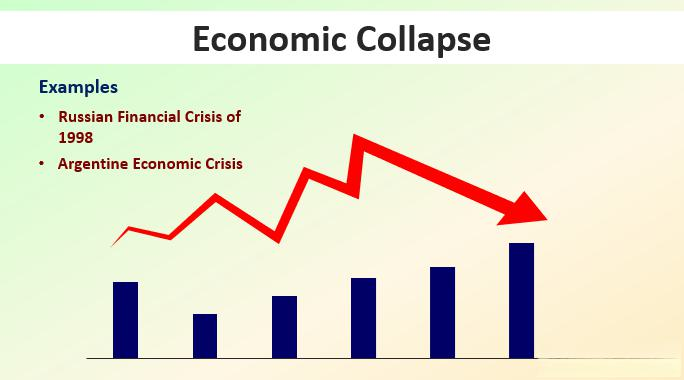

## Table of Contents

## What is a money market fund?

A money market fund is a type of mutual fund that invests in very safe, short-term debts like government bonds or high-quality corporate bonds. These funds aim to keep their value stable and provide investors with a safe place to park their money. They are often used by people who want to earn a little interest on their cash without taking on much risk.

Money market funds are popular because they are considered very safe. They usually offer lower returns compared to riskier investments like stocks, but they are less likely to lose value. This makes them a good choice for people saving for short-term goals or keeping an emergency fund.

## What was The Reserve Fund?

The Reserve Fund was a type of money market fund that became famous for a bad reason. It was started in 1970 and was one of the first money market funds. People put their money in it because they thought it was safe and would give them a little bit of interest. But in 2008, something big happened. The fund had invested in debts from Lehman Brothers, a big company that suddenly went bankrupt. Because of this, The Reserve Fund lost a lot of money and its value dropped below $1 per share, which is called "breaking the buck."

When The Reserve Fund broke the buck, it scared a lot of people. Many investors panicked and wanted their money back right away. This caused a big rush to pull money out of money market funds, not just The Reserve Fund. The government had to step in to calm things down and stop the panic from spreading to other parts of the financial system. This event showed that even money market funds, which people thought were very safe, could have problems if they made bad investments.

## When did The Reserve Fund collapse?

The Reserve Fund collapsed in September 2008. It was a big deal because it was one of the first money market funds, and people thought it was safe. But it had put money into debts from Lehman Brothers, a big company that went bankrupt suddenly. When Lehman Brothers failed, The Reserve Fund lost a lot of money and its value dropped below $1 per share. This is called "breaking the buck."

When The Reserve Fund broke the buck, it scared a lot of people. Many investors wanted their money back right away, causing a rush to pull money out of money market funds. This panic spread and the government had to step in to stop it from causing more problems in the financial system. The collapse of The Reserve Fund showed that even money market funds, which were thought to be very safe, could have big problems if they made bad investments.

## What were the immediate causes of The Reserve Fund's collapse?

The Reserve Fund collapsed in September 2008 because it had invested in debts from Lehman Brothers. Lehman Brothers was a big company that suddenly went bankrupt. When Lehman Brothers failed, the debts The Reserve Fund held became worthless. This caused The Reserve Fund to lose a lot of money. Its value dropped below $1 per share, which is called "breaking the buck."

When The Reserve Fund broke the buck, it scared a lot of people. Many investors panicked and wanted their money back right away. This caused a big rush to pull money out of money market funds, not just The Reserve Fund. The panic spread and the government had to step in to calm things down and stop it from causing more problems in the financial system. The collapse of The Reserve Fund showed that even money market funds, which people thought were very safe, could have big problems if they made bad investments.

## How did the collapse of The Reserve Fund affect the financial markets?

The collapse of The Reserve Fund in September 2008 caused a big scare in the financial markets. People thought money market funds were safe places to keep their money, but when The Reserve Fund lost value and "broke the buck," it made everyone worried. Investors panicked and started pulling their money out of many money market funds, not just The Reserve Fund. This rush to get money out was called a run on the funds. It made the financial markets very unstable because people were scared and didn't know where to put their money safely.

The government had to step in to stop the panic from getting worse. They took actions to calm things down and make sure the financial system didn't fall apart. The collapse of The Reserve Fund showed that even things people thought were safe, like money market funds, could have big problems if they made bad investments. This event made people and regulators think more about how to keep money market funds safe in the future.

## What was the impact on investors who had money in The Reserve Fund?

When The Reserve Fund collapsed, investors who had money in it lost a lot. The fund's value dropped below $1 per share, which meant people didn't get all their money back. This was a big shock because people thought money market funds were safe. Many investors panicked and wanted their money back right away, but it was hard to get it all because the fund had lost so much.

The collapse also made investors worried about other money market funds. They started taking their money out of those funds too, causing a big rush that made the financial markets very unstable. The government had to step in to calm things down and make sure the financial system didn't fall apart. This event showed investors that even things they thought were safe could have big problems, and it made them more careful about where they put their money in the future.

## What role did Lehman Brothers' bankruptcy play in the collapse?

Lehman Brothers' bankruptcy was the main reason The Reserve Fund collapsed. The Reserve Fund had invested in debts from Lehman Brothers, thinking they were safe. But when Lehman Brothers went bankrupt suddenly, those debts became worthless. This caused The Reserve Fund to lose a lot of money. Its value dropped below $1 per share, which is called "breaking the buck."

When The Reserve Fund broke the buck, it scared a lot of people. Many investors panicked and wanted their money back right away. This rush to pull money out of The Reserve Fund and other money market funds made the financial markets very unstable. The government had to step in to stop the panic from spreading and causing more problems in the financial system.

## What measures were taken by the government in response to the collapse?

When The Reserve Fund collapsed, the government had to do something to calm people down. They knew that if people kept taking their money out of money market funds, it could cause a big problem for the whole financial system. So, the government stepped in and promised to help. They said they would protect money market funds and make sure people could get their money back if they needed it. This was important because it stopped people from panicking even more.

The government also worked on new rules to make money market funds safer in the future. They wanted to make sure that what happened with The Reserve Fund wouldn't happen again. They looked at how money market funds invest and made changes to make them less risky. This helped to rebuild trust in money market funds and made people feel safer about putting their money there again.

## How did the collapse influence regulatory changes in the money market fund industry?

The collapse of The Reserve Fund made the government think hard about how to make money market funds safer. They knew that if something like this happened again, it could scare people and cause big problems in the financial world. So, they decided to make new rules to protect people's money. They looked at how money market funds invest and made changes to make them less risky. This was important because it helped to stop money market funds from breaking the buck again.

These new rules made money market funds hold more safe investments and less risky ones. They also made it easier for people to get their money back if they needed it quickly. This helped to make people trust money market funds again. The government's changes were a big step to make sure that what happened with The Reserve Fund wouldn't happen again. It was all about making the financial system safer for everyone.

## What lessons can be learned from the collapse of The Reserve Fund?

The collapse of The Reserve Fund teaches us that even things we think are safe can have big problems. Money market funds were supposed to be a safe place to keep money, but when Lehman Brothers went bankrupt, it showed that bad investments can hurt even the safest funds. This event made everyone realize that it's important to check what a fund is investing in, not just trust that it's safe because it's called a money market fund.

Another lesson is that panic can make things worse. When The Reserve Fund broke the buck, people got scared and wanted their money back right away. This rush to pull money out made the financial markets very unstable. It showed that when people panic, it can cause big problems, so staying calm and making smart decisions is important. The government had to step in to calm things down, which shows that having rules and help from the government can make a big difference in keeping the financial system safe.

## How have money market funds evolved since the collapse to prevent similar incidents?

Since The Reserve Fund collapsed, money market funds have changed a lot to make sure something like that doesn't happen again. They now have to hold more safe investments, like government bonds, and less risky ones. This makes them less likely to lose money if one of their investments goes bad. They also have to keep more money ready to give back to people if they want it, so there's less chance of a rush to pull money out like what happened with The Reserve Fund.

These changes help make money market funds safer for everyone. The government made new rules to make sure money market funds are watched more closely and can't take big risks. This has helped people trust money market funds again, knowing that they're less likely to lose money. It's all about making the financial system stronger and safer so people can save their money without worrying too much.

## What are the ongoing risks and challenges facing money market funds today?

Even though money market funds have gotten safer since The Reserve Fund collapsed, there are still some risks and challenges they face. One big risk is [interest rate](/wiki/interest-rate-trading-strategies) changes. When interest rates go up or down, it can affect the value of the bonds that money market funds invest in. If rates go up quickly, the value of the bonds can drop, which might hurt the fund's value. Another challenge is keeping enough cash on hand. Money market funds need to have enough money ready to give back to people who want to take their money out. If too many people want their money back at the same time, it can be hard for the fund to meet everyone's needs.

Another ongoing risk is the credit quality of the investments. Money market funds try to invest in safe things, but sometimes even safe investments can go bad. If a company or government that the fund invested in has money problems, it can cause the fund to lose money. This is why funds have to be careful about what they invest in and keep checking to make sure their investments are still safe. Despite these challenges, money market funds are still seen as a safe place to keep money, but it's good for people to know about these risks and keep an eye on their investments.

## References & Further Reading

[1]: ["The Financial Crisis Inquiry Report: Final Report of the National Commission on the Causes of the Financial and Economic Crisis in the United States"](https://www.govinfo.gov/app/details/GPO-FCIC/) by Financial Crisis Inquiry Commission.

[2]: McCabe, P. E., Cipriani, M., Holscher, M., & Martin, A. (2013). ["The Minimum Balance at Risk: A Proposal to Mitigate the Systemic Risks Posed by Money Market Funds."](https://www.brookings.edu/wp-content/uploads/2016/07/2013a_mccabe.pdf) Finance and Economics Discussion Series Divisions of Research & Statistics and Monetary Affairs, Federal Reserve Board, Washington, D.C.

[3]: Kregel, J. (2008). ["The Discrete Charm of the Washington Consensus."](https://papers.ssrn.com/sol3/papers.cfm?abstract_id=1127338) Working Paper No. 533, Levy Economics Institute.

[4]: Hendershott, T., Jones, C. M., & Menkveld, A. J. (2011). ["Does Algorithmic Trading Improve Liquidity?"](https://onlinelibrary.wiley.com/doi/full/10.1111/j.1540-6261.2010.01624.x) The Review of Financial Studies, 24(8), 2445-2481.

[5]: Lewis, M. (2015). ["Flash Boys: A Wall Street Revolt."](https://en.wikipedia.org/wiki/Flash_Boys) W. W. Norton & Company.

[6]: ["Regulation of Money Market Funds: A Study of Risk and Stability"](https://www.semanticscholar.org/paper/The-impact-of-regulation-on-money-market-funds-Aftab/a7e437b714125a8064684dd17e9162cc9e8d1153) by U.S. Securities and Exchange Commission.

[7]: Aldridge, I. (2013). ["High-Frequency Trading: A Practical Guide to Algorithmic Strategies and Trading Systems."](https://www.ahmetbeyefendi.com/wp-content/uploads/2020/07/High-Frequency-Trading-Irene-Aldridge.pdf) Wiley.