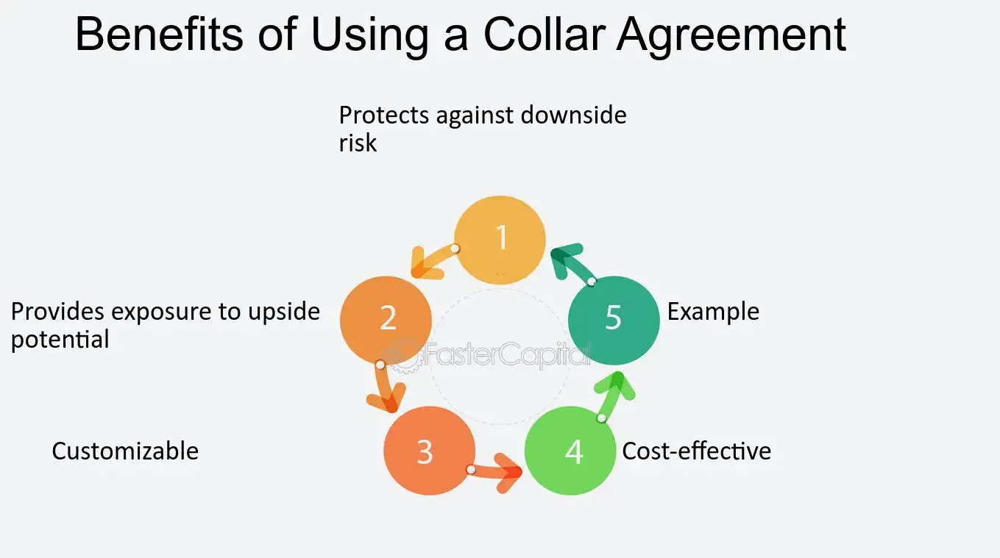

## Table of Contents

## What is a collar agreement?

A collar agreement is a financial strategy that helps protect the value of an investment. It involves using two types of options: a put option and a call option. The put option sets a minimum price for the investment, which protects it from falling too low. The call option sets a maximum price, which limits how much the investment can gain. By using both options, the collar agreement creates a range within which the investment's value can move.

This strategy is often used by investors who want to protect their gains without selling their investment. For example, if someone owns stock that has gone up a lot, they might use a collar agreement to lock in some of those gains. They buy a put option to protect against a big drop in the stock's price, and they sell a call option to help pay for the put option. This way, they can keep their stock but feel safer about possible future price changes.

## How does a collar agreement function?

A collar agreement works by using two options to set a price range for an investment. Imagine you own a stock and you're worried it might lose value. To protect yourself, you buy a put option. This gives you the right to sell your stock at a set price, even if the market price drops lower. This is like having a safety net; it limits how much you can lose if the stock goes down.

To help pay for the put option, you also sell a call option. This means you agree to sell your stock at a higher set price if someone else wants to buy it. By selling this call option, you get some money that can cover the cost of the put option. But, there's a catch: if the stock price goes above the call option's price, you might have to sell your stock at that lower price, missing out on extra gains. So, a collar agreement keeps your investment within a safe range, but it also means you might not make as much money if the stock does really well.

## What are the main components of a collar agreement?

The main parts of a collar agreement are a put option and a call option. A put option is like insurance for your investment. If you own a stock and you're worried it might lose value, you can buy a put option. This gives you the right to sell your stock at a certain price, no matter how low the market price goes. It's a way to protect yourself from big losses.

The other part is a call option. When you sell a call option, you agree to sell your stock at a set price if someone else wants to buy it. This helps you pay for the put option because you get money from selling the call option. But, if the stock price goes above the call option's price, you might have to sell your stock at that lower price, which means you could miss out on extra gains. So, a collar agreement uses these two options to keep your investment within a safe range, but it also limits how much you can gain if the stock does really well.

## Who typically uses collar agreements?

Collar agreements are often used by people who own a lot of stock in a company, especially if they work for that company. These people, like company founders or top executives, might have a big part of their money tied up in the company's stock. They use collar agreements to protect their money without selling their stock. This is important because selling the stock might send a bad message to other investors.

Investors who have made a lot of money from a stock that went up in value also use collar agreements. They want to keep their stock because they believe in the company, but they also want to protect their gains. By using a collar agreement, they can feel safer about the stock's future price changes without having to sell it. This way, they can still own the stock and possibly benefit from it in the long run.

## What are the benefits of using a collar agreement?

Using a collar agreement helps protect your investment from big losses. If you own a stock and you're worried it might go down in value, a collar agreement lets you buy a put option. This put option is like insurance; it gives you the right to sell your stock at a set price, no matter how low the market price goes. This way, you can limit how much you might lose if the stock's price drops a lot.

Another benefit is that a collar agreement can be cheaper than just buying a put option. When you use a collar agreement, you also sell a call option. This means you agree to sell your stock at a higher set price if someone else wants to buy it. The money you get from selling the call option can help pay for the put option. So, you get protection without spending as much money. However, you might miss out on some extra gains if the stock's price goes above the call option's price.

## What are the potential risks or drawbacks of a collar agreement?

One big risk of using a collar agreement is that you might miss out on big gains. If the stock's price goes way up, you might have to sell it at the lower price set by the call option. This means you won't get to enjoy all the extra money you could have made if you had kept the stock. So, while a collar agreement protects you from big losses, it also limits how much you can gain.

Another drawback is that setting up a collar agreement can be a bit tricky. You need to pick the right prices for both the put and call options. If you choose the wrong prices, the collar might not work as well as you hoped. Plus, you have to keep an eye on the stock and the options, which can take time and might need some help from a financial advisor. This can make things more complicated and might cost you more money in the long run.

## How does a collar agreement differ from other financial instruments like options or futures?

A collar agreement is different from other financial instruments like options or futures because it uses two options together to create a safety net for an investment. With a collar agreement, you buy a put option to protect against a drop in the stock's price and sell a call option to help pay for the put option. This sets a range for the stock's price, limiting both potential losses and gains. In contrast, a single option, like a put or call option, only gives you the right to buy or sell a stock at a set price, without the balancing effect of the other option. Futures, on the other hand, are contracts to buy or sell an asset at a future date at a set price, and they don't involve options at all.

The main difference between a collar agreement and these other instruments is the way they manage risk. A collar agreement is designed to protect an investment while keeping it, which is why it's often used by people who own a lot of stock and don't want to sell it. Options, whether put or call, are more flexible and can be used for different strategies, like betting on a stock's price going up or down. Futures are used to lock in prices for commodities or other assets, which is useful for businesses that need to plan for future costs. So, while all these instruments can help manage financial risk, they do it in different ways and for different purposes.

## Can you walk through a real-world example of a collar agreement in action?

Imagine you own 100 shares of XYZ Company, and the stock is currently worth $50 per share. You've made a good profit from this stock, but you're worried it might go down in value. To protect your investment, you decide to use a collar agreement. You buy a put option with a strike price of $45. This means if the stock price drops below $45, you can sell your shares at $45 each, limiting your loss. To help pay for the put option, you sell a call option with a strike price of $55. If the stock price goes above $55, you might have to sell your shares at $55 each, which means you could miss out on extra gains.

Let's say after setting up your collar agreement, the stock price of XYZ Company drops to $40. Because you have the put option, you can sell your shares at $45 each instead of the lower market price of $40. This saves you from a bigger loss. On the other hand, if the stock price goes up to $60, you might have to sell your shares at $55 each because of the call option you sold. You won't get to enjoy the full gain of the stock going up to $60, but you still make a profit from selling at $55. This way, the collar agreement helps you protect your investment while still keeping your shares.

## What are the tax implications of entering into a collar agreement?

When you use a collar agreement, it can affect your taxes. If you buy a put option and sell a call option, the money you get from selling the call option is usually not taxed right away. It's considered a "deferred gain" because you might have to give the stock away at a higher price later. But, if you end up selling your stock at a profit, you'll have to pay capital gains tax on that profit. The tax rate depends on how long you owned the stock. If you owned it for more than a year, it's a long-term capital gain, which usually has a lower tax rate than a short-term gain, which is for stocks held for a year or less.

Also, if the stock price drops and you use your put option to sell it at a higher price than the market, you might be able to claim a loss on your taxes. This can help reduce the amount of tax you owe on other income. However, the rules about options and taxes can be tricky, so it's a good idea to talk to a tax advisor. They can help you understand how a collar agreement will affect your taxes and make sure you're following all the rules.

## How do regulatory requirements affect the use of collar agreements?

Regulatory requirements can impact how you use collar agreements. Different countries have their own rules about trading options, which are a key part of collar agreements. In the United States, for example, the Securities and Exchange Commission (SEC) and the Financial Industry Regulatory Authority (FINRA) set rules that you need to follow. These rules might include things like how much money you need to have before you can trade options, and what kind of paperwork you need to fill out. If you don't follow these rules, you could get in trouble or face fines.

Because of these regulations, it's important to know the rules in your area before you set up a collar agreement. You might need to work with a financial advisor or a broker who knows the rules well. They can help you make sure you're doing everything right. Also, some companies have their own rules about when their employees can use collar agreements, especially if the employees own a lot of the company's stock. So, it's a good idea to check with your company too, to make sure you're not breaking any internal policies.

## What strategies can be employed to optimize the use of collar agreements?

To make the best use of collar agreements, you need to pick the right prices for your put and call options. The put option's price should be close to the lowest price you're okay with for your stock. This way, if the stock goes down, you can still sell it at a good price. The call option's price should be high enough that you're happy to sell your stock at that price if it goes up a lot. By choosing these prices carefully, you can protect your investment without missing out on too much if the stock does well.

Another way to optimize a collar agreement is to think about how long you want it to last. If you think the stock's price might change a lot in the short term, you might choose a collar agreement that lasts just a few months. But if you're worried about the stock over a longer time, you might choose one that lasts a year or more. Also, keep an eye on the stock and be ready to change your collar agreement if things change. For example, if the stock goes up a lot, you might want to adjust the call option's price higher to keep more of your gains. Talking to a financial advisor can help you make these choices and use collar agreements in the best way possible.

## How have collar agreements evolved in response to market changes and technological advancements?

Collar agreements have changed a lot over time because of new market rules and better technology. In the past, setting up a collar agreement was harder because you had to do a lot of paperwork and talk to people at a brokerage firm. Now, with online trading platforms, it's much easier. You can buy and sell options with just a few clicks on your computer or phone. This makes it simpler for more people to use collar agreements to protect their investments. Also, new rules from places like the SEC and FINRA have made things clearer and safer for everyone using these agreements.

Because of changes in the market, collar agreements have become more popular with different kinds of investors. For example, when the stock market is going up and down a lot, more people might use collar agreements to feel safer about their investments. Technology has also made it easier to keep track of your collar agreements and make changes if you need to. With real-time data and better tools, you can quickly see if your stock is doing well or if you need to adjust your options to protect your money better. This means collar agreements can now be used in more flexible and smart ways to fit what's happening in the market.

## What are Collar Agreements and how do they work?

A financial collar is a strategic approach designed to manage risk by establishing a ceiling and a floor on potential returns. The structure of a collar involves two key components: the purchase of a put option and the sale of a call option on the same underlying asset. The put option serves as a safety net, providing the right to sell the asset at a predetermined price, known as the strike price, thereby establishing a floor on potential losses. Conversely, the sale of a call option generates premium income, effectively setting an upper limit or ceiling on potential gains, as the investor is obligated to sell the asset if the price rises above the call option's strike price.

The technical composition of a collar agreement can be illustrated as follows: 

1. Let $P$ represent the price of the underlying asset.
2. Let $K_{\text{put}}$ be the strike price of the purchased put option, setting the lower boundary.
3. Let $K_{\text{call}}$ be the strike price of the sold call option, defining the upper boundary.

With these parameters, the investor's total payoff, $\Pi$, within the collar arrangement can be described by:

$$
\Pi = 
\begin{cases} 
K_{\text{put}} - P, & \text{if } P < K_{\text{put}} \\
0, & \text{if } K_{\text{put}} \leq P \leq K_{\text{call}} \\
P - K_{\text{call}}, & \text{if } P > K_{\text{call}}
\end{cases}
$$

Collar agreements are particularly beneficial in volatile market conditions where price shifts can be dramatic and unpredictable. By constraining the range of potential outcomes for an investment, collars help stabilize returns and shield against significant downside risks. This strategy is advantageous for investors who seek to maintain exposure to an asset while also implementing a defensive measure against adverse market movements. Overall, collars provide a pragmatic solution by tailoring the risk-reward ratio to align with specific investment objectives.

## References & Further Reading

[1]: Hull, J. C. (2017). ["Options, Futures, and Other Derivatives"](https://www.semanticscholar.org/paper/Options%2C-Futures%2C-and-Other-Derivatives-Hull/89bdee500c8623864fc9eb7a471546aa713acc44). Pearson. 

[2]: Black, F., & Scholes, M. (1973). ["The Pricing of Options and Corporate Liabilities."](https://www.cs.princeton.edu/courses/archive/fall09/cos323/papers/black_scholes73.pdf) Journal of Political Economy, 81(3), 637-654.

[3]: Whaley, R. E. (2006). "Derivatives on Market Volatility: Hedging Tools Long Overdue." The Journal of Derivatives, 13(3), 71-84.

[4]: Durbin, M. (2010). ["All About High-Frequency Trading."](https://www.mhebooklibrary.com/doi/book/10.1036/9780071743457) McGraw-Hill.

[5]: Kissell, R. (2013). ["The Science of Algorithmic Trading and Portfolio Management"](https://www.sciencedirect.com/book/9780124016897/the-science-of-algorithmic-trading-and-portfolio-management). Academic Press.

[6]: Poon, S-H., & Granger, C. W. J. (2003). ["Forecasting Volatility in Financial Markets: A Review."](https://www.aeaweb.org/articles?id=10.1257/002205103765762743) Journal of Economic Literature, 41(2), 478-539.

[7]: ["Risk Management and Financial Institutions"](https://archive.org/download/quant_books/Risk%20Management%20_%20Financial%20Institutions%20-%20J.%20C.%20Hull.pdf) by John C. Hull

[8]: de Prado, M. L. (2018). ["Advances in Financial Machine Learning"](https://www.amazon.com/Advances-Financial-Machine-Learning-Marcos/dp/1119482089). Wiley.