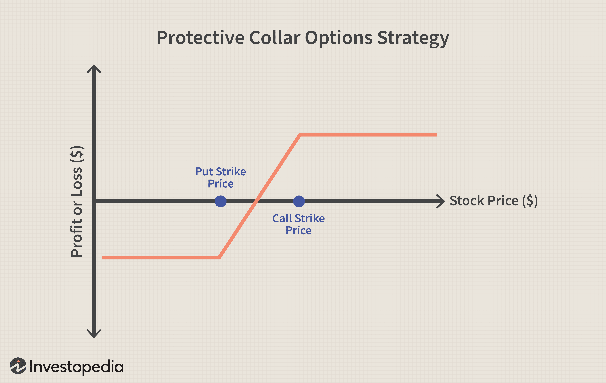

Options trading has gained significant popularity among investors due to its versatility and strategic potential in enhancing portfolio management. Essentially, options are financial derivatives that provide investors the right, but not the obligation, to buy (call options) or sell (put options) an underlying asset at a predetermined price within a specified timeframe. This flexibility allows for a range of investment strategies tailored to different market outlooks and risk appetites. Among various options trading strategies, the collar strategy stands out as an effective risk management tool.

The collar strategy involves simultaneously holding a long position in an asset, acquiring a protective put option, and writing a call option on the same asset. This approach effectively limits downside risk by ensuring a minimum selling price while capping potential upside due to the obligaion to sell at a set price if the call is exercised. This trade-off makes the collar strategy particularly appealing to investors seeking to stabilize returns in volatile market conditions.



Simultaneously, algorithmic trading, or algo trading, is revolutionizing modern financial markets by leveraging technology for automatic trade execution based on pre-defined criteria. Algorithms process vast amounts of market data with high speed and precision, which enables traders to capitalize on arbitrage opportunities, manage large volumes of trades efficiently, and execute sophisticated strategies that may be challenging to implement manually.

The integration of the collar strategy with algorithmic trading promises to amplify efficiency and effectiveness in executing this risk management approach. By automating the collar strategy, investors can more readily adapt to dynamic market conditions, ensuring optimal timing and execution of trades without the delays inherent in manual trading.

This article aims to examine the confluence of traditional risk management strategies like the collar with the transformative capabilities of algorithmic trading. The focus will be on understanding the foundational concepts of options trading, comprehending the operational mechanics of both the collar strategy and algorithmic trading, and exploring the synergies that arise from their integration. Through this exploration, the article seeks to provide insights into optimizing risk management and decision-making processes in the evolving landscape of financial markets.

## Table of Contents

## Understanding Options Trading

Options trading is a method of trading derivative securities, allowing investors to speculate on the future price movement of underlying assets such as stocks, indices, or commodities. Options are contracts that provide the buyer the right, but not the obligation, to buy or sell an underlying asset at a predetermined price, within a specified timeframe. The two primary components of options are calls and puts.

**1. Components of Options: Calls and Puts**

- **Call Option**: A call option gives the holder the right to purchase the underlying asset at the strike price before the option expires. Investors purchase call options when they anticipate an increase in the price of the underlying asset.

- **Put Option**: Conversely, a put option provides the holder the right to sell the underlying asset at the strike price before expiration. Investors buy put options when they expect a decline in the price of the underlying asset.

**2. Strategic Advantages of Options**

Options trading offers several strategic advantages. One significant benefit is leverage, as options allow traders to control a larger position with a relatively smaller investment. This leverage can amplify both potential gains and losses. Additionally, options offer flexibility as they can be used for various purposes, including hedging, speculation, and income generation. 

Furthermore, options facilitate strategic investment through customization. Traders can tailor their positions based on market outlook, risk tolerance, and investment objectives, such as enhancing returns or protecting against downside risks.

**3. Commonly Used Options Strategies**

Several strategies are popularly employed in options trading, including:

- **Covered Call**: Involves selling a call option on an asset already owned by the investor. This approach generates additional income from the option premium but limits upside potential if the underlying's price surpasses the strike price.

- **Protective Put**: This is a hedging strategy where an investor buys a put option for a long position in the underlying asset, safeguarding against downside risk.

- **Straddle**: Involves buying both a call and put option at the same strike price and expiration date, benefiting from significant price movements in either direction.

- **Butterfly Spread**: A neutral strategy that combines bullish and bearish spreads, ideally profiting from minimal price changes in the underlying.

**4. Role of Options in Risk Management and Portfolio Diversification**

Options are integral to risk management and portfolio diversification. Through options, investors can hedge positions, limiting losses while maintaining upside potential. For instance, using protective puts, investors can mitigate losses from a decline in the underlying asset while enjoying gains from any appreciation.

To diversify portfolios, options can be employed along with traditional assets, providing exposure to different market situations without committing significant capital to buy the underlying securities. This allows for broader risk allocation and the ability to exploit different market opportunities.

**5. Significance of Strategies Like Collar in Options Trading**

The collar strategy combines owning an underlying asset with buying a put option and selling a call option, creating a protective band around the asset's price. This strategy is significant because it offers a balanced approach to limiting downside risk and capping upside returns. In uncertain or volatile markets, employing a collar strategy protects against significant losses while securing potential gains up to a point, giving investors peace of mind and stable returns.

In conclusion, options trading is a versatile tool for investors, offering strategic advantages in terms of leverage, flexibility, and risk management. By understanding and utilizing various options strategies, investors can enhance their investment performance and safeguard their portfolios against market [volatility](/wiki/volatility-trading-strategies).

## Exploring the Collar Strategy

The collar strategy is a popular options trading strategy designed to protect an investor's gains while providing some potential for profit. It involves three principal components: owning the underlying asset (long stock), purchasing a protective put option, and writing (selling) a call option. This strategy is typically considered by investors who want to safeguard their equity investments during turbulent market times without liquidating their positions. 

The protective put option in a collar strategy grants the investor the right to sell the underlying stock at a specified strike price before the expiration date. This component effectively limits the potential loss if the stock price falls significantly. The short call, on the other hand, obligates the investor to sell the stock at a predetermined price if the call option is exercised. By selling the call, the investor generates premium income that helps offset the cost of purchasing the put option. However, this component also limits the upside potential, as any gains above the call's strike price are forfeited.

To describe how the collar strategy functions, consider a scenario where an investor holds 100 shares of a stock currently trading at $50 per share. To establish a collar, the investor might buy a put option with a strike price of $45 (expiring in three months) for a premium of $2 per share and simultaneously sell a call option with a strike price of $55 for a premium of $2 per share. This arrangement provides the investor with insurance against price drops below $45, while gains above $55 are capped because the investor would be required to sell the stock at that higher strike price if the call is exercised.

The collar strategy is particularly advantageous in volatile market conditions, offering a buffer against severe losses while also allowing for moderate profit. For instance, during unpredictable economic periods, the collar's protective put dampens potential downswings, offering the investor peace of mind. Meanwhile, the income generated from writing the call helps mitigate the cost of purchasing the put, thereby making the strategy more financially viable.

Despite its benefits, the collar strategy comes with several considerations and risks. The primary disadvantage is the capped upside potential, which might result in missed opportunities if the stock experiences a significant increase in value. Furthermore, transaction costs can accumulate, particularly when adjusting positions or rolling options to new expiration dates. Investors need to be aware of the possibility of early exercise of the call option, which might require the sale of the underlying stock before the desired time.

In summary, while the collar strategy provides a structured approach to managing investment risk, its appropriateness depends on individual market outlooks, risk tolerance, and investment objectives.

 to Algorithmic Trading

Algorithmic trading, commonly known as algo trading, involves using pre-programmed trading instructions to execute trades at optimal conditions, with speed and accuracy impossible for human traders. It employs mathematical models and algorithms to determine trading decisions based on predefined criteria such as timing, price, and order quantity.

Technology and automation play a crucial role in modern trading strategies, providing traders with tools to analyze markets and execute trades promptly. The core advantage of [algorithmic trading](/wiki/algorithmic-trading) is its efficiency; it allows for the simultaneous processing of vast amounts of data, enabling traders to exploit market conditions quickly. Furthermore, it reduces the impact of human emotions on trading decisions, leading to more consistent and objective outcomes.

Incorporating algorithms into trading practices offers several advantages: enhanced speed, cost reduction, and increased market [liquidity](/wiki/liquidity-risk-premium). By automating trading processes, traders can execute orders in milliseconds, capitalizing on fleeting market opportunities. This efficiency also reduces transaction costs and allows for continuous market participation, increasing overall liquidity and reducing price volatility.

Several common types of algorithms are used in trading, each tailored to specific strategies. Market-making algorithms facilitate price stability by providing continuous buy and sell offers. Arbitrage algorithms exploit price discrepancies across different markets or financial instruments. Trend-following algorithms identify and capitalize on market [momentum](/wiki/momentum), while execution algorithms, such as the Volume Weighted Average Price (VWAP), ensure orders are filled at the best average price throughout the trading day.

Algorithmic trading has significantly transformed investment strategies, including options trading. Options are derivatives that allow traders to speculate on or hedge against future price movements of underlying assets. By integrating algorithms, traders can systematically manage options portfolios, executing complex strategies like straddles or collars with greater precision and efficiency.

Overall, algorithmic trading represents a monumental shift in financial markets, offering a sophisticated toolset for traders to optimize their strategies and achieve superior performance outcomes. As technology continues to advance, the role of algorithms in trading is expected to grow, further enhancing the capabilities of market participants.

## Integrating Collar Strategy with Algo Trading

The integration of the collar strategy with algorithmic trading (algo trading) presents a sophisticated approach to executing options trading strategies. The collar strategy, consisting of a long position in a stock, a protective long put, and a covered short call, can be efficiently automated using algorithms to optimize both risk management and potential returns. Here we examine how this automation operates, its advantages, empirical examples, and the inherent challenges.

**Automation of the Collar Strategy through Algo Trading**

Automating the collar strategy involves setting predefined rules for trading the components of the strategy. The algorithm is designed to monitor market data continuously and execute trades based on specific conditions such as price thresholds, volatility levels, or time decay. One potential algorithmic approach is to implement a system where:

- A long put option is purchased to protect the downside risk.
- A short call option is sold to offset the cost of purchasing the put.
- The corresponding stock is bought or held to complete the collar structure.

In Python, a simplistic outline for such an algorithm might look like this:

```python
class CollarStrategy:
    def __init__(self, stock, strike_put, strike_call, expiry):
        self.stock = stock
        self.strike_put = strike_put
        self.strike_call = strike_call
        self.expiry = expiry

    def execute_trade(self):
        # Monitor stock price
        stock_price = get_current_stock_price(self.stock)

        # Execute long put if conditions met
        if stock_price < self.strike_put:
            buy_put(self.stock, self.strike_put, self.expiry)

        # Execute short call if conditions met
        if stock_price > self.strike_call:
            sell_call(self.stock, self.strike_call, self.expiry)

        # Maintain the long stock position
        hold_stock(self.stock)
```

**Benefits of Using Algorithms for Collar Strategies**

Algorithms enhance the execution of collar strategies by allowing for:

1. **Speed and Precision**: Algorithms can rapidly process massive volumes of market data, execute trades instantaneously, and adjust strategies without human intervention, ensuring accuracy and efficiency.

2. **Consistency**: Automated systems follow predefined rules consistently, reducing emotional biases that human traders might introduce.

3. **Cost Efficiency**: By selling call options systematically, the algorithm can offset the cost of buying put options, potentially making the protective strategy more affordable.

4. **Scalability**: Algorithms can manage multiple contracts and securities simultaneously, distributing the collar strategy across numerous positions.

**Case Studies and Examples**

While specific case studies on the public domain might be limited due to proprietary trading strategies, many financial institutions have successfully employed algorithm-driven risk management strategies to automate their options trading. For instance, hedge funds and proprietary trading firms often utilize algorithms to dynamically hedge portfolios using strategies like the collar to protect against market downturns efficiently.

**Enhanced Risk Management and Decision-Making**

Algo trading enhances risk management by:

- Continuously monitoring and adjusting positions in real-time based on market movements.
- Utilizing historical data to refine trading algorithms and optimize risk-reward ratios.
- Diversifying across different assets and time horizons to mitigate risks.

**Challenges and Limitations**

Automating the collar strategy comes with challenges, including:

- **Complexity and Costs**: Developing robust algorithms requires significant technical expertise and financial resources.
- **Market Risk**: In volatile markets, the algorithm might make numerous adjustments, leading to increased transaction costs.
- **System Risks**: Technical glitches, data feed interruptions, or software bugs can lead to trading errors.
- **Over-optimization**: Excessively fine-tuning an algorithm based on historical data can result in strategies that perform well only in past scenarios but fail in future conditions.

In conclusion, while algorithmic trading offers substantial benefits for implementing a collar strategy, careful consideration of the associated challenges is crucial. Continuous monitoring and optimization of the algorithm ensure it adapts to ever-changing market conditions, ultimately enhancing the efficacy of the collar strategy.

## Benefits and Risks of Combining Collar Strategy with Algo Trading

Combining the collar strategy with algorithmic trading offers several valuable advantages that can enhance investment performance. One of the primary benefits is efficiency in execution. By automating the trading process, algorithms can rapidly identify opportunities to implement a collar strategy, reducing the time and effort required by manual methods. This process ensures that traders can respond to market changes with speed and precision, crucial in volatile conditions.

**Risk Mitigation through Automation**

Automated collar strategies effectively manage risk by strictly adhering to predetermined criteria for buying and selling options. Algorithms can be programmed to execute the collar strategy as soon as specific conditions are met, such as predefined price levels or volatility thresholds. This reduces emotional biases that can cloud human judgment, leading to more disciplined and consistent trading practices.

The automated nature of algorithmic trading also supports dynamic adjustments to the collar strategy. For instance, algorithms can automatically adjust strike prices or expiration dates for puts and calls based on changing market conditions, optimizing risk-return profiles. This ability to quickly adapt to market shifts enhances the risk mitigation capabilities of the collar strategy.

**Potential Pitfalls and How to Avoid Them**

Despite the advantages, combining these approaches is not without risks. Algorithmic trading can result in over-reliance on technology, where technical glitches or programming errors might lead to unintended trades or significant losses. To mitigate these risks, robust testing and validation of algorithms before deployment are essential. This includes [backtesting](/wiki/backtesting) against historical data and employing fail-safes to halt trading during system malfunctions.

Additionally, markets can sometimes behave unpredictably, and purely algorithmic approaches might not accommodate unforeseen events. Mixing human oversight with algorithmic trading can provide a balanced approach, allowing human intuition to override automatic trading in exceptional circumstances.

**Investor Considerations and Market Conditions**

Investors should consider several factors when using automated collar strategies. These include the level of market volatility, transaction costs associated with the trading platform, and the liquidity of the options involved. High transaction costs or low liquidity can erode the profitability of automated strategies, making it essential to choose a trading environment that supports cost-effective execution.

Moreover, investors need to remain aware of the macroeconomic environment and regulatory factors that might impact option prices. Understanding these broader influences can help optimize the timing and parameters of automated trades.

**Future Prospects of Integrating Advanced Technologies**

The integration of advanced technologies like [machine learning](/wiki/machine-learning) and [artificial intelligence](/wiki/ai-artificial-intelligence) with options trading presents promising opportunities for the future. These technologies could enhance the predictive capabilities of algorithms, allowing traders to preemptively adjust collar strategies based on complex data analysis and predictive modeling.

As technology continues to advance, we might see increasingly sophisticated tools for integrating market data feeds, real-time news sentiment analysis, and automated decision-making into options trading strategies. The future holds potential for developing adaptive algorithms that learn and evolve from past trading activity, further optimizing risk management and investment outcomes. 

Investment in research and development of these technologies will likely continue to grow, paving the way for more innovative, effective trading strategies that combine the best aspects of traditional and modern methodologies.

## Conclusion

In reviewing the intricate dynamics of options trading and algorithmic strategies, it is evident that the combination of the collar strategy with algo trading presents a nuanced yet powerful method for enhancing investment outcomes. The collar strategy itself offers a structured approach to managing risks by limiting potential losses while capping gains, making it a viable option during volatile market conditions. When integrated with algorithmic trading, this strategy benefits from increased precision and efficiency in execution due to the automated nature of algorithms. Investors stand to gain from reduced emotional biases and enhanced consistency in strategy implementation.

Staying abreast of innovative trading methodologies is crucial in today's fast-evolving financial landscape. The ongoing technological advancements and the shift towards data-driven decision-making signify transformative changes in trading practices. Investors are encouraged to explore how combining traditional approaches, like the collar strategy, with modern technological solutions, such as algorithmic trading, can yield comprehensive risk management and potentially improved profitability.

In concluding, optimizing trading strategies for effective risk management and market success is paramount. The intersection of traditional knowledge and modern technology creates a fertile ground for developing robust strategies that adapt to varying market conditions. The field of algorithmic trading continues to evolve, offering immense potential for further exploration and research. By embracing these advancements, investors can position themselves strategically to harness the benefits of both conventional and cutting-edge trading approaches, paving the way for informed and strategic investment decisions.

## References & Further Reading

[1]: Luenberger, D. G. (1997). ["Investment Science."](https://www.amazon.com/Investment-Science-David-G-Luenberger/dp/0199740089) Oxford University Press.

[2]: Hull, J. C. (2017). ["Options, Futures, and Other Derivatives."](https://www.pearson.com/en-us/subject-catalog/p/options-futures-and-other-derivatives/P200000005938/9780136939917) Pearson.

[3]: Chan, E. P. (2008). ["Quantitative Trading: How to Build Your Own Algorithmic Trading Business."](https://github.com/ftvision/quant_trading_echan_book) Wiley.

[4]: Black, F., & Scholes, M. (1973). ["The Pricing of Options and Corporate Liabilities."](https://www.cs.princeton.edu/courses/archive/fall09/cos323/papers/black_scholes73.pdf) The Journal of Political Economy, 81(3), 637-654.

[5]: Treleaven, P., Galas, M., & Lalchand, V. (2013). ["Algorithmic Trading Review."](https://dl.acm.org/doi/10.1145/2500117) Communications of the ACM, 56(11), 76-85.