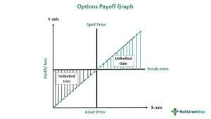

Understanding market volatility is paramount for modern investors and traders as it directly influences the potential for returns and the level of risk in investment portfolios. Market volatility refers to the rate at which the price of securities increases or decreases for a given set of returns. It is a natural characteristic of financial markets, driven by factors such as economic releases, geopolitical events, or company-specific news. The challenges posed by volatility necessitate effective strategies to manage risk, protect gains, and maintain portfolio stability.

One effective approach to manage the risks associated with volatility is the collar strategy, a risk management tool in options trading designed to protect against downside risk while allowing for some upside potential. By using a combination of owned stock, a put option, and a call option, investors can lock in profits and provide a degree of protection against price declines. This strategy is particularly popular among cautious investors, aiming to balance risk and reward without significantly impeding potential profits.



The integration of algorithmic trading has significantly transformed how collar strategies are implemented in options trading. Algorithmic trading involves using computer algorithms to automatically execute trades based on pre-defined criteria, such as price, timing, or volume. This technological advancement has enhanced the efficiency and precision of implementing collar strategies, allowing traders to set detailed rules based on volatility analysis and execute trades at optimal moments without human intervention. The automated nature of algorithmic trading minimizes emotional decision-making, ensuring consistent application of strategies tailored to manage market volatility effectively.

This article delves into the nuances of collar strategies, particularly within the context of market volatility and algorithmic trading, providing insights into how these strategies can be effectively employed to safeguard investments and enhance portfolio performance.

## Table of Contents

## What is a Collar Strategy?

A collar strategy is a fundamental risk management tool in options trading, primarily employed by investors seeking to protect their stock investments during periods of market volatility. This strategy involves three key actions: holding a stock, buying a put option, and selling a call option. 

The investor initially holds a position in a stock, which they believe has upward potential but wish to protect against potential declines. The purchase of a put option on the same stock is the first layer of protection. This put option gives the investor the right, but not the obligation, to sell the stock at a predetermined price, known as the strike price, before the option expires. This mechanism provides a safety net by limiting the potential losses on the stock if the market price falls below the strike price, hence offering downside protection.

Simultaneously, the investor sells a call option on the same stock. The call option sale generates premium income, which helps to offset the cost of purchasing the put option. However, selling a call option means that the investor is obliged to sell the stock at the call option's strike price if it is exercised by the buyer, which caps the potential gains in the event of a significant increase in the stock's price.

In essence, the collar strategy locks in potential profits while limiting losses, making it a popular choice among cautious investors looking to balance risk and reward. This strategic configuration allows investors to participate in upward market movements to a certain extent while minimizing their exposure to downside risks. As a result, it is a valuable tool in navigating volatile market conditions, aligning with the broader objective of maintaining a stable investment portfolio.

## Components of a Collar Strategy

A collar strategy in options trading involves three primary components: the underlying security, a put option, and a call option. Each component serves a specific purpose in creating a balanced risk management approach.

The underlying security forms the foundation of the collar strategy. It is typically a stock or a commodity that the trader already owns. Holding this security is essential as it represents the asset whose price movements the options will protect against. The existing ownership creates the necessity for risk mitigation, especially in volatile markets.

The put option is a critical element in providing downside protection. By purchasing a put option, the trader acquires the right to sell the underlying security at a predetermined price (the strike price) until the option's expiration date. This mechanism safeguards against a decrease in the asset's price, ensuring the trader can sell the security at the strike price even if the market price falls below it. The formula to determine the protective benefit due to a put option can be expressed as:

$$
\text{Maximum Loss} = \text{Purchase Price of the Stock} - \text{Strike Price of the Put} + \text{Put Premium}
$$

For instance, if a stock is purchased at $30 and a put is acquired with a strike price of $27.50, the maximum loss is limited, reducing potential investment risk.

The call option introduces a source of income to offset the cost associated with purchasing the put option. By selling a call option, the trader grants the buyer the right to purchase the underlying security at a predetermined strike price. This action generates a premium, which can partly or wholly cover the expense of the put option. Effectively, it allows the trader to implement the collar strategy without significant out-of-pocket expenses. However, this also introduces a cap on the upside potential, as the stock is obliged to be sold at the strike price of the call option if exercised. The potential maximum profit in this context is given by:

$$
\text{Maximum Profit} = \text{Strike Price of the Call} - \text{Purchase Price of the Stock} + \text{Net Premium Received}
$$

These components collectively form the collar strategy, balancing risk and reward by providing a protective financial barrier while managing costs through the sale of call options.

## Mechanics of Collar Strategy in Options Trading

A collar strategy in options trading fundamentally involves the simultaneous purchase of a put option and the sale of a call option, both tied to the same underlying asset. This configuration creates a strategic blend of risk mitigation and income generation, aiming to shield investors from downside risk while moderately capping potential gains.

The core mechanics of the collar strategy hinge on two pivotal options components: the put option and the call option. The put option provides the holder the right, but not the obligation, to sell the underlying asset at a predetermined strike price before a specified expiration date. This feature primarily serves as a protective measure against declines in the asset’s market price. Concurrently, the sale of a call option grants the buyer the right to purchase the underlying asset from the option writer at a specific strike price, also by a designated expiration. This call option's sale generates premium income, which can partially or fully offset the cost of purchasing the put option.

The selection of strike prices and expiration dates plays a critical role in executing an effective collar strategy. The strike price of the put option is typically set below the current market price of the underlying asset, ensuring an [exit](/wiki/exit-strategy) point at a minimal loss if market prices plummet. Conversely, the call option's strike price is generally above the current market price, setting a cap on potential profits if the market price rises above this level.

Critical to evaluating any collar strategy is the influence of stock price movements on profitability and risk control. If the stock price appreciates beyond the call option's strike price, the option is likely to be exercised by the buyer, thus capping the potential gains for the option writer. In such cases, though gains are limited, the initial intent of protecting against losses is preserved due to the income generated by the call premium and the put option's protective nature. Conversely, if the stock price falls below the put's strike price, the investor can exercise the option to sell at that strike price, effectively setting a floor on potential losses.

Thus, a collar strategy provides a structured framework balancing risk and return. By carefully selecting strike prices and expiration dates, investors can tailor the strategy to suit specific risk tolerances and market outlooks, ensuring that both protection and income objectives are met.

## Example of Implementing a Collar Strategy

Jack owns 100 shares of XYZ Corporation, purchased at $22 per share. Currently, XYZ trades at $30 per share. To safeguard his gains and curb potential losses, Jack decides to implement a collar strategy. This strategy involves two key actions: acquiring a put option and selling a call option.

Firstly, Jack buys a put option with a strike price of $27.50. This put option grants him the right to sell his shares at $27.50, insuring against substantial price declines below this threshold. Essentially, the put option acts as a safety net, providing downside protection.

Concurrently, Jack sells a call option with a strike price of $35. This call option obligates him to sell his shares at $35 if the option is exercised. By selling the call, Jack generates premium income, which can offset the cost of the put option, making the strategy cost-effective.

To understand the potential outcomes at expiration, consider the following scenarios:

- **Scenario 1: XYZ trades below $27.50**  
  If the share price drops below $27.50, Jack exercises the put option, selling his shares at $27.50 instead of the market price. Although he incurs a loss from the original $22 purchase price, the collar strategy cushions the extent of the loss by setting a floor at $27.50.

- **Scenario 2: XYZ remains between $27.50 and $35**  
  In this case, both the options expire worthless. Jack retains his shares and continues to hold onto his original investment value, minus the cost of implementing the collar. The premium from the call option sale helps counterbalance these costs.

- **Scenario 3: XYZ trades above $35**  
  When the share price exceeds $35, the call option is likely exercised, compelling Jack to sell his shares at $35. Here, he benefits from the price appreciation up to $35 but sacrifices further gains beyond this point. His profit per share is capped at $13 ($35 minus $22 original purchase price).

Thus, by deploying the collar strategy, Jack effectively manages risk, securing his position and profits against adverse market movements while accepting a capped upside potential.

## Algorithmic Trading and Collar Strategy

Algorithmic trading has become a pivotal facet of modern finance, automating complex trading strategies like the collar strategy to enhance efficiency and precision. This automation is crucial in swiftly changing markets where timely execution can significantly influence profitability. The integration of algorithms allows traders to set predefined rules grounded in [volatility](/wiki/volatility-trading-strategies) analysis, facilitating the strategic deployment of collars without the need for continuous manual oversight.

### Automating Collar Strategy Implementation

The fundamental basis of [algorithmic trading](/wiki/algorithmic-trading) lies in its ability to execute orders based on predetermined criteria. For a collar strategy, these criteria often revolve around volatility measures, strike prices, and expiration dates, among other factors. By leveraging historical data and volatility analysis, algorithms can dynamically adjust the parameters of the collar strategy to optimize protection and potential returns. This reduces the emotional bias often present in manual trading, thereby providing a consistent approach to risk management.

#### Rule-Based Deployment

Algorithms are programmed to follow specific rules triggered by market conditions. For example, consider the Python pseudocode below which illustrates a simplified version of rule-based deployment for a collar strategy:

```python
def analyze_volatility(stock):
    # Calculate implied volatility
    iv = calculate_implied_volatility(stock)
    return iv

def deploy_collar(stock, iv_threshold):
    if analyze_volatility(stock) > iv_threshold:
        buy_put(stock, strike_price_low)
        sell_call(stock, strike_price_high)
    else:
        hold_position(stock)

deploy_collar('XYZ', 0.25)
```

In this code, the algorithm evaluates the implied volatility of a stock, such as XYZ. If the implied volatility exceeds a certain threshold, the algorithm automatically executes the collar strategy by purchasing a protective put and selling a call option. This ensures the collar is only applied under conditions that justify its use, minimizing unnecessary costs.

### Profit-Locking Systems

Algorithmic systems enhance the ability to lock in profits through precise market entry and exit points. These systems use historical patterns to forecast market movements and adapt collar components accordingly. For instance, if a stock's price trend indicates a likely downturn, the system can preemptively adjust the strike prices of the put option to safeguard existing profits.

Moreover, algorithms can be programmed to react to real-time data feeds, recalibrating the strategy to keep up with market developments. This is particularly useful in volatile markets where rapid price fluctuations can erode potential gains.

### Insights into Algorithmic Integration

The integration of algorithmic trading with collar strategies offers several insights:

1. **Efficiency**: Automation significantly speeds up the decision-making process, reducing the latency between the market signal and the execution of trades.

2. **Scalability**: Algorithms can manage multiple assets and strategies simultaneously, providing scalability that is unfeasible with manual monitoring.

3. **Risk Management**: By consistently applying predefined rules, algorithms help mitigate risks associated with human errors and emotional decisions.

The synergy between algorithmic trading and the collar strategy provides a robust framework for traders aiming to balance risk and reward dynamically. As technology continues to evolve, the adaptability and precision of such systems will likely become even more integral to successful trading strategies.

## Advantages and Disadvantages of a Collar Strategy

The collar strategy offers several important benefits that make it attractive to investors seeking to manage risk during volatile market conditions. One of the primary advantages of utilizing a collar strategy is its ability to provide downside protection. By owning a put option, investors can secure a minimum selling price for their underlying asset, thus protecting against significant declines in the asset's market value. This protective feature is crucial for investors who wish to safeguard their investments during periods of uncertainty.

Another advantage of the collar strategy is its flexibility. Investors have the ability to customize the strike prices of both the put and call options to align with their specific risk tolerance and market outlook. This customization allows the collar strategy to be tailored to suit individual preferences and market scenarios, providing an adaptable risk management tool.

Despite these benefits, the collar strategy is not without its limitations. One significant drawback is the capped upside potential. By selling a call option, investors agree to sell the underlying asset at a predetermined price, limiting potential gains if the asset's market value rises significantly. This trade-off between downside protection and upside potential must be carefully considered by investors employing the collar strategy.

Moreover, the complexity involved in executing a collar strategy can be a barrier for some investors. Successful implementation requires a thorough understanding of options pricing, strike price selection, and the timing of option purchases and sales. This complexity necessitates careful planning and analysis, which can be challenging for those unfamiliar with options trading.

Balancing the cost of implementing a collar strategy against its protective benefits is crucial. The premium paid for the put option and the premium received from the call option must be weighed to determine the net cost of the strategy. Investors should assess whether the protection provided by the collar justifies the associated expenses, taking into account their overall investment goals and market outlook.

While the collar strategy offers compelling benefits such as downside protection and flexibility, it is important to recognize the limitations of capped upside potential and execution complexity. Investors should carefully evaluate these factors to determine if a collar strategy aligns with their investment objectives.

## Collar Strategy vs. Other Options Strategies

The collar strategy, protective puts, covered calls, and bull call spreads represent key methodologies within options trading, each serving distinct investor goals and risk profiles.

**Protective Puts** involve holding a long position in a stock while buying a put option for the same asset. This strategy offers downside protection as the put option allows the investor to sell the stock at the strike price, effectively limiting potential losses. However, protective puts do not generate income, and their cost reduces overall returns when the underlying stock does not decline.

**Covered Calls** entail owning a stock and selling a call option on the same asset. This approach generates income through the premium received for selling the call option, but it caps the upside potential at the strike price of the call. If the stock price rises above the strike price, the investor must sell the shares, potentially foregoing further gains.

**Bull Call Spreads** involve purchasing a call option at a lower strike price while selling another call option at a higher strike price. This strategy is designed for instances when investors anticipate moderate increases in the stock price. It limits both gains and losses, with the maximum profit occurring when the stock price ends above the higher strike price at expiration.

### Unique Position of the Collar Strategy

The collar strategy holds a distinct place among these strategies by offering a balanced approach to risk management. By combining elements of protective puts and covered calls, it allows investors to lock in profits while providing downside protection. The put option in a collar ensures a minimum selling price for the underlying asset, similar to a protective put, while the call option generates income to offset the cost of the put, akin to a covered call. This dual mechanism provides a cost-effective way to hedge against volatility, making it particularly appealing in uncertain market conditions.

### Choosing Collars Over Other Strategies

Investors might opt for a collar strategy when concerned about potential market downturns while still desiring to participate in moderate upside potential. Unlike protective puts, which solely guard against losses, the income from the call option in a collar strategy helps offset the cost of the protective put. In comparison to covered calls, which cap upside without offering downside protection, collars provide a safety net against sharp declines, which is especially beneficial in volatile markets. Finally, unlike bull call spreads that limit profits, collars allow investors to retain ownership of the underlying asset, preserving the opportunity for long-term growth.

## Conclusion

The collar strategy emerges as a vital tool for traders who aim to manage risk effectively in the face of market volatility. Its structured approach, combining the ownership of an underlying asset with the use of options to cap downside risk while limiting upside potential, offers investors a balanced method to navigate uncertain market conditions. Such strategic implementation is particularly valuable when markets are unpredictable, providing a safeguard against significant losses.

The rise of algorithmic trading has further refined the application of collar strategies. By automating decision-making processes and executing trades based on pre-determined criteria, algorithmic systems enhance the efficiency and precision of implementing collars. Algorithms can rapidly analyze market volatility and adjust collar positions in real-time, optimizing the balance between risk and reward. This technological integration allows traders to handle large volumes of data and execute strategies at speeds unattainable by manual trading.

While collar strategies involve complexities, they serve as accessible initiations for traders eager to mitigate risk and preserve gains. With the aid of algorithmic tools, the execution of these strategies becomes more streamlined, allowing even those new to trading to participate in sophisticated risk management practices. For investors focused on securing returns in a volatile market landscape, the collar strategy provides a structured yet flexible approach to achieving financial stability.

## References & Further Reading

[1]: McMillan, L. G. (2004). ["Options as a Strategic Investment."](https://www.amazon.com/Options-Strategic-Investment-Lawrence-McMillan/dp/0735201978) New York: Prentice Hall Press.

[2]: Passarelli, D. (2012). ["Trading Options Greeks: How Time, Volatility, and Other Pricing Factors Drive Profit."](https://www.amazon.com/Trading-Options-Greeks-Volatility-Pricing/dp/1118133161) Wiley.

[3]: Hull, J. C. (2017). ["Options, Futures, and Other Derivatives."](https://www.semanticscholar.org/paper/Options%2C-Futures%2C-and-Other-Derivatives-Hull/89bdee500c8623864fc9eb7a471546aa713acc44) Pearson.

[4]: Black, F., & Scholes, M. (1973). ["The Pricing of Options and Corporate Liabilities."](https://www.cs.princeton.edu/courses/archive/fall09/cos323/papers/black_scholes73.pdf) Journal of Political Economy, 81(3), 637-654.

[5]: Hasbrouck, J. (2007). ["Empirical Market Microstructure: The Institutions, Economics, and Econometrics of Securities Trading."](https://academic.oup.com/book/52241) Oxford University Press.