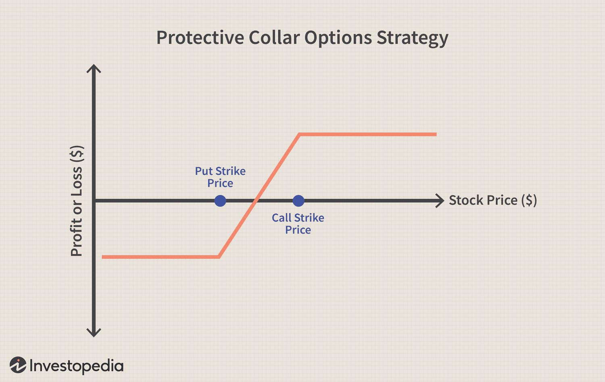

## Table of Contents

## What is a collar strategy in options trading?

A collar strategy in options trading is a way to protect your investment from big losses while still being able to make some profit. It involves owning a stock, buying a put option to set a floor on how much you can lose, and selling a call option to help pay for the put option. The put option gives you the right to sell the stock at a certain price, which limits your losses if the stock price drops a lot. The call option you sell gives someone else the right to buy your stock at a certain price, which can limit your gains if the stock price goes up a lot.

Using a collar strategy can be helpful if you think the stock might go down but you still want to keep it. By buying the put option, you know the lowest price you'll get for your stock, which can make you feel more secure. However, by selling the call option, you might miss out on some gains if the stock price rises above the call option's price. This strategy is like an insurance policy for your stock, where you pay a little to protect against big losses, but you also give up some potential profits.

## How does a collar strategy work to protect investments during market volatility?

A collar strategy helps protect your investments when the market is going up and down a lot. Imagine you own a stock and you're worried it might lose value because of all the market swings. To protect yourself, you buy a put option. This put option is like an insurance policy that lets you sell your stock at a set price, no matter how low the market price goes. So, if the stock price drops a lot, you can still sell it at the higher price you set with the put option, which limits how much money you could lose.

To help pay for this insurance, you also sell a call option. This means you agree to sell your stock at a certain price if someone wants to buy it. If the stock price goes up a lot, the person who bought your call option might want to buy your stock at that set price. This means you might miss out on some extra profit if the stock price goes even higher, but it helps you pay for the put option. So, a collar strategy is like a safety net that keeps your losses from getting too big during wild market swings, while still letting you make some money if the stock price goes up a bit.

## What are the key components of a collar strategy?

A collar strategy has three main parts: owning a stock, buying a put option, and selling a call option. When you own a stock, you want to protect it from losing too much value. That's where the put option comes in. By buying a put option, you get the right to sell your stock at a certain price, no matter how low the market price goes. This sets a floor on how much you can lose if the stock price drops a lot.

To help pay for the put option, you sell a call option. Selling a call option means you agree to sell your stock at a set price if someone wants to buy it. If the stock price goes up a lot, the person who bought your call option might want to buy your stock at that price. This means you might miss out on some extra profit if the stock price goes even higher, but it helps cover the cost of the put option. So, the collar strategy is like a safety net that limits your losses while still letting you make some money if the stock price goes up a bit.

## What are the benefits of using a collar strategy in volatile markets?

Using a collar strategy in volatile markets can help protect your investments. When the market is going up and down a lot, it can be scary to own stocks because their prices can change a lot. A collar strategy lets you set a floor on how much you can lose by buying a put option. This put option gives you the right to sell your stock at a certain price, even if the market price drops a lot. So, if the stock price goes down, you can still sell it at the higher price you set with the put option, which means you won't lose as much money.

The other part of the collar strategy is selling a call option, which helps pay for the put option. When you sell a call option, you agree to sell your stock at a set price if someone wants to buy it. This means if the stock price goes up a lot, you might have to sell your stock at that price and miss out on some extra profit. But, it's a good trade-off because it helps you afford the put option that protects you from big losses. So, using a collar strategy in volatile markets can give you peace of mind by limiting your losses while still letting you make some money if the stock price goes up a bit.

## What are the potential drawbacks or limitations of a collar strategy?

Using a collar strategy can have some downsides. One big problem is that you might miss out on big profits if the stock price goes way up. When you sell a call option as part of the collar, you agree to sell your stock at a certain price. If the stock price goes higher than that, you have to sell it at the lower price you agreed to, so you don't get to keep all the extra money you could have made.

Another limitation is that a collar strategy can be a bit complicated and might cost you money. You have to pay to buy the put option, which is like buying insurance. Even though selling the call option helps cover some of this cost, you still might end up spending more than you want. Plus, figuring out the right prices for the put and call options can be tricky, and if you get it wrong, the strategy might not work as well as you hoped.

## How do you set up a basic collar strategy?

To set up a basic collar strategy, you start by owning a stock that you want to protect. Then, you buy a put option for that stock. The put option gives you the right to sell your stock at a certain price, which is called the strike price. You choose a strike price that is lower than the current stock price but still high enough to limit your losses if the stock price goes down a lot. This put option acts like insurance, protecting you from big losses if the stock price drops.

Next, to help pay for the put option, you sell a call option on the same stock. The call option you sell has its own strike price, which is usually higher than the current stock price. By selling this call option, you agree to sell your stock at that higher strike price if someone wants to buy it. This means if the stock price goes up a lot, you might miss out on some extra profit, but it helps you afford the put option. So, by buying a put option and selling a call option, you set up a collar strategy that limits your losses while still letting you make some money if the stock price goes up a bit.

## What are the costs associated with implementing a collar strategy?

Setting up a collar strategy involves some costs that you need to think about. The main cost comes from buying a put option. This put option is like insurance for your stock, and you have to pay a premium to get it. The price of this premium depends on things like how long the option lasts and how far the strike price is from the current stock price. The further away the strike price is from the current stock price, the more you'll have to pay for the put option.

To help cover the cost of the put option, you sell a call option. When you sell a call option, you get a premium from the person who buys it. This money can help pay for the put option you bought. But, selling a call option might mean you miss out on some profits if the stock price goes up a lot. So, while the call option premium can lower your overall costs, it also means you might not make as much money if the stock does really well.

Overall, the costs of a collar strategy include the premium you pay for the put option and any transaction fees from buying and selling options. The premium you get from selling the call option can help offset these costs, but you need to balance this against the potential for missing out on gains if the stock price rises a lot. It's important to think about these costs and how they fit into your overall investment plan.

## How does a collar strategy affect potential profits and losses?

A collar strategy can help limit how much money you might lose if the stock price goes down. When you buy a put option, you get the right to sell your stock at a certain price, even if the market price drops a lot. This means you won't lose as much money as you would if you just held onto the stock. For example, if you bought a stock for $50 and the price drops to $30, but you have a put option with a strike price of $40, you can still sell your stock for $40, which saves you from losing $20 per share.

On the other hand, a collar strategy can also limit how much money you can make if the stock price goes up a lot. When you sell a call option, you agree to sell your stock at a certain price if someone wants to buy it. If the stock price goes above that price, you have to sell it at the lower price you agreed to, so you miss out on the extra profit you could have made. For instance, if your stock goes up to $70 but you sold a call option with a strike price of $60, you have to sell it at $60 and miss out on the extra $10 per share. So, while a collar strategy helps protect you from big losses, it also means you might not make as much money if the stock does really well.

## Can a collar strategy be adjusted once it is in place, and if so, how?

Yes, you can change a collar strategy after you've set it up. If the stock price moves a lot or if your feelings about the stock change, you might want to adjust your strategy. One way to do this is by rolling the options. This means you can close out the old put and call options and open new ones with different strike prices or expiration dates. For example, if the stock price goes up a lot, you might want to buy a new put option with a higher strike price to keep protecting your stock, and sell a new call option with a higher strike price to keep getting some money to help pay for the put.

Another way to adjust a collar strategy is by changing just one part of it. If you think the stock might go down more than you first thought, you could buy a new put option with a lower strike price to give you more protection. Or, if you want to give your stock more room to grow, you could sell a new call option with a higher strike price. But remember, making these changes might cost you more money because you'll have to pay for new options. So, it's important to think about the costs and benefits of any changes you make to your collar strategy.

## What are some advanced techniques for optimizing a collar strategy?

One way to make a collar strategy work better is by using different expiration dates for your put and call options. Usually, people use the same expiration date for both, but if you pick different dates, you can give yourself more flexibility. For example, you could buy a put option that lasts longer than the call option you sell. This means you keep protection against the stock going down for a longer time, while still getting money from the call option. Another trick is to roll your options. This means you close the old options and open new ones with different strike prices or expiration dates. If the stock price changes a lot, rolling the options can help you keep the strategy working well without losing too much money.

Another advanced technique is to adjust the strike prices of your options based on how the stock is doing. If the stock price goes up a lot, you might want to buy a new put option with a higher strike price to keep protecting your stock, and sell a new call option with a higher strike price to keep getting some money to help pay for the put. On the other hand, if the stock price goes down, you could buy a new put option with a lower strike price to give you more protection. This way, you can keep the collar strategy in line with what's happening in the market. It's like fine-tuning your strategy to make sure it keeps working the way you want it to.

## How does market volatility impact the effectiveness of a collar strategy?

Market volatility can make a collar strategy more important but also trickier to use. When the market is going up and down a lot, you might feel more worried about your stock losing value. A collar strategy helps because it lets you set a floor on how much you can lose by buying a put option. This put option acts like insurance, so if the stock price drops a lot, you can still sell it at a higher price than the market. But, because the market is so unpredictable, figuring out the right prices for your put and call options can be harder. If you choose the wrong strike prices or expiration dates, the strategy might not work as well as you hoped.

The other part of a collar strategy, selling a call option, can also be affected by market volatility. When you sell a call option, you agree to sell your stock at a certain price if someone wants to buy it. In a volatile market, if the stock price goes up a lot, you might have to sell it at that lower price and miss out on extra profit. But, because the market is so unpredictable, the premium you get for selling the call option might be higher, which can help pay for the put option. So, while a collar strategy can protect you from big losses in a volatile market, it also means you might not make as much money if the stock does really well. It's a balance between safety and potential profits.

## What are some real-world examples of collar strategies used during periods of high market volatility?

During the financial crisis of 2008, many investors used collar strategies to protect their stock portfolios from big losses. For example, imagine an investor who owned shares in a big bank. As the market started to crash, they bought put options to set a floor on how much they could lose if the bank's stock price kept falling. To help pay for these put options, they sold call options on the same stock. This way, if the stock price did go down a lot, they could still sell it at the higher price they set with the put option. But, if the stock price went up a lot, they might have to sell it at a lower price than the market, missing out on some extra profit. This collar strategy helped them feel safer during a very scary time in the market.

Another real-world example happened during the market volatility caused by the COVID-19 pandemic in early 2020. Many investors were worried about their tech stocks because the market was going up and down so much. One investor who owned shares in a tech company decided to use a collar strategy. They bought put options to protect against a big drop in the stock price, setting a price at which they could sell the stock even if it fell a lot. To cover the cost of these put options, they sold call options. If the stock price went up a lot, they might have to sell it at the call option's price and miss out on some gains, but the strategy helped them limit their losses during a very uncertain time.

## What are the components of a Collar Strategy?

A collar strategy in options trading involves three primary components: the underlying security, a put option, and a call option. Each component serves a specific purpose in creating a balanced risk management approach.

The underlying security forms the foundation of the collar strategy. It is typically a stock or a commodity that the trader already owns. Holding this security is essential as it represents the asset whose price movements the options will protect against. The existing ownership creates the necessity for risk mitigation, especially in volatile markets.

The put option is a critical element in providing downside protection. By purchasing a put option, the trader acquires the right to sell the underlying security at a predetermined price (the strike price) until the option's expiration date. This mechanism safeguards against a decrease in the asset's price, ensuring the trader can sell the security at the strike price even if the market price falls below it. The formula to determine the protective benefit due to a put option can be expressed as:

$$
\text{Maximum Loss} = \text{Purchase Price of the Stock} - \text{Strike Price of the Put} + \text{Put Premium}
$$

For instance, if a stock is purchased at $30 and a put is acquired with a strike price of $27.50, the maximum loss is limited, reducing potential investment risk.

The call option introduces a source of income to offset the cost associated with purchasing the put option. By selling a call option, the trader grants the buyer the right to purchase the underlying security at a predetermined strike price. This action generates a premium, which can partly or wholly cover the expense of the put option. Effectively, it allows the trader to implement the collar strategy without significant out-of-pocket expenses. However, this also introduces a cap on the upside potential, as the stock is obliged to be sold at the strike price of the call option if exercised. The potential maximum profit in this context is given by:

$$
\text{Maximum Profit} = \text{Strike Price of the Call} - \text{Purchase Price of the Stock} + \text{Net Premium Received}
$$

These components collectively form the collar strategy, balancing risk and reward by providing a protective financial barrier while managing costs through the sale of call options.

## References & Further Reading

[1]: McMillan, L. G. (2004). ["Options as a Strategic Investment."](https://www.amazon.com/Options-Strategic-Investment-Lawrence-McMillan/dp/0735201978) New York: Prentice Hall Press.

[2]: Passarelli, D. (2012). ["Trading Options Greeks: How Time, Volatility, and Other Pricing Factors Drive Profit."](https://www.amazon.com/Trading-Options-Greeks-Volatility-Pricing/dp/1118133161) Wiley.

[3]: Hull, J. C. (2017). ["Options, Futures, and Other Derivatives."](https://www.semanticscholar.org/paper/Options%2C-Futures%2C-and-Other-Derivatives-Hull/89bdee500c8623864fc9eb7a471546aa713acc44) Pearson.

[4]: Black, F., & Scholes, M. (1973). ["The Pricing of Options and Corporate Liabilities."](https://www.cs.princeton.edu/courses/archive/fall09/cos323/papers/black_scholes73.pdf) Journal of Political Economy, 81(3), 637-654.

[5]: Hasbrouck, J. (2007). ["Empirical Market Microstructure: The Institutions, Economics, and Econometrics of Securities Trading."](https://academic.oup.com/book/52241) Oxford University Press.