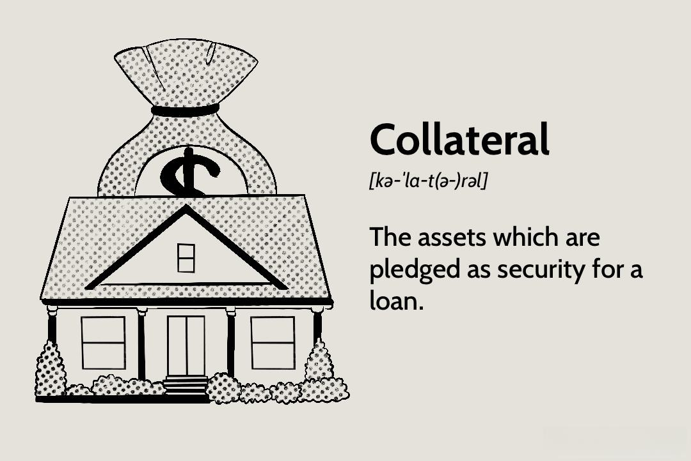

## Table of Contents

## What is a collateral trust bond?

A collateral trust bond is a type of bond that is backed by assets, but instead of using physical assets like property or equipment, it uses financial assets like stocks or bonds. When a company issues a collateral trust bond, it puts these financial assets into a trust. If the company can't pay back the bond, the investors can take the financial assets in the trust to get their money back.

This kind of bond is useful for companies that don't have a lot of physical assets but have plenty of financial assets. It helps them borrow money by showing they have something valuable to back up their promise to pay. For investors, it's a bit safer than a bond with no collateral because they have a chance to recover their investment if the company fails.

## How does a collateral trust bond differ from other types of bonds?

A collateral trust bond is different from other bonds because it uses financial assets like stocks or bonds as collateral, instead of physical assets like buildings or machines. With a collateral trust bond, the company puts these financial assets into a trust. If the company cannot pay back the bond, the investors can take the financial assets from the trust to get their money back. This makes it a good option for companies that have a lot of financial assets but not many physical ones.

Other types of bonds might use different kinds of collateral or no collateral at all. For example, a mortgage bond uses real estate as collateral, while a debenture bond has no collateral and relies only on the creditworthiness of the issuer. Because collateral trust bonds are backed by financial assets, they are seen as less risky than debenture bonds but might be considered riskier than mortgage bonds, depending on the value and stability of the financial assets in the trust.

## What types of assets can be used as collateral for a collateral trust bond?

Collateral trust bonds use financial assets as collateral. These assets can include stocks, bonds, and other securities that the company owns. If the company cannot pay back the bond, the investors can take these financial assets to get their money back. This makes the bond safer for investors because they have something valuable to fall back on.

The types of financial assets used can vary. For example, a company might use shares of stock in other companies, government bonds, or even its own bonds. The key is that these assets need to be valuable and easy to sell if needed. This way, the investors can be sure that they can get their money back if the company fails to pay.

## Who typically issues collateral trust bonds?

Collateral trust bonds are usually issued by companies that have a lot of financial assets but not many physical ones. These companies might not have enough buildings or machines to use as collateral, but they do have stocks, bonds, or other securities that they can put into a trust. By using these financial assets as collateral, the company can borrow money from investors who are willing to lend based on the value of these assets.

For example, a company that invests in other businesses might have a lot of stocks. They can use these stocks to back their bonds. This makes the bonds more attractive to investors because they know they can get their money back by selling the stocks if the company cannot pay. This type of bond is a good choice for companies that want to borrow money but don't have the usual types of collateral.

## What are the benefits of investing in collateral trust bonds?

Investing in collateral trust bonds can be a good choice for people looking for a safer way to invest. These bonds are backed by financial assets like stocks or bonds, which means if the company can't pay back the bond, investors can take these assets to get their money back. This makes the investment less risky than bonds with no collateral, because there's something valuable to fall back on.

Another benefit is that collateral trust bonds can offer a good balance between risk and reward. Since they are backed by financial assets, they might give a higher return than other safe investments like government bonds. This can be attractive for investors who want to earn more money but don't want to take on too much risk.

## What are the risks associated with collateral trust bonds?

Collateral trust bonds have some risks that investors should know about. One big risk is that the value of the financial assets used as collateral can go down. If the stocks or bonds in the trust lose value, they might not be worth enough to cover the bond if the company can't pay it back. This means investors could lose money even if they get the assets.

Another risk is that selling the financial assets might not be easy or quick. If the company fails and investors need to sell the stocks or bonds to get their money back, they might find it hard to do so. This could lead to delays or lower prices, making it harder to recover the full amount of the bond. So, while collateral trust bonds can be safer than some other bonds, they still come with their own set of risks.

## How is the value of the collateral assessed in a collateral trust bond?

The value of the collateral in a collateral trust bond is assessed by looking at the current market value of the financial assets in the trust. This could be stocks, bonds, or other securities that the company owns. The value of these assets can change every day because the prices of stocks and bonds go up and down. When the bond is issued, experts look at how much the assets are worth at that time. They might also think about how likely the value is to change in the future.

Sometimes, the value of the collateral is checked again while the bond is still being paid back. This is called a revaluation. If the value of the assets goes down a lot, the company might need to add more assets to the trust to make sure the bond stays safe for investors. This helps keep the bond's value stable, even if the market changes. By doing these checks, investors can feel more confident that the collateral will be worth enough to cover the bond if the company can't pay.

## What happens if the issuer of a collateral trust bond defaults?

If the issuer of a collateral trust bond defaults, it means they can't pay back the money they owe on the bond. When this happens, the investors can take the financial assets that were put into the trust as collateral. These assets might be stocks, bonds, or other securities. The investors can then sell these assets to get their money back.

The process of selling the collateral might not be easy or quick. The value of the stocks or bonds in the trust can change every day, so they might not be worth as much as when the bond was issued. If the value has gone down a lot, the investors might not get back all the money they invested. But having the collateral gives them a better chance to recover some of their money than if the bond had no collateral at all.

## How do collateral trust bonds fit into a diversified investment portfolio?

Collateral trust bonds can be a good addition to a diversified investment portfolio. They are backed by financial assets like stocks or bonds, which makes them less risky than bonds with no collateral. This means if the company can't pay back the bond, investors can take the assets in the trust to get their money back. This can help balance out riskier investments in a portfolio, like stocks or high-yield bonds, because collateral trust bonds offer a bit more safety.

Including collateral trust bonds can also help investors earn a steady income. These bonds usually pay interest regularly, which can provide a reliable source of money. While they might not offer the highest returns, they can still give a good balance between risk and reward. This makes them a useful part of a diversified portfolio, helping to spread out risk and keep the portfolio stable.

## What are the legal and regulatory considerations for issuing collateral trust bonds?

When a company wants to issue collateral trust bonds, they have to follow certain legal and regulatory rules. These rules can be different depending on the country or region where the bonds are being issued. In the United States, for example, the company needs to follow the rules set by the Securities and Exchange Commission (SEC). They have to make sure they give investors all the important information about the bond, like how much it's worth, what the collateral is, and any risks involved. This is to protect investors and make sure the bond market is fair and honest.

Another important part is setting up the trust that holds the collateral. The company has to work with a trustee, which is usually a bank or a trust company, to manage the assets in the trust. The trustee makes sure the assets are safe and that they can be given to investors if the company can't pay back the bond. The legal documents for the bond need to clearly say what happens if the company defaults and how the collateral will be handled. This helps make sure everything is done correctly and fairly if something goes wrong.

## How have collateral trust bonds performed historically compared to other investment vehicles?

Collateral trust bonds have had ups and downs like other investments. They are usually safer than bonds with no collateral because they have financial assets like stocks or bonds backing them up. This can make them a good choice for people who want to keep their money safe but still earn some interest. Over the years, when the economy has been doing well, collateral trust bonds have done well too, giving investors a steady income. But when the economy has had tough times, like during financial crises, the value of the assets in the trust can go down, which can make the bonds less valuable.

Compared to other investment vehicles like stocks, collateral trust bonds are less risky but might not grow as much. Stocks can go up a lot in value, but they can also lose value quickly. Collateral trust bonds don't usually have big ups and downs, so they are more predictable. When looking at how they stack up against other bonds, like government bonds, collateral trust bonds might offer higher returns because they are a bit riskier. But they are still safer than bonds with no collateral, which makes them a good middle ground for people looking to balance risk and reward in their investments.

## What advanced strategies can be used to optimize returns from collateral trust bonds?

To optimize returns from collateral trust bonds, investors can use a strategy called laddering. This means buying bonds that mature at different times. By doing this, you can take the money from bonds that mature sooner and reinvest it in new bonds that might have higher interest rates. This can help you earn more over time because you're always putting your money into the best available bonds. Also, laddering can help you manage risk better because you're not putting all your money into bonds that mature at the same time.

Another strategy is to keep an eye on the value of the collateral in the trust. Since the value of the financial assets backing the bond can change, it's smart to check these values regularly. If you see that the value is going down, you might want to sell the bond before it loses too much value. On the other hand, if the value is going up, you might want to hold onto the bond longer to get a better return when it matures. By staying informed about the collateral, you can make smarter choices about when to buy or sell your bonds.

## References & Further Reading

1. **Books:**
   - "The Bond Book: Everything Investors Need to Know About Treasuries, Municipals, GNMAs, Corporates, Zeros, Bond Funds, Money Market Funds, and More" by Annette Thau. This comprehensive guide covers a variety of bonds, explaining their intricacies and investment strategies.
   - "Fixed Income Securities: Tools for Today's Markets" by Bruce Tuckman and Angel Serrat. This book provides an in-depth understanding of fixed income securities and the mathematics involved in their valuation.
   - "Algorithmic Trading: Winning Strategies and Their Rationale" by Ernie Chan. A crucial resource for understanding the frameworks and algorithms behind efficient trading strategies.

2. **Academic Journals:**
   - "The Journal of Fixed Income" by Institutional Investor Journals. This journal explores a wide range of fixed-income securities, providing detailed analyses and research on bond markets.
   - "Journal of Financial Markets" by Elsevier. Articles in this journal offer insights into the functioning of various financial markets including bonds, presenting empirical research on trading and market dynamics.

3. **Market Analysis Reports:**
   - "Global Bond Markets: Updates and Highlights" by Moody's Analytics. This report provides periodic insights into global bond market trends, risks, and opportunities.
   - "The Annual Reports on Collateral Trust Bonds" by Fitch Ratings. These reports evaluate the performance and risks associated with collateral trust bonds.

4. **Financial Strategy Guides:**
   - "Principles of Corporate Finance" by Richard A. Brealey, Stewart C. Myers, and Franklin Allen. This book addresses financing strategies using bonds, making it a valuable guide for understanding corporate finance.
   - "Bond Markets, Analysis, and Strategies" by Frank J. Fabozzi. A well-regarded guide that offers strategies for bond market analysis and investment.

5. **Online Resources and Blogs:**
   - Investopedia's Bond Investing Guide. This online resource provides a step-by-step introduction to bond investment strategies, suitable for both beginners and intermediate investors.
   - Financial Times' Markets Section offers up-to-date news and analysis on global financial markets, including the bond market.

6. **Coding and Quantitative Analysis:**
   - "Python for Finance: Analyze Big Financial Data" by Yves Hilpisch. This book introduces Python programming for financial data analysis, beneficial for those interested in algorithmic trading.
   - QuantLib, a free/open-source library for modeling, trading, and risk management in real-life. It’s extensively used for bond and derivatives analytics.

These resources provide a comprehensive foundation for anyone interested in extending their knowledge of bond markets, collateral trust bonds, and the role of [algorithmic trading](/wiki/algorithmic-trading) within these domains.

