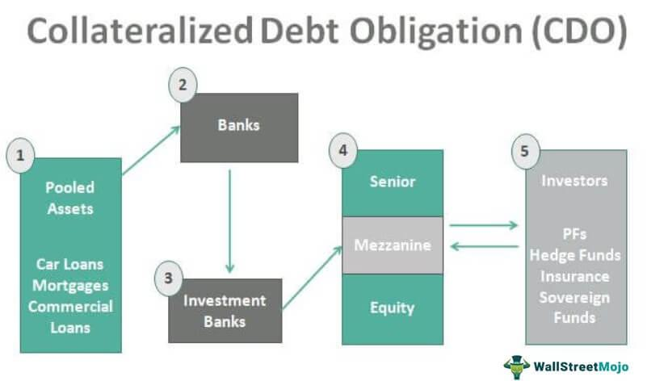

## Table of Contents

## What is a Collateralized Bond Obligation (CBO)?

A Collateralized Bond Obligation (CBO) is a type of financial product where a group of bonds is bundled together and sold as one investment. These bonds are usually high-risk, like junk bonds, which means they have a higher chance of the issuer not paying back the money. By bundling them together, the risk is spread out, making the investment seem safer to buyers.

Investors who buy a CBO get payments from the interest and principal of the bundled bonds. The CBO is divided into different levels, or tranches, each with its own risk and return. The top tranches are the safest and get paid first, while the bottom tranches are riskier but offer higher potential returns. This structure allows investors to choose the level of risk they are comfortable with.

## How does a CBO differ from other types of collateralized obligations?

A Collateralized Bond Obligation (CBO) is different from other types of collateralized obligations mainly in what it uses as collateral. A CBO specifically uses bonds, often high-risk or junk bonds, as its underlying assets. This is different from a Collateralized Loan Obligation (CLO), which uses loans, usually to businesses, as collateral. Another type is the Collateralized Mortgage Obligation (CMO), which uses mortgage loans as its underlying assets. Each type of collateralized obligation focuses on different kinds of debt, tailoring the product to different markets and investor needs.

The structure and purpose of CBOs also set them apart from other collateralized obligations. CBOs are designed to pool together various bonds to diversify risk and make high-risk bonds more attractive to investors. They are divided into tranches, allowing investors to choose their level of risk and return. In contrast, CLOs focus on pooling business loans, often to improve [liquidity](/wiki/liquidity-risk-premium) and spread risk among investors. CMOs, on the other hand, are structured to manage the cash flows from mortgage payments, offering investors a way to invest in real estate without directly buying property. Each type serves a unique role in the financial market, catering to different investor preferences and risk appetites.

## What are the main components of a CBO?

A Collateralized Bond Obligation (CBO) has several main parts. First, there are the bonds that make up the CBO. These are usually high-risk or junk bonds that are grouped together. By putting them together, the risk is spread out, which can make the investment seem safer. The money from these bonds, including interest and principal payments, is what goes to the investors.

The second main part of a CBO is how it's divided into different levels, called tranches. Each tranche has its own level of risk and potential return. The top tranches are the safest because they get paid first. The bottom tranches are riskier but offer higher returns if everything goes well. This setup lets investors pick the level of risk they want. The way these tranches work is important for managing and selling the CBO to different kinds of investors.

## Who are the typical investors in CBOs?

Typical investors in CBOs are often big institutions like banks, insurance companies, and pension funds. These organizations have a lot of money to invest and can handle the risks that come with CBOs. They like CBOs because they can earn good returns from the interest and principal payments of the bundled bonds. Also, they can choose different tranches based on how much risk they want to take.

Some hedge funds and other investment firms also invest in CBOs. They might be looking for high returns and are willing to take on more risk. These investors often have strategies to manage the risks of CBOs, like trading the tranches or using other financial tools. Overall, CBOs attract investors who want to diversify their investments and are okay with dealing with complex financial products.

## What are the risks associated with investing in CBOs?

Investing in CBOs comes with several risks. One big risk is that the bonds inside the CBO might not pay back the money they owe. Since these bonds are often high-risk or junk bonds, there's a higher chance they could default. If too many bonds default, it can hurt the whole CBO, especially the lower tranches that get paid last. Another risk is that the value of the CBO can go up and down a lot. This can happen if the market thinks the bonds are riskier or if interest rates change. Investors need to be ready for these ups and downs.

There's also the risk of not understanding the CBO well enough. CBOs are complex, and it can be hard to figure out all the risks involved. If investors don't know what they're getting into, they might lose money. Plus, CBOs can be hard to sell quickly if you need your money back fast. This lack of liquidity can be a problem if the market turns bad. Overall, while CBOs can offer good returns, they come with risks that investors need to think about carefully.

## How is the cash flow structured in a CBO?

In a CBO, the cash flow comes from the interest and principal payments of the bonds that are bundled together. When these bonds make payments, the money is collected and then distributed to the investors who bought the CBO. The way the money is shared depends on the different levels, or tranches, of the CBO. Each tranche gets paid in a certain order, starting with the top ones that are the safest.

The top tranches are the first to get paid from the cash flow. They are considered safer because they have priority, so they are less likely to lose money if some bonds don't pay back. The bottom tranches, on the other hand, are paid last and are riskier. If some bonds default and don't pay, the bottom tranches might not get all their money. This structure helps spread the risk and lets investors pick how much risk they want to take based on which tranche they buy.

## What role do rating agencies play in the issuance of CBOs?

Rating agencies are important when CBOs are created and sold. They look at the CBO and give it a rating that shows how risky it is. This rating helps investors decide if they want to buy the CBO. The agencies check the quality of the bonds inside the CBO and how the CBO is set up, like how the tranches work. If the rating is high, it means the CBO is seen as safer, and more investors might want to buy it.

The ratings can also affect how much money the people making the CBO can get for it. A high rating can mean a better price because investors feel safer. But if the rating is low, it might be harder to sell the CBO, and the price might be lower. So, the rating agencies play a big role in deciding how well a CBO will do in the market.

## How are CBOs managed and what are the responsibilities of the CBO manager?

A CBO is managed by a CBO manager, who has important jobs to do. The manager's main job is to pick the bonds that go into the CBO. They look for bonds that will pay back the money and give good interest. The manager also watches the bonds to make sure they are doing well. If some bonds start to look risky, the manager might sell them and buy new ones to keep the CBO safe.

The CBO manager also has to handle the cash that comes in from the bonds. They make sure the money gets shared the right way to the different tranches of the CBO. The top tranches get paid first, and the bottom ones get paid last. The manager needs to keep everything running smoothly and report to the investors about how the CBO is doing. This helps investors know if their money is safe and how much they might earn.

## Can you explain the process of tranching in CBOs?

Tranching in CBOs is when the CBO is split into different parts, called tranches. Each tranche is like a different level of the CBO, and they have different risks and rewards. The top tranches are the safest because they get paid first from the money the bonds make. The bottom tranches are riskier because they get paid last. This way, investors can pick the tranche that matches how much risk they want to take.

The process starts by deciding how to divide up the CBO into tranches. Usually, there are three main types: senior, mezzanine, and equity tranches. The senior tranche is the safest and gets the first cut of the cash flow. The mezzanine tranche comes next and is riskier but offers more reward. The equity tranche is the riskiest but can give the highest returns if everything goes well. By setting up the CBO this way, it helps spread out the risk and makes the CBO more appealing to different kinds of investors.

## What impact did the 2008 financial crisis have on the CBO market?

The 2008 financial crisis hit the CBO market hard. Many CBOs were made up of high-risk bonds, and when the economy got bad, a lot of these bonds didn't pay back the money they owed. This caused big problems for CBOs because the money that was supposed to go to investors stopped coming in. Investors who thought their money was safe in the top tranches of CBOs found out they could lose money too. The trust in CBOs went down a lot, and fewer people wanted to buy them.

After the crisis, rules about CBOs got stricter. The government made new laws to make sure CBOs were safer and that investors knew more about the risks. This made it harder to create new CBOs, and the market for them got smaller. Even though CBOs are still around, they are not as popular as they used to be before the crisis. People are more careful about investing in them because they remember how risky they can be.

## How have regulations changed for CBOs post-financial crisis?

After the 2008 financial crisis, the rules for CBOs got a lot stricter. The government wanted to make sure that CBOs were safer and that people knew more about the risks. They made new laws that said CBOs had to be more clear about what bonds were inside them. They also had to show more information about how risky the CBOs were. This was to help investors make better choices and not get surprised by big losses like what happened in 2008.

These new rules made it harder to create CBOs. Banks and other companies had to follow more steps and do more checks before they could sell a CBO. This slowed down the CBO market a lot. Even though CBOs are still around, they are not as popular as they used to be. People are more careful about investing in them because they remember how risky they can be. The changes helped make the market safer, but they also made it smaller.

## What are the current trends and future outlook for CBOs in the financial market?

Right now, CBOs are not as popular as they used to be before the 2008 financial crisis. The market for them is smaller because of the new rules that make them harder to create and sell. But some big investors, like banks and insurance companies, still use CBOs to spread out their risks and earn good returns. They are careful and pick CBOs that are safer and have clear information about the bonds inside them. The trend is to be more careful and focus on quality over quantity.

In the future, CBOs might become a bit more popular again if the economy stays stable and people feel safer about investing in them. But they will likely stay a small part of the financial market because of the strict rules. The focus will be on making sure CBOs are safe and clear for investors. New technology might help make CBOs easier to manage and understand, which could bring more interest. But overall, CBOs will keep being used by big investors who know the risks and want to earn good returns in a careful way.

## References & Further Reading

[1]: Jobst, A. A. (2006). ["Collateralized Debt Obligations (CDOs) and Structured Finance."](https://www.academia.edu/123669405/Collateralised_Loan_Obligations_CLOs_A_Primer) IMF Working Paper.

[2]: Fabozzi, F. J. (Editor). (2007). ["Handbook of Fixed-Income Securities"](https://www.amazon.com/Handbook-Fixed-Income-Securities-Ninth/dp/1260473899). McGraw-Hill Education.

[3]: Patel, H. (2019). ["Algorithmic Trading & DMA: An introduction to direct access trading strategies"](https://www.amazon.com/Algorithmic-Trading-DMA-introduction-strategies/dp/0956399207). 4Myeloma Press.

[4]: Hull, J. C. (2018). ["Risk Management and Financial Institutions"](https://books.google.com/books/about/Risk_Management_and_Financial_Institutio.html?id=1J1QDwAAQBAJ). Wiley.

[5]: ["Fixed Income Securities: Tools for Today's Markets"](https://www.amazon.com/Fixed-Income-Securities-Markets-Finance/dp/1119835550) by Bruce Tuckman and Angel Serrat

[6]: BlackRock. (2019). ["The Role of Fixed Income in a Portfolio."](https://www.blackrock.com/institutions/en-us/insights/fixed-income-portfolio-views) BlackRock Investment Institute.

[7]: Joshi, M. (2016). ["The Concepts and Practice of Mathematical Finance."](https://archive.org/download/quant_books/Concepts%20_%20Practice%20of%20Mathematical%20Finance%20-%20M.%20S.%20Joshi.pdf) Cambridge University Press.

[8]: CoinDesk. (2021). ["Blockchain in Fixed Income Markets: The Future."](https://www.coindesk.com/reports/coindesk-2021-annual-crypto-review) CoinDesk.