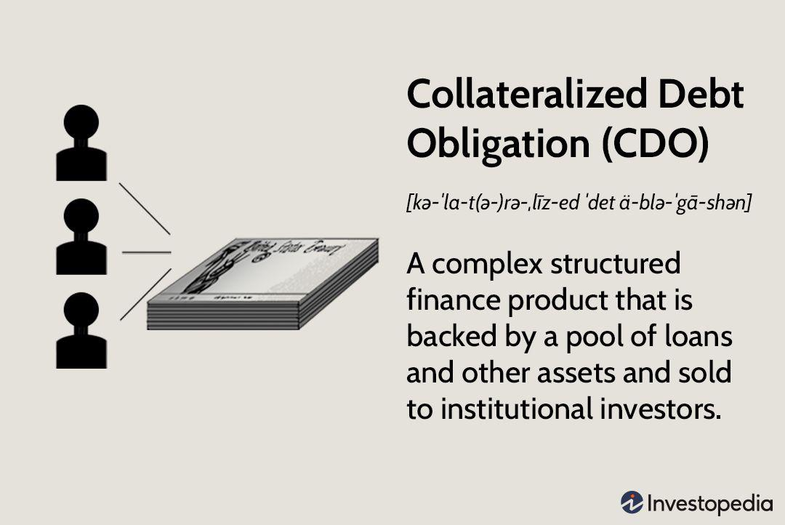

## Table of Contents

## What is a Collateralized Debt Obligation (CDO)?

A Collateralized Debt Obligation (CDO) is a type of financial product that banks create by bundling together a bunch of loans, like mortgages or credit card debts, and then selling them to investors as a single investment. Think of it like a big pie made up of smaller slices of debt. The idea is to spread out the risk, so if one loan goes bad, it doesn't bring down the whole investment.

Investors buy different parts of the CDO, called tranches, which have different levels of risk and return. The safest tranches get paid back first, but they offer lower returns. The riskier tranches, which get paid back last, offer higher returns to make up for the higher chance of losing money. CDOs became very popular before the 2008 financial crisis, but they also played a big role in causing it because many of the loans bundled into them were risky and ended up failing.

## How do CDOs relate to the mortgage market?

CDOs are closely tied to the mortgage market because many CDOs are made up of mortgage loans. When banks give out mortgages, they can sell these loans to other companies, which then bundle them into CDOs. These CDOs are sold to investors who are looking to earn money from the interest that homeowners pay on their mortgages. So, the performance of the mortgage market directly affects the value of CDOs. If lots of homeowners pay their mortgages on time, the CDOs do well. But if many homeowners can't pay and default on their loans, the CDOs can lose value quickly.

Before the 2008 financial crisis, many CDOs were filled with risky mortgages, often called subprime loans. These were given to people who had a higher chance of not being able to pay them back. Banks and other companies thought they could manage the risk by bundling these loans together, but when housing prices dropped and many homeowners defaulted, the CDOs collapsed. This led to huge losses for investors and played a big role in the financial crisis. So, the health of the mortgage market is crucial for the stability of CDOs.

## What are the different types of CDOs?

There are mainly three types of CDOs: cash flow CDOs, market value CDOs, and synthetic CDOs. Cash flow CDOs are the most common type. They are made from a bunch of loans, like mortgages or credit card debts. The money that investors get comes from the interest and principal payments that people make on these loans. If people pay their loans on time, the investors get paid regularly.

Market value CDOs work a bit differently. Instead of relying on the payments from the loans, they depend on the value of the assets they hold. If the value of the loans or other assets goes up, the CDO can sell them for a profit. But if the value goes down, the CDO can lose money. This type can be riskier because it depends on the market's ups and downs.

Synthetic CDOs don't use actual loans. Instead, they use credit default swaps, which are like insurance policies on loans. Investors bet on whether the loans will be paid back or not. If the loans do well, the investors earn money. But if the loans go bad, the investors can lose money. Synthetic CDOs became very popular before the 2008 financial crisis and were a big part of why it happened.

## How are CDOs structured and what are their tranches?

CDOs are structured like a big cake with different layers, called tranches. Each tranche represents a different level of risk and return. The bottom layer, or the safest tranche, is called the senior tranche. It gets paid back first from the money that comes in from the loans inside the CDO. Because it's the safest, it also offers the lowest return. The middle layer is the mezzanine tranche, which is riskier than the senior tranche but safer than the top layer. It gets paid back after the senior tranche but before the top layer. The top layer, or the equity tranche, is the riskiest. It gets paid back last and offers the highest return to make up for the high risk.

The money that flows into the CDO from the loans is used to pay back the investors in order, starting with the senior tranche. If there's enough money, everyone gets paid. But if there isn't enough money because some loans aren't being paid back, the equity tranche might not get anything. This structure is meant to spread out the risk. If a few loans go bad, the senior and mezzanine tranches might still get paid, but if many loans go bad, even the senior tranche could lose money. This is why understanding the quality of the loans inside the CDO is so important.

## What role do mortgage-backed securities play in CDOs?

Mortgage-backed securities (MBS) are a big part of many CDOs. They are made up of a bunch of home loans that banks have given out. When banks sell these loans to other companies, those companies can bundle them together and turn them into MBS. These MBS are then often used as the main ingredients in CDOs. The money that investors get from the CDO comes from the payments that homeowners make on their mortgages. So, if lots of homeowners pay their mortgages on time, the CDO does well.

But if many homeowners can't pay their mortgages and default, the MBS lose value, and this can cause big problems for the CDO. Before the 2008 financial crisis, many CDOs were filled with MBS made from risky loans called subprime mortgages. These were given to people who might not be able to pay them back. When housing prices dropped and many homeowners defaulted on their loans, the MBS lost a lot of value, and the CDOs fell apart. This shows how closely tied MBS are to the health of CDOs.

## How did CDOs contribute to the 2007-2008 financial crisis?

CDOs played a big role in the 2007-2008 financial crisis because many of them were filled with risky loans, especially subprime mortgages. These were loans given to people who might not be able to pay them back. Banks thought they could manage the risk by bundling these loans together into CDOs and selling them to investors. But when housing prices started to fall, lots of homeowners couldn't pay their mortgages. This caused the value of the mortgage-backed securities (MBS) inside the CDOs to drop quickly. As a result, the CDOs lost a lot of value, and investors who bought them lost a lot of money.

The problems with CDOs spread to the whole financial system. Many big banks and financial companies had invested heavily in these CDOs. When the CDOs failed, these companies faced huge losses. This led to a crisis of confidence, where people stopped trusting banks and other financial institutions. The crisis caused many banks to fail, and it led to a global economic downturn. The failure of CDOs showed how risky financial products can have a big impact on the whole economy if they're not managed carefully.

## What are the risks associated with investing in CDOs?

Investing in CDOs can be risky because they are made up of a bunch of loans, like mortgages or credit card debts. If a lot of people can't pay back their loans, the CDO can lose value quickly. This is called credit risk. Before the 2008 financial crisis, many CDOs were filled with risky loans called subprime mortgages. When housing prices dropped, lots of homeowners couldn't pay their mortgages, and the CDOs fell apart. This shows how important it is to know the quality of the loans inside a CDO.

Another risk is market risk. The value of a CDO can go up and down based on what's happening in the market. If people think the economy is doing well, they might pay more for CDOs, but if they think the economy is going to get worse, they might not want to buy them. This can make the value of the CDO go down even if the loans inside it are still being paid back. 

There's also the risk that comes from how CDOs are structured. They have different layers, called tranches, with different levels of risk. The safest tranches get paid back first, but they offer lower returns. The riskiest tranches get paid back last and offer higher returns. If you invest in the riskiest tranches, you could lose all your money if the loans inside the CDO go bad. So, it's important to understand which tranche you're investing in and how much risk you're taking on.

## How are CDOs rated and what does the rating signify?

CDOs are rated by special companies called rating agencies. These agencies look at the loans inside the CDO and try to figure out how risky they are. They give the CDO a rating, like AAA, AA, or BBB. A AAA rating means the CDO is very safe, and it's likely that investors will get their money back. A lower rating, like BBB, means the CDO is riskier, and there's a bigger chance that investors could lose money.

The rating is important because it helps investors decide if they want to buy a CDO. If a CDO has a high rating, like AAA, investors might feel safer buying it because they think it's less likely to lose value. But if a CDO has a low rating, investors might want to stay away because it's riskier. Before the 2008 financial crisis, many CDOs were given high ratings even though they were filled with risky loans. When these loans went bad, the CDOs lost a lot of value, and investors who trusted the high ratings lost a lot of money.

## What is the process of securitization in relation to CDOs?

Securitization is the process of turning loans, like mortgages or credit card debts, into securities that can be sold to investors. When banks give out loans, they can sell these loans to other companies. These companies then bundle the loans together and create securities, like mortgage-backed securities (MBS) or CDOs. The money that investors get from these securities comes from the payments that people make on their loans. So, if people pay their loans on time, the securities do well. But if lots of people can't pay their loans, the securities can lose value.

In the case of CDOs, securitization involves taking a bunch of different loans and dividing them into different layers, called tranches. Each tranche has a different level of risk and return. The safest tranches get paid back first and offer lower returns, while the riskiest tranches get paid back last and offer higher returns. The money that comes in from the loans is used to pay back the investors in order, starting with the safest tranches. This process helps spread out the risk, but it can also make things more complicated. If the loans inside the CDO go bad, it can cause big problems for the whole CDO.

## How have regulations regarding CDOs changed since the financial crisis?

Since the 2008 financial crisis, rules about CDOs have changed a lot to make them safer. One big change is the Dodd-Frank Act, which was made to stop another big financial crisis from happening. This law made banks keep some of the riskiest parts of the CDOs they create, so they have to be more careful about the loans they put in them. It also made rating agencies be more careful about giving high ratings to CDOs, so investors can trust the ratings more.

Another change is that banks have to give more information about the loans inside the CDOs. This helps investors understand how risky the CDOs are before they buy them. Also, there are now rules that make it harder for banks to use a lot of borrowed money to buy CDOs, which can make things less risky. These changes are meant to make the financial system safer and stop another big crisis from happening because of CDOs.

## What are the current trends in the CDO market?

The CDO market has changed a lot since the 2008 financial crisis. People are more careful now, and there are stricter rules to make sure CDOs are safer. Banks have to keep some of the riskiest parts of the CDOs they create, so they think more about the loans they put in them. Also, there's more information about the loans inside the CDOs, so investors can make better choices. These changes have made the CDO market smaller but safer.

Even though the CDO market is smaller, it's still around. Some investors still like CDOs because they can offer good returns if the loans inside them do well. But they're more careful now and look for CDOs with safer loans. The market has also seen new types of CDOs, like those made from car loans or student loans, not just mortgages. These new types can spread out the risk more, but they still need to be watched closely to make sure they don't cause problems like before.

## How can investors mitigate risks when investing in CDOs?

Investors can lower their risks when investing in CDOs by being very careful about which ones they buy. They should look at the quality of the loans inside the CDO. If the loans are safe and people are likely to pay them back, the CDO is less risky. Investors should also check the ratings from rating agencies, but they shouldn't trust them completely. They should do their own research to make sure the CDO is as safe as the rating says it is. It's also a good idea to spread out their money by investing in different types of CDOs or other investments, so if one CDO loses value, they don't lose all their money.

Another way to reduce risk is to understand the different layers, or tranches, of the CDO. The safest tranches get paid back first, but they offer lower returns. If investors want to be safer, they should stick to these tranches. The riskiest tranches get paid back last and offer higher returns, but they're more likely to lose money if the loans go bad. Investors should also keep an eye on the economy and the housing market, because these can affect the value of the CDO. By being careful and doing their homework, investors can make smarter choices and lower their risks when investing in CDOs.

## What is the key to understanding the mortgage market?

The mortgage market is a pivotal component of the global financial ecosystem, functioning as a mechanism to provide individuals and entities the necessary funding to purchase real estate. It serves the dual purpose of enabling homeownership and offering investment opportunities through various financial products. Essentially, a mortgage is a loan secured by real estate, where the borrower agrees to pay back the loan amount with interest over a set period. The mortgage market's significance extends beyond individual property ownership, influencing broader economic stability and growth.

### Types of Mortgage Loans and Key Players

The mortgage market offers a diverse range of loan products tailored to different borrower needs. Key mortgage loan types include:

1. **Fixed-Rate Mortgages (FRM):** These loans have a constant interest rate throughout the loan term, providing predictability and stability in monthly payments.

2. **Adjustable-Rate Mortgages (ARM):** The interest rate on these loans is variable, typically starting lower than FRMs but subject to fluctuations based on market conditions after an initial fixed period.

3. **Interest-Only Mortgages:** Borrowers pay only the interest for a specified period, followed by regular interest and principal payments.

4. **Reverse Mortgages:** Generally available to older homeowners, these allow conversion of home equity into regular income streams or lump sums, with repayment deferred until the borrower moves, sells, or passes away.

5. **Government-Backed Loans:** Loans like FHA, VA, and USDA mortgages are insured by government entities, making them more accessible to borrowers with lower credit or income levels.

Key players in the mortgage market include borrowers, lenders (such as banks and credit unions), mortgage brokers, government-sponsored enterprises like Fannie Mae and Freddie Mac, and regulatory bodies. Additionally, investors participate in this market by purchasing mortgage-backed securities derived from pooled mortgage loans.

### Recent Trends and Challenges

The mortgage market is continuously shaped by economic conditions, demographic changes, and regulatory landscapes. Recent trends include:

- **Digitalization and Technology:** The adoption of digital technology has streamlined mortgage applications and approvals, enhancing customer experience and operational efficiency.

- **COVID-19 Pandemic Impact:** The pandemic led to historically low-interest rates, driving a surge in refinancing and home buying activity. It also prompted temporary measures such as mortgage forbearance to assist struggling borrowers.

- **Rising Home Prices:** Urbanization and limited housing supply have led to increased property prices, posing affordability challenges for many prospective homeowners.

Challenges faced include regulatory changes, economic uncertainties, and maintaining affordability in the face of rising real estate prices.

### Impact of Interest Rates and Regulations

Interest rates exert a profound influence on the mortgage market. Lower rates generally encourage borrowing and refinancing, increasing market activity, while higher rates can dampen demand. The calculation of mortgage interest can be derived from the following formula:

$$
\text{Monthly Payment} = P \times \frac{r(1+r)^n}{(1+r)^n-1}
$$

where $P$ is the loan principal, $r$ is the monthly interest rate, and $n$ is the number of payments.

Regulatory frameworks, such as those established by the Dodd-Frank Act post-2008 financial crisis, aim to ensure transparency, reduce risk, and protect consumers. These regulations require lenders to adhere to stringent standards in assessing borrower suitability and managing risk, contributing to the long-term stability of the mortgage market.

Understanding the mortgage market's complexity, encompassing its various loan types, trends, and regulatory influences, is crucial for stakeholders involved. This not only facilitates informed decision-making but also ensures resilience in the face of shifting economic climates.

## What are the financial instruments used in the mortgage market?

Mortgage-backed securities (MBS) are a primary financial instrument tied to the mortgage market. These securities are created by bundling home loans into a package that is then sold to investors. By doing this, lenders can replenish their capital and issue more loans, thereby enhancing [liquidity](/wiki/liquidity-risk-premium) within the mortgage market.

The evolution of MBS can be traced back to the 1970s when the Government National Mortgage Association (Ginnie Mae) introduced the first mortgage-backed securitization. This innovation transformed illiquid assets into tradable securities, facilitating a broader distribution of risk among various investors. Over time, the market for mortgage-backed securities grew substantially, leading to the development of various forms of securitization, including agency and non-agency MBS, based on whether or not they are backed by government-sponsored entities.

MBS play a critical role in spreading risk. By pooling thousands of mortgages, the risk of borrower default is diversified, reducing the potential impact on any single investor. This spreading of risk allows investors with varying risk appetites to participate in the mortgage market, thus optimizing the allocation of resources across the financial system.

Investing in mortgage-backed securities presents both benefits and risks. Some of the benefits include the potential for regular interest payments derived from mortgage payments and diversification opportunities due to the varied underlying mortgage loans within the security. Furthermore, MBS often offer higher yields compared to government bonds, making them attractive to yield-seeking investors.

However, the risks should not be underestimated. One significant risk associated with MBS is prepayment risk, which arises when borrowers pay off their mortgages earlier than anticipated, leading to a decline in expected interest payments. This can be modeled as:

$$
\text{Prepayment Risk} = \frac{\sum_{t=0}^{T} \text{CF}_t \cdot (1 - \text{PSA})^t}{(1 + r)^t}
$$

where $\text{CF}_t$ is the cash flow at time $t$, $\text{PSA}$ is the prepayment speed assumption, and $r$ is the discount rate.

Another significant risk is credit risk, especially relevant in non-agency MBS where there is no government guarantee. The risk of default can drastically affect the valuation and performance of these securities. The 2008 financial crisis exemplified the dangers of poorly evaluated mortgage-backed securities, where the collapse of the subprime mortgage market severely impacted the wider economy.

Historically, mortgage-backed securities have seen shifts in regulatory environments, especially post-2008. Stricter regulations and oversight were introduced to ensure better transparency and risk assessment in MBS issuance. Despite the risks, MBS remain a pivotal component of the financial market infrastructure, providing liquidity and enabling efficient capital flows in the mortgage industry.

## References & Further Reading

[1]: Gorton, G. B. (2010). *Slapped by the Invisible Hand: The Panic of 2007*. Oxford University Press.  
[2]: Lewis, M. (2011). *The Big Short: Inside the Doomsday Machine*. W. W. Norton & Company.  
[3]: Patterson, S. (2013). *Dark Pools: The Rise of the Machine Traders and the Rigging of the U.S. Stock Market*. Crown Business.  
[4]: Rebonato, R. (1996). *Interest Rate Option Models: Understanding, Analysing, and Using Models for Exotic Interest Rate Options*. John Wiley & Sons.  
[5]: Sorkin, A. R. (2010). *Too Big to Fail: The Inside Story of How Wall Street and Washington Fought to Save the Financial System--and Themselves*. Viking.  
[6]: Tett, G. (2009). *Fool's Gold: The Inside Story of J.P. Morgan and How Wall St. Greed Corrupted Its Bold Dream and Created a Financial Catastrophe*. Free Press.  
[7]: Wilmott, P. (2006). *Paul Wilmott Introduces Quantitative Finance*. John Wiley & Sons.  

These references provide insightful perspectives and further information on the subject matter discussed in the article, such as the interplay between financial markets, [algorithmic trading](/wiki/algorithmic-trading), and the complexities of mortgage-backed instruments.