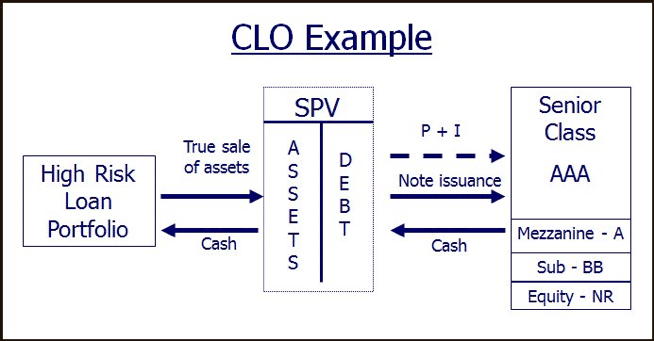

## Table of Contents

## What is a Collateralized Loan Obligation (CLO)?

A Collateralized Loan Obligation, or CLO, is a type of financial product where a bunch of loans, usually given to companies that aren't super big, are bundled together. These loans are then sold to investors as securities. Think of it like a big pie made up of smaller loan slices. The investors who buy these securities get paid back from the money that the companies pay back on their loans.

CLOs are divided into different levels, or tranches, based on how risky they are. The safest tranches get paid first and have the lowest risk, but they also offer the lowest returns. The riskier tranches get paid later and have a higher chance of not getting all their money back, but they offer higher returns to make up for that risk. This way, investors can choose how much risk they want to take on, depending on what they're comfortable with.

## How is a CLO structured?

A CLO is structured by taking a bunch of loans, usually given to businesses that aren't huge, and putting them all together into one big pool. This pool is then split into different parts called tranches. Each tranche is like a slice of the pie, and they are ranked from safest to riskiest. The safest tranches are paid back first and have the lowest risk, but they also give the lowest returns. The riskier tranches are paid back later and have a higher chance of losing money, but they offer higher returns to make up for that risk.

The money to pay back the investors comes from the interest and principal payments that the companies make on their loans. A manager, who is usually a professional in handling these kinds of investments, oversees the CLO. They make sure the loans in the pool are performing well and decide when to buy or sell loans to keep the CLO running smoothly. This structure allows investors to choose how much risk they want to take on, depending on what they're comfortable with.

## What are the different tranches in a CLO?

In a CLO, the loans are split into different levels called tranches. These tranches are like slices of a pie, and they are ranked from safest to riskiest. The safest tranche is called the senior tranche. It gets paid back first and has the lowest risk, but it also gives the lowest returns. This is because it's at the top of the payment order, so it's the first to get money from the loans that are being paid back.

The next level down is the mezzanine tranche. It's riskier than the senior tranche but less risky than the bottom level. It gets paid after the senior tranche and offers higher returns to make up for the extra risk. The riskiest tranche is called the equity tranche. It gets paid last and has the highest chance of not getting all its money back. But, if things go well, it can offer the highest returns. This way, investors can choose a tranche that matches their comfort with risk and their goals for returns.

## Who are the typical investors in CLOs?

Typical investors in CLOs are a mix of different types of people and organizations. You'll find big banks and insurance companies, who like the steady income that the safer tranches can offer. They use CLOs as a way to diversify their investments and get a bit more return than they would from super safe investments like government bonds.

But it's not just the big players. Hedge funds and other types of investment funds also get into CLOs, especially the riskier tranches. They're looking for higher returns and are willing to take on more risk to get them. Sometimes, even wealthy individuals or family offices invest in CLOs, choosing the tranche that matches their risk comfort level and investment goals.

## What are the benefits of investing in CLOs?

Investing in CLOs can be a good way to spread out your investments and make more money. CLOs take a bunch of loans and put them together, then split them into different parts called tranches. Each part has a different level of risk and reward. By choosing the right tranche, investors can find a balance that matches what they're comfortable with. For example, big banks and insurance companies often go for the safer tranches because they want steady income without too much risk. On the other hand, hedge funds and other investors might go for the riskier tranches to chase bigger returns.

Another benefit is that CLOs can offer higher returns than other safe investments like government bonds. This is because they're based on loans to businesses, which can be riskier but also more rewarding. Plus, the people who manage CLOs are usually experts who keep an eye on the loans to make sure they're doing well. This can give investors a bit more peace of mind, knowing that professionals are looking after their money. So, whether you're looking for steady income or higher returns, CLOs can be a useful part of your investment plan.

## How do CLOs generate returns for investors?

CLOs generate returns for investors by taking a bunch of loans, usually given to businesses, and putting them all together. The money that these businesses pay back on their loans, including both the interest and the principal, is used to pay back the investors who bought into the CLO. The CLO is split into different parts called tranches, and each part has its own level of risk and reward. The safest tranches, called senior tranches, get paid back first and offer lower returns because they're less risky. The riskier tranches, like the mezzanine and equity tranches, get paid back later and offer higher returns to make up for the extra risk.

The returns come from the interest payments on the loans that are part of the CLO. If the businesses are doing well and paying back their loans on time, the CLO can keep making money for the investors. A professional manager oversees the CLO, making sure the loans are performing well and deciding when to buy or sell loans to keep things running smoothly. This management helps to make the most of the loans and generate steady returns for the investors, depending on which tranche they've chosen to invest in.

## What are the risks associated with CLOs?

Investing in CLOs comes with some risks that investors should know about. One big risk is that the businesses who took out the loans might not be able to pay them back. If too many businesses default on their loans, the CLO might not have enough money to pay back all the investors, especially those in the riskier tranches. This can lead to losses, especially for those who invested in the mezzanine or equity tranches, which are paid back last.

Another risk is that the value of the CLO can go up and down based on what's happening in the economy. If there's a big economic downturn, more businesses might struggle to pay back their loans, which can hurt the value of the CLO. Also, if interest rates go up, the cost of borrowing can increase, making it harder for businesses to pay back their loans. This can affect the returns that investors get from their CLO investments.

## How does the performance of underlying loans affect a CLO?

The performance of the loans that make up a CLO can really impact how well the CLO does. If the businesses that took out these loans are doing well and paying back their loans on time, the CLO can keep making money for the investors. This is because the money from the loan payments, both interest and principal, is used to pay back the investors. When the loans are performing well, the CLO can keep up with its payments to all the different tranches, from the safest senior tranches to the riskier equity tranches.

But if the businesses start to struggle and can't pay back their loans, it can cause problems for the CLO. If too many businesses default on their loans, the CLO might not have enough money to pay back all the investors. This can hit the riskier tranches the hardest because they get paid back last. So, the performance of the underlying loans is super important for the CLO's success, and it can make a big difference in how much money investors get back.

## What role do CLO managers play, and how are they compensated?

CLO managers are like the captains of the ship. They keep an eye on all the loans that make up the CLO and make sure they're doing okay. If some loans start to go bad, the manager can sell them and buy new ones that might do better. They also decide when it's time to buy or sell loans to keep the CLO running smoothly. Their job is to make sure the CLO keeps making money for the investors by managing the loans well.

CLO managers get paid in a few ways. They usually get a fee for managing the CLO, which is a small percentage of the total value of the CLO. This fee is paid no matter how the CLO is doing. But they can also earn more if the CLO does really well. If the CLO makes more money than expected, the managers might get a bonus, which is usually a share of the extra profits. This way, they have a reason to do a good job and make the CLO as successful as possible.

## How have regulatory changes impacted the CLO market?

Regulatory changes have had a big impact on the CLO market. One big change came after the financial crisis in 2008. New rules were put in place to make sure banks and other big investors were safer. For example, the Volcker Rule in the U.S. stopped banks from investing in risky stuff like CLOs with their own money. This made it harder for CLOs to get money from banks, which changed how the market worked.

Another change was the introduction of risk retention rules. These rules say that the people who put together CLOs have to keep some of the risk themselves. They have to hold onto a part of the CLO, usually the riskiest part, to make sure they have a reason to manage it well. This was meant to make CLOs safer, but it also made it a bit harder and more expensive to create them. Overall, these regulatory changes have made the CLO market more careful and changed who invests in them and how they're made.

## What are the key differences between CLOs and other structured credit products like CDOs?

CLOs and CDOs are both types of structured credit products, but they have some key differences. CLOs are made up of loans given to businesses, usually ones that aren't huge. These loans are bundled together and then split into different parts called tranches, based on how risky they are. CDOs, on the other hand, can be made up of all sorts of debts, like mortgages, bonds, or even other CDOs. This means that CDOs can be a lot more varied in what they include, while CLOs stick to business loans.

Another big difference is how they're managed. CLOs usually have a manager who keeps an eye on the loans and can buy or sell them to keep the CLO running smoothly. This active management can help make sure the CLO keeps making money for investors. CDOs, however, are often not managed this way. Once they're set up, they usually don't change much. This can make CDOs riskier because if the debts inside them start to go bad, there's not much that can be done to fix it. So, while both CLOs and CDOs are ways to invest in bundled debts, they work differently and have different risks and rewards.

## How can advanced analytics and stress testing be used to assess CLO risk?

Advanced analytics and stress testing are super important tools for figuring out how risky a CLO is. They help investors and managers see what could happen to the CLO if things go wrong. By using advanced analytics, people can look at a bunch of data about the loans in the CLO, like how well the businesses are doing and if they're likely to pay back their loans on time. This can give a better idea of how the CLO might do in the future. Stress testing takes this a step further by imagining different bad scenarios, like a big economic downturn or a jump in interest rates, and seeing how the CLO would hold up. This helps everyone understand the risks better and make smarter choices about investing in CLOs.

Stress testing can be especially useful because it shows what might happen if things get really tough. For example, if a lot of businesses can't pay back their loans all at once, the stress test can show how that would affect the different tranches of the CLO. The senior tranches might still be okay, but the riskier mezzanine and equity tranches could lose a lot of money. By running these tests, investors can see where the biggest risks are and decide if they're comfortable with them. This way, advanced analytics and stress testing help everyone involved with CLOs be more prepared and make better decisions.

## References & Further Reading

[1]: "Collateralized Loan Obligations: A Powerful and Scalable Investment Solution" by Standard & Poor's Rating Services. Available at: https://www.spglobal.com/ratings/en/research-insights/articles/collateralized-loan-obligations-a-powerful-and-scalable-investment-solution 

[2]: Tavakoli, Janet M. (2003). "[Collateralized Debt Obligations & Structured Finance: New Developments in Cash & Synthetic Securitization](https://onlinelibrary.wiley.com/doi/book/10.1002/9781118268230)" Wiley.

[3]: "Algorithmic Trading: Concepts and Applications" by Barry Johnson (2010). Available at: https://www.amazon.com/Algorithmic-Trading-Concepts-Barry-Johnson/dp/0956399207

[4]: Gorton, Gary B., and Nicholas S. Souleles. (2006). "[Special Purpose Vehicles and Securitization](https://www.nber.org/papers/w11190)." National Bureau of Economic Research Working Paper Series.

[5]: "Blockchain and Securitization: The Future of Structured Finance" by World Economic Forum. Available at: https://www.weforum.org/reports/blockchain-and-securitization-the-future-of-structured-finance

[6]: Lopez de Prado, Marcos (2018). "[Advances in Financial Machine Learning](https://www.amazon.com/Advances-Financial-Machine-Learning-Marcos/dp/1119482089)" Wiley.

[7]: "Understanding Credit Derivatives and Related Instruments" by Antulio N. Bomfim (2015), Elsevier. Available at: https://www.elsevier.com/books/understanding-credit-derivatives-and-related-instruments/bomfim/978-0-12-800116-9