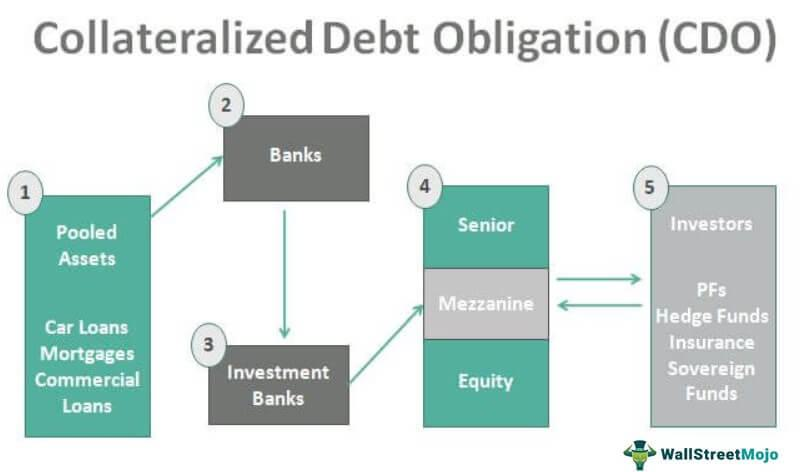

The financial landscape is inherently complex, characterized by an array of instruments crafted to manage risk while generating returns. Among these instruments, the Collateralized Loan Obligation (CLO) stands out for its distinct structure and potential benefits. CLOs are financial tools used predominantly by institutional investors, drawn to their high yield prospects and the promise of portfolio diversification. As a securitized product, CLOs consist of a collection of loans, typically corporate loans with lower credit ratings, pooled together and sold as a single security. This diversification can mitigate individual loan risks, transforming a bundle of high-risk loans into a relatively stable financial product. 

The allure of CLOs extends beyond mere diversification. These instruments have gained traction because they offer a tiered structure of risk and return. By layering debt into tranches, investors can choose their desired level of exposure and potential reward—from secure, lower-yield tranches to riskier, higher-yield options. Such a structure caters to varying risk appetites, making CLOs a versatile choice in different investment strategies.



The intersection of technology and finance has further enhanced the appeal of CLOs. Algorithmic trading strategies, leveraging speed and sophisticated data analysis, integrate CLOs to maximize returns and refine risk management. These strategies can unearth arbitrage opportunities and optimize portfolio management, underscoring the growing significance of technology in modern finance.

Moreover, advancements in technology have revolutionized CLO management, offering novel solutions to inherent risks. Blockchain technology, for instance, promises greater transparency and efficiency in transactions, while machine learning algorithms provide meticulous risk assessment and management capabilities. 

This article seeks to disentangle the intricacies of CLOs, examining their structural makeup and associated risks. It will also highlight how algorithmic trading and technological advancements have reshaped the landscape, handling CLOs more effectively and allowing investors to navigate their complexities with increased confidence.

## Table of Contents

## Understanding Collateralized Loan Obligations (CLO)

A Collateralized Loan Obligation (CLO) is a type of structured finance product that is created through the securitization of a pool of corporate loans, typically those with a lower credit rating. These corporate loans are often leveraged or syndicated loans extended to large corporations. The aim of a CLO is to distribute the credit risk among multiple investors while providing these investors with the opportunity to earn returns based on the risk level they choose to bear.

The process of securitization is central to the creation of a CLO. This involves pooling multiple loans together to form a diversified portfolio. By aggregating these loans, a single security, or CLO, is issued to investors. This security represents a claim on the cash flows generated by the underlying pool of loans. The pooling process enables the conversion of relatively illiquid loans into tradable securities, making them more attractive to a broad range of investors.

CLOs share similarities with Collateralized Mortgage Obligations (CMOs). However, while CMOs are backed by mortgages, the underlying assets of CLOs are corporate loans. This distinction is crucial because corporate loans, typically being leveraged loans, [carry](/wiki/carry-trading) different risk profiles compared to mortgages. Leveraged loans are generally used by companies that have high levels of debt, thus presenting higher default risks compared to traditional mortgage borrowers. The securitization of these loans into CLOs offers a method to manage such risks through diversification and tranching.

The basic structure of a CLO involves dividing the cash flows from the pool of loans into several tranches, each characterized by different levels of risk and return. By doing so, a CLO can cater to different types of investors, from those seeking lower-risk investments to those willing to accept higher risks for potentially higher returns. Thus, a well-structured CLO provides both risk diversification and tailored investment opportunities.

## Structure of CLOs

Collateralized Loan Obligations (CLOs) are structured financial instruments that delineate varying levels of risk and return through a hierarchical system known as tranching. This structure is crucial for allocating cash flows generated from the underlying pool of loans to different classes of investors based on their risk appetite and desired yield.

The hierarchy of a CLO begins with debt tranches, traditionally rated from AAA (highest credit quality) to BB (non-investment grade), and culminates with an equity tranche. Each tranche represents a different priority in the income distribution sequence, dictating the order in which cash flows are allocated and losses absorbed.

1. **Debt Tranches**: 
   - The senior-most class in the tranche hierarchy is usually rated AAA. These tranches are characterized by their low risk but also by their relatively lower returns. They have the first claim on cash flows from the underlying assets, meaning they are the first to be paid interest and principal.
   - Below AAA, tranches can be rated AA, A, BBB, down to BB. Each descending step in the credit rating implies higher risk but provides a higher yield to compensate for this risk.
   - The ratings are assigned by credit rating agencies based on the creditworthiness of the underlying loans and the structural features of the CLO.

2. **Equity Tranche**:
   - The equity tranche sits at the bottom of the cash flow hierarchy and bears the highest level of risk. Investors in the equity tranche are the last to receive payments, and they absorb the first loss if any underlying loans default.
   - Despite recognizing the residual nature of payments, the equity tranche offers potentially higher returns than higher-rated tranches due to its risk profile.
   - Essentially, the equity tranche acts akin to the first-loss piece, where investors are rewarded with the excess spread after all other tranches have been paid.

The structuring of CLOs into tranches not only facilitates a diverse range of investment opportunities catering to various risk-return preferences but also significantly underpins the appeal of CLOs in optimizing capital allocations within institutional portfolios. The tranching mechanism inherently allows the redistribution of credit risk, translating into more stable risk-adjusted returns across the different asset tiers.

## Financial Risks in CLOs

Collateralized Loan Obligations (CLOs) are subject to a variety of financial risks that can affect the return on investment and overall stability of these instruments. Understanding these risks is crucial for investors looking to optimize their portfolios.

**Credit Risk**

Credit risk is a primary concern for CLO investors, as these instruments are underpinned by a collection of corporate loans, typically involving borrowers with lower credit ratings. The possibility of default by one or more borrowers poses a direct threat to the income stream from the CLO. Credit risk is often measured using credit rating scores provided by agencies like Moody's or S&P Global. A decline in the credit quality of the underlying loans can lead to a cascading effect, where lower-rated tranches of the CLO are most susceptible to losses. Portfolio managers often employ credit risk models to quantify this threat and adjust their holdings accordingly.

**Liquidity Risk**

Liquidity risk within CLOs becomes prominent during periods of market stress. This risk reflects the difficulties in selling CLO securities quickly without significantly affecting their market price. During financial turmoil, the demand for CLOs can shrink, resulting in wider bid-ask spreads and an illiquid market environment. Investors might find themselves unable to liquidate their positions promptly or at favorable prices, which can lead to forced selling at discounts. Enhanced [liquidity](/wiki/liquidity-risk-premium) risk management practices are required to mitigate this, often involving maintaining cash reserves or access to credit lines.

**Interest Rate Risk**

Interest rate risk is another significant [factor](/wiki/factor-investing) affecting CLOs. Changes in interest rates can have a dual impact: they directly alter the cash flows of the underlying floating-rate loans, and they also affect the discount rates applied when valuing these cash flows. When interest rates rise, the cost of borrowing increases, potentially increasing the likelihood of borrower default. Conversely, falling interest rates can lead to loan prepayments, disrupting the expected cash inflows to the CLO. CLO managers often use [interest rate](/wiki/interest-rate-trading-strategies) swaps and other derivatives to hedge against these risks, attempting to stabilize the cash flow and valuation of their portfolios.

Understanding these risks requires a robust analytical approach, utilizing various financial and computational tools to assess and manage potential downsides. Advanced models often integrate multiple risk factors to provide a comprehensive view of the CLO portfolio's risk profile. As these financial instruments grow in complexity, so too does the necessity for sophisticated risk management strategies.

## Algorithmic Trading and CLOs

Algorithmic trading has revolutionized the way financial instruments, including Collateralized Loan Obligations (CLOs), are traded. It employs computer algorithms to conduct trades at high speed and frequency, capitalizing on financial market data to gain insights that are impossible for human traders to discern manually. 

One of the primary benefits of [algorithmic trading](/wiki/algorithmic-trading) in the CLO market is its ability to identify [arbitrage](/wiki/arbitrage) opportunities. By analyzing vast datasets in real-time, algorithms can detect price discrepancies between related securities that would be imperceptible to human traders. For instance, if a CLO tranche is mispriced relative to similar instruments, an algorithm can swiftly execute trades to exploit the pricing inefficiency, balancing the pricing while generating profit for the investor.

Additionally, algorithmic trading enhances portfolio management of CLOs by increasing efficiency. Through automation, algorithms can dynamically adjust portfolio compositions in response to market movements or changes in risk factors, ensuring that investment strategies remain aligned with predefined objectives. This real-time adaptability is crucial in a complex market like CLOs, where credit events or interest rate changes can quickly affect asset performance.

Moreover, quantitative models underpin algorithmic trading strategies, providing sophisticated methods for risk management. These models incorporate a multitude of variables and scenarios to predict potential outcomes and risks associated with CLO investments. Techniques such as mean-variance optimization, a mathematical model used to optimize the risk-return tradeoff in a portfolio, are frequently employed. Here's a simple example in Python to demonstrate how mean-variance optimization might be used:

```python
import numpy as np
from scipy.optimize import minimize

# Expected returns and covariance matrix for three CLO tranches
expected_returns = np.array([0.06, 0.08, 0.12])
covariance_matrix = np.array([
    [0.0004, 0.0001, 0.0002],
    [0.0001, 0.0005, 0.0003],
    [0.0002, 0.0003, 0.0008]
])

# Portfolio variance function
def portfolio_variance(weights, covariance_matrix):
    return weights.T @ covariance_matrix @ weights

# Constraint: sum of weights = 1
constraints = ({'type': 'eq', 'fun': lambda x: np.sum(x) - 1})

# Bounds for each weight
bounds = tuple((0, 1) for _ in range(len(expected_returns)))

# Initial guess
initial_weights = np.array([1/3, 1/3, 1/3])

# Optimize for minimum variance
result = minimize(portfolio_variance, initial_weights, args=(covariance_matrix),
                  method='SLSQP', bounds=bounds, constraints=constraints)

optimal_weights = result.x
print("Optimal Portfolio Weights:", optimal_weights)
```

This script aims to determine the optimal weighting of three CLO tranches to minimize risk while achieving desired return levels. Such algorithmic approaches allow for proactive risk mitigation, helping investors navigate the complexities of CLO markets with greater confidence.

In summary, algorithmic trading equips investors with powerful tools to enhance performance and manage risks in trading CLOs. The integration of speed, data, and quantitative strategies enables more effective investment decisions tailored to the fast-paced financial environment.

## Technological Advances in Managing CLOs

Technology has significantly transformed the management and trading of Collateralized Loan Obligations (CLOs), enhancing transparency, efficiency, and risk assessment. Blockchain technology plays a critical role in improving the efficiency and transparency of CLO transactions. By utilizing a decentralized ledger system, blockchain ensures that every transaction related to the issuance and settlement of CLOs is recorded in an immutable and accessible way. This transparency can potentially reduce counterparty risks and streamline the overall process of trading CLO securities.

The use of [machine learning](/wiki/machine-learning) algorithms is another pivotal advancement in managing CLOs. These algorithms allow financial institutions to better assess and manage risks by analyzing vast datasets to identify patterns and trends that may not be immediately apparent to human analysts. For instance, machine learning models can be employed to predict the probability of default of the loans that constitute the underlying assets of CLOs. By incorporating features such as historical financial data, macroeconomic indicators, and even social media sentiment, these models can provide a comprehensive risk assessment, enhancing decision-making processes. An example Python snippet for a simple risk prediction model might look like this:

```python
from sklearn.ensemble import RandomForestClassifier
from sklearn.model_selection import train_test_split
from sklearn.metrics import accuracy_score

# Sample dataset features: historical financial data, macroeconomic indicators
X = dataset[['financial_data', 'economic_indicators']]
y = dataset['default_risk']

# Splitting data into training and test sets
X_train, X_test, y_train, y_test = train_test_split(X, y, test_size=0.2, random_state=42)

# Initializing and training the Random Forest Classifier
model = RandomForestClassifier(n_estimators=100, random_state=42)
model.fit(X_train, y_train)

# Making predictions and calculating accuracy
predictions = model.predict(X_test)
accuracy = accuracy_score(y_test, predictions)
print(f'Model Accuracy: {accuracy * 100:.2f}%')
```

Moreover, machine learning can optimize the asset selection process when constructing new CLOs. By analyzing historical loan performance data, these algorithms can aid in selecting loans with the most favorable risk-return profiles, thus enhancing the appeal of CLOs to potential investors.

Overall, technology is not only advancing the efficiency and transparency of CLO management through blockchain but is also revolutionizing risk assessment and decision-making frameworks through machine learning. As these technologies continue to evolve, they hold the potential to further mitigate the inherent complexities and risks associated with CLO investments.

## Conclusion

Collateralized Loan Obligations (CLOs) remain a complex yet potentially lucrative investment avenue for those seeking higher returns in their financial portfolios. CLOs are designed to pool and redistribute financial risk, offering appealing yields by tapping into the segment of low-rated corporate loans. Despite the attractive returns, CLOs are not devoid of risks, including credit risk from loan defaults, liquidity risk during market stress, and interest rate risk affecting valuations.

Recent advancements in technology and algorithmic trading have significantly transformed the way CLOs are managed and traded. Technologies such as blockchain enhance transparency and efficiency in CLO transactions, resolving issues related to opacity and procedural delays traditionally associated with these instruments. Furthermore, machine learning algorithms are increasingly employed to predict potential market shifts and assess the risk associated with CLOs, thereby empowering investors with better analytical tools for risk management.

Algorithmic trading also plays a crucial role in the contemporary landscape by utilizing automated trading strategies that can quickly process large volumes of data. This technology allows for the exploitation of arbitrage opportunities and the optimization of investment portfolios. It has the potential to improve the robustness of risk management practices by applying quantitative models to predict and mitigate potential losses.

To successfully integrate CLOs into an investment strategy, investors must continuously stay informed about both market conditions and the technological advancements driving changes in how these instruments are managed. Staying updated with these developments enables investors to adapt their strategies, optimize returns, and mitigate potential risks. The convergence of financial acumen and technological prowess thus remains a critical component in leveraging the full potential of CLOs.

## References & Further Reading

[1]: "Collateralized Loan Obligations: A Powerful and Scalable Investment Solution" by Standard & Poor's Rating Services. Available at: https://www.spglobal.com/ratings/en/research-insights/articles/collateralized-loan-obligations-a-powerful-and-scalable-investment-solution 

[2]: Tavakoli, Janet M. (2003). "[Collateralized Debt Obligations & Structured Finance: New Developments in Cash & Synthetic Securitization](https://onlinelibrary.wiley.com/doi/book/10.1002/9781118268230)" Wiley.

[3]: "Algorithmic Trading: Concepts and Applications" by Barry Johnson (2010). Available at: https://www.amazon.com/Algorithmic-Trading-Concepts-Barry-Johnson/dp/0956399207

[4]: Gorton, Gary B., and Nicholas S. Souleles. (2006). "[Special Purpose Vehicles and Securitization](https://www.nber.org/papers/w11190)." National Bureau of Economic Research Working Paper Series.

[5]: "Blockchain and Securitization: The Future of Structured Finance" by World Economic Forum. Available at: https://www.weforum.org/reports/blockchain-and-securitization-the-future-of-structured-finance

[6]: Lopez de Prado, Marcos (2018). "[Advances in Financial Machine Learning](https://www.amazon.com/Advances-Financial-Machine-Learning-Marcos/dp/1119482089)" Wiley.

[7]: "Understanding Credit Derivatives and Related Instruments" by Antulio N. Bomfim (2015), Elsevier. Available at: https://www.elsevier.com/books/understanding-credit-derivatives-and-related-instruments/bomfim/978-0-12-800116-9