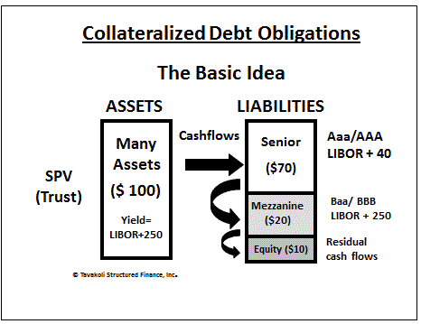

## Table of Contents

## What is a Collateralized Mortgage Obligation (CMO)?

A Collateralized Mortgage Obligation (CMO) is a type of mortgage-backed security that pools together a large number of home loans and then divides them into different parts, called tranches. Each tranche has its own level of risk and return, so investors can choose the one that fits their needs. The idea is to make the investment more appealing by offering different levels of risk and reward.

The money from the home loans, including both the monthly payments and the final payments when the loans are paid off, is used to pay back the investors in the CMOs. The way the payments are distributed depends on the rules set up for each tranche. Some tranches get paid back first and are considered safer, while others get paid back later and are riskier but can offer higher returns. This structure helps spread out the risk and makes CMOs an important tool in the world of finance.

## What is a Collateralized Bond Obligation (CBO)?

A Collateralized Bond Obligation (CBO) is a type of security where a bunch of bonds are put together into one big package. This package is then split into different parts, called tranches, each with its own level of risk and reward. People who want to invest can pick the part that matches what they're looking for. The money that comes from the bonds, like interest payments and the money you get back when the bonds mature, is used to pay back the investors in the CBO.

The way the money is shared among the different parts of the CBO depends on the rules set for each tranche. Some parts get paid back first and are safer, while others get paid back later and are riskier but can offer higher returns. This setup helps spread out the risk and makes CBOs a useful tool for investors who want to manage their investments carefully.

## How are CMOs and CBOs structured?

CMOs and CBOs are both structured by pooling together a bunch of loans or bonds and then dividing them into different parts called tranches. Each tranche has its own level of risk and reward. This way, investors can choose the part that matches what they want. For CMOs, the loans are usually home loans, and for CBOs, they are bonds. The money that comes in from these loans or bonds, like monthly payments or interest, is used to pay back the investors.

The way the money is shared among the different tranches depends on the rules set for each one. Some tranches get paid back first and are safer, while others get paid back later and are riskier but can offer higher returns. This structure helps spread out the risk. It makes CMOs and CBOs useful tools for investors who want to manage their investments carefully. By choosing different tranches, investors can balance their need for safety with their desire for higher returns.

## What types of assets back CMOs and CBOs?

CMOs are backed by home loans. This means that the money used to pay back investors in CMOs comes from the monthly payments that homeowners make on their mortgages. When someone takes out a mortgage to buy a house, that loan can be included in a pool of other home loans. This pool is then divided into different parts, or tranches, and sold to investors as CMOs. The safety and return of each tranche depend on how quickly the homeowners pay back their loans and whether they default on their payments.

CBOs, on the other hand, are backed by bonds. These bonds can be from different issuers like companies or governments. The money that investors in CBOs get comes from the interest payments and the principal that bondholders receive when the bonds mature. Just like with CMOs, these bonds are pooled together and then divided into tranches. Each tranche has its own level of risk and return, based on the creditworthiness of the bonds and how they perform over time.

## What are the primary risks associated with investing in CMOs?

One of the main risks of investing in CMOs is prepayment risk. This happens when homeowners pay off their mortgages earlier than expected, maybe because they sell their house or refinance their loan. When this happens, the money that was supposed to come in over a long time comes in all at once. This can be a problem for investors because they might have to reinvest this money at a lower interest rate, which means they won't make as much money as they had planned.

Another big risk is interest rate risk. When interest rates go up, the value of the CMOs can go down. This is because new loans and securities might offer higher rates, making the older CMOs less attractive. Also, if interest rates rise, fewer people might refinance their mortgages, which can slow down the payments coming into the CMO. This can affect how much money investors get and when they get it.

Lastly, there's the risk of default. If a lot of homeowners can't make their mortgage payments, it can hurt the value of the CMO. This risk is spread out across the different tranches, so some parts of the CMO might be safer than others. But if enough people default, even the safer tranches can be affected. This is why it's important for investors to understand how the CMO is structured and what kind of loans are in the pool.

## What are the primary risks associated with investing in CBOs?

One of the main risks of investing in CBOs is credit risk. This means that the bonds that back the CBO might not be paid back on time or at all. If the companies or governments that issued these bonds have financial problems, they might default on their payments. This can hurt the value of the CBO and reduce the amount of money that investors get back. The risk is spread out across the different tranches of the CBO, so some parts might be safer than others, but if enough bonds default, it can affect the whole CBO.

Another risk is interest rate risk. When interest rates go up, the value of the bonds in the CBO can go down. This is because new bonds might offer higher interest rates, making the older bonds less attractive. If interest rates rise, it can also affect how much money the CBO brings in, because the bonds might not pay as much interest as before. This can make it harder for the CBO to pay back its investors and can lead to lower returns.

Lastly, there's the risk of market risk. The value of the CBO can go up and down based on what's happening in the overall market. If investors start to worry about the economy or the bond market, they might sell their CBOs, which can drive the price down. This means that even if the bonds in the CBO are doing okay, the CBO itself might lose value because of what's happening in the market.

## How do the cash flows differ between CMOs and CBOs?

The cash flows in CMOs come from homeowners paying their mortgages. When people make their monthly mortgage payments, that money goes into the CMO. The CMO then uses this money to pay back the investors. The way the money is shared among the different parts of the CMO depends on the rules set for each part. Some parts get paid back first and are safer, while others get paid back later and are riskier but can offer higher returns. If homeowners pay off their mortgages early or if they can't make their payments, it can change how much money comes into the CMO and how it's shared among the investors.

The cash flows in CBOs come from the bonds that are part of the CBO. These bonds pay interest regularly and return the principal when they mature. The money from these bond payments goes into the CBO and is used to pay back the investors. Just like with CMOs, the money is shared among the different parts of the CBO based on the rules set for each part. Some parts get paid back first and are safer, while others get paid back later and are riskier but can offer higher returns. If the companies or governments that issued the bonds have trouble making their payments, it can affect how much money comes into the CBO and how it's shared among the investors.

## What are the typical investors in CMOs and CBOs?

The typical investors in CMOs are often big institutions like banks, insurance companies, and pension funds. They like CMOs because they can choose different parts of the CMO that fit their need for safety or their desire for higher returns. These investors have a lot of money to invest and they want to spread out their risk. They also have the resources to understand the complicated structure of CMOs and how the cash flows work. Sometimes, wealthy people who want to invest in real estate without buying property directly might also invest in CMOs.

For CBOs, the investors are usually also big institutions like banks, hedge funds, and mutual funds. They invest in CBOs to get a mix of bonds with different levels of risk and return. These investors are looking for ways to manage their money carefully and they can handle the complexity of CBOs. They have the knowledge and tools to analyze the bonds that back the CBO and understand how the cash flows are shared. Like with CMOs, some rich individuals might also invest in CBOs if they want to diversify their investments and are comfortable with the risks involved.

## How do prepayment risks affect CMOs compared to CBOs?

Prepayment risk is a big deal for CMOs but not really for CBOs. In CMOs, the money comes from people paying their home loans. If a lot of people pay off their loans early, maybe because they sell their house or get a new loan with a lower interest rate, it can mess things up for the CMO. The money that was supposed to come in over a long time comes in all at once. This can be bad for investors because they might have to put that money into something new that doesn't pay as much. So, prepayment risk can really change how much money investors in CMOs make.

CBOs don't have the same problem with prepayment risk. The money for CBOs comes from bonds, and people who buy bonds usually don't pay them off early. Bonds have a set time when they need to be paid back, and that time doesn't change. So, the money coming into CBOs is more predictable. This means investors in CBOs don't have to worry about their money coming in too fast like investors in CMOs do. That's why prepayment risk is a much bigger issue for CMOs than for CBOs.

## What role do credit ratings play in the valuation of CMOs versus CBOs?

Credit ratings are super important for both CMOs and CBOs because they help investors figure out how safe their money is. For CMOs, the credit rating depends on how likely the homeowners are to keep paying their mortgages. If a lot of people might not be able to pay, the credit rating goes down, and the CMO is worth less. The different parts of the CMO, called tranches, can have different ratings too. The safer parts get higher ratings, while the riskier parts get lower ratings. This helps investors pick the part that matches how much risk they want to take.

For CBOs, credit ratings are based on how likely the companies or governments that issued the bonds are to keep paying their interest and return the money when the bonds are due. If a lot of the bonds in the CBO have a high chance of not being paid back, the CBO's credit rating goes down, and it's worth less. Just like with CMOs, the different tranches of a CBO can have different ratings. The safer tranches get higher ratings, and the riskier ones get lower ratings. This way, investors can choose the part of the CBO that fits their need for safety or their desire for higher returns.

## How do regulatory environments impact the issuance and trading of CMOs and CBOs?

The rules set by the government can really change how CMOs and CBOs are made and traded. For CMOs, the government keeps a close eye on them because they are tied to home loans. After the big financial crisis in 2008, the rules got stricter. Now, companies that make CMOs have to show more information about the loans they are using. This makes it harder to create CMOs but also makes them safer for investors. The government also watches how CMOs are traded to make sure everything is fair and open. If the rules change, it can make it easier or harder for people to buy and sell CMOs.

For CBOs, the rules also have a big impact. The government looks at the bonds that are used to make CBOs and makes sure they meet certain standards. If the rules get tighter, it can be harder for companies to put together a CBO because they need to find bonds that fit the new rules. The trading of CBOs is also affected by regulations. The government wants to make sure that the market for CBOs is fair and that investors have all the information they need. Changes in the rules can make it easier or harder to trade CBOs, which can change how much they are worth and how many people want to buy them.

## What are advanced strategies for hedging risks in CMOs and CBOs?

To hedge risks in CMOs, investors can use interest rate swaps. This is like making a deal with someone else to swap interest payments. If interest rates go up, the CMO might lose value, but the swap can help make up for that loss. Another way is to use options, which are like bets on how interest rates will change. If rates go up and hurt the CMO, the options can pay off and help cover the loss. Also, investors can spread their money across different parts of the CMO, called tranches. Some tranches are safer and others are riskier, so by picking a mix, investors can balance their risk.

For CBOs, hedging can involve credit default swaps. These are like insurance policies that pay out if the bonds in the CBO don't get paid back. If a lot of bonds default, the swap can help cover the loss. Another strategy is to use interest rate derivatives, like futures or options, to protect against changes in interest rates. If rates go up and the bonds in the CBO lose value, the derivatives can help make up for that loss. Just like with CMOs, spreading money across different tranches of the CBO can help manage risk. By choosing a mix of safe and risky tranches, investors can balance their need for safety with their desire for higher returns.

## What are Collateralized Mortgage Obligations and how are they explained?

A Collateralized Mortgage Obligation (CMO) is a sophisticated type of mortgage-backed security (MBS) that aggregates a collection of mortgage loans and redistributes the cash flows into a structured hierarchy known as tranches. Each tranche is characterized by its unique maturity profile and risk exposure, allowing investors to select a tranche that aligns with their specific risk tolerance and investment horizon.

### Tranche Structure and Risk

The segmentation into tranches enables a CMO to cater to different investor needs by offering a range of risk-return profiles. Tranches are generally structured hierarchically, with senior tranches possessing priority in receiving cash flows from the underlying mortgage pool, thus bearing less risk. Conversely, junior tranches are subordinate to senior tranches and are exposed to higher levels of risk in exchange for potentially higher returns.

For example, if we denote the cash flow structure with $C_i$ as the cash flow to the $i^{th}$ tranche, the formula for the distribution of total cash flows $C$ can be represented as:

$$
C = C_1 + C_2 + \cdots + C_n
$$

Where each $C_i$ is allocated based on the priority established by the tranche hierarchy.

### Diversification and Yield Potential

CMOs offer significant diversification benefits as they are comprised of numerous individual mortgage loans, reducing the impact of any single mortgage's performance on the overall security. This diversification appeals to investors seeking to mitigate idiosyncratic risks associated with individual borrowers' defaults.

Moreover, due to the potential to allocate interest and principal payments in a tailored fashion among tranches, CMOs can offer attractive yield potentials. Investors aiming for stable cash flows might opt for senior tranches, while those inclined toward potentially higher yields may choose more subordinate tranches, which bear elevated risk.

CMOs have become valuable in the portfolio diversification strategies for institutional investors, as they allow for a more targeted exposure to mortgage markets compared to traditional MBS structures. By balancing risk and yield, CMOs offer a compelling investment proposition, aligning with various investor goals in structured financial products.

## What are the challenges and risks?

Mortgage-backed securities (MBS), including Collateralized Mortgage Obligations (CMOs) and Collateralized Bond Obligations (CBOs), alongside algorithmic trading, introduce several challenges despite their advantages. These challenges primarily stem from interest rate risk, algorithmic failures, and market [volatility](/wiki/volatility-trading-strategies), all of which can significantly impact their performance and effectiveness.

Interest rate risk is a significant concern in the context of MBS and its derivatives. These securities are particularly sensitive to changes in interest rates due to their reliance on underlying mortgage payments. As interest rates rise, the value of existing bonds typically decreases, impacting the market price of MBS. This relationship is crucial for investors to monitor: 

$$
\Delta P = -D \times \frac{\Delta y}{1+y}
$$

where $\Delta P$ represents the change in price, $D$ denotes the bond's duration, and $\Delta y$ refers to the change in yield, with $y$ being the yield.

Algorithmic trading, while enhancing efficiency, introduces the risk of algorithmic failures. These failures can occur due to coding errors, unforeseen market conditions, or system malfunctions, potentially leading to substantial financial losses. Furthermore, as algorithms operate on predefined logic, they might not adapt swiftly to unusual market conditions, thereby exacerbating risks during turbulent periods.

Market volatility poses additional challenges for both traditional and algorithm-driven investment strategies. Volatile markets can lead to sharp price movements that increase the likelihood of executing trades at unfavorable prices. For MBS, such volatility can cause unpredictable changes in cash flow projections due to fluctuations in mortgage prepayment rates.

Addressing these risks necessitates a comprehensive understanding and strategic management approach. Investors and traders must employ advanced risk management techniques, such as stress testing and scenario analysis, to anticipate potential market scenarios. Furthermore, continuous monitoring and updating of algorithmic models are essential to align them with current market conditions. 

In conclusion, while CMOs, CBOs, and algorithmic trading offer significant benefits to financial markets, their inherent challenges require careful consideration and management. Investors must balance optimizing returns with risk mitigation to effectively navigate this complex investment landscape.

## References & Further Reading

[1]: Fabozzi, F. J. (2001). ["Fixed Income Analysis"](https://books.google.com/books/about/Fixed_Income_Analysis.html?id=lujLawVLS3YC). John Wiley & Sons.

[2]: Gorton, G. B., & Metrick, A. (2012). ["Getting Up to Speed on the Financial Crisis: A One-Weekend-Reader's Guide."](https://www.nber.org/system/files/working_papers/w17778/w17778.pdf) Journal of Economic Perspectives, 26(2), 77-100.

[3]: Hull, J. C. (2018). ["Options, Futures, and Other Derivatives"](https://www.semanticscholar.org/paper/Options%2C-Futures%2C-and-Other-Derivatives-Hull/89bdee500c8623864fc9eb7a471546aa713acc44) (10th ed.). Pearson.

[4]: Mason, J. R., & Rosner, J. (2007). ["Where Did the Risk Go? How Misapplied Bond Ratings Cause Mortgage Backed Securities and Collateralized Debt Obligation Market Disruptions."](https://papers.ssrn.com/sol3/papers.cfm?abstract_id=1027475) Journal of Structured Finance, 13(2), 7-19.

[5]: Narang, R. K. (2013). ["Inside the Black Box: A Simple Guide to Quantitative and High-Frequency Trading"](https://onlinelibrary.wiley.com/doi/book/10.1002/9781118662717) (2nd ed.). Wiley.

[6]: Seth, A., & Loonkar, D. A. (2008). ["Collateralized Mortgage Obligations."](https://core.ac.uk/download/pdf/30899175.pdf) The Handbook of Mortgage-Backed Securities, 7th ed., Frank J. Fabozzi (Ed.), 325-351.