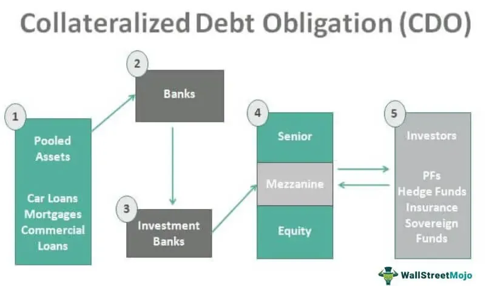

Mortgage-backed securities (MBS) play an essential role in the financial markets by enabling investors to gain exposure to the cash flows generated by mortgage loans. These securities provide a vital link between the housing sector and capital markets, facilitating the distribution of mortgage risks and returns. Within the broader category of MBS, Collateralized Mortgage Obligations (CMOs) and Collateralized Bond Obligations (CBOs) stand out as popular instruments due to their unique structures and benefits. CMOs are structured to pool mortgage loans and divide them into tranches with varying maturities and risk levels, while CBOs are backed by a diversified pool of debt securities, such as corporate bonds, often categorized based on credit risk.

Algorithmic trading, often referred to as algo trading, has brought about a significant transformation in the way MBS are traded. This form of trading leverages complex algorithms to automate trading decisions and executions, enhancing both liquidity and market efficiency. By facilitating rapid and accurate transactions, algorithmic trading allows market participants to benefit from smaller price movements, thus resulting in tighter spreads and improved pricing for investors.



This article investigates the intricate connection between CMOs, CBOs, and the prevalence of algorithmic trading, highlighting the individual roles of these components and their synergistic effects in shaping modern financial markets. Through this exploration, readers will gain insights into how these elements integrate to enhance efficiency, optimize returns, and provide robust investment opportunities in the ever-evolving financial landscape.

## Table of Contents

## Understanding Mortgage-Backed Securities

Mortgage-backed securities (MBS) are prominent financial instruments that provide investors with claims on the cash flows generated by mortgage loans. These securities are integral to the global financial markets, facilitating the pooling of mortgages into investable assets. MBS represent a wide range of mortgage loan categories, offering diverse risk-return profiles to suit various investor preferences. 

Two significant types of MBS include Collateralized Mortgage Obligations (CMOs) and Collateralized Bond Obligations (CBOs). These instruments are differentiated by the nature of their underlying assets. CMOs are specifically structured from pools of mortgage loans, whereas CBOs are derived from a mix of debt securities, such as corporate or junk bonds.

The valuation and risk assessment of MBS are inherently linked to the quality of the underlying mortgage assets, which include factors such as loan-to-value ratios, interest rates, and the geographical distribution of the properties securing these loans. Additionally, the creditworthiness of borrowers plays a critical role in influencing the overall risk associated with MBS. Higher credit scores and stable income levels in borrowers typically translate to lower default risks, thereby enhancing the security's appeal to investors.

The following Python code snippet demonstrates a basic concept of calculating the weighted average life (WAL) of an MBS, which helps in understanding the amortization schedule and risk profile:

```python
def calculate_weighted_average_life(principal_payments, periods):
    total_weighted_life = 0
    total_principal = sum(principal_payments)

    for payment, period in zip(principal_payments, periods):
        total_weighted_life += payment * period

    weighted_average_life = total_weighted_life / total_principal
    return weighted_average_life

principal_payments = [1000, 2000, 1500, 2500]
periods = [1, 2, 3, 4]

wal = calculate_weighted_average_life(principal_payments, periods)
print(f"Weighted Average Life: {wal} years")
```

Overall, understanding the underlying asset structure and credit risk parameters is crucial for evaluating mortgage-backed securities. This insight enables investors to make informed decisions and strategically manage their portfolios in the ever-evolving financial landscape.

## Collateralized Mortgage Obligations Explained

A Collateralized Mortgage Obligation (CMO) is a sophisticated type of mortgage-backed security (MBS) that aggregates a collection of mortgage loans and redistributes the cash flows into a structured hierarchy known as tranches. Each tranche is characterized by its unique maturity profile and risk exposure, allowing investors to select a tranche that aligns with their specific risk tolerance and investment horizon.

### Tranche Structure and Risk

The segmentation into tranches enables a CMO to cater to different investor needs by offering a range of risk-return profiles. Tranches are generally structured hierarchically, with senior tranches possessing priority in receiving cash flows from the underlying mortgage pool, thus bearing less risk. Conversely, junior tranches are subordinate to senior tranches and are exposed to higher levels of risk in exchange for potentially higher returns.

For example, if we denote the cash flow structure with $C_i$ as the cash flow to the $i^{th}$ tranche, the formula for the distribution of total cash flows $C$ can be represented as:

$$
C = C_1 + C_2 + \cdots + C_n
$$

Where each $C_i$ is allocated based on the priority established by the tranche hierarchy.

### Diversification and Yield Potential

CMOs offer significant diversification benefits as they are comprised of numerous individual mortgage loans, reducing the impact of any single mortgage's performance on the overall security. This diversification appeals to investors seeking to mitigate idiosyncratic risks associated with individual borrowers' defaults.

Moreover, due to the potential to allocate interest and principal payments in a tailored fashion among tranches, CMOs can offer attractive yield potentials. Investors aiming for stable cash flows might opt for senior tranches, while those inclined toward potentially higher yields may choose more subordinate tranches, which bear elevated risk.

CMOs have become valuable in the portfolio diversification strategies for institutional investors, as they allow for a more targeted exposure to mortgage markets compared to traditional MBS structures. By balancing risk and yield, CMOs offer a compelling investment proposition, aligning with various investor goals in structured financial products.

## Collateralized Bond Obligations Simplified

Collateralized Bond Obligations (CBOs) are a type of structured financial product that allows investors to engage with pools of debt securities. Unlike Collateralized Mortgage Obligations (CMOs), which are based on mortgage loans, CBOs are constructed from various bonds, including corporate bonds and high-yield (often referred to as junk) bonds. This composition offers unique investment characteristics that differ from those associated with mortgage-backed securities. 

The tranching of CBOs is based primarily on the credit risk of the underlying debt instruments. Tranches represent different slices of risk and return, allowing investors to align their investments with their risk tolerance. For instance, the least risky senior tranches have lower yields but more predictable cash flows and priority in payments. Conversely, the equity or subordinate tranches come with higher yields but also greater risk, as they absorb initial losses first.

CBOs present an opportunity for investment in high-yield bonds with the added benefit of risk diversification. By pooling various bonds and categorizing them into tranches, CBOs mitigate the risk associated with any single security defaulting. This diversification is particularly advantageous in volatile markets or when dealing with securities that possess higher credit risk. 

Moreover, CBOs provide institutional investors with access to enhanced yield potential. By investing in a collection of bonds, investors can achieve returns that are inherently higher than those from individual low-risk government bonds. This is particularly appealing for entities seeking to balance risk and return effectively.

Python can be used to model the risk and return profiles of different CBO tranches by simulating cash flows and default probabilities. Here's a basic illustration:

```python
import numpy as np

# Define parameters
n_bonds = 100
default_probability = 0.05
bond_yields = np.random.normal(0.07, 0.02, n_bonds)  # Simulating bond yields

# Simulate defaults
default_outcomes = np.random.binomial(1, default_probability, n_bonds)

# Calculate actual returns considering defaults
actual_returns = bond_yields * (1 - default_outcomes)

expected_portfolio_return = np.mean(actual_returns)
risk_measure = np.std(actual_returns)

print(f"Expected Return: {expected_portfolio_return:.2f}")
print(f"Portfolio Risk (Standard Deviation): {risk_measure:.2f}")
```

This script simulates bond defaults and calculates the expected return and risk of a CBO investment, thereby helping investors to quantitatively assess the viability of different tranches. Such tools are critical in navigating the complex landscape of CBO investments.

## The Role of Algorithmic Trading in MBS

Algorithmic trading employs sophisticated algorithms to perform trading tasks such as decision-making and execution without human intervention. In Mortgage-Backed Securities (MBS), this approach facilitates enhanced [liquidity](/wiki/liquidity-risk-premium) and market efficiency. MBS, being complex financial products, benefit significantly from the precision and speed that [algorithmic trading](/wiki/algorithmic-trading) offers.

The impact of algorithmic trading on MBS markets primarily lies in its ability to execute transactions rapidly and accurately. Traditional trading often depends on manual processes, which can be slow and prone to errors. Algorithms, however, can analyze vast amounts of data in real-time, making split-second decisions that optimize trading outcomes. This capability is critical in markets where price movements can be fleeting, allowing traders to capture gains from even minor fluctuations.

Algorithmic trading strategies can exploit small price movements within MBS markets, which leads to tighter spreads. Spreads, the difference between the bid and ask prices, are a crucial [factor](/wiki/factor-investing) in market liquidity and pricing efficiency. By narrowing these spreads, algo trading provides more competitive pricing for investors, enhancing their ability to enter and [exit](/wiki/exit-strategy) positions with minimal cost impact.

Moreover, the use of algorithms enables traders to handle large volumes of MBS efficiently. This ability is particularly valuable given the complexity and diversity of MBS products, such as Collateralized Mortgage Obligations (CMOs) and Collateralized Bond Obligations (CBOs), which may require different trading strategies depending on their structure and risk profile. Algorithmic trading supports the management of these portfolios, optimizing returns while maintaining a controlled risk exposure.

In summary, algorithmic trading plays a critical role in improving the liquidity and efficiency of MBS markets. Its application results in faster execution, reduced transaction costs, and more precise pricing, ultimately benefiting investors who seek to maximize their investment outcomes in mortgage-backed securities.

## Benefits of Combining MBS and Algo Trading

Integrating mortgage-backed securities (MBS) with algorithmic trading mechanisms offers several pivotal benefits that enhance market dynamics and investor outcomes. Primarily, this synergy facilitates improved market access and effective price discovery processes. Algorithmic trading enables rapid and precise execution of trades, significantly increasing market liquidity. This enhanced liquidity ensures that investors can enter and exit positions more readily, which contributes to more accurate and efficient pricing of MBS. 

For traders managing extensive portfolios of MBS, algorithmic strategies are indispensable tools for optimizing returns while maintaining controlled exposure to risk. The complexity of MBS, particularly instruments like Collateralized Mortgage Obligations (CMOs) and Collateralized Bond Obligations (CBOs), requires sophisticated risk management techniques. Algorithmic trading provides the necessary computational power to assess and respond to market changes promptly. This capability not only optimizes portfolio performance but also mitigates potential risks associated with [interest rate](/wiki/interest-rate-trading-strategies) fluctuations and credit markets.

Furthermore, algorithmic trading supports the management of complex instruments by automating processes that would otherwise be burdensome and time-consuming if carried out manually. Traders can deploy algorithms to monitor slight price variations across a wide array of securities, enabling them to exploit these opportunities for more favorable trading outcomes. The algorithms can be programmed to utilize various financial models and strategies, continually adapting to evolving market conditions.

The integration of MBS with algorithmic trading is also instrumental in managing the intricacies of tranches within CMOs and CBOs. By leveraging computational efficiency, traders can tailor strategies that align with specific investment goals, such as targeting particular maturities or credit risk profiles. This tailored approach ensures that investors can achieve a balance between yield potential and risk exposure according to their preferences.

Overall, the confluence of MBS and algorithmic trading not only transforms trading practices but also propels advancements in market structure, setting a foundation for improved liquidity, robust price discovery, and more sophisticated portfolio management strategies.

## Challenges and Risks

Mortgage-backed securities (MBS), including Collateralized Mortgage Obligations (CMOs) and Collateralized Bond Obligations (CBOs), alongside algorithmic trading, introduce several challenges despite their advantages. These challenges primarily stem from interest rate risk, algorithmic failures, and market [volatility](/wiki/volatility-trading-strategies), all of which can significantly impact their performance and effectiveness.

Interest rate risk is a significant concern in the context of MBS and its derivatives. These securities are particularly sensitive to changes in interest rates due to their reliance on underlying mortgage payments. As interest rates rise, the value of existing bonds typically decreases, impacting the market price of MBS. This relationship is crucial for investors to monitor: 

$$
\Delta P = -D \times \frac{\Delta y}{1+y}
$$

where $\Delta P$ represents the change in price, $D$ denotes the bond's duration, and $\Delta y$ refers to the change in yield, with $y$ being the yield.

Algorithmic trading, while enhancing efficiency, introduces the risk of algorithmic failures. These failures can occur due to coding errors, unforeseen market conditions, or system malfunctions, potentially leading to substantial financial losses. Furthermore, as algorithms operate on predefined logic, they might not adapt swiftly to unusual market conditions, thereby exacerbating risks during turbulent periods.

Market volatility poses additional challenges for both traditional and algorithm-driven investment strategies. Volatile markets can lead to sharp price movements that increase the likelihood of executing trades at unfavorable prices. For MBS, such volatility can cause unpredictable changes in cash flow projections due to fluctuations in mortgage prepayment rates.

Addressing these risks necessitates a comprehensive understanding and strategic management approach. Investors and traders must employ advanced risk management techniques, such as stress testing and scenario analysis, to anticipate potential market scenarios. Furthermore, continuous monitoring and updating of algorithmic models are essential to align them with current market conditions. 

In conclusion, while CMOs, CBOs, and algorithmic trading offer significant benefits to financial markets, their inherent challenges require careful consideration and management. Investors must balance optimizing returns with risk mitigation to effectively navigate this complex investment landscape.

## Conclusion

Collateralized Mortgage Obligations (CMOs) and Collateralized Bond Obligations (CBOs) are key financial instruments that play a significant role in providing investors with structured exposure to diverse mortgage and bond markets. These instruments offer a range of investment opportunities by segmenting the cash flows from mortgage loans and debt securities into different tranches, tailored to varying risk appetites and investment horizons.

The adoption of algorithmic trading within Mortgage-Backed Securities (MBS) markets has considerably enhanced the efficiency of these financial products and broadened market participation. Algorithmic trading, characterized by the use of complex algorithms to automate trading processes, enhances liquidity by enabling rapid transactions and precise pricing mechanisms. This integration facilitates market participants in capturing small price movements, promoting tighter spreads and overall market efficiency.

Investors who harness this convergence of CMOs, CBOs, and algorithmic trading gain several advantages. Improved liquidity ensures that investors can seamlessly enter and exit positions, while the enhanced price discovery process leads to better pricing of securities. Furthermore, algorithmic trading assists in the efficient management of large and complex MBS portfolios, optimizing returns while controlling risk. By strategically adopting these advanced trading technologies, investors can maximize their portfolio management capabilities, making the most of diversified and sophisticated investment vehicles such as CMOs and CBOs.

## References & Further Reading

[1]: Fabozzi, F. J. (2001). ["Fixed Income Analysis"](https://books.google.com/books/about/Fixed_Income_Analysis.html?id=lujLawVLS3YC). John Wiley & Sons.

[2]: Gorton, G. B., & Metrick, A. (2012). ["Getting Up to Speed on the Financial Crisis: A One-Weekend-Reader's Guide."](https://www.nber.org/system/files/working_papers/w17778/w17778.pdf) Journal of Economic Perspectives, 26(2), 77-100.

[3]: Hull, J. C. (2018). ["Options, Futures, and Other Derivatives"](https://www.semanticscholar.org/paper/Options%2C-Futures%2C-and-Other-Derivatives-Hull/89bdee500c8623864fc9eb7a471546aa713acc44) (10th ed.). Pearson.

[4]: Mason, J. R., & Rosner, J. (2007). ["Where Did the Risk Go? How Misapplied Bond Ratings Cause Mortgage Backed Securities and Collateralized Debt Obligation Market Disruptions."](https://papers.ssrn.com/sol3/papers.cfm?abstract_id=1027475) Journal of Structured Finance, 13(2), 7-19.

[5]: Narang, R. K. (2013). ["Inside the Black Box: A Simple Guide to Quantitative and High-Frequency Trading"](https://onlinelibrary.wiley.com/doi/book/10.1002/9781118662717) (2nd ed.). Wiley.

[6]: Seth, A., & Loonkar, D. A. (2008). ["Collateralized Mortgage Obligations."](https://core.ac.uk/download/pdf/30899175.pdf) The Handbook of Mortgage-Backed Securities, 7th ed., Frank J. Fabozzi (Ed.), 325-351.