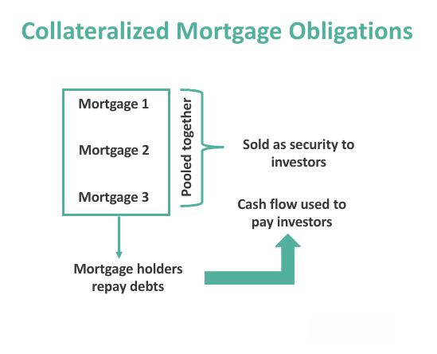

## Table of Contents

## What is a Collateralized Mortgage Obligation (CMO)?

A Collateralized Mortgage Obligation (CMO) is a type of complex financial product that is backed by a pool of mortgages. When people take out mortgages to buy homes, these loans are bundled together and used as the foundation for creating CMOs. Investors can buy parts of these CMOs, which means they are essentially investing in the payments that homeowners make on their mortgages. The idea is to spread out the risk and make the investment more appealing by dividing the cash flows into different parts, called tranches, each with its own level of risk and return.

CMOs are structured to cater to different types of investors by offering various tranches. Each tranche has a different priority in receiving payments from the underlying mortgages. Some tranches are safer and offer lower returns, while others are riskier and offer higher potential returns. This structure helps investors choose the level of risk they are comfortable with. However, CMOs can be quite complex and were part of the financial products that contributed to the 2008 financial crisis, so they require a good understanding before investing.

## How does a CMO differ from a traditional mortgage-backed security?

A Collateralized Mortgage Obligation (CMO) and a traditional mortgage-backed security (MBS) both involve pooling mortgages together and selling them to investors. The key difference lies in how the cash flows from the mortgages are distributed. In a traditional MBS, all investors receive payments at the same time, sharing the principal and interest payments proportionally based on their investment. This means everyone gets paid together, and the risk is shared equally among all investors.

In contrast, a CMO divides the cash flows into different parts called tranches. Each tranche has a different level of risk and return, and they are paid in a specific order. Some tranches get paid first and are considered safer, while others get paid later and are riskier but offer higher potential returns. This structure allows investors to choose a tranche that matches their risk tolerance and investment goals. So, while an MBS is simpler and treats all investors the same, a CMO is more complex and tailored to different investor needs.

## What are the basic components of a CMO?

A Collateralized Mortgage Obligation, or CMO, is made up of a bunch of home loans that are put together into one big pool. This pool of loans is then divided into smaller parts called tranches. Each tranche is like a piece of the pie, and they are sold to different investors. The money that homeowners pay on their mortgages, like their monthly payments, goes into this pool and then gets divided up among the tranches.

Each tranche in a CMO has its own rules about when it gets paid and how much risk it carries. Some tranches get paid first and are safer, while others get paid later and are riskier but can offer more money in return. This way, investors can pick the tranche that fits what they want, whether they want something safe or something that might make them more money but is riskier. So, the basic parts of a CMO are the pool of home loans, the tranches that come from that pool, and the different levels of risk and return for each tranche.

## Who typically invests in CMOs?

People who invest in CMOs are usually big organizations like banks, insurance companies, and pension funds. They have a lot of money to invest and are looking for ways to make more money for their clients or members. CMOs can be a good choice for them because they offer different levels of risk and return, so these organizations can pick the parts of the CMO that fit their needs.

Sometimes, individual investors also buy CMOs, but it's less common because CMOs can be pretty complicated. These investors might be looking for a way to earn more money than they would from regular savings or bonds. But they need to understand the risks and how CMOs work before they invest, because it's not as simple as putting money in a regular bank account.

## What are the risks associated with investing in CMOs?

Investing in CMOs can be risky because they are complex and depend a lot on how people pay their home loans. If a lot of homeowners stop paying their mortgages, it can hurt the value of the CMO. This is called default risk. Also, if interest rates go up, the value of the CMO can go down because people might refinance their homes at the new lower rates, which means the CMO gets less money than expected. This is called prepayment risk.

Another risk is called extension risk. If interest rates go up and people don't refinance, the CMO might take longer to pay back the money to investors, which can be a problem if they were counting on that money sooner. CMOs are also hard to understand and can be unpredictable, which adds to the risk. It's important for investors to know these risks and think carefully before putting their money into CMOs.

## How are CMOs structured and what are the different tranches?

A CMO is made up of a bunch of home loans that are put together into one big pool. This pool is then divided into smaller parts called tranches. Each tranche is like a slice of the pie, and they are sold to different investors. The money that homeowners pay on their mortgages goes into this pool and then gets divided up among the tranches. Each tranche has its own rules about when it gets paid and how much risk it carries.

There are different types of tranches in a CMO. Some tranches, called senior tranches, get paid first and are considered safer. They get the money from the homeowners' payments before anyone else. Other tranches, called mezzanine tranches, get paid after the senior tranches but before the last ones. They are riskier but can offer more money in return. The last tranches, called equity or junior tranches, get paid last and are the riskiest. They might not get paid at all if a lot of homeowners stop paying their mortgages, but if everything goes well, they can make a lot of money.

So, the structure of a CMO helps investors pick the part that fits their needs. If they want something safe, they can go for the senior tranches. If they're okay with more risk for a chance at more money, they might choose the mezzanine or equity tranches. It's all about balancing risk and reward.

## What is the process of creating a CMO?

To create a CMO, banks and financial institutions start by gathering a bunch of home loans. These loans are all put together into one big pool. This pool of loans is then used as the foundation for the CMO. The next step is to divide this pool into smaller parts called tranches. Each tranche is like a slice of the pie, and they are designed to appeal to different types of investors. The money that homeowners pay on their mortgages goes into the pool and is then divided up among these tranches.

The tranches are set up with different levels of risk and return. Some tranches, called senior tranches, get paid first and are safer. Others, called mezzanine tranches, get paid after the senior ones but before the last ones, and they are riskier but can offer more money in return. The last tranches, called equity or junior tranches, get paid last and are the riskiest. They might not get paid at all if a lot of homeowners stop paying their mortgages, but if everything goes well, they can make a lot of money. Once the tranches are set up, the CMO is sold to investors who can pick the tranche that fits their needs.

## How do prepayment risks affect CMO investors?

Prepayment risk is a big deal for people who invest in CMOs. This risk happens when homeowners pay off their mortgages earlier than expected, maybe because they refinance their homes at lower interest rates. When this happens, the money that was supposed to come into the CMO pool stops coming in sooner than planned. This can be a problem for investors, especially those who bought the safer tranches, because they were expecting a steady flow of payments over a longer time.

The impact of prepayment risk can be different for different tranches. For example, investors in the senior tranches might get their money back faster than they wanted, which means they have to find a new place to invest that money. On the other hand, investors in the riskier tranches might see their expected returns go down because the pool of money gets smaller when people pay off their loans early. So, prepayment risk can mess up the plans of CMO investors and make their investments less predictable.

## What role do rating agencies play in the CMO market?

Rating agencies are really important in the CMO market because they help investors understand how safe or risky a CMO is. They look at the pool of home loans that make up the CMO and the different tranches, and then they give each tranche a rating. A high rating means the tranche is seen as safer, while a lower rating means it's riskier. This helps investors decide which tranches they want to buy based on how much risk they are okay with.

These ratings can affect how much people are willing to pay for a CMO. If a tranche gets a good rating, more people might want to buy it, which can make its price go up. But if the rating goes down, people might not want to buy it as much, and the price could go down. So, rating agencies play a big role in how CMOs are bought and sold, and they help make the market work better by giving investors important information about risk.

## How have CMOs evolved since their introduction?

When CMOs first came out in the 1980s, they were a new way to invest in home loans. They were made to help investors get a better idea of the risks and rewards by splitting the money from the home loans into different parts, called tranches. At first, CMOs were pretty simple, with just a few tranches. But over time, they got more complicated as people figured out new ways to make them work better for different investors.

As time went on, CMOs started to include more types of home loans, like those with different interest rates or payment schedules. This made them even more complex but also more useful for a wider range of investors. The 2008 financial crisis showed that CMOs could be risky if not handled carefully, so after that, there were more rules and checks to make sure they were safer. Today, CMOs are still used a lot, but people who invest in them are more careful and pay closer attention to the risks involved.

## What are some advanced strategies for investing in CMOs?

When it comes to investing in CMOs, some advanced strategies involve looking closely at the different tranches and [picking](/wiki/asset-class-picking) the ones that match your goals. For example, if you want a steady income and are okay with lower returns, you might focus on the senior tranches. These are the safest parts of the CMO and get paid first. But if you're willing to take more risk for a chance at higher returns, you might go for the mezzanine or equity tranches. These get paid later and are riskier, but they can offer more money if things go well. Another strategy is to use a laddering approach, where you invest in different tranches with different maturity dates. This can help spread out the risk and make sure you have a steady flow of income over time.

Another advanced strategy is to pay attention to the [interest rate](/wiki/interest-rate-trading-strategies) environment. If you think interest rates are going to go down, you might want to invest in CMOs because they could become more valuable. But if you think rates are going up, you might want to be careful because it could increase the prepayment risk. It's also a good idea to keep an eye on the credit quality of the underlying mortgages. If the homeowners are likely to keep paying their loans, the CMO is safer. But if there's a chance a lot of them might stop paying, it's riskier. So, understanding these factors can help you make smarter choices when investing in CMOs.

## How do regulatory changes impact the CMO market?

Regulatory changes can have a big impact on the CMO market. After the 2008 financial crisis, new rules were made to make sure that CMOs were safer and more transparent. These rules made banks and financial institutions show more information about the home loans in the CMO and how they are put together. This helped investors understand the risks better and made the market more stable. But these rules also made it harder and more expensive for banks to create and sell CMOs, which meant there were fewer of them available.

Even though these rules made CMOs safer, they also changed how investors looked at them. Some investors started to be more careful and wanted to see more proof that the CMOs were safe before they would buy them. This led to a shift in the market, with more focus on high-quality CMOs that met the new standards. Over time, as people got used to the new rules, the CMO market found a new balance, but it's always changing as regulators keep an eye on things and make adjustments to keep the market safe and fair.

## References & Further Reading

[1]: Fabozzi, F. J., Bhattacharya, K., & Berliner, W. S. (2010). ["Mortgages and Mortgage-Backed Securities: Comprehensive Guide to Structuring, Issuing, and Investing in Mortgage- and Asset-Backed Securities"](https://archive.org/details/mortgagebackedse0000fabo). Wiley Finance.

[2]: Giesecke, K., Longstaff, F. A., Schaefer, S., & Strebulaev, I. A. (2011). ["Corporate Bond Default Risk: A 150-Year Perspective."](https://www.sciencedirect.com/science/article/abs/pii/S0304405X11001450) Journal of Financial Economics.

[3]: ["Algorithmic and High-Frequency Trading"](https://www.amazon.com/Algorithmic-High-Frequency-Trading-Mathematics-Finance/dp/1107091144) by Álvaro Cartea, Sebastian Jaimungal, and José Penalva

[4]: Lopez de Prado, M. (2018). ["Advances in Financial Machine Learning"](https://www.amazon.com/Advances-Financial-Machine-Learning-Marcos/dp/1119482089). Wiley.

[5]: Vink, D., & Thibeault, A. (2008). ["ABS, MBS and CDO Compared"](https://www.researchgate.net/profile/Andre-Thibeault-2/publication/4867892_ABS_MBS_and_CDO_compared_An_empirical_analysis/links/09e41507d6c5f3872f000000/ABS-MBS-and-CDO-compared-An-empirical-analysis.pdf) Journal of Structured Finance.