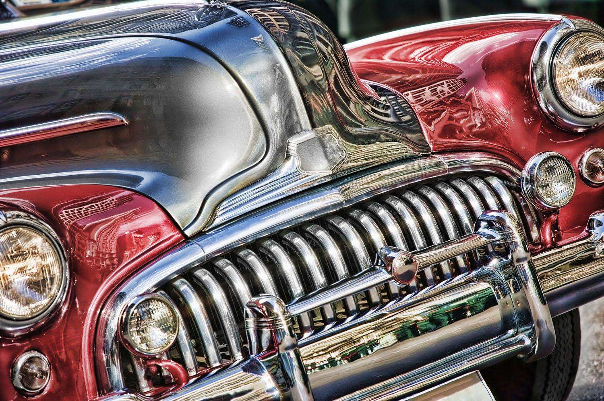

## Table of Contents

## What is a collectible car and why might it be a good investment?

A collectible car is an old car that people want to own because it is special or rare. These cars can be from a long time ago or just a few years old, but they are usually not made anymore. People like them because they remind them of the past or because they are very cool to look at and drive.

Buying a collectible car can be a good investment because its value can go up over time. If you take good care of the car and keep it in great shape, more people might want to buy it later. This can make the car worth more money than what you paid for it. Also, collecting cars can be fun and a way to meet other people who like the same thing.

## How do I start researching collectible cars for investment?

To start researching collectible cars for investment, you should first decide what kind of cars interest you. Think about the age, the brand, and the style of car that you like. Once you have an idea, you can start looking at different car models and learning about their history. Websites, car magazines, and books about classic cars are great places to begin your research. You can also join online forums or local car clubs where people talk about their favorite cars and share tips on buying and selling.

After you have a list of cars you are interested in, you need to find out how much they are worth. Look at recent sales of similar cars on auction websites or in car sale reports. This will give you an idea of the current market value. It's also important to learn about the condition of the cars. A car that is in perfect shape will be worth more than one that needs a lot of work. You can use guides like the Kelley Blue Book or the NADA Guide to help you understand the value of different cars based on their condition.

Finally, think about the future value of the cars you are looking at. Some cars become more popular over time, which can make their value go up. Talk to experts or experienced collectors to get their advice on which cars might be good investments. Remember, investing in collectible cars can be fun, but it also takes time and effort to do it right. Keep learning and stay updated on the latest trends in the car collecting world.

## What are the key factors to consider when evaluating a collectible car's investment potential?

When you want to know if a collectible car is a good investment, you should look at how rare it is. If there are not many of that car left, it might be worth more money. Also, think about if the car is popular. Some cars are loved by a lot of people because they are from a famous movie or because they are really cool to look at. The more people who want the car, the more its value might go up. Another thing to consider is the car's history. If the car has a special story or was owned by someone famous, that can make it more valuable.

You also need to check the condition of the car. A car that is in perfect shape will be worth more than one that needs a lot of repairs. Make sure to look at the car carefully and maybe get a professional to check it too. Think about how much it will cost to keep the car in good shape. Some cars need a lot of money to maintain, and that can affect how good of an investment they are. Finally, think about what might happen in the future. Some cars become more popular over time, while others might not be as wanted. Talking to people who know a lot about cars can help you guess which cars might go up in value.

## How does the condition of a collectible car affect its value?

The condition of a collectible car is very important because it can change how much the car is worth. If a car is in perfect shape, with no scratches or problems, it will be worth more money than a car that needs a lot of work. People who buy collectible cars want them to be as close to new as possible. That's why cars that have been well taken care of and kept in good condition are more valuable. A car that looks great and runs well will attract more buyers and can be sold for a higher price.

On the other hand, if a car has a lot of rust, dents, or mechanical issues, its value will go down. Fixing these problems can cost a lot of money, and not everyone wants to spend time and money on repairs. Even small things like faded paint or worn seats can make a big difference in the car's value. That's why it's important to check the car carefully and maybe even have a professional look at it before deciding if it's a good investment. The better the condition of the car, the better the investment it can be.

## What are the common pitfalls to avoid when investing in collectible cars?

When you start investing in collectible cars, one big mistake to avoid is not doing enough research. It's easy to fall in love with a car because it looks cool or reminds you of a favorite movie, but you need to know if it's a good investment. Look at how much the car is worth now and how much it might be worth in the future. Talk to people who know a lot about cars and read about them in [books](/wiki/algo-trading-books) and on websites. Not doing your homework can lead to buying a car that loses value instead of gaining it.

Another common mistake is not checking the condition of the car carefully. A car that looks good on the outside might have big problems on the inside. If you don't check everything, you might end up spending a lot of money on repairs. Always get a professional to look at the car before you buy it. They can find problems that you might miss. Also, be careful about how much you spend on fixing up a car. Sometimes, the cost of repairs can be more than the car is worth, which can make it a bad investment.

## How can I determine the authenticity and provenance of a collectible car?

To determine the authenticity of a collectible car, you need to check if it is really what the seller says it is. Start by looking at the car's VIN (Vehicle Identification Number). This number can tell you a lot about the car, like when it was made and what model it is. You can use the VIN to check records and see if the car's history matches what the seller tells you. Also, look for any original parts or stamps on the car. Sometimes, cars have special marks or labels that show they are real. If you're not sure, it's a good idea to get help from an expert who knows a lot about that type of car. They can tell if the car is authentic or if someone has tried to make it look like something it's not.

Provenance, or the history of the car, is also important. You want to know where the car has been and who has owned it. Ask the seller for any documents like old titles, service records, or photos that show the car's history. Sometimes, cars that were owned by famous people or used in movies can be worth more. You can also check public records or use online databases to see if the car's history matches what the seller says. If the seller can't give you clear proof of the car's history, be careful. It might be hard to sell the car later if you can't prove where it came from.

## What are the best strategies for buying and selling collectible cars?

When you want to buy a collectible car, start by doing a lot of research. Look at different car models and learn about their history and value. Use websites, car magazines, and talk to other collectors to find out which cars might be good investments. When you find a car you like, check its condition carefully. Look for any problems and maybe get a professional to inspect it. Make sure to check the car's authenticity and history too. Ask for documents like old titles and service records. Don't be afraid to negotiate the price. Sometimes, you can get a better deal if you talk to the seller about the price.

Selling a collectible car can be just as important as buying one. First, make sure your car is in the best shape possible. Fix any problems and keep it clean. Take good photos from different angles to show the car's condition. Write a clear description of the car, including its history and any special features. You can sell the car at an auction, through a dealership, or online. Each way has its own pros and cons. Auctions can get you a high price if there's a lot of interest, but you might have to pay fees. Dealerships can help you sell the car quickly, but they might take a big cut of the sale. Online selling can reach a lot of people, but you need to be careful about scams. Always be honest about the car's condition and history to build trust with buyers.

## How do market trends and economic factors influence collectible car values?

Market trends and economic factors can really change how much a collectible car is worth. When the economy is doing well, people have more money to spend on things they like, like fancy cars. This can make the value of collectible cars go up because more people want to buy them. Also, if a certain type of car becomes really popular, maybe because it was in a new movie or because people start liking old styles again, its value can go up too. On the other hand, if the economy is not doing well, people might not have as much money to spend on fun things, and the value of collectible cars can go down.

Sometimes, big events can also affect the value of collectible cars. For example, if there's a big car show or a famous auction, it can make people more interested in certain cars, which can increase their value. Economic factors like interest rates and inflation can also play a role. If interest rates are high, it might be harder for people to get loans to buy expensive cars, which can lower their value. But if inflation is high, some people might see collectible cars as a good way to keep their money safe, which can make the value of these cars go up.

## What role do car auctions play in the collectible car market?

Car auctions are very important in the collectible car market because they help set the prices for these cars. When a car goes up for auction, lots of people can see it and bid on it. This means the car can sell for a high price if many people want it. Auctions also show what kinds of cars are popular right now. If a certain type of car keeps selling for a lot of money at auctions, it can mean that car is a good investment. People who want to buy or sell collectible cars often watch auctions to see what's happening in the market.

Auctions can also be a good place to buy or sell a collectible car. They bring together buyers and sellers from all over the world, so you can find rare cars that might not be for sale anywhere else. But auctions can be tricky too. Sometimes, the excitement of bidding can make people pay more than they planned. Also, auctions often charge fees, which can make the total cost higher. Still, many people like using auctions because they can be a fun and exciting way to buy or sell a collectible car.

## How should I approach the restoration of a collectible car to maximize its investment value?

When you want to restore a collectible car to make it a good investment, you need to be careful about how you do it. Start by making a plan for what you want to fix. Think about which parts of the car are most important to make it look and work like new. It's a good idea to keep the car as close to its original state as possible. If you change too much, it might not be worth as much. Talk to experts who know about the kind of car you have. They can tell you what to fix and what to leave alone. Also, keep track of all the work you do and save the receipts. This can help show buyers that you took good care of the car.

Restoring a car can be expensive, so you need to think about how much you are spending. Make sure the cost of fixing the car doesn't end up being more than what the car will be worth when you're done. Sometimes, it's better to leave some small problems alone if fixing them will cost too much. When you're done restoring the car, take good photos and write down everything you did. This can make the car more attractive to buyers and help you get a better price when you sell it. Remember, the goal is to make the car look great and work well, but also to keep the cost of the restoration in line with the car's value.

## What insurance considerations are important for collectible car investors?

When you own a collectible car, getting the right insurance is really important. You need insurance that covers the full value of your car, not just what a regular car would be worth. This is called agreed value insurance. It means that if something bad happens to your car, like a crash or a fire, the insurance company will pay you the full amount you agreed on, which is usually more than what a normal car insurance would pay. You also need to think about where you keep your car. If it's in a safe place like a garage, it might be cheaper to insure. But if you drive the car a lot, the insurance might cost more because there's a higher chance of something happening to it.

Another thing to think about is what kind of coverage you need. Some insurance plans only cover the car when it's not being driven, like when it's in storage. Others cover it when you're driving it too. You need to pick the right one based on how often you drive your collectible car. Also, some insurance companies offer special coverage for things like going to car shows or taking long trips. Make sure to ask about these options. It's a good idea to talk to an insurance agent who knows about collectible cars. They can help you find the best plan for your needs and make sure your investment is protected.

## How can I build a diversified portfolio of collectible cars to manage risk?

To build a diversified portfolio of collectible cars, you should spread your money across different types of cars. This means buying cars from different times, like some from the 1950s, some from the 1970s, and some newer ones. You should also look at cars from different brands and countries. For example, you could have a mix of American muscle cars, European sports cars, and Japanese classics. This way, if one type of car goes down in value, the others might stay the same or even go up, which helps to manage your risk.

Another important thing is to consider the condition and rarity of the cars you buy. Some cars might be in perfect shape and very rare, while others might need some work but are still valuable. By having a mix of cars in different conditions, you can balance the costs of fixing them up with the potential for high returns. Also, think about how much you want to spend on each car. Don't put all your money into one expensive car. Instead, spread it out so that if something happens to one car, it won't hurt your whole collection. This way, you can enjoy your hobby and still feel safe about your investment.

## References & Further Reading

[1]: Gourvish, T. R. (2011). ["The British Motor Industry, 1896-1939"](https://archive.org/details/britishmotorindu0000rich). Cambridge University Press.

[2]: Erlanger, L. (1998). ["The Collector's Guide to Antique Automobiles."](https://www.sothebys.com/en/articles/collectors-couch-how-do-we-attach-value-to-the-things-we-collect) Krause Publications.

[3]: Viljoen, J. H. (2020). ["Classic Car Investment Manual: Discover the Top 40 Fast Appreciating Classic Cars and How to Invest in Them."](https://www.texilajournal.com/public-health/article/2829-predictors-of-unsuppressed) Independently published.

[4]: Dholakia, Nikilesh (2018). ["Big Data and Predictive Business Analytics."](https://scholar.google.com/citations?user=DQQJdb8AAAAJ&hl=en) Routledge.

[5]: Carosso, V. P. (1970). ["Investment Banking in America."](https://archive.org/details/investmentbankin0000caro) Harvard University Press. 

[6]: Vigna, P. & Casey, M. J. (2016). ["The Age of Cryptocurrency: How Bitcoin and Digital Money are Challenging the Global Economic Order."](https://archive.org/details/ageofcryptocurre0000vign) St. Martin's Press.