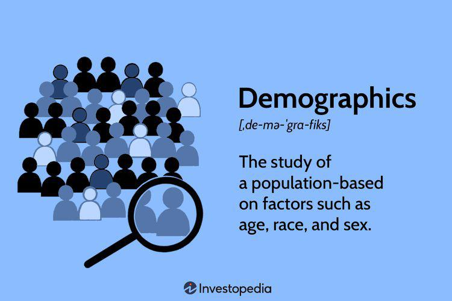

In the modern world of finance and technology, data analysis has become more critical than ever, particularly in areas such as demographic data collection and algorithmic trading. These components form a vital part of strategic decision-making processes within businesses and financial markets, as they provide valuable insights that inform various operational and investment strategies.

Demographic data refers to information regarding the characteristics of a population. It includes variables such as age, gender, income, and education level. This data is crucial for governments and businesses alike, enabling them to tailor public policies and marketing strategies effectively. By understanding demographic trends, organizations can predict consumer behavior, identify emerging markets, and address potential challenges with precision.



Meanwhile, algorithmic trading harnesses the power of computer algorithms to automate trading activities, allowing for swift and efficient execution beyond human capabilities. This trading method integrates elements of data science and technology to analyze extensive datasets, making it possible to identify patterns and trends that inform trading decisions. Algorithmic trading utilizes not only market data but also incorporates demographic insights, creating more holistic strategies for investors.

This article will explore how demographic data collection and algorithmic trading intersect, providing an in-depth analysis of their contributions to more informed and strategic decisions in both business and financial contexts. By examining the processes involved in data collection, the functionality of algorithmic trading, and the ethical considerations surrounding these practices, we will shed light on how these data-driven approaches are reshaping the economic landscape. As technology advances, the integration of demographic data and algorithmic models will continue to evolve, offering further opportunities for strategic enhancement in varied sectors.

## Table of Contents

## Understanding Demographic Data

Demographics are the statistical characteristics of populations, essential for understanding the dynamics of different groups within a society. Core demographic variables include age, gender, income, education level, and more. These factors are pivotal in shaping the socio-economic profiles of populations, influencing everything from consumer behavior to voting patterns.

Governments heavily rely on demographic data to frame effective public policies. For example, data on age distribution can guide the allocation of resources for education or retirement schemes. Similarly, understanding income levels across various regions helps in planning economic support systems and infrastructure developments.

Businesses, on the other hand, use demographic insights to fine-tune marketing and product development strategies. By understanding the demographic profile of their target audience, companies can craft personalized marketing campaigns, design products that meet specific needs, and determine optimal locations for new outlets. This data allows marketers to predict trends and consumer behaviors, enabling more effective segmentation and targeting.

Technological advancements have transformed the ways demographic data is collected and analyzed. Traditional methods like surveys and censuses are now complemented by digital data collection techniques, such as social media analytics and transaction records. This shift has made demographic data more precise and comprehensive, providing deeper insights into human behaviors and preferences.

The integration of various data sources allows for the generation of granular demographic insights. For instance, geolocation data gathered from mobile phones can offer detailed information about commuting patterns, while online purchase history may reveal shifts in consumer spending habits. These insights are invaluable for businesses and governments aiming to anticipate trends and respond to the changing needs of populations effectively.

In summary, demographic data is foundational in driving informed decisions in both public and private sectors. Its comprehensive analysis has become crucial for strategic planning and forecasting in today’s data-driven world, enabled significantly by technological advancements in data collection and processing.

## The Process of Data Collection and Analysis

Data collection involves gathering information from various sources to inform analysis and enable making educated predictions. For demographic data, this process includes leveraging surveys, census information, and digital data accumulated through platforms and services.

Surveys constitute a traditional yet effective method for collecting demographic information. They can be conducted through various media, including face-to-face interviews, telephone calls, online questionnaires, and mail. Each method has its strengths and weaknesses; for instance, online surveys can reach a large audience quickly but may face issues with sampling bias due to internet accessibility constraints.

Census data represents one of the most comprehensive forms of demographic data collection. Governments conduct censuses periodically to gather data on the age, gender, income level, education, and other vital [statistics](/wiki/bayesian-statistics) of populations. This data is pivotal for developing public policies and has applications in business strategy, allowing companies to tailor their marketing efforts to specific demographic segments.

Digital data gathering through platforms and services is becoming increasingly prominent. With the proliferation of smartphones, social media, and other online platforms, an unprecedented amount of demographic data is generated. This data can include users' location, browsing habits, purchase history, and social interactions. Companies and researchers can use this information to obtain more granular insights into demographic trends and behavior patterns.

Once data is collected, rigorous analysis is essential to extract valuable insights. Data analysis applies statistical and computational techniques to interpret data sets, identify patterns, and discern meaningful information. This could involve basic descriptive statistics or more complex inferential models and [machine learning](/wiki/machine-learning) algorithms, depending on the scope and objectives of the analysis.

Understanding consumer behavior is a crucial outcome of demographic data analysis. By examining various demographic factors, businesses can predict market trends and identify potential growth or risk areas. For instance, if data analysis reveals a growing young adult population in a region with increasing disposable income, businesses may decide to target this segment with new product lines or marketing strategies.

Overall, the intricate process of collecting and analyzing demographic data provides vital insights into consumer behavior and market dynamics. These insights aid in making informed strategic decisions that can lead to enhanced business outcomes and targeted public policies.

 to Algorithmic Trading

Algorithmic trading refers to the use of computer programs and algorithms to [carry](/wiki/carry-trading) out trading activities autonomously, significantly improving the speed, accuracy, and efficiency of transactions over traditional human methods. This automated trading approach harnesses the extensive capabilities of data science and technology, allowing for the rapid processing and analysis of vast datasets to inform trading decisions.

Algorithms employed in trading typically analyze numerous market variables, identifying patterns and executing trades at speeds that are unattainable for human traders. Such algorithms may be based on complex mathematical models and conditions, facilitating the precise execution of orders according to predefined criteria, such as timing, price, or [volume](/wiki/volume-trading-strategy). This approach not only enhances transactional efficiency but also allows traders to exploit market inefficiencies with reduced human intervention, minimizing the impact of emotions on trading decisions.

A key advantage of [algorithmic trading](/wiki/algorithmic-trading) is its ability to incorporate diverse data sources, including financial metrics, macroeconomic indicators, and socio-economic data, such as demographic insights. By integrating demographic data, algorithms can predict market trends and consumer behavior, refining the trading strategies employed. For instance, demographic trends revealing an increase in consumption among a specific age group can lead to informed investment decisions in associated industries.

In practice, algorithmic trading systems often employ techniques from [artificial intelligence](/wiki/ai-artificial-intelligence) and machine learning to further refine their models. Techniques such as sentiment analysis can assess social media platforms or news articles for market mood, impacting trading strategies. Python, a dominant language in data science due to its extensive libraries and ease of use, is commonly used for developing such algorithms. A basic Python example for a simple mean-reversion strategy might involve using libraries like NumPy for calculations and pandas for handling data:

```python
import numpy as np
import pandas as pd

# Sample data representing historical stock prices
data = pd.Series([100, 102, 101, 105, 110, 108, 107, 111, 115])

def mean_reversion_strategy(prices, window=5):
    rolling_mean = prices.rolling(window=window).mean()
    signals = (prices - rolling_mean).apply(lambda x: 'buy' if x < 0 else 'sell')
    return signals

signals = mean_reversion_strategy(data)
print(signals)
```

This code calculates a rolling mean over a specified window of historical stock prices and recommends buying or selling depending on whether the current price is below or above the calculated mean, exemplifying the fundamental operations of a simple algorithmic trading strategy.

As algorithmic trading continues to evolve, its reliance on data-driven strategies underscores the crucial role of advanced data analytics in shaping the future of financial trading. With the ceaseless growth of data sources and analytical techniques, algorithmic trading remains at the forefront of leveraging technological advancements for strategic market participation.

## Utilizing Demographic Data in Algorithmic Trading

Algorithmic traders employ demographic data as a critical tool to enhance the prediction of market trends and consumer spending patterns. By analyzing demographic information—such as age, gender, income, and education—traders can tailor their strategies to be more responsive to specific population characteristics. This strategic approach enables traders to choose stocks from industries that align with demographic groups likely to increase their spending or investment.

Demographic data helps in identifying target markets and understanding consumer behavior. For instance, an aging population might lead to a rise in healthcare and retirement service industries, prompting traders to focus on stocks within these sectors. Conversely, a younger demographic with increasing income may boost sectors like technology and consumer electronics.

Additionally, demographic data facilitates sentiment analysis, which can refine trading algorithms. Sentiment analysis involves assessing the emotional tone behind people's reactions and opinions, often through social media, news outlets, and other digital communication platforms. By incorporating demographic inputs, traders can adjust sentiment models to capture more nuanced insights. For example, if a particular age group exhibits increased positivity about a technology innovation, sentiment analysis can enhance algorithmic trading decisions related to tech stocks.

Modern algorithms often integrate machine learning techniques to process and interpret large volumes of demographic data. The use of such advanced methods allows for the continuous adaptation of trading strategies in response to the ever-changing socio-economic landscape. For instance, algorithms can be programmed to dynamically update trading signals if significant demographic shifts are detected through consistent data monitoring.

In Python, a simple algorithmic trading model incorporating demographic insights can be illustrated as follows:

```python
import numpy as np
import pandas as pd
from sklearn.linear_model import LinearRegression

# Synthetic demographic data and stock prices
demographics = pd.DataFrame({
    'age': np.random.randint(18, 70, size=100),
    'income': np.random.randint(20000, 100000, size=100)
})

stock_prices = np.random.rand(100) * 100

# Predictor variables
X = demographics[['age', 'income']]
# Target variable
y = stock_prices

# Linear regression model
model = LinearRegression()
model.fit(X, y)

# Predicting stock prices based on demographic data
predicted_prices = model.predict(X)
print(predicted_prices)
```

This example demonstrates how demographic factors such as age and income could be integrated into a linear regression model to predict stock prices. Although simplified, it highlights the potential for using demographic data in making informed trading decisions.

Leveraging demographic data not only assists in predicting economic trends but also creates a framework within which tailored investment strategies can be devised. As the availability and granularity of demographic data continue to improve, its application within algorithmic trading will likely expand, offering traders a more sophisticated means to navigate financial markets.

## Case Studies and Real-World Applications

Leading quantitative hedge funds such as Renaissance Technologies exemplify the effective use of demographic data in algorithmic trading. This [hedge fund](/wiki/hedge-fund-trading-strategies), renowned for employing complex mathematical models and extensive data analysis, utilizes demographic data to enhance its trade algorithms. By analyzing population trends, income shifts, and consumer behavior patterns, Renaissance Technologies can refine their models to predict market movements with greater accuracy. For example, shifts in median age or education levels in certain geographical areas could signal potential changes in market demand, which the firm might incorporate into its trading strategy.

Retail brokers have also begun adopting similar strategies, providing individual investors with AI-powered tools that leverage demographic insights. These tools often include sophisticated algorithms that process vast amounts of demographic data, enabling users to identify trends and make informed investment decisions. By analyzing factors such as age distribution, gender, and income levels across regions, these tools can help investors tailor their strategies to better align with predicted market shifts. 

For instance, a broker might offer a dashboard showing demographic shifts in urban areas, which could inform an investor's decision to buy into real estate or retail stocks expected to benefit from an influx of younger residents. Through this approach, individual investors can harness the power of algorithms that were once the exclusive domain of large institutional traders.

A practical example of this is the use of sentiment analysis, which combines demographic data with real-time information from social media and online platforms to gauge public opinion about certain products or services. By analyzing posts and reviews, algorithms can classify sentiment as positive, negative, or neutral, often enriched with demographic metadata. These insights might predict a stock's performance based on current public sentiment trends.

The application of demographic data in trading goes beyond individual strategies and impacts broader market dynamics. As algorithms become more adept at processing demographic information, the feedback loop between data analysis and trading decisions tightens. This continuous adaptation and refinement of trading strategies enhance the overall efficiency and responsiveness of markets.

Overall, demographic data provides a valuable stream of information that, when integrated with algorithmic trading, can offer a significant advantage. This integration aids in predicting market trends, optimizing algorithms, and ultimately shaping market strategies, demonstrating the profound influence of data-driven insights on contemporary financial markets.

## Ethical Considerations

Handling demographic data involves significant ethical responsibilities, primarily concerning privacy and potential biases. Ensuring adherence to data protection regulations, like the General Data Protection Regulation (GDPR) in the European Union, is crucial. GDPR, established in 2018, is designed to protect individuals' personal data with principles such as lawfulness, fairness, transparency, purpose limitation, and data minimization. Non-compliance with these regulations can result in substantial fines and loss of public trust.

Privacy concerns arise as demographic data often contain personally identifiable information (PII), which, if mishandled, can be exploited maliciously. Organizations must employ robust data anonymization techniques to ensure that individuals cannot be discerned from datasets. For instance, k-anonymity is a common method to prevent re-identification by ensuring each person is indistinguishable from at least k-1 other individuals in the dataset.

Moreover, biases in demographic data can lead to unethical outcomes. Bias may be introduced inadvertently during data collection, stemming from non-representative samples or prejudiced societal structures that skew the data. Algorithmic trading decisions based on biased data could exacerbate financial inequalities by disproportionately affecting certain demographics.

To mitigate these biases, organizations should implement fairness metrics in their data analytics processes. Techniques like equalized odds and demographic parity can help in evaluating and adjusting the fairness of algorithmic decisions. In Python, libraries such as Fairlearn can assist in quantifying and addressing bias in machine learning models:

```python
from fairlearn.metrics import MetricFrame, selection_rate
from sklearn.metrics import accuracy_score

# Assuming 'y_true', 'y_pred', and 'sensitive_features' are predefined
mf = MetricFrame(metrics=accuracy_score,
                 y_true=y_true,
                 y_pred=y_pred,
                 sensitive_features=sensitive_features)

print(mf.overall)
print(mf.by_group)
```

Finally, transparency and accountability are vital in the ethical management of demographic data. Organizations should maintain clear documentation regarding data collection methods, algorithm development, and the decision-making process. Regular audits by independent bodies can ensure compliance and foster trust among stakeholders. By integrating these practices, businesses can ethically harness demographic data for algorithmic trading, aligning their operations with both legal standards and societal values.

## Conclusion

Demographic data analysis and algorithmic trading together form a compelling synergy, fusing extensive datasets with cutting-edge technology to transform decision-making processes in finance and business. By comprehensively understanding and leveraging demographic trends, organizations gain a competitive advantage, allowing for the refinement of strategies aimed at targeting specific consumer markets, optimizing resource allocation, and predicting economic shifts. For instance, demographic data provide insights into age distribution, income levels, and education, which can be pivotal in determining investment opportunities in sectors aligned with particular population characteristics.

In the financial sector, the integration of demographic analysis into algorithmic trading has proved invaluable, enabling traders to make data-driven predictions on market movements and consumer behavior. This approach facilitates the development of advanced trading algorithms capable of adapting to the dynamic market environment, thus optimizing trade execution and enhancing profitability.

However, this progression also brings with it substantial ethical considerations. With the continuous advancement of technology, ensuring compliance with data protection regulations, such as the General Data Protection Regulation (GDPR), becomes a crucial aspect of data management. Safeguarding individual privacy and mitigating potential biases inherent in demographic data analysis are imperative steps in maintaining the integrity of these practices.

As this landscape continues to evolve, addressing these ethical concerns alongside rigorous regulatory compliance will be essential. This approach will not only protect individual rights but also bolster public trust, ensuring that the intersection of demographic analysis and algorithmic trading is navigated responsibly and effectively.

## References & Further Reading

[1]: Bergstra, J., Bardenet, R., Bengio, Y., & Kégl, B. (2011). ["Algorithms for Hyper-Parameter Optimization."](https://papers.nips.cc/paper/4443-algorithms-for-hyper-parameter-optimization) Advances in Neural Information Processing Systems 24.

[2]: ["Advances in Financial Machine Learning"](https://www.amazon.com/Advances-Financial-Machine-Learning-Marcos/dp/1119482089) by Marcos Lopez de Prado

[3]: ["Evidence-Based Technical Analysis: Applying the Scientific Method and Statistical Inference to Trading Signals"](https://www.amazon.com/Evidence-Based-Technical-Analysis-Scientific-Statistical/dp/0470008741) by David Aronson

[4]: ["Machine Learning for Algorithmic Trading"](https://github.com/stefan-jansen/machine-learning-for-trading) by Stefan Jansen

[5]: ["Quantitative Trading: How to Build Your Own Algorithmic Trading Business"](https://www.amazon.com/Quantitative-Trading-Build-Algorithmic-Business/dp/1119800064) by Ernest P. Chan