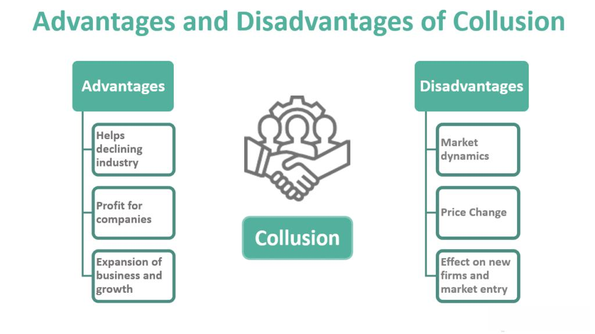

## Table of Contents

## What is collusion and how is it defined in legal terms?

Collusion is when two or more people or companies secretly work together to cheat or do something illegal, usually to gain an advantage over others. This can happen in many areas, like business, sports, or politics. For example, in business, companies might collude to fix prices, which means they agree to keep prices high instead of competing fairly.

In legal terms, collusion is often considered a serious offense. It is defined as an agreement between two or more parties to commit fraud or deceive others. This can lead to legal action, fines, and even jail time for those involved. Laws against collusion are in place to protect fair competition and ensure that everyone plays by the same rules.

## What are some common examples of collusion in business?

One common example of collusion in business is price fixing. This happens when companies that should be competing against each other secretly agree to set their prices at the same level. By doing this, they can keep prices higher than they would be if they were truly competing. This hurts consumers because they end up paying more for products or services. A famous case of price fixing was when several companies that made electronic components agreed to keep their prices high, which led to big fines when they got caught.

Another example is bid rigging, which often happens in the construction industry or when governments are buying things. In bid rigging, companies that want to win a contract agree in secret on who will submit the lowest bid. They might take turns winning contracts or agree to not bid against each other at all. This means the person or government giving out the contract doesn't get the best deal, and it's not fair to other companies that aren't part of the collusion. A well-known case involved construction companies rigging bids for public projects, which led to legal action and penalties.

## How does collusion affect market competition and consumers?

Collusion hurts market competition because it stops companies from trying to beat each other. When companies work together secretly, they don't need to lower their prices or make their products better to attract customers. Instead, they can keep prices high and share the profits. This means new companies find it hard to enter the market because they can't compete with the high prices set by the colluding companies. Over time, this can lead to fewer choices for consumers and a market that doesn't grow or innovate as much as it should.

For consumers, collusion means they end up paying more for products and services. When companies agree to keep prices high, people don't get the benefit of lower prices that come from fair competition. This can be tough on people's wallets, especially if they need to buy things that are essential, like food or medicine. Also, because companies aren't trying to outdo each other, consumers might not get new and better products as often. In the end, collusion makes the market less fair and can make life harder for everyone who shops in that market.

## What are the different types of collusion, such as explicit and tacit collusion?

There are two main types of collusion: explicit collusion and tacit collusion. Explicit collusion happens when companies openly agree to work together to do something illegal, like fixing prices or rigging bids. They might have secret meetings or make secret deals. This type of collusion is easier to catch because there's clear evidence of the agreement. It's also more likely to be punished harshly because it's a direct violation of competition laws.

Tacit collusion, on the other hand, is when companies don't have a clear agreement, but they still act in a way that helps them all. They might watch each other's prices and match them without ever talking about it. This kind of collusion is harder to prove because there's no direct evidence of an agreement. It can still hurt competition and raise prices for consumers, but it's trickier for regulators to stop because it's more subtle.

## Can you provide historical examples of major collusion cases?

One famous case of collusion happened in the 1990s with the Archer Daniels Midland (ADM) company. ADM and other companies that made lysine, a food additive, got caught fixing prices. They had secret meetings where they agreed to keep lysine prices high. This made food more expensive for people. When they got caught, ADM had to pay a huge fine of $100 million, and some of their top executives went to jail. This case showed how big companies can secretly work together to make more money at the expense of regular people.

Another big case of collusion was with the OPEC oil cartel. OPEC stands for Organization of the Petroleum Exporting Countries. These countries, like Saudi Arabia and Venezuela, agreed to control how much oil they produced to keep oil prices high. This affected the price of gas and other things people need. OPEC's actions have been controversial because they can make life harder for people in countries that need to buy oil. While OPEC's actions are not always illegal, they show how countries can work together to influence global markets and affect everyday life.

A more recent example is the case against major banks like JPMorgan Chase and Citigroup. These banks were found to have colluded to manipulate the foreign exchange market. They shared information and worked together to affect currency prices, which hurt people and businesses that needed to trade money. The banks had to pay big fines, showing that even huge financial institutions can break the rules and work together in ways that are unfair to others.

## What are the legal consequences of engaging in collusion?

When people or companies engage in collusion, they can face serious legal consequences. These consequences can include big fines that can cost a lot of money. The fines are meant to punish the companies and to stop others from doing the same thing. Sometimes, the fines can be so big that they can even put a company out of business. Besides fines, the people involved in the collusion, like company leaders, can go to jail. This means they could spend time in prison for breaking the law.

Also, companies caught colluding might have to pay back the money they made from their illegal actions. This is called restitution, and it's meant to make things right for the people who were hurt by the collusion. On top of that, the company's reputation can be damaged, which can make it hard for them to do business in the future. Customers and other businesses might not want to work with them anymore. All these consequences are there to make sure that companies follow the rules and compete fairly.

## How do antitrust laws help prevent collusion?

Antitrust laws are rules made by governments to stop companies from working together in ways that hurt competition. These laws make it illegal for companies to collude, like fixing prices or rigging bids. By having these laws, governments can keep markets fair and make sure companies compete with each other instead of secretly working together. If companies break these laws, they can get into big trouble, like having to pay huge fines or even going to jail. This makes companies think twice before trying to collude.

To enforce antitrust laws, governments have special agencies that watch over businesses and look for signs of collusion. If they find evidence that companies are breaking the rules, they can start investigations and take the companies to court. These agencies also work to educate businesses about what is and isn't allowed, so companies know the risks of colluding. By keeping a close eye on the market and punishing those who break the rules, antitrust laws help protect consumers and make sure they get the benefits of fair competition, like lower prices and better products.

## What role do regulatory bodies play in detecting and preventing collusion?

Regulatory bodies are like watchdogs that keep an eye on businesses to make sure they play fair. They look for signs that companies might be colluding, like fixing prices or rigging bids. These bodies use different tools to catch companies that break the rules. They might look at price changes that don't make sense, talk to people inside the companies, or use secret information to find out what's going on. If they find proof of collusion, they can start an investigation and take the companies to court.

Once regulatory bodies find evidence of collusion, they can take strong actions to stop it. They can make companies pay big fines, which can hurt the company's wallet and show other businesses that breaking the rules is not worth it. Sometimes, the people running the companies can go to jail if they were part of the collusion. By doing all this, regulatory bodies help keep the market fair and make sure that companies compete honestly. This is good for everyone because it helps keep prices down and gives people better choices when they shop.

## What are some effective strategies businesses can implement to avoid collusion?

Businesses can avoid getting into trouble with collusion by making sure they understand and follow the rules about competition. They should have clear policies that tell everyone in the company what they can and can't do. It's important to train employees about these rules so they know how to act the right way. Companies should also set up ways to report any suspicious behavior without being scared of getting in trouble themselves. This helps catch any problems early before they get worse.

Another good strategy is to keep good records of all business dealings, especially when it comes to pricing and bidding. This way, if someone ever questions what the company did, they can show clear proof that they followed the rules. Businesses should also be careful about talking to competitors. They should avoid sharing sensitive information that could lead to collusion. By staying open and honest in their business practices, companies can stay out of legal trouble and keep the market fair for everyone.

## How can technology and data analytics be used to detect collusion?

Technology and data analytics can be really helpful in finding out if companies are colluding. Computers can look at a lot of information quickly and find patterns that might show companies are working together in secret. For example, they can check if prices from different companies go up and down at the same time in a way that doesn't make sense. They can also look at emails and messages to see if people from different companies are talking about things they shouldn't, like agreeing on prices.

Using technology like this helps people who watch over businesses, like government agencies, do their job better. They can use special software to spot strange things in the market that might mean companies are colluding. By keeping an eye on how companies behave and using data to find clues, these agencies can catch companies that are breaking the rules and stop them from hurting competition and making prices higher for everyone.

## What are the challenges in proving collusion in court?

Proving collusion in court can be really hard. One big challenge is finding clear evidence that shows companies made a secret deal. Often, the people involved in collusion try to hide what they're doing, so they don't leave behind easy-to-find proof. They might use secret meetings or coded messages, which makes it tough for lawyers to show that a deal actually happened. Also, companies can say they just happened to do the same thing at the same time by chance, which can make it even harder to prove they were working together on purpose.

Another challenge is showing that the collusion hurt competition and consumers. Even if you can prove that companies talked about working together, you still need to show that their actions made prices higher or stopped other companies from competing fairly. This can involve a lot of complicated math and economics to explain how the market was affected. Judges and juries might not always understand these complex ideas, so it can be difficult to convince them that the collusion was a big problem.

## What future trends might impact the prevention and detection of collusion?

In the future, technology will play a bigger role in stopping and finding collusion. Computers and data analytics will get even better at looking at huge amounts of information to spot strange patterns that might mean companies are working together in secret. New tools like [artificial intelligence](/wiki/ai-artificial-intelligence) could help find hidden messages or secret deals faster than ever before. This will make it easier for people who watch over businesses to catch companies that are breaking the rules and stop them before they can hurt competition and raise prices for everyone.

Another trend that might change how we prevent and detect collusion is more international cooperation. As businesses work more across different countries, it will be important for governments around the world to work together to stop collusion. They might share information and help each other with investigations. This could make it harder for companies to hide their secret deals, no matter where they are. By working together, countries can make sure that markets stay fair and that consumers everywhere get the benefits of honest competition.

## References & Further Reading

[1]: Aldridge, I. (2013). ["High-Frequency Trading: A Practical Guide to Algorithmic Strategies and Trading Systems (Wiley Trading)."](https://books.google.com/books/about/High_Frequency_Trading.html?id=8QpIsVUMhmEC) John Wiley & Sons.

[2]: Lopez de Prado, M. (2018). ["Advances in Financial Machine Learning."](https://www.amazon.com/Advances-Financial-Machine-Learning-Marcos/dp/1119482089) Wiley.

[3]: Johnson, B. (2010). ["Algorithmic Trading & DMA: An Introduction to Direct Access Trading Strategies."](https://archive.org/details/algorithmictradi0000john) 4Myeloma Press.

[4]: Woolley, P. (2012). ["The Future of Investing in Algorithmic Trading."](http://idei.fr/sites/default/files/IDEI/documents/pw/hft_financial_world.pdf) Routledge.

[5]: Financial Conduct Authority. (2020). ["Algorithmic Trading Compliance in Wholesale Markets."](https://www.fca.org.uk/publication/multi-firm-reviews/algorithmic-trading-compliance-wholesale-markets.pdf)