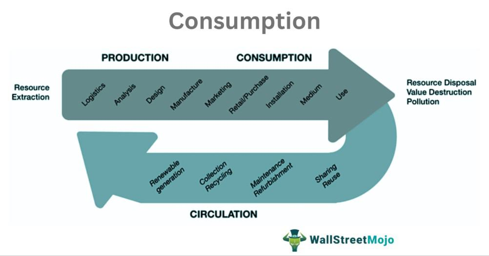

In the world of trading, interpreting trends and making informed decisions is crucial for success. Traders rely on a multitude of tools and strategies to navigate the complex and often volatile markets effectively. Among these, color theory and symbolism play a unique and intriguing role, offering a new dimension to traditional and algorithmic trading strategies. 

Color theory in trading revolves around the use of color-coded systems for data representation and decision-making. These visual cues allow traders to analyze complex datasets swiftly and accurately. For instance, green and red are commonly used colors in trading platforms to represent positive and negative movements, respectively. This intuitive application of color not only aids in quick data interpretation but also influences trader psychology and decision-making processes.



This article explores how color theory applies to trading, providing examples of its implementation across various platforms and its symbolic meanings within the context of trading. We will analyze how these color-coded methodologies are used to create visual representations like candlestick charts and heat maps, which simplify the trading process and enhance efficiency. Furthermore, we'll examine the intersection of color with algorithmic trading, demonstrating how it supports and augments decision-making through systematically programmed responses to color signals.

Ultimately, this introduction sets the stage for a comprehensive exploration of the fusion of art and science in modern trading strategies. By understanding the impact and application of color theory and symbolism in trading, market participants can enhance their analytical capabilities and refine their trading strategies, paving the way for more informed and intuitive decision-making.

## Table of Contents

## Understanding Color Theory in Trading

Color theory in trading involves using color-coded indicators to facilitate visual analysis, allowing traders to interpret complex data more efficiently. In financial markets, colors serve as intuitive signals that can convey information swiftly. Green and red are the most commonly used colors in trading—green typically indicates upward movement or positive trends, while red denotes downward trends or negative signals. 

The use of color-coded signals simplifies the data interpretation process, enabling traders to make quicker and more informed decisions. For example, a green-colored candlestick on a chart might signal to a trader that the market is trending upwards, providing a visual cue to consider buying. Conversely, a red candlestick could suggest a downward trend, prompting caution or selling.

These visual cues help traders to quickly identify patterns and trends without needing to delve deeply into numerical data continually. By incorporating color theory into trading strategies, individuals can effectively enhance their ability to read and react to market signals.

Understanding color theory also extends to using various tools like moving averages and oscillators, where different colors may be used to highlight entry and [exit](/wiki/exit-strategy) points or to differentiate between various asset classes or trading signals.

Overall, integrating color theory into trading practices not only speeds up decision-making processes but also enhances the accuracy with which traders can interpret market data, ultimately supporting more effective trading strategies.

## Examples of Color Theory Application

Candlestick charts, heat maps, and technical indicators illustrate the application of color theory in trading, providing traders with visual tools to enhance their decision-making process.

Candlestick charts are pivotal in technical analysis, displaying price movements over a specified time frame. Each candlestick typically consists of a body and wicks, representing the opening, closing, high, and low prices. In this context, color plays a significant role: green candlesticks usually indicate an upward price movement, closing higher than the opening price, while red candlesticks signify a price decrease, closing lower than the opening. This color coding enables traders to quickly identify market trends and potential reversals, offering a visual cue for understanding market dynamics.

Heat maps present another effective application of color theory, offering a comprehensive overview of market performance. By displaying data in a color gradient format, heat maps allow traders to assess the intensity of market movements swiftly. Typically, warmer colors like red or orange are used to depict sectors or stocks experiencing significant drops, whereas cooler colors like green or blue indicate upward movements or gains. This color-based representation helps traders instantly spot outperforming or underperforming areas, facilitating quicker decision-making and strategic planning.

Technical indicators also employ color-coded signals to provide clarity on potential trends and market conditions. Many traders rely on indicators such as moving averages, Relative Strength Index (RSI), and Moving Average Convergence Divergence (MACD) to inform their strategies. These indicators often utilize colors to signify various states or signals—for instance, MACD might employ different colors to show a crossover or diverging signals, offering traders instant visual confirmation of market shifts. 

By simplifying complex data, color theory applications make the trading process more intuitive, particularly for beginners who may find numerical data overwhelming. The ability to gauge market conditions at a glance through color-coded tools not only saves time but also enhances the trader's ability to react promptly to volatile markets. Thus, color theory remains an invaluable asset in the toolkit of traders seeking efficient and effective market insights.

## Color Symbolism and Its Role in Trading

Colors evoke psychological responses that can significantly impact trading behavior. The symbolism inherent in colors is not just a matter of aesthetics but serves as a powerful tool in financial markets. Understanding these symbolic meanings helps traders interpret market signals beyond the numerical data, incorporating psychological cues that assist in their decision-making processes.

Green is a predominant color in trading, often associated with growth, prosperity, and the notion of moving forward. This positive connotation makes green a symbol of optimism and upward trends in market charts. For instance, in candlestick charts, a green candle typically indicates that the closing price was higher than the opening price, signaling bullish behavior. This visualization aligns with the psychological effect of green, encouraging traders to perceive market movements with positivity and action.

Conversely, red symbolizes caution and decline. It can indicate a decrease in value or a potential reversal of trends. When traders see red on their screens, particularly through red candlesticks or heat maps, it often signifies that the closing price was lower than the opening price. This can evoke a sense of urgency or alertness, prompting traders to adopt defensive strategies. The widespread use of red to denote warning or danger in everyday contexts reinforces its application in trading environments, where it serves as a reminder to tread carefully.

These color associations can influence trader sentiment and decision-making. Colors act as psychological triggers, impacting emotional responses that are crucial during trading. For instance, excessive exposure to red indicators might induce anxiety or panic, leading to hasty decisions. Conversely, an abundance of green might lead to overconfidence and heightened risk-taking.

Recognizing color symbolism adds a psychological layer to technical analysis by allowing traders to grasp emotional undercurrents in the market. It encourages traders to consider not only the data but also the emotional and psychological dynamics at play. By integrating color symbolism into their analytical toolkit, traders can achieve a more holistic understanding of market conditions, combining technical indicators with human psychological insights.

## Integrating Color Theory with Algorithmic Trading

Algorithmic trading has increasingly integrated color-coded strategies to enhance decision-making efficacy. By programming automated systems to recognize and respond to color signals, traders can systematically capitalize on color-based indicators. The use of color theory in [algorithmic trading](/wiki/algorithmic-trading) combines the precision of scientific analysis with the intuitive insights offered by art.

### Color Signals in Algorithmic Trading

Color signals in trading charts, such as candlestick patterns, heat maps, and moving averages, provide a visual shorthand that can quickly convey market conditions or shift in trends. Algorithmic systems use color recognition to identify these visual patterns, enabling rapid responses to market changes without human intervention.

For example, a Python-based trading algorithm can be programmed to execute buy or sell orders based on the presence of specific color patterns in candlestick charts. Consider the following pseudocode, which demonstrates a simple implementation for recognizing color patterns:

```python
def trade_decision(candlestick_data):
    # Assume each data point includes 'color', 'open', 'close'

    for data in candlestick_data:
        if data['color'] == 'green' and data['close'] > data['open']:
            execute_trade('buy')
        elif data['color'] == 'red' and data['close'] < data['open']:
            execute_trade('sell')

def execute_trade(action):
    print(f"Executing {action} trade")
```
This approach illustrates how algorithms can execute trades based on predefined color criteria, providing a systematic and unbiased method of interpreting market data.

### Systematic Approach to Color-Based Indicators

Integrating color theory with algorithmic trading offers a structured methodology to utilize color indicators effectively. Traders establish rules where the algorithmic system monitors specific color patterns and executes trades accordingly, ensuring consistency and minimizing emotional biases that can influence manual trading decisions.

By recognizing color patterns, such as red indicating potential downtrends or green suggesting uptrends, algorithmic systems enhance the accuracy and speed of market analysis. This capability supports more informed trading strategies and can be particularly advantageous in high-frequency trading environments. 

### Enhancing Decision-Making

Integrating color theory into algorithmic trading augments both human and automated trading processes. Human traders benefit more intuitive data presentations, facilitating quicker recognition of relevant market patterns. Meanwhile, algorithms leverage color indicators to refine decision-making processes, reducing reaction times and enhancing the precision of trades.

In summary, the fusion of color theory with algorithmic trading underscores the convergence of artistic insights with technical rigor. This synthesis not only optimizes trading efficiency but also broadens the scope of analytical tools available to traders, providing an enriched platform for market assessment and strategy execution.

## Benefits and Limitations of Color-Based Trading

Color-based trading offers significant advantages and a few limitations that traders should be mindful of to optimize their strategies. One of the primary benefits of using color-coded indicators is the simplification of complex data. By presenting information visually, traders can quickly grasp market trends and potential opportunities, reducing the time spent on analysis. This expedited decision-making process is particularly beneficial in fast-paced trading environments where timely actions can be crucial.

The use of colors in trading also aids in emotional management. Psychologically, colors can evoke specific responses—green typically induces a sense of growth and optimism, while red often signals caution or decline. These visual cues help traders manage stress and maintain a clear focus, potentially leading to better trading outcomes. The visual clarity provided by color codes can prevent emotional overreactions to market fluctuations, promoting consistency in trading behavior.

Despite these benefits, there are inherent limitations tied to color-based trading. One significant risk is the possibility of over-relying on color signals, which might lead to neglecting fundamental analyses. While colors can efficiently highlight trends, they do not provide the comprehensive insight offered by [fundamental analysis](/wiki/fundamental-analysis), which considers financial statements, market conditions, and economic data. Therefore, traders are advised to use color-coded strategies alongside a range of analytical tools to ensure a well-rounded approach to market analysis.

Moreover, the potential biases associated with colors should be carefully managed. Colors can subconsciously influence decisions based on their psychological impact. This can result in a skewed interpretation of data if not critically assessed. Traders must remain objective and regularly evaluate the effectiveness of their strategies, potentially adjusting them to counteract bias. By being aware of these limitations, traders can strike a balance between visual trading aids and comprehensive analytic methods, optimizing their overall trading performance.

## Conclusion

Color theory and symbolism provide valuable insights for traders seeking to refine their strategies. By employing visually intuitive cues, such as red for negative trends and green for positive ones, traders can quickly grasp complex data, enabling more efficient decision-making processes. However, it is crucial to recognize that while color theory offers significant advantages, it is not a standalone solution. It should be used in conjunction with other technical tools and analysis methods to ensure a comprehensive trading strategy.

The evolving landscape of trading technologies continues to present opportunities for integrating color theory. As algorithmic trading systems become more sophisticated, incorporating color-coded indicators can support more informed and intuitive decision-making. These indicators can enhance the functionality of automated systems by enabling them to recognize and respond to color-based signals systematically, potentially improving trading outcomes through a blend of art and science.

For both novice and experienced traders, exploring the impact of color on trading strategies can reveal new opportunities. By understanding how color symbolism affects trader sentiment and market perception, individuals can refine their strategies to manage emotional responses effectively and improve overall trading performance. As part of a broader toolkit, color theory can aid in navigating the complexities of financial markets, enhancing both the speed and accuracy of trading decisions.

## References & Further Reading

[1]: Anthony, P. E., & Falen, L. A. (1983). ["Color-Symbol Image: A New Dimension in Maps."](https://en.wikipedia.org/wiki/Marc_Antony_and_Pussyfoot) Journal of Geography 82, no. 2: 58–60.

[2]: Williams, L. R., & Brown, J. T. (2020). ["The Role of Visual Cues in Data Interpretation: Applying Color Theory to Financial Analysis."](https://acp.copernicus.org/articles/24/14177/2024/index.html) Journal of Finance and Economics.

[3]: ["Technical Analysis of the Financial Markets: A Comprehensive Guide to Trading Methods and Applications"](https://www.amazon.com/Technical-Analysis-Financial-Markets-Comprehensive/dp/0735200661) by John J. Murphy

[4]: Engelbart, D. C. (1962). ["Augmenting Human Intellect: A Conceptual Framework."](https://dougengelbart.org/content/view/138/) SRI Summary Report AFOSR-3223.

[5]: Tufte, E. R. (1990). ["Envisioning Information."](https://archive.org/details/envisioninginfor00tuft) Cheshire, CT: Graphics Press.

[6]: ["The Visual Display of Quantitative Information"](https://www.edwardtufte.com/book/the-visual-display-of-quantitative-information/) by Edward R. Tufte

[7]: ["Market Psychology: A Profound Study in Investment."](https://www.supermoney.com/encyclopedia/market-psychology) by A. Paul Hughes