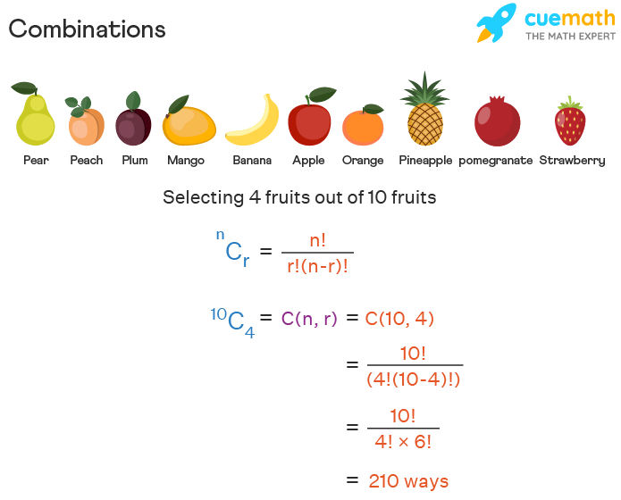

Combinatorics and permutations serve as the cornerstone of various mathematical disciplines with significant implications across numerous fields, notably algorithmic trading. These concepts are key to understanding the numerous ways elements within a set can be arranged or selected, offering profound insight into decision-making processes and strategic planning. This article provides an analysis of combinations and permutations, focusing on their definitions and mathematical basics, along with their pivotal role in trading. By examining these elements, traders and investors can harness these tools to enhance their strategies, optimize decision-making, and ultimately secure a competitive advantage in the fast-paced financial markets. Understanding these concepts helps in navigating complex market situations and in creating robust algorithmic trading models that adapt to varying market conditions. Readers will find that mastering these mathematical concepts can not only elevate their trading acumen but also provide a structured approach to reducing risks and boosting potential returns.

## Table of Contents



## Understanding Combinatorics and Combinations

Combinatorics is a branch of mathematics focused on the study of counting, arrangement, and combination of elements within a set. It provides foundational techniques used in various disciplines, including computer science, biology, and finance. A critical concept within combinatorics is the idea of combinations, where the objective is selecting a subset of items from a larger set without considering the order. Unlike permutations, which are concerned with arrangements where order matters, combinations are solely about the selection of items.

The mathematical formula for combinations is expressed as:

$$
nCr = \frac{n!}{r!(n - r)!}
$$

where $n$ represents the total number of elements in the set, $r$ denotes the number of elements to choose, and $!$ denotes factorial, the product of all positive integers up to a number. This formula serves as a fundamental tool in calculating possible groupings or combinations from a larger set.

In finance, the application of combinatorics, particularly combinations, is instrumental in fields like portfolio management and strategic decision-making in investments. Portfolio management often requires choosing a specific combination of assets to optimize returns while mitigating risk. Investors seek the most advantageous mix of stocks, bonds, and other securities to meet their financial goals. For instance, if an investor is considering a portfolio from a selection of ten potential assets, combinations allow for calculating the numerous ways to construct diversified investment portfolios with varying numbers of assets.

Similarly, strategic decision-making in investments benefits from combinatorial analysis. Financial analysts use combinations to evaluate diverse scenarios, process large volumes of data more efficiently, and predict optimal outcomes. These methodologies enable informed decision-making and strategic planning within uncertain and volatile financial markets.

By leveraging combinations, financial professionals can develop more sophisticated models and decision-making frameworks that better account for uncertainties and complexities inherent in financial systems. This enhances their capability to create resilient investment strategies aimed at achieving consistent and desirable financial outcomes.

## Application of Combinations in Algorithmic Trading

Algorithmic trading utilizes advanced mathematical techniques, including combinations, to enhance trading strategies and manage complex market conditions. Combinations are essential in structuring diversified portfolio strategies where the objective is to achieve optimal returns while minimizing risk exposure. When constructing a portfolio, a trader can use the concept of combinations to explore various asset selections without considering the sequence. The formula for combinations, $nCr = \frac{n!}{r!(n - r)!}$, is crucial here, indicating the number of possible ways to choose 'r' assets from a pool of 'n' assets without regard to order.

In practice, algorithmic traders leverage combinations to simulate and assess multiple portfolio configurations effectively. This comprehensive evaluation helps identify the most favorable mix of stocks, bonds, or commodities, considering diverse market scenarios and investor risk profiles. For example, a trader may consider the combination of different asset classes and the application of hedging strategies, such as pairing high-risk stocks with lower-risk bonds, to achieve a balanced risk profile.

Moreover, combinations aid in scenario analysis, where traders assess the impact of different market conditions on portfolio performance. Through such simulations, traders can predict potential outcomes and make informed decisions about trade selections and adjustments necessary to optimize returns. By systematically evaluating multiple trade combinations, traders can devise strategies that are robust in handling market volatilities, thus ensuring a higher probability of achieving desired financial goals.

To implement combinations in [algorithmic trading](/wiki/algorithmic-trading), traders often employ programming languages like Python, known for its powerful libraries such as NumPy and pandas, which facilitate large-scale data analysis and quantitative strategy development. For instance, Python can be used to generate possible combinations of trade selections across assets and simulate their performance:

```python
import itertools

# Sample assets
assets = ['AAPL', 'GOOGL', 'AMZN', 'MSFT', 'TSLA']

# Generate all possible combinations of 3 assets out of 5
combinations = list(itertools.combinations(assets, 3))

print("Possible Asset Combinations:")
for combination in combinations:
    print(combination)
```

In this example, traders can evaluate the returns and risks associated with each combination, selecting the optimal set that maximizes expected returns while mitigating risk.

In summary, implementing combinations in algorithmic trading provides traders with a structured approach to portfolio management by enabling systematic analysis of asset mixes. This method allows market participants to navigate complex trading environments with greater precision and confidence, ultimately contributing to refined, robust trading strategies.

## Combinations in Probability and Statistics

Combinations are a foundational element in probability and statistical models, playing a key role in determining the likelihood of various outcomes. In [statistics](/wiki/bayesian-statistics), combinations help to calculate probabilities, particularly within the framework of binomial distributions. The binomial distribution models the number of successful outcomes in a fixed number of binary experiments (each with the same probability of success). The probability $P$ of getting exactly $k$ successes in $n$ trials can be calculated using combinations as follows:

$$
P(X = k) = \binom{n}{k} p^k (1-p)^{n-k}
$$

Here, $\binom{n}{k}$ represents the binomial coefficient, also known as a combination, and it is calculated as:

$$
\binom{n}{k} = \frac{n!}{k!(n-k)!}
$$

The parameters $p$ and $1-p$ denote the probability of success and failure, respectively, in each trial.

In the financial sector, traders use combinations to estimate investment success rates, thus aiding in decision-making. By calculating the probability of various outcomes, traders can assess the risks and potential returns of different investment strategies. For example, when evaluating a new trading strategy, a trader can apply combinations within a statistical framework to determine the likelihood of achieving certain return thresholds. This quantification of risk versus reward enables a more informed approach to portfolio management.

Statistical analysis using combinations becomes particularly useful when dealing with large datasets, often encountered in modern trading environments. Traders can employ combinations to quantify the probabilities of particular outcomes across different market conditions, thereby gaining insights into potential risks and rewards. Additionally, combinations facilitate scenario analyses where traders can simulate various market scenarios and measure their potential impact on investment returns.

In Python, calculating combinations for a simple binomial distribution might look like this:

```python
from math import comb

def binomial_probability(n, k, p):
    return comb(n, k) * (p ** k) * ((1 - p) ** (n - k))

# Example usage: Probability of getting 5 successes (e.g., profitable trades) in 10 trials with a 50% success probability in each trial
success_probability = binomial_probability(10, 5, 0.5)
print(success_probability)
```

This example illustrates using combinations to compute the probability of specific outcomes, a critical task in evaluating financial risks and potential rewards in trading. By integrating combinations into probability and statistics, traders are better positioned to create robust financial strategies that adapt to an ever-changing market landscape.

## Combinations and Big Data in Finance

The integration of big data into finance has significantly increased the relevance of combinatorial techniques, particularly combinations, to analyze and interpret vast amounts of information. In financial domains, such as credit scoring and predictive analytics for trading, the utilization of combinations aids in creating robust and accurate models by improving data stratification and feature selection processes.

In credit scoring, combinations allow for the creation of diverse interpretive models using multiple data features, providing a comprehensive approach to assessing credit risk. These models frequently rely on combinations of various financial indicators and personal data attributes, enabling lenders to predict creditworthiness with increased precision.

In trading, especially algorithmic trading, combinations are employed to enhance decision models based on extensive datasets. Traders use combinations to assess multifaceted variables mathematically, such as different market conditions, asset classes, and trading strategies. Through combinations, it is possible to explore various portfolio configurations and to determine the optimal set of trades that minimize risk while maximizing returns. This methodical evaluation process ensures that the trading algorithms are grounded in statistical rigor, making them more robust against market [volatility](/wiki/volatility-trading-strategies).

Furthermore, combinatorial methods streamline the processing of big data in [machine learning](/wiki/machine-learning) frameworks used within finance. In machine learning, combinations are pivotal for feature selection, reducing the dimensionality of data, and ensuring that only the most relevant data features are used for training predictive models. Python, with libraries such as NumPy and SciPy, facilitates the implementation of combination-related computations efficiently:

```python
from scipy.special import comb

# Calculate the number of combinations
n = 50  # total number of data features
r = 5   # number of features to select for the model
num_combinations = comb(n, r)
print(f"Number of possible feature combinations: {num_combinations}")
```

This script calculates the number of possible combinations for selecting five features from a set of fifty, illustrating how traders and analysts can utilize combinatorial computing to identify potential predictive variables.

The application of combinations in analyzing big data enables more nuanced insights into trading markets, leading to well-informed decisions that align with real-time market dynamics. As financial institutions increasingly adopt sophisticated analytics solutions, combinations remain integral, providing clarity and direction through the unprecedented [volume](/wiki/volume-trading-strategy) and variety of data available today.

## Mathematical Strategies in Developing Trading Algorithms

Mathematical strategies are pivotal in developing trading algorithms, where combinations serve as essential tools to minimize risks and optimize returns. Trading algorithms, particularly in high-frequency trading ([HFT](/wiki/high-frequency-trading-strategies)), require precision and efficiency. Mathematical rigor ensures these algorithms can swiftly process and analyze vast datasets to identify profitable trading opportunities. Combinations, in this context, allow for the structured arrangement and selection of various trade portfolios, optimizing the trade execution process.

In high-frequency trading, the speed of execution is crucial, and mathematical models help create algorithms that can react to market changes in milliseconds. By employing combinations, traders can evaluate a multitude of scenarios and choose the optimal set of trades to execute under given market conditions. For example, combinations enable the exploration of different asset allocations or order executions, allowing the selection of a portfolio that offers the greatest expected return for a given level of risk.

Scenario analysis also benefits from the application of combinations in algorithmic trading. Traders can simulate various market conditions and assess the impact of different trading strategies. By analyzing combinations of trade scenarios, algorithms can forecast potential outcomes and adapt accordingly, providing resilience against market volatility.

Case studies highlight the practical impact of using combinations in algorithmic development. For instance, quantitative techniques often utilize combinations to handle multi-[factor](/wiki/factor-investing) models, which assess various market indicators and predict future price movements. These techniques can be implemented in programming languages like Python, where libraries such as Pandas and NumPy facilitate the handling of large datasets and the computation of combinatorial probabilities.

Here is a simple example in Python demonstrating how combinations can be used to evaluate different trade setups:

```python
from itertools import combinations

assets = ['AAPL', 'GOOGL', 'MSFT', 'AMZN', 'FB']
# Generate combinations of 3 assets from the list
asset_combinations = list(combinations(assets, 3))

# Simulate evaluation of each combination
for combo in asset_combinations:
    print(f"Evaluating portfolio: {combo}")
    # Placeholder for hypothetical evaluation function
    # result = evaluate_portfolio(combo)
    # print(f"Expected return: {result}")
```

In this example, combinations help evaluate all possible sets of three assets from a list, providing insights into the optimal composition of an investment portfolio.

Mathematical strategies incorporating combinations enhance the development of sophisticated trading algorithms. They provide structured and efficient techniques for managing risks and optimizing returns, essential in today's fast-paced financial markets. The continued evolution and integration of mathematical models and data analysis promise to expand the capabilities and precision of trading algorithms.

## Conclusion

The understanding and application of combinations in financial markets significantly enhance the efficiency of trading strategies. By systematically evaluating various combinations, traders gain the ability to make informed decisions that contribute to reduced risks and increased returns. Combinations provide a structured framework allowing traders to explore different asset mixtures in portfolios, thereby optimizing allocations to align with financial goals. This mathematical approach brings clarity and precision to decision-making, instrumental in navigating the complexities of modern financial markets.

The integration of combinations into trading is poised to deepen as mathematical modeling continues to evolve. The progress in data analysis and algorithmic trading, supported by advancements in technology, will further the application of combinations in these domains. As financial markets generate vast and complex datasets, the ability to leverage combinations for actionable insights becomes indispensable. By applying combinations to large-scale data, traders can refine predictive models, enhancing the accuracy of their strategies.

Moreover, the ongoing development of machine learning and [artificial intelligence](/wiki/ai-artificial-intelligence) opens new horizons for the deployment of combinations in trading algorithms. These technologies enable the processing of complex patterns and relationships within financial datasets, allowing for dynamic strategy adjustments in response to market changes. As mathematical techniques become more sophisticated, the role of combinations in generating robust and adaptable trading algorithms will likely expand, offering greater opportunities for innovative solutions in the financial sector.

## References & Further Reading

[1]: Bergstra, J., Bardenet, R., Bengio, Y., & Kégl, B. (2011). ["Algorithms for Hyper-Parameter Optimization."](https://dl.acm.org/doi/10.5555/2986459.2986743) Advances in Neural Information Processing Systems 24.

[2]: ["Advances in Financial Machine Learning"](https://www.amazon.com/Advances-Financial-Machine-Learning-Marcos/dp/1119482089) by Marcos Lopez de Prado

[3]: ["Evidence-Based Technical Analysis: Applying the Scientific Method and Statistical Inference to Trading Signals"](https://www.amazon.com/Evidence-Based-Technical-Analysis-Scientific-Statistical/dp/0470008741) by David Aronson

[4]: ["Machine Learning for Algorithmic Trading"](https://github.com/stefan-jansen/machine-learning-for-trading) by Stefan Jansen

[5]: ["Quantitative Trading: How to Build Your Own Algorithmic Trading Business"](https://github.com/LucindaYa/quant-resources/blob/master/Quantitative%20Trading%20How%20to%20Build%20Your%20Own%20Algorithmic%20Trading%20Business.pdf) by Ernest P. Chan