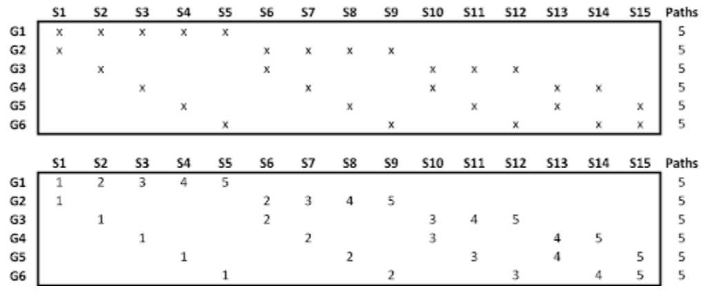

In algorithmic trading, backtesting and model validation are critical components for developing successful trading strategies. Traditional cross-validation techniques, such as k-fold cross-validation, often encounter limitations when applied to financial data, which inherently possess time-dependent characteristics. These conventional methods tend to overlook the time series nature of financial datasets, leading to issues like data leakage and overfitting. Such limitations hinder the accurate assessment of predictive models in financial markets.

Combinatorial Purged Cross-Validation (CPCV) emerges as an innovative solution to these challenges. CPCV offers a robust framework for evaluating and refining trading algorithms by effectively addressing the time-dependent nature of financial data. Unlike traditional cross-validation, CPCV minimizes information leakage by systematically purging overlapping data across different cross-validation splits. This method creates a more realistic simulation of real-world trading conditions, enhancing the reliability and predictability of financial models.



This article discusses the significance of CPCV in the context of algorithmic trading with a focus on improving model performance. Understanding CPCV's methodology, the benefits it brings, and its practical implementation will provide quantitative analysts and traders with valuable insights into building more resilient trading models.

## Table of Contents

## Understanding Combinatorial Purged Cross-Validation (CPCV)

Combinatorial Purged Cross-Validation (CPCV) is an advanced method designed to backtest trading strategies while addressing critical issues such as information leakage and overfitting. Unlike traditional k-fold cross-validation, which often falls short for financial data due to temporal dependencies, CPCV systematically evaluates multiple cross-validation paths by purging overlapping data across different splits. This technique results in a more accurate estimation of a model's performance in real-world trading scenarios.

In traditional cross-validation methods, the data is divided into k equally sized folds. The model is trained on k-1 folds and tested on the remaining one. However, when applied directly to time-series data, this approach risks information leakage, as future data might inadvertently inform the model during training. This issue is particularly pronounced in financial markets, where data points are not independently and identically distributed (i.i.d) but are instead serially correlated due to market dynamics.

The CPCV approach mitigates this problem by organizing the data into partitions that maintain their chronological sequence. Within this structure, potential training and testing splits are computed while purging adjacent or overlapping data points. By applying methods such as PurgedKFold, CPCV ensures that any information that could leak from the future into the past is effectively removed.

The purge operation defines a "buffer zone" around each test set in the cross-validation process. This buffer zone, or `embargo`, excludes any training points that are too close to the test set, thus eliminating any carryover of information. This is crucial in maintaining the independence of the train and test datasets.

Here's a simplified illustration of CPCV's purging process using pseudocode:

```python
import numpy as np
from sklearn.model_selection import TimeSeriesSplit

def purged_split(data, n_splits, embargo_size):
    tscv = TimeSeriesSplit(n_splits=n_splits)
    for train_index, test_index in tscv.split(data):
        test_start = test_index[0]
        embargo_end = min(test_start + embargo_size, len(data))

        # Create purged train indices
        purged_train_index = train_index[train_index < test_start - embargo_size]

        yield purged_train_index, test_index

```

In the example above, for a given dataset `data` and number of splits `n_splits`, an embargo of `embargo_size` ensures that the train set indices do not include data points which are too close to the start of the test set.

By employing CPCV, quantitative analysts and traders can achieve more reliable predictive models. The technique offers a safeguard against overfitting and unrealistically optimistic performance estimates that might stem from overlapping label information. As a result, models validated using CPCV are more robust when applied to actual market conditions, aligning better with their real-world performance and thus enhancing their credibility and utility in financial decision-making processes.

## The Necessity of CPCV in Algorithmic Trading

In financial time series, the inherent serial correlation and lack of independent distribution among data points present significant challenges for predictive model validation. Traditional cross-validation techniques, such as k-fold cross-validation, often fall short in addressing these challenges as they do not consider the temporal dependencies present in sequential data. This oversight can result in data leakage, where information from future data unwittingly influences the model during training, leading to overfitting—a scenario where the model performs well on the training data but poorly on unseen data.

Combinatorial Purged Cross-Validation (CPCV) offers a solution by generating train/test splits that are non-overlapping and by applying a technique called purging, which minimizes the overlap of data across different splits. This ensures that past information does not compromise the integrity of the testing phase. By accommodating the unique aspects of financial data, such as varying market [volatility](/wiki/volatility-trading-strategies) and auto-correlation, CPCV facilitates a more realistic simulation of how a trading strategy might perform in the actual marketplace.

Implementing CPCV is particularly beneficial for traders and quantitative analysts as it enhances the validation process by ensuring the model's robustness against real-world conditions. CPCV's methodological framework accounts for the dynamic nature of financial markets, where the distribution of returns can fluctuate, potentially leading to misleading performance metrics if not properly accounted for. By adopting CPCV, practitioners can ensure that their models are not only theoretically sound but also practically relevant, thereby increasing confidence in their predictive capabilities and aiding in more informed decision-making in trading strategies.

## The CPCV Methodology

Combinatorial Purged Cross-Validation (CPCV) is a methodology specifically designed to address the complexities inherent in time series data, particularly in [algorithmic trading](/wiki/algorithmic-trading). Unlike traditional cross-validation methods that shuffle data, CPCV respects the chronological order of financial time series, preserving the temporal dependencies that are crucial for accurate modeling.

The CPCV method begins by partitioning the dataset into several groups, maintaining the sequence to avoid shuffling. This is crucial because shuffling could disrupt the time-dependent structure of financial data, leading to misleading model evaluations. In each group, the PurgedKFold approach is applied. PurgedKFold is a variant that, unlike regular k-fold cross-validation, incorporates a purging process where neighboring time periods are removed from the training and testing datasets to prevent any leakage of information that could lead to overfitting. This purging step ensures that the evaluation remains robust and reflective of potential future trading scenarios.

Once the groups are defined, CPCV proceeds to generate a variety of training and testing splits. Each split undergoes this purging process, which can also be supplemented with an embargoing technique where data from a specified period is withheld from both training and testing sets to account for look-ahead bias. By eliminating these biases, CPCV enhances the model's validity when applied to unseen data.

To estimate a trading strategy's risk and return profiles more accurately, CPCV generates multiple paths, systematically computing performance metrics such as Sharpe ratios across these paths. Sharpe ratio, defined as:

$$
\text{Sharpe Ratio} = \frac{E[R_p - R_f]}{\sigma_p}
$$

where $R_p$ is the portfolio return, $R_f$ is the risk-free rate, and $\sigma_p$ is the standard deviation of the portfolio return, provides an insight into the risk-adjusted return of a strategy. By collecting these metrics over numerous iterations, CPCV constructs an empirical distribution that offers a comprehensive view of how a trading strategy might perform under varying market conditions. 

In practice, implementing CPCV requires careful manipulation of the dataset, ensuring that both purging and any additional embargoing are effectively managed. This meticulous approach results in more reliable predictive models, enhancing their robustness against the unpredictable nature of financial markets. Employing CPCV not only aids in mitigating overfitting but also plays a pivotal role in refining trading algorithms, thus offering a strategic advantage in the algorithmic trading arena.

## Implementing CPCV in Algorithmic Trading

Implementing Combinatorial Purged Cross-Validation (CPCV) in algorithmic trading requires meticulous handling of time series data to prevent data leakage. This involves adjusting algorithms to incorporate purging and embargoing techniques. Purging ensures the removal of consecutive observations that might leak information, while embargoing applies a time gap after each test period to prevent any overlap with the training set. These adjustments are critical to accurately simulating trading conditions and ensuring the robustness of predictive models.

Software tools have been developed to facilitate the application of CPCV in [backtesting](/wiki/backtesting) environments. These tools typically include functionalities for partitioning time series data while respecting its chronological order, computing multiple train-test splits using the PurgedKFold approach, and automatically handling purging and embargoing mechanics. Such tools are indispensable for professionals seeking to integrate CPCV in a systematic and scalable manner.

Furthermore, traders and quantitative analysts can access sample code and leverage open-source libraries designed to implement CPCV efficiently. Python, with its extensive ecosystem of scientific and financial libraries, is commonly used for such purposes. Libraries like `scikit-learn`, through custom modules or extensions, can be adapted to support CPCV by enabling PurgedKFold cross-validation routines.

An exemplary implementation in Python may look like this:

```python
from sklearn.model_selection import KFold
import numpy as np

def purged_kfold(data, n_splits, embargo):
    # Custom PurgedKFold implementation
    kf = KFold(n_splits=n_splits, shuffle=False)
    for train_index, test_index in kf.split(data):
        # Purge and Embargo logic
        test_index = test_index[embargo:]  # Apply embargo
        # Yield the purged train/test indices
        yield train_index, test_index

# Example of usage
for train_idx, test_idx in purged_kfold(data, n_splits=5, embargo=10):
    train_data, test_data = data[train_idx], data[test_idx]
    # Train and test your model
```

Implementing CPCV effectively enhances the reliability of trading models by ensuring that backtesting results are not tainted by forward-looking bias or overfitting. By following strategic steps, such as incorporating robust validation tools and adhering to best practices in data handling, traders can significantly improve the performance and credibility of their algorithmic trading strategies. This meticulous approach to model validation ultimately leads to a more reliable assessment of risk and return profiles in financial markets.

## Benefits and Challenges of Using CPCV

Combinatorial Purged Cross-Validation (CPCV) serves as a significant advancement in validating algorithmic trading strategies, offering numerous benefits while also presenting certain challenges. The primary advantage of CPCV is its ability to improve model generalization by more accurately reflecting real-world trading conditions. This is achieved by preventing the over-optimistic results commonly associated with overlapping label information. In traditional cross-validation settings, overlapping data between training and test sets can lead to the leakage of future information, resulting in biased performance estimates that may not hold in live trading. CPCV addresses this by ensuring that the data used for training and testing do not temporally overlap, preserving the causal structure inherent in financial time series.

One of the critical challenges associated with CPCV is its complexity and the computational demands it places on resources. Implementing CPCV requires a thorough understanding of not only algorithmic trading principles but also the specific nuances of CPCV. For instance, the method involves creating multiple, non-overlapping train/test splits that maintain the chronological order of data, typically requiring advanced programming skills and computational power to handle extensive backtesting scenarios efficiently.

The effective implementation of CPCV mandates expertise in applying purging and embargoing techniques to minimize information leakage. Purging involves removing data points close to the boundaries of training and testing sets, while embargoing further prevents any potential overlap by holding out certain periods of data around these boundaries. Thus, a robust grasp of these concepts is crucial for successful deployment.

Despite these hurdles, the benefits of CPCV, such as enhanced model predictability and robustness, are invaluable for practitioners. By providing a more accurate assessment of a strategy's performance, traders are able to reduce the risks of overfitting and develop models that are more resilient to market dynamics. This increased predictability is essential for maintaining a competitive edge in financial markets where rapid changes and high volatility are the norms.

Ultimately, while the initial learning curve and computational intensity of CPCV may present obstacles, the improved generalization and model reliability it offers outweigh these challenges, making it a crucial tool for quantitative analysts and traders aiming to refine their trading algorithms and achieve sustainable success.

## Concluding Remarks

Combinatorial Purged Cross-Validation (CPCV) stands as an essential mechanism in enhancing the effectiveness of algorithmic trading strategies. By effectively mitigating issues like overfitting and refining model validation, CPCV has become indispensable in today's trading environments, which are marked by their inherent complexity and dynamism. Such innovative validation methods help ensure that models developed through CPCV are not only statistically sound but also practical for real-world trading situations.

Traders and quantitative analysts are highly encouraged to integrate CPCV into their processes to achieve more robust and reliable trading models. By utilizing CPCV, they can guard against over-optimistic predictions that might arise from improperly validated models, thus preventing potential substantial financial losses. This method ensures that models extrapolate performance data accurately, reflecting the reality of volatile and often unpredictable financial markets.

As the landscape of financial markets continues to change and evolve, advanced validation techniques like CPCV will remain critical. It offers quantifiable improvements in predictive accuracy, which is vital for gaining and maintaining a competitive edge in an ever-advancing industry. The application of CPCV is not merely a theoretical enhancement; it provides a tangible advantage, optimizing trading algorithms to better withstand the tests of market unpredictability.

## References & Further Reading

[1]: ["Advances in Financial Machine Learning"](https://www.amazon.com/Advances-Financial-Machine-Learning-Marcos/dp/1119482089) by Marcos Lopez de Prado

[2]: ["Evidence-Based Technical Analysis: Applying the Scientific Method and Statistical Inference to Trading Signals"](https://www.amazon.com/Evidence-Based-Technical-Analysis-Scientific-Statistical/dp/0470008741) by David Aronson

[3]: ["Machine Learning for Algorithmic Trading"](https://github.com/PacktPublishing/Machine-Learning-for-Algorithmic-Trading-Second-Edition) by Stefan Jansen

[4]: ["Quantitative Trading: How to Build Your Own Algorithmic Trading Business"](https://books.google.com/books/about/Quantitative_Trading.html?id=j70yEAAAQBAJ) by Ernest P. Chan