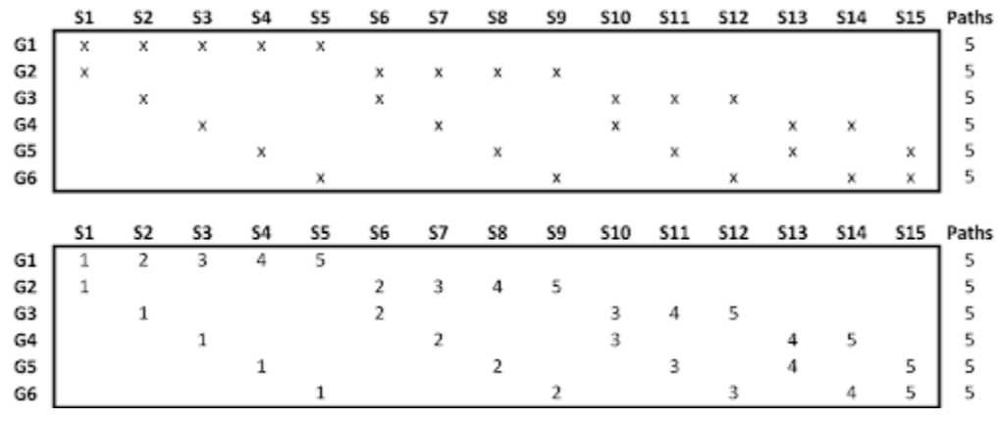

## Table of Contents

## What is cross-validation and why is it important in machine learning?

Cross-validation is a technique used in machine learning to assess how well a model will perform on new, unseen data. It works by splitting the available data into several smaller sets, using some of these sets to train the model and the others to test it. This process is repeated multiple times, with different parts of the data being used for training and testing each time. By doing this, cross-validation helps to make sure that the model's performance is not just good on one specific set of data but is generally good across different sets of data.

Cross-validation is important because it helps to prevent overfitting, which is when a model performs well on the data it was trained on but poorly on new data. By using cross-validation, we can get a more accurate picture of how the model will perform in the real world. This is crucial for building reliable models that can be trusted to make good predictions or decisions when faced with new data. In short, cross-validation helps to create models that are more robust and effective.

## What is the main concept behind combinatorially symmetric cross-validation (CSCV)?

Combinatorially symmetric cross-validation (CSCV) is a special way of doing cross-validation that makes sure all parts of the data are treated the same. In regular cross-validation, you split your data into different pieces and use some pieces to train your model and other pieces to test it. But sometimes, the way you split the data can affect how well your model seems to work. CSCV fixes this problem by making sure that every piece of data gets a chance to be in the training set and the test set in every possible combination.

The main idea behind CSCV is to be fair to all the data. It does this by using all possible ways to split the data into training and testing sets. This means that if you have, say, 10 pieces of data, CSCV will try every way to pick some of those pieces for training and the rest for testing. By doing this, CSCV gives you a very good idea of how well your model will work on new data, because it has seen every possible way the data can be split. This makes your model's performance more reliable and trustworthy.

## How does CSCV differ from traditional k-fold cross-validation?

CSCV and traditional k-fold cross-validation are both ways to check how good a model is, but they do it differently. In k-fold cross-validation, you split your data into k equal parts. You then use k-1 parts to train your model and the last part to test it. You do this k times, each time using a different part for testing. This way, every piece of data gets a chance to be in the test set once. It's simple and works well for many problems.

CSCV goes a step further to make sure every piece of data is treated the same. Instead of just using k different splits, CSCV uses all possible ways to split the data into training and testing sets. This means if you have 10 pieces of data, CSCV will try every possible way to pick some pieces for training and the rest for testing. This makes CSCV more thorough and fair, but it can also take a lot more time and computing power because there are so many more splits to try.

## What are the advantages of using CSCV over other cross-validation methods?

CSCV has a big advantage because it treats all the data the same. In regular cross-validation, how you split the data can change how good your model looks. But CSCV tries every possible way to split the data into training and testing sets. This means every piece of data gets a fair chance to be in both the training and testing sets in all possible combinations. This makes your model's performance more reliable and trustworthy because it has been tested in every possible way.

Using CSCV can also help you find problems with your data that other methods might miss. Because CSCV uses all possible splits, it can show you if your model works well only with certain kinds of data or if it has trouble with others. This can help you make your model better by fixing these problems. But, CSCV takes more time and computer power because it tries so many different splits. So, you have to think about if the extra work is worth it for your project.

## Can you explain the combinatorial aspect of CSCV?

The combinatorial part of CSCV means it uses all possible ways to split your data into training and testing sets. Think of it like this: if you have 10 pieces of data, CSCV will try every single way to pick some of those pieces for training and the rest for testing. It's like making every possible team from a group of players, where each team is a different way to split your data. This makes sure that every piece of data gets a fair chance to be in both the training and testing sets in all possible combinations.

Because CSCV uses all these different splits, it's very thorough. It can show you if your model works well only with certain kinds of data or if it has trouble with others. This can help you make your model better by fixing these problems. But, using CSCV takes more time and computer power because it tries so many different splits. So, you have to think about if the extra work is worth it for your project.

## How does symmetry play a role in CSCV?

Symmetry in CSCV means that every piece of data is treated the same way. Imagine you have a bunch of blocks, and you want to build different towers with them. In CSCV, every block gets a chance to be in every possible spot in every tower. This makes sure that no block is left out or used too much. By treating all the data the same, CSCV helps you see if your model is good in a fair way.

Using symmetry like this helps CSCV find problems that other methods might miss. If your model only works well with certain blocks, CSCV will show you that because it tries every way to build the towers. This can help you fix your model to make it work better with all kinds of data. But, using CSCV takes more time and computer power because it tries so many different ways to split the data.

## What types of data sets are best suited for CSCV?

CSCV works best with small data sets. When you have a small number of data points, CSCV can check every possible way to split the data into training and testing sets. This makes sure every piece of data gets treated the same, which is really important when you don't have a lot of data. If you use CSCV with a small data set, you can trust that your model's performance is fair and reliable.

But CSCV can be too slow for big data sets. When you have a lot of data, trying every possible split takes too much time and computer power. For big data sets, simpler cross-validation methods like k-fold cross-validation are usually better because they are faster and still give you a good idea of how well your model works. So, if you have a big data set, you might want to use a different method instead of CSCV.

## How can CSCV help in reducing bias in model validation?

CSCV helps reduce bias in model validation by making sure every piece of data gets treated the same. In regular cross-validation, how you split the data can make your model look better or worse than it really is. But CSCV tries every possible way to split the data into training and testing sets. This means every piece of data gets a fair chance to be in both the training and testing sets in all possible combinations. By doing this, CSCV makes sure your model's performance is fair and reliable, without any bias from how the data was split.

Using CSCV can also help you find problems with your data that other methods might miss. If your model only works well with certain kinds of data, CSCV will show you that because it tries every way to split the data. This can help you fix these problems and make your model better. But CSCV takes more time and computer power because it tries so many different splits. So, it's best used with small data sets where you can check every possible split without taking too long.

## What are the computational challenges associated with implementing CSCV?

Using CSCV can be hard because it needs a lot of computer power. CSCV tries every possible way to split the data into training and testing sets. If you have a lot of data, this means there are so many different ways to split it that it can take a very long time for the computer to try them all. This makes CSCV slow and hard to use with big data sets.

Even with small data sets, CSCV can still take a lot of time. For example, if you have 10 pieces of data, CSCV will try every single way to pick some pieces for training and the rest for testing. This can be good because it makes sure every piece of data is treated the same, but it also means your computer has to work a lot harder. So, you need to think about if the extra time and work is worth it for your project.

## Can you provide an example of how CSCV can be applied in a real-world scenario?

Imagine a small medical clinic that wants to predict if a patient has a certain disease based on their symptoms. They have data from 20 patients, but they want to make sure their model works well for new patients too. They decide to use CSCV to check their model. CSCV will try every possible way to split the 20 patients into training and testing groups. This way, every patient's data gets a fair chance to be used for both training and testing the model. By doing this, the clinic can trust that their model will work well for new patients because it has been tested in every possible way.

Using CSCV helps the clinic find out if their model only works well for certain kinds of patients or if it has trouble with others. For example, if the model only works well for young patients and not for older ones, CSCV will show that because it tries every way to split the data. This can help the clinic make their model better by fixing these problems. Even though CSCV takes more time and computer power, it's worth it for the clinic because they have a small data set and they need to be sure their model is fair and reliable for all patients.

## How does CSCV handle class imbalance compared to other methods?

CSCV can help with class imbalance by making sure every piece of data gets a fair chance to be in the training and testing sets. In a class imbalance situation, one type of data is much more common than the other. Regular cross-validation might miss this problem because it only tries a few ways to split the data. But CSCV tries every possible way, so it can show if your model works better with the common type of data and worse with the rare type. This helps you see the problem clearly and fix it.

Using CSCV with class imbalance takes more time and computer power, but it can be worth it, especially with small data sets. If you have a small number of data points, CSCV can check every possible split without taking too long. This thorough check can help you make your model better by making sure it works well for all types of data, not just the common ones. So, CSCV is a good choice when you need to be sure your model is fair and reliable, even when the data is imbalanced.

## What are the latest research developments or advancements in CSCV?

Recent research in CSCV has focused on making it work better with bigger data sets. One big problem with CSCV is that it takes a long time because it tries every possible way to split the data. Scientists are working on new ways to make CSCV faster. They are using smart ways to pick only the most important splits to try, instead of trying every single one. This can help CSCV work well even with more data, without taking too long.

Another area of research is about using CSCV with different kinds of models. CSCV is good at checking how well models work, but some models are hard to use with CSCV. Researchers are finding ways to make CSCV work better with these tricky models. They are also looking at how CSCV can help with new problems, like making sure models are fair and don't treat different groups of people differently. By working on these things, scientists hope to make CSCV even more useful for all kinds of [machine learning](/wiki/machine-learning) projects.

## References & Further Reading

[1]: Bergstra, J., Bardenet, R., Bengio, Y., & Kégl, B. (2011). ["Algorithms for Hyper-Parameter Optimization."](https://papers.nips.cc/paper/4443-algorithms-for-hyper-parameter-optimization) Advances in Neural Information Processing Systems 24.

[2]: ["Advances in Financial Machine Learning"](https://www.amazon.com/Advances-Financial-Machine-Learning-Marcos/dp/1119482089) by Marcos Lopez de Prado

[3]: ["Evidence-Based Technical Analysis: Applying the Scientific Method and Statistical Inference to Trading Signals"](https://www.amazon.com/Evidence-Based-Technical-Analysis-Scientific-Statistical/dp/0470008741) by David Aronson

[4]: ["Machine Learning for Algorithmic Trading"](https://github.com/stefan-jansen/machine-learning-for-trading) by Stefan Jansen

[5]: ["Quantitative Trading: How to Build Your Own Algorithmic Trading Business"](https://books.google.com/books/about/Quantitative_Trading.html?id=j70yEAAAQBAJ) by Ernest P. Chan