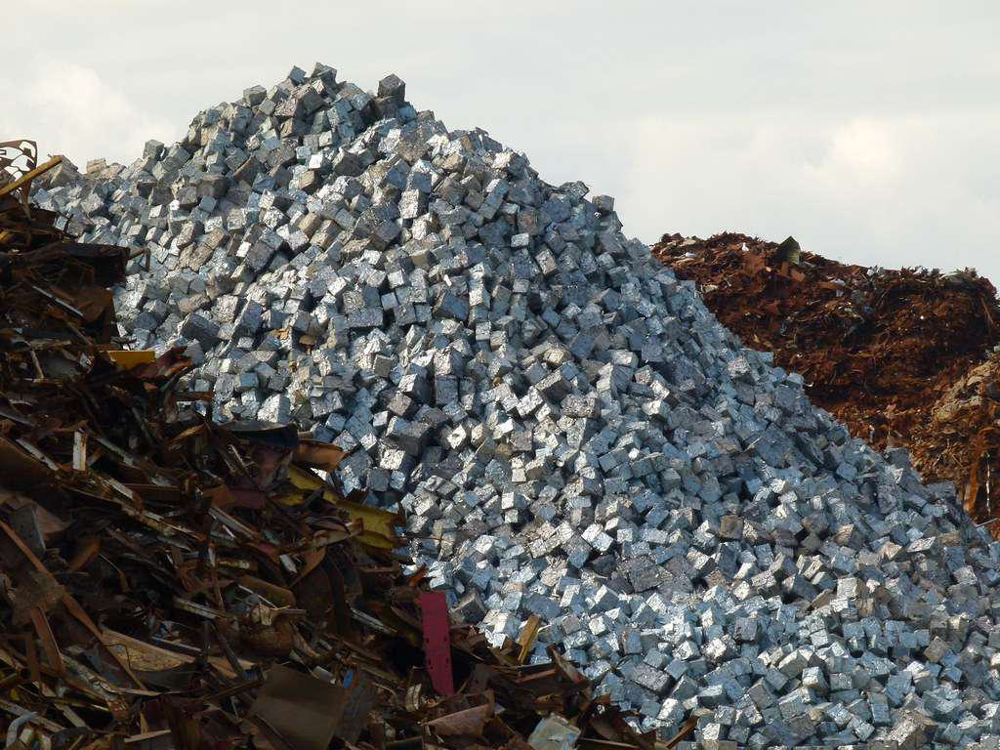

## Table of Contents

## What is COMEX and what is its primary function?

COMEX is a company that runs a big market where people buy and sell metals like gold, silver, and copper. It is part of the Chicago Mercantile Exchange, which is a very important place for trading. People from all over the world use COMEX to trade these metals because it is a trusted place to do business.

The main job of COMEX is to help people trade metals easily and safely. They make rules and set prices that everyone follows. This helps keep the trading fair and organized. By doing this, COMEX helps people who need metals for their work, like making jewelry or electronics, to get what they need, and it also helps people who want to invest in metals.

## When was COMEX founded and how has its role evolved over time?

COMEX was founded in 1933. At first, it was just a place where people could trade metals like gold and silver. It started in New York and was a way for people to buy and sell these metals in a safe and organized way. Back then, it was important because it helped people during the Great Depression by giving them a place to trade valuable metals.

Over time, COMEX has grown a lot. In 1994, it joined with the Chicago Mercantile Exchange, which made it even bigger and more important. Now, COMEX is not just about trading metals in the United States; it's a global market where people from all over the world come to trade. It has added more types of metals like copper and has become a key part of the world's financial system, helping to set prices and make trading easier and safer for everyone involved.

## Which metals are primarily traded on COMEX?

The main metals traded on COMEX are gold, silver, and copper. These are important because they are used in many things like jewelry, electronics, and building stuff. People also buy and sell these metals as investments, hoping their value will go up over time.

COMEX helps set the prices for these metals. When people all over the world want to know how much gold, silver, or copper costs, they often look at the prices set by COMEX. This makes COMEX a very important place for anyone who needs these metals for their work or wants to invest in them.

## How does trading on COMEX influence global metal prices?

Trading on COMEX influences global metal prices because it is a big and trusted market where a lot of gold, silver, and copper are bought and sold. When many people trade these metals on COMEX, the prices they agree on help set the standard for what these metals are worth all around the world. If the price of gold goes up on COMEX, for example, people in other countries might start paying more for gold too, because they see that's what it's worth on this important market.

Also, COMEX has rules and ways of doing things that make trading fair and clear. This helps everyone trust the prices set there. Because COMEX is so big and well-known, other markets often look at its prices to decide their own. So, if COMEX says gold is worth a certain amount, other places might use that as a guide. This makes COMEX very important in deciding how much these metals cost everywhere.

## What are the different types of contracts available for trading on COMEX?

On COMEX, people can trade different types of contracts for metals like gold, silver, and copper. The main type of contract is called a futures contract. A futures contract is an agreement to buy or sell a certain amount of metal at a set price on a future date. This helps people plan ahead and protect themselves from big changes in metal prices. For example, if you think the price of gold will go up, you can buy a futures contract now and sell it later at a higher price.

Besides futures contracts, COMEX also offers options contracts. An options contract gives you the right, but not the obligation, to buy or sell a futures contract at a certain price before a specific date. This can be useful if you want to protect yourself from price changes but are not sure if you want to go through with the trade. Options can be a bit more complicated, but they give traders more flexibility. Both futures and options contracts help make trading on COMEX more useful for different kinds of traders.

## Can you explain the process of futures trading on COMEX?

Futures trading on COMEX is like making a deal about the future price of metals like gold, silver, or copper. When someone wants to trade futures, they agree to buy or sell a certain amount of metal at a set price on a specific future date. For example, if you think the price of gold will go up, you can buy a futures contract now. This means you're agreeing to buy gold at today's price, even though you'll actually get it later. If the price does go up, you can sell the gold at the higher price and make money. But if the price goes down, you might lose money because you have to buy it at the higher price you agreed on.

To start trading futures on COMEX, you need to have an account with a broker who can trade on COMEX. Once you have an account, you can look at the different futures contracts available and decide which one you want to buy or sell. You'll need to put down some money, called margin, to show that you're serious about the trade. This isn't the full price of the metal, just a part of it. Then, you wait until the date in the future when the contract says you'll buy or sell the metal. During this time, the price of the metal might go up or down, and you can decide to keep the contract or get out of it if you want. If you keep it until the end, you'll either buy or sell the metal at the price you agreed on, no matter what the current price is.

## What are the key historical events that have impacted COMEX?

COMEX started in 1933, during a tough time called the Great Depression. It was a new place where people could trade gold and silver safely. This was important because it helped people who were struggling to have a place to buy and sell valuable metals. Over the years, COMEX grew bigger and became more important. In 1974, the U.S. government let people own gold again, which made more people want to trade gold on COMEX. This change helped COMEX become a bigger part of the metal trading world.

In 1994, COMEX joined with the Chicago Mercantile Exchange (CME). This made COMEX even bigger and more powerful. Now, it could reach more people around the world and trade more kinds of metals, like copper. This merger was a big step because it helped COMEX set prices that people everywhere started to trust and follow. Over time, COMEX has faced challenges like big price changes and new technology, but it has always kept working to make trading fair and easy for everyone.

## How does COMEX ensure the quality and standardization of the metals traded?

COMEX makes sure the metals traded on it are good quality and the same everywhere by setting strict rules. They have special standards for each metal, like gold, silver, and copper. For example, when someone wants to trade gold on COMEX, the gold has to be at least 99.5% pure. This helps everyone know exactly what they are buying or selling. COMEX also checks the metals to make sure they meet these standards before they can be traded.

Besides setting rules, COMEX uses something called "good delivery" rules. This means that the metals have to be in a certain shape and size, like gold bars, and they must be stored in places that COMEX trusts. This helps keep everything the same and fair. By doing all this, COMEX makes sure that people all over the world can trust the metals they trade on the exchange.

## What role do COMEX warehouses play in the trading process?

COMEX warehouses are important places where the metals like gold, silver, and copper are kept safe before they are traded. When someone wants to trade metals on COMEX, they don't just trade the metal itself right away. Instead, they trade something called a futures contract, which is a promise to buy or sell the metal later. The actual metal stays in the warehouse until it's time to finish the deal. This helps make trading easier and safer because everyone knows the metal is in a trusted place.

The warehouses also help make sure the metals are good quality and meet COMEX's rules. Before the metals can be traded, they are checked to make sure they are pure enough and the right size and shape. If they pass the check, they get stored in the warehouse until someone wants to buy them. This way, when people trade on COMEX, they can trust that the metal they are buying or selling is the same as what everyone else is trading.

## How do regulatory changes affect trading on COMEX?

Regulatory changes can have a big impact on trading on COMEX. When the government or other big groups make new rules, it can change how people buy and sell metals like gold, silver, and copper. For example, if the rules about how much money people need to trade get stricter, fewer people might want to trade because it becomes harder or more expensive to do so. Also, new rules can change what kinds of metals can be traded or how they need to be stored and checked. This means COMEX might have to change its own rules to follow the new laws, which can affect how easy or hard it is for people to trade.

These changes can also make prices go up or down. If a new rule makes it harder to trade, the price of metals might go up because there are fewer people buying and selling. On the other hand, if a new rule makes trading easier or safer, more people might start trading, which could make prices more stable or even go down. COMEX has to keep up with these changes and make sure everyone follows the new rules. This helps keep trading fair and trusted, but it can also mean that people need to learn new ways of doing things when they trade on COMEX.

## What advanced trading strategies are used by expert traders on COMEX?

Expert traders on COMEX use many smart ways to trade metals like gold, silver, and copper. One way is called "spread trading." This is when they buy one futures contract and sell another one at the same time. They do this to make money from the difference in prices between the two contracts. Another strategy is "[arbitrage](/wiki/arbitrage)," where traders buy metal in one place and sell it in another place where the price is higher. This can be done between different markets or even between COMEX and other exchanges. These strategies help traders make money even when the overall price of the metal isn't changing much.

Another advanced strategy is called "technical analysis." Traders use charts and numbers to guess where the price of a metal might go next. They look for patterns and use special tools to help them decide when to buy or sell. Some traders also use "hedging," which is a way to protect themselves from big price changes. They might buy a futures contract to lock in a price now, so if the price goes down later, they won't lose as much money. These strategies need a lot of knowledge and practice, but they can help expert traders make good decisions and manage their risks on COMEX.

## How does COMEX compare to other major commodity exchanges around the world?

COMEX, part of the Chicago Mercantile Exchange, is one of the biggest places in the world where people trade metals like gold, silver, and copper. It's very important because it sets prices that many people around the world use as a guide. Compared to other big commodity exchanges, like the London Metal Exchange (LME) and the Shanghai Futures Exchange (SHFE), COMEX is known for its strict rules and high standards for the quality of metals. It also has a lot of people trading, which makes the market very active and the prices more trusted. The LME is famous for trading a wider range of metals, including aluminum and zinc, while the SHFE is important because it's in China, a big country that uses a lot of metals.

Even though COMEX, LME, and SHFE all trade metals, they each have their own special ways of doing things. COMEX focuses a lot on futures and options contracts, which help people plan for the future and protect themselves from big price changes. The LME is known for its system of trading metals in warehouses, which helps people know where their metals are stored. The SHFE, on the other hand, is growing fast and becoming more important because China is a big player in the world's metal market. All these exchanges work together to make a big, global market for metals, but they each bring something different to the table.

## References & Further Reading

[1]: ["Algorithmic Trading: Winning Strategies and Their Rationale"](https://www.wiley.com/en-us/Algorithmic+Trading%3A+Winning+Strategies+and+Their+Rationale-p-9781118460146) by Ernest P. Chan

[2]: ["Advances in Financial Machine Learning"](https://www.amazon.com/Advances-Financial-Machine-Learning-Marcos/dp/1119482089) by Marcos Lopez de Prado

[3]: ["Evidence-Based Technical Analysis: Applying the Scientific Method and Statistical Inference to Trading Signals"](https://www.amazon.com/Evidence-Based-Technical-Analysis-Scientific-Statistical/dp/0470008741) by David Aronson

[4]: ["Machine Learning for Asset Managers"](https://ia802907.us.archive.org/31/items/machine_learning_for_asset_managers/machine_learning_for_asset_managers.pdf) by Marcos Lopez de Prado

[5]: ["Quantitative Trading: How to Build Your Own Algorithmic Trading Business"](https://www.amazon.com/Quantitative-Trading-Build-Algorithmic-Business/dp/1119800064) by Ernest P. Chan