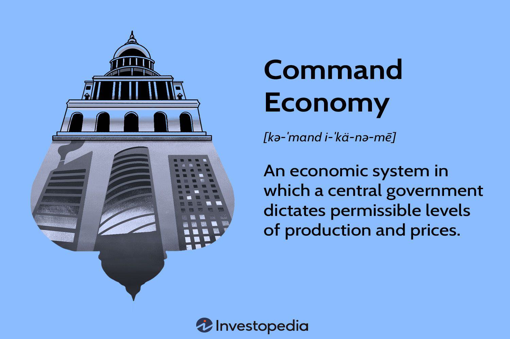

This article explores the intersection of central planning economic systems, often exemplified by command economies, and algorithmic trading (algo trading), which thrives in free-market settings. Command economies, characterized by central planning, have historically aimed to achieve specific economic and social objectives through governmental or authoritative control over production and distribution. Countries such as the former Soviet Union and present-day North Korea have implemented command economic models intending to create equitable wealth distribution and social welfare.

Conversely, algorithmic trading represents the technological edge of free-market principles. It utilizes complex computer algorithms to facilitate high-speed and high-volume trading, promoting efficiency in financial exchanges. As a product of a competitive market environment, algo trading enhances market liquidity and can substantially reduce transaction costs, transforming the landscape of global financial markets. However, it also poses challenges such as increased market volatility and systemic risks.

Understanding these two distinct systems offers insights into their significant roles in shaping the contemporary economic landscape. This article will examine the characteristics, advantages, disadvantages, and recent trends associated with command economies and algorithmic trading. It will delve into how these economic mechanisms respond to the demands of a rapidly evolving global market, offering a comparative perspective on the implications of centralized control versus technological innovation in financial systems.

## Table of Contents

## Understanding Central Planning and Command Economy

Central planning and command economies represent systems where a central authority, typically the government, assumes total control over economic decision-making processes. This centralized approach stands in contrast to market economies, where market forces primarily dictate economic outcomes. 

In a central planning system, the government is responsible for making all critical decisions regarding the production, pricing, and distribution of goods and services. The central authority establishes production targets and allocates resources to various sectors according to pre-determined national goals and priorities. This method is designed to organize economic activity in a manner that aligns with the broader social and economic objectives of the state.

Historically, the former Soviet Union exemplified a pure command economy where state planners dictated all aspects of economic life. Industries were nationalized, and private ownership was minimal, if not entirely non-existent. Production was largely guided by extensive multi-year plans, such as the famous Five-Year Plans implemented under Joseph Stalin. These plans aimed to rapidly industrialize the economy by setting ambitious targets for output in key sectors, such as heavy industry and agriculture.

Present-day North Korea provides another example of a command economy, where the government centralizes economic control to pursue self-reliance and political isolation. In environments like this, competitive markets are severely restricted or banned, leading to a lack of market signals, such as prices influenced by supply and demand, which can hinder efficiency and innovation.

A defining characteristic of command economies is state ownership of the means of production, positioning the government as the primary employer and decision-maker. While this can allow for a coordinated approach to resource allocation and social welfare programs, it often results in drawbacks like diminished economic efficiency and limited consumer choice. The absence of competitive pressures reduces the incentive for innovation and efficiency improvements, which are typically driven by market dynamics in free economies.

Central planners typically employ multi-year plans to guide economic development. These plans attempt to forecast future economic needs and adjust production goals accordingly. By establishing explicit targets for each sector, central planners aim to ensure that production meets national priorities. However, the success of these plans heavily relies on the accuracy of forecasts and the ability to adapt to unanticipated changes in economic conditions.

In summary, central planning and command economies focus on structured resource allocation guided by state-defined objectives, often at the expense of efficiency and market responsiveness. They offer a lens through which to understand the trade-offs between centralized control and economic freedom.

## Advantages and Disadvantages of Command Economies

Command economies, often associated with central planning, present both strengths and weaknesses in their implementation, affecting various facets of economic and social structures.

One major advantage of command economies is their capacity to ensure an equitable distribution of resources. This system allows central authorities to allocate goods and services in a manner that addresses social welfare objectives. By prioritizing essential needs over market-driven demands, command economies can potentially reduce poverty and achieve a more balanced socio-economic landscape. Additionally, the centralized nature of decision-making enables these economies to mobilize resources swiftly in times of national emergencies, such as wars or natural disasters. This resource mobilization can be crucial in maintaining stability and providing necessary support to affected populations.

Despite these advantages, command economies face significant criticisms. One of the primary disadvantages is their inefficiency. The absence of competitive markets often leads to a lack of motivation among workers and enterprises to improve productivity and efficiency. The 'incentive problem' arises when individuals and businesses do not have sufficient motivation to optimize performance due to fixed targets and lack of profit incentives. Furthermore, the 'information vacuum' becomes a central issue, as central planners may lack accurate or timely data to make informed decisions, leading to misallocation of resources and economic imbalances.

Moreover, the lack of responsiveness to consumer needs is another critical drawback in command economies. Without a market mechanism to signal consumer preferences, production often remains misaligned with actual demand, resulting in surpluses and shortages of various goods. This misalignment can stifle innovation, as enterprises have little incentive or capacity to develop new products that might better serve consumer interests.

In real-world applications, these drawbacks manifest as bureaucratic inefficiencies and industrial stagnation. With layers of administrative processes, decision-making can be slow and cumbersome, preventing timely adaptation to changing economic conditions. Industries under central control may become stagnant, unable or unwilling to adopt new technologies or methods due to rigid planning structures.

Thus, while command economies can claim certain advantages in equitable resource distribution and crisis management, they are often plagued by inefficiencies and a lack of innovation, limiting their long-term sustainability.

## Algorithmic Trading in Free-Market Economies

Algorithmic trading, a hallmark of modern free-market economies, leverages sophisticated computer programs to execute trades at high speeds and volumes. This innovation has become essential in environments where market competition fuels technological advancement and efficiency. The automation of trade execution through algorithms allows for rapid and precise market interactions that human traders alone cannot replicate.

Central to the efficacy of [algorithmic trading](/wiki/algorithmic-trading) is its ability to enhance market [liquidity](/wiki/liquidity-risk-premium). By facilitating a larger number of trades at any given time, algorithms increase the availability of assets for buying and selling, thereby stabilizing prices. Additionally, the reduction of transaction costs is a significant advantage; automated systems minimize the need for manual intervention, thus decreasing the associated expenses of human resources and potential errors.

However, algorithmic trading is not without its challenges. Critics raise concerns about its contribution to market [volatility](/wiki/volatility-trading-strategies). The rapid pace and vast [volume](/wiki/volume-trading-strategy) of trades can exacerbate price fluctuations, leading to instability in financial markets. This volatility is closely tied to the potential for systemic risk, as evidenced by incidents such as the Flash Crash of 2010, where markets experienced a sudden and severe downturn triggered by algorithmic trading activity.

Regulatory bodies worldwide are meticulously evaluating the implications of algorithmic trading on market integrity. They aim to ensure that while financial markets benefit from increased efficiency, they remain fair and transparent. Regulations may include measures to prevent market manipulation and ensure that trading algorithms adhere to standards that secure overall market stability.

In conclusion, algorithmic trading represents a transformative force in free-market economies by driving technological innovation and efficiency. Yet, it requires careful oversight to mitigate risks and maintain market integrity, ensuring that its benefits are realized without compromising the stability of financial systems.

## Comparative Analysis: Command Economies vs. Free-Market Economies

Command economies and free-market economies represent two fundamentally different approaches to economic organization, each with distinct motivations and mechanisms. In command economies, the primary focus is on achieving social objectives, such as equitable distribution of resources, ensuring employment, and meeting basic needs of the population. The central authority plans and controls economic activity, setting production targets and allocating resources based on national priorities. This contrasts sharply with free-market economies, where economic activities are primarily driven by the pursuit of profit. Market forces, primarily competition and consumer choice, play a crucial role in determining what goods and services are produced, in what quantities, and at what prices.

Economic efficiency in free-market economies is often higher due to the competitive environment that encourages innovation, cost-reduction, and productivity improvements. The dynamic nature of competitive markets fosters a continuous search for improved processes, technologies, and products. This contrasts with command economies, where centralized decision-making can lead to inefficiencies and a lack of innovation. The absence of competitive pressure reduces the incentive for enterprises to minimize costs or improve products, potentially resulting in lower overall economic efficiency.

The response of these systems to economic crises also differs significantly. Command economies can rapidly mobilize resources through direct central directives to address emergencies, leveraging their ability to coordinate large-scale actions without the friction of market processes. However, the lack of feedback loops inherent in market systems can sometimes lead to prolonged inefficiencies and misallocations during such interventions. In contrast, free-market economies rely on dynamic adjustments driven by supply and demand forces. Prices adjust in response to changes in economic conditions, and resources are reallocated as businesses adapt to new realities, although this self-correcting mechanism can sometimes be more volatile and disruptive in the short term.

Blended systems represent an attempt to harness the strengths of both approaches. China's socialist market economy is a prominent example, integrating central planning with market mechanisms. Such economies utilize state intervention to guide long-term development and fulfill strategic goals while allowing market forces to allocate resources in less crucial sectors. This hybrid approach aims to achieve the social objectives of a command economy without sacrificing the efficiency and innovation benefits of a market-based system.

One of the most significant differences between command and free-market economies is adaptability. Free-market economies are inherently more adaptable due to their decentralized decision-making structure and reliance on market signals. Businesses and consumers can quickly respond to changing conditions, enabling economies to pivot and adjust to new technologies, consumer preferences, and global trends. Conversely, command economies tend to be more rigid, with changes often requiring extensive bureaucratic processes and central approval. This rigidity can hinder timely responses to economic challenges and limit the ability to capitalize on new opportunities.

In summary, the contrasting principles and operational methodologies of command economies and free-market economies lead to varied strengths and weaknesses. By understanding these differences, policymakers can better navigate the complexities of their own economic environments, potentially drawing lessons from each to create more resilient and effective economic systems.

## Impact of Algorithmic Trading on Modern Economies

Algorithmic trading, or algo trading, has transformed modern economies by enhancing trading efficiency in global financial markets. This efficiency is primarily achieved through the rapid execution of trades at high volumes and with minimal human intervention. As algorithms can process vast amounts of data in real time and execute trades based on predefined rules, they substantially reduce the time it takes to complete transactions. This capability not only streamlines trading processes but also contributes to the overall liquidity of financial markets.

The rapid execution of trades in algo trading is, however, a double-edged sword, presenting both opportunities and risks. On one hand, it allows investors to capitalize on market opportunities with precision and speed that human traders cannot match. Algorithmic strategies can identify and exploit price discrepancies across different markets or assets instantaneously. On the other hand, the same features that enable high-speed trading can lead to increased market volatility. For instance, the flash crash of May 6, 2010, highlighted how algorithms could amplify market fluctuations, resulting in significant and sudden price swings within minutes.

As technology continues to advance, the interplay between algorithmic trading and market regulation remains a critical focus for policymakers and regulatory bodies worldwide. This evolving relationship necessitates continuous monitoring and adaptation to safeguard market integrity. Regulatory frameworks are often updated to address the risks associated with high-frequency trading, including measures to prevent disorderly market activity and ensure fair trading practices.

The widespread use of algo trading further underscores the need for robust risk management strategies within the financial industry. Financial institutions are required to implement comprehensive risk controls to mitigate potential system failures or unintended trading behaviors that could disrupt markets. These controls include testing algorithms in simulated environments, setting limits on trading activities, and maintaining real-time monitoring systems to detect anomalies.

Both institutional and retail investors benefit from the efficiencies introduced by algorithmic trading. For institutional investors, reduced transaction costs and the ability to execute large orders without significant market impact are significant advantages. Retail investors, likewise, experience improved pricing transparency and access to competitive market rates, enabling them to make more informed investment decisions.

In summary, while algorithmic trading offers substantial benefits in terms of trading efficiency and market liquidity, it also presents challenges related to market volatility and systemic risk. Balancing these factors requires ongoing dialogue and collaboration between industry stakeholders and regulators to ensure the sustainable development of financial markets globally.

## Future Trends and Perspectives

Command economies are increasingly considering mixed models to integrate market efficiencies. This evolution is motivated by the potential to optimize resource allocation and enhance economic resilience. The incorporation of selective free-market mechanisms can lead to improved economic outcomes, as evidenced by the economic reforms in China, where a blend of state control and market-friendly policies has led to rapid growth and development.

The emergence of digital currencies and blockchain technology offers new tools for central planning. Blockchain, with its decentralized ledger system, can be used by governments to ensure transparency and reduce corruption. It allows for secure transactions and real-time data analysis, which can facilitate more efficient economic planning. Digital currencies, on the other hand, offer the potential to streamline monetary policy implementation and provide alternative solutions for cross-border transactions.

In the fast-paced world of algorithmic trading, advancements in [artificial intelligence](/wiki/ai-artificial-intelligence) (AI) and [machine learning](/wiki/machine-learning) are poised to transform market dynamics. Algorithms can now process vast amounts of financial data to make impactful trading decisions. With machine learning, trading systems continually improve their strategies based on historical data patterns, potentially leading to more sophisticated and efficient trading practices. As a result, financial markets may experience increased liquidity and more stable pricing.

However, balancing regulation with innovation remains a critical challenge for sustainable financial market growth. Excessive regulation may stifle innovation, while lax oversight could result in market instability. Policymakers must find equilibrium to ensure that advancements in trading technology do not compromise market integrity. Developing a regulatory framework that encourages innovation while safeguarding against systemic risk will be essential.

Continuous adaptation is crucial for both command economies and free-market systems to thrive in an evolving global landscape. For command economies, this means adopting policies that allow for flexibility and responsiveness to market signals. Free-market economies, on the other hand, need to embrace technological innovations in a manner that promotes efficiency without sacrificing stability. As economic environments change rapidly, the ability of each system to adapt will determine their long-term viability and success in achieving economic and social objectives.

## Conclusion

Both command economies and algorithmic trading play significant and distinct roles in contemporary global economic systems. Command economies, characterized by their centralized control mechanisms, offer a model that emphasizes state-driven objectives and resource allocation. This approach, while ensuring certain levels of social stability and equitable distribution, often comes at the cost of reduced efficiency and limited innovation due to its rigidity and lack of responsiveness to consumer demands.

In stark contrast, algorithmic trading embodies the complexity and rapid pace of modern free-market economies. This technologically driven approach leverages advanced algorithms to execute trades with high speed and precision, contributing to heightened market liquidity and improved pricing transparency. However, it also introduces potential risks, including increased market volatility and systemic issues, necessitating careful regulatory oversight and risk management strategies.

By understanding the distinct functions and evolutionary trajectories of these two economic constructs, policymakers can gain valuable insights into crafting informed economic strategies. Such strategies are essential for addressing contemporary challenges and for navigating the complexities of economic governance.

Looking forward, the global economic landscape is poised to increasingly feature a blend of traditionally opposed systems. The integration of central planning elements within primarily market-driven economies and vice versa—such as in the case of socialist market economies—illustrates this trend. The future will likely witness a more nuanced interplay between control and freedom, as nations continue to balance the demands of economic innovation with the need for stability and regulation.

This continuous balancing act underscores the ongoing dialogue between central planning and market forces, revealing a dynamic interplay that defines modern economic frameworks. As both systems evolve, they offer diverse pathways for addressing global economic challenges, underscoring the importance of adaptability and strategic policy development in shaping future economic landscapes.

## References & Further Reading

[1]: Kotz, D. M. (2004). ["Russian Economic Reform Through the Lens of Theories of Transition."](https://www.taylorfrancis.com/books/mono/10.4324/9780203799369/russia-path-gorbachev-putin-david-kotz-fred-weir) Science & Society, 48(3), 9-26.

[2]: Davidson, N. (2012). ["The Commanding Heights: The Battle for the World Economy."](https://www.goodreads.com/book/show/255075.The_Commanding_Heights) PBS.

[3]: O’Hara, M. (2015). ["High Frequency Market Microstructure."](https://www.sciencedirect.com/science/article/pii/S0304405X15000045) Journal of Financial Economics, 116(2), 257-270.

[4]: Li, K. (2001). ["The Development of Algorithmic Trading in China: Challenges and Opportunities."](https://www.cambridge.org/core/journals/journal-of-financial-and-quantitative-analysis/article/abs/algorithmic-trading-and-market-quality-international-evidence/4B96E916E3E13AFF1DF9B5FCC188F4E0) Federal Reserve Bank of St. Louis Review.

[5]: Bayoumi, T. (2014). ["The Impact of Algorithmic Trading on Market Liquidity and Legacy Trading Systems."](https://www.sciencedirect.com/science/article/pii/S0957417422006479) International Monetary Fund Working Paper.