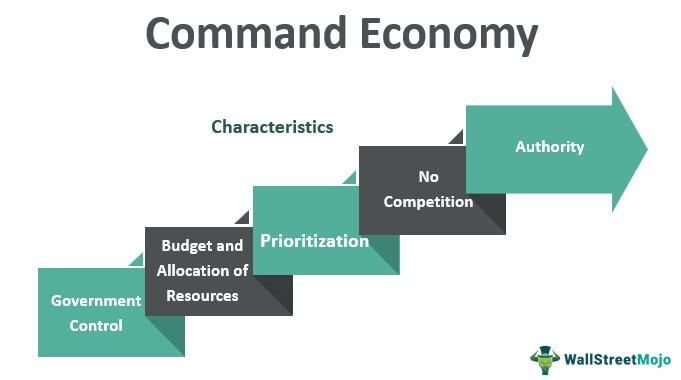

## Table of Contents

## What is a command economy?

A command economy is a type of economic system where the government makes all the big decisions about what to produce, how to produce it, and who gets the goods and services. Instead of people and businesses making choices based on what they want or need, the government plans everything. This kind of system is often found in countries with strong central governments, like communist or socialist countries.

In a command economy, the government might set prices, control wages, and decide how much of each product should be made. The goal is often to make sure everyone has what they need, but it can lead to problems like shortages or surpluses because the government might not always guess correctly what people want. For example, if the government decides to produce too many shoes and not enough food, people might have lots of shoes but not enough to eat.

## How does a command economy differ from a market economy?

In a command economy, the government decides everything about what to make, how to make it, and who gets it. The government plans the whole economy, setting prices and controlling how much of each thing is produced. The idea is to make sure everyone gets what they need, but sometimes the government might make mistakes, like making too many shoes and not enough food. Countries with strong central governments, like those with communist or socialist systems, often use command economies.

A market economy is very different. In this system, people and businesses make their own choices about what to buy and sell. Prices are set by what people are willing to pay, not by the government. If lots of people want something, the price goes up, and if nobody wants it, the price goes down. This is called supply and demand. The goal is to let people decide for themselves what they want, but it can lead to some people having more than others. Most capitalist countries, like the United States, use market economies.

The main difference between the two is who makes the decisions. In a command economy, it's the government, while in a market economy, it's the people and businesses. Both systems have their pros and cons, and some countries even mix elements of both to try and get the best of both worlds.

## What are the main characteristics of a command economy?

In a command economy, the government is in charge of everything about the economy. They decide what should be made, how it should be made, and who gets it. This means the government sets the prices for things and controls how much of everything is produced. The idea behind this is to make sure everyone has what they need, like food, clothes, and homes. Countries that have strong central governments, like those with communist or socialist systems, often use command economies.

One big thing about command economies is that they can lead to problems. Sometimes, the government might guess wrong about what people want or need. For example, they might make too many shoes and not enough food. This can cause shortages or surpluses, which means people might not have enough of what they really need. Also, because the government is making all the choices, there might not be as much room for new ideas or businesses to start up.

## Can you provide examples of countries that have implemented a command economy?

Some countries that have used command economies are the Soviet Union and North Korea. The Soviet Union, which existed from 1922 to 1991, had a command economy where the government planned everything about what to make, how to make it, and who got what. They wanted to make sure everyone had what they needed, but sometimes they made mistakes, like making too many shoes and not enough food. This led to problems like shortages and long lines for basic things.

North Korea is another example of a country with a command economy. The government there decides what to produce, how to produce it, and who gets the goods. They aim to make sure everyone has enough, but like the Soviet Union, they can also make mistakes. For instance, they might produce too much of one thing and not enough of another, leading to shortages. This can make life hard for people because they might not always have what they need.

Cuba is also a country that has used a command economy, though it has been making some changes in recent years. The government in Cuba used to control everything about the economy, deciding what to produce and how to distribute it. The goal was to make sure everyone had enough, but it often led to shortages and a lack of new ideas or businesses. Recently, Cuba has been trying to mix in some market economy ideas to help solve these problems.

## What are the potential benefits of a command economy?

One big benefit of a command economy is that it can help make sure everyone has what they need. The government can plan to produce enough food, clothes, and homes for everyone. This means that in a command economy, the government can focus on making sure no one goes hungry or lives without a roof over their head. It's like having a big plan to take care of everyone, which can be really helpful, especially in tough times.

Another benefit is that a command economy can help a country grow quickly. When the government is in charge, it can decide to put a lot of effort into building things like roads, schools, and factories. This can make the country's economy stronger and help it grow faster than it might in a market economy. It's like having a big boss who can tell everyone what to do to make the country better, and that can lead to big improvements in a short time.

## How does a command economy aim to reduce inequality?

In a command economy, the government tries to make sure everyone has what they need, which can help reduce inequality. They do this by planning what to produce and how much, so there's enough food, clothes, and homes for everyone. The idea is to make sure no one goes hungry or lives without basic things, which means the gap between rich and poor can be smaller. By controlling prices and wages, the government can make sure everyone earns enough to live on and can afford what they need.

This system also aims to reduce inequality by focusing on the needs of all people, not just those who can pay more. In a command economy, the government can decide to build more schools and hospitals in poor areas, so everyone has a chance to get an education and stay healthy. By making these services available to everyone, the government helps to level the playing field, so people have more equal opportunities to improve their lives.

## What are the drawbacks of a command economy?

One big problem with a command economy is that the government might guess wrong about what people want or need. They might make too many shoes and not enough food, which can cause shortages. When there are shortages, people have to wait in long lines or go without things they really need. This can make life hard for everyone, because even if the government wants to help, they can make big mistakes that hurt people.

Another issue is that command economies can stop new ideas and businesses from starting up. When the government controls everything, there's not much room for people to try new things or start their own companies. This can slow down progress and make it hard for the country to grow and improve. It's like having one big boss making all the decisions, which can make it tough for new and different ideas to come to life.

## How can inefficiencies arise in a command economy?

In a command economy, inefficiencies can happen because the government might not always guess right about what people want. They might decide to make too many shoes and not enough food. This can cause shortages, where people have to wait in long lines or go without things they need. It's like trying to plan a big party without asking the guests what they want – you might end up with too much of one thing and not enough of another.

Another way inefficiencies can arise is because there's not much room for new ideas or businesses to start up. When the government controls everything, people might not be able to try new things or start their own companies. This can slow down progress and make it hard for the country to grow and improve. It's like having one big boss making all the decisions, which can make it tough for new and different ideas to come to life.

## What role does the government play in a command economy?

In a command economy, the government is like the big boss that decides everything. They choose what things should be made, how to make them, and who gets them. This means they set the prices for things and control how much of everything is produced. The idea is to make sure everyone has what they need, like food, clothes, and homes. Countries with strong central governments, like those with communist or socialist systems, often use command economies.

One big thing the government does in a command economy is to try and make sure everyone has enough. They plan to produce enough food, clothes, and homes for everyone. But sometimes, the government might guess wrong about what people want or need. For example, they might make too many shoes and not enough food. This can cause problems like shortages or surpluses, which means people might not have enough of what they really need.

## How does a command economy handle resource allocation?

In a command economy, the government decides how to use resources. They choose what things should be made, like food, clothes, and houses, and how much of each thing to make. The government looks at what they think people need and tries to make sure there's enough for everyone. This means they control the factories, farms, and other places where things are made. The goal is to make sure no one goes hungry or lives without basic things.

Sometimes, the government might make mistakes when deciding how to use resources. They might think people need more shoes than they actually do, so they make too many shoes and not enough food. This can cause problems like shortages, where people have to wait in long lines or go without things they need. Because the government is making all the choices, there might not be as much room for new ideas or for people to start their own businesses. This can slow down progress and make it hard for the country to grow and improve.

## What are the long-term sustainability issues in a command economy?

In a command economy, the government decides everything about what to make, how to make it, and who gets it. This can lead to long-term sustainability issues because the government might not always guess right about what people want or need. If they make too many shoes and not enough food, it can cause shortages. Over time, these mistakes can hurt the economy and make it hard for people to get what they need. It's like trying to plan a big party without asking the guests what they want – you might end up with too much of one thing and not enough of another, which isn't good for the long run.

Another problem is that command economies can slow down progress and innovation. When the government controls everything, there's not much room for people to try new things or start their own businesses. This can make it hard for the country to grow and improve over time. Without new ideas and businesses, the economy might not be able to keep up with changes in the world, like new technology or ways of doing things. This can make it tough for a command economy to stay strong and healthy in the long term.

## How have command economies evolved in the modern era?

In the modern era, command economies have started to change a lot. Some countries that used to have strict command economies, like China and Vietnam, have begun to mix in some ideas from market economies. They still have a strong government that plans a lot of things, but they also let people and businesses make some of their own choices. This mix is called a mixed economy, and it helps these countries grow faster and give people more freedom to start their own businesses and try new ideas. It's like having a big boss who still makes many decisions but also lets people have a say in some things.

These changes have helped command economies become more flexible and able to deal with new challenges. For example, China has grown a lot by letting some businesses operate more freely, which has brought in new technology and ideas. But even with these changes, the government still plays a big role in planning what to make and how to use resources. This balance can be tricky, but it shows that command economies are trying to find ways to stay strong and help their people in the long run. It's like learning to ride a bike with training wheels – you start with a lot of help, but slowly you learn to do more on your own.

## References & Further Reading

[1]: Bergstra, J., Bardenet, R., Bengio, Y., & Kégl, B. (2011). ["Algorithms for Hyper-Parameter Optimization."](https://papers.nips.cc/paper/4443-algorithms-for-hyper-parameter-optimization) Advances in Neural Information Processing Systems 24.

[2]: ["Advances in Financial Machine Learning"](https://www.amazon.com/Advances-Financial-Machine-Learning-Marcos/dp/1119482089) by Marcos Lopez de Prado

[3]: ["Evidence-Based Technical Analysis: Applying the Scientific Method and Statistical Inference to Trading Signals"](https://www.amazon.com/Evidence-Based-Technical-Analysis-Scientific-Statistical/dp/0470008741) by David Aronson

[4]: ["Machine Learning for Algorithmic Trading"](https://github.com/stefan-jansen/machine-learning-for-trading) by Stefan Jansen

[5]: ["Quantitative Trading: How to Build Your Own Algorithmic Trading Business"](https://www.amazon.com/Quantitative-Trading-Build-Algorithmic-Business/dp/1119800064) by Ernest P. Chan