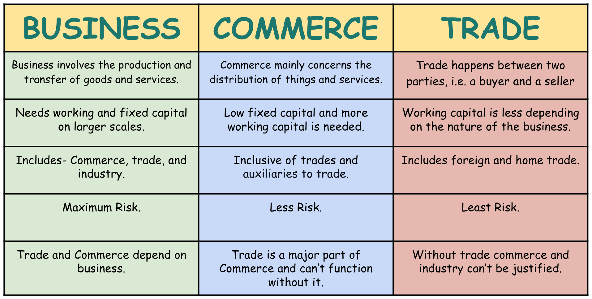

## Table of Contents

## What is commerce?

Commerce is the activity of buying and selling things. It is how people trade goods and services with each other. Commerce happens every day in many places, like stores, online, and even between countries. It helps people get what they need and want, and it also helps businesses make money.

There are different types of commerce. One type is business-to-consumer (B2C), where businesses sell things directly to people. Another type is business-to-business (B2B), where one business sells to another business. There is also electronic commerce, or e-commerce, which is buying and selling things over the internet. All these types of commerce help keep the economy moving.

## What is business?

Business is an activity where people make, buy, or sell things to earn money. It can be a small shop where someone sells homemade cookies, or a big company that makes cars. People start businesses because they want to offer something useful or enjoyable to others, and they also want to make a profit. A profit is what is left over after paying for all the costs of running the business.

There are many kinds of businesses. Some businesses make products, like clothes or computers. Others provide services, like haircuts or cleaning houses. Businesses can be owned by one person, a group of people, or even by the government. They all work to meet the needs and wants of people, and they help the economy grow by creating jobs and providing goods and services.

## What is trade?

Trade is when people or countries exchange goods and services with each other. It can happen between neighbors, within a country, or between different countries. When someone trades, they give something they have to get something they need or want. For example, a farmer might trade some of his apples for a carpenter's table.

Trade helps everyone by making more things available. If a country can grow lots of bananas but no wheat, they can trade bananas for wheat from another country that has plenty of wheat. This way, people in both countries can enjoy bananas and wheat. Trade can make life better by giving people more choices and helping them get things they couldn't make or grow themselves.

## How do commerce, business, and trade differ from each other?

Commerce, business, and trade are all connected but they are different in some ways. Commerce is the big picture of buying and selling things. It includes all the activities that happen when goods and services move from the producer to the consumer. Commerce can happen in many ways, like in stores, online, or between countries. It's all about the flow of goods and services and making sure they get to the people who need them.

Business is a smaller part of commerce. It's when someone starts a company or a shop to make, buy, or sell things to earn money. A business can be anything from a small bakery to a big car company. The main goal of a business is to make a profit, which is the money left after paying for all the costs. Businesses help drive commerce by producing and selling goods and services.

Trade is the act of exchanging goods and services between people or countries. It's a basic part of both commerce and business. Trade can be as simple as swapping apples for a table or as complex as countries trading large amounts of goods. Trade helps everyone by making more things available and giving people more choices. It's the foundation that helps commerce and business work together to meet people's needs and wants.

## Can you provide examples of activities that fall under commerce?

Commerce includes lots of things people do every day. When you go to a store and buy a toy, that's commerce. The store bought the toy from a company that made it, and now they are selling it to you. When you buy things online, like ordering a book from a website, that's also commerce. The website is selling you the book, and they might have bought it from a publisher or another seller.

Commerce also happens between businesses. For example, a restaurant might buy food from a supplier. The supplier sells the food to the restaurant, which then uses it to make meals for customers. This is part of commerce too. Another example is when a car company buys tires from a tire company. The car company needs the tires to finish making their cars, and the tire company sells them to make money.

These examples show how commerce is all about buying and selling things. It helps goods and services move from where they are made to where they are needed. Commerce is a big part of how we get the things we use every day.

## What are some common business activities?

Common business activities include making things and selling them. A business might make toys, clothes, or food. They use machines, workers, and materials to create these products. After making them, the business sells the products to stores or directly to people. They might also advertise to let people know about their products. All these steps help the business earn money.

Another common activity is providing services. This means doing something for someone else, like cutting hair, cleaning houses, or teaching. Businesses that provide services often need to talk to customers to find out what they need. They might also need to hire people with special skills to do the work. By offering good services, these businesses can make money and keep their customers happy.

Some businesses also do things like keeping track of money, planning for the future, and making sure they follow the law. These activities help the business run smoothly and stay successful. Whether they are making products or providing services, all these activities are important parts of running a business.

## What types of trade exist and how do they function?

Trade can be split into two main types: domestic trade and international trade. Domestic trade happens inside one country. It's when people or businesses in the same country buy and sell things to each other. For example, a farmer in one state might sell apples to a store in another state. This helps goods move around the country and makes sure people can get what they need.

International trade is when countries trade with each other. One country might have a lot of something, like oil, and they can trade it for something another country has a lot of, like cars. This kind of trade helps countries get things they can't make themselves. It can make life better for people in both countries by giving them more choices and helping their economies grow.

Both types of trade are important for keeping goods and services moving. They help people and businesses get what they need and want. By trading, countries and people can work together to make life better for everyone.

## How do legal regulations impact commerce, business, and trade?

Legal regulations are rules made by governments that affect how commerce, business, and trade work. These rules help keep things fair and safe for everyone. For commerce, regulations might set standards for how goods are made and sold. For example, there are rules about food safety that businesses must follow to make sure what they sell is safe to eat. These rules help protect customers and make sure they get good quality products.

For businesses, legal regulations can cover many things like how they treat their workers, how they handle their money, and how they advertise their products. For instance, there are laws about minimum wage, which means businesses have to pay their workers a certain amount. There are also rules about taxes, which businesses have to pay to the government. These regulations help make sure businesses act responsibly and treat people fairly.

In trade, legal regulations can affect how countries buy and sell things with each other. There are rules about tariffs, which are taxes on goods that come from other countries. These can make some things more expensive and affect how much trade happens. There are also agreements between countries that set rules for trade, like how much of a certain product one country can sell to another. These regulations help manage trade and make sure it is fair for everyone involved.

## What role does technology play in modern commerce, business, and trade?

Technology has changed the way we do commerce, business, and trade a lot. In commerce, technology has made it easy to buy and sell things online. This is called e-commerce. Now, people can shop from their homes using computers or phones. Websites and apps help people find what they want quickly. Technology also helps businesses keep track of what they have and what they need to buy. This makes everything run smoother and helps businesses make more money.

In business, technology helps in many ways. It makes it easier for businesses to talk to their customers and other businesses. They can use emails, social media, and video calls to reach people all over the world. Technology also helps businesses make things better and faster. Machines and computers can do a lot of the work, which saves time and money. This helps businesses grow and offer more to their customers.

Technology also plays a big role in trade. It makes it easier for countries to trade with each other. Ships, planes, and trucks use technology to move goods quickly and safely. Computers help keep track of where everything is and when it will arrive. This makes trade faster and more reliable. Technology also helps with things like money. Now, businesses can pay each other in different countries easily using online systems. This helps trade happen smoothly and helps the world's economy grow.

## How do global economic trends affect commerce, business, and trade?

Global economic trends can really change how commerce, business, and trade work. When the world's economy is doing well, people and businesses feel confident and spend more money. This means more buying and selling, which helps commerce grow. Businesses can sell more of their products and services, so they might hire more workers and make more things. Trade between countries also increases because there is more demand for goods. But if the economy is not doing well, people might spend less money. This can slow down commerce because fewer things are being bought and sold. Businesses might have to cut back, and trade between countries can go down too.

These trends can also affect what kinds of goods and services people want. For example, if a new technology becomes popular around the world, businesses that make or use that technology might do really well. This can lead to more commerce and trade in those areas. On the other hand, if there's a big problem like a global health crisis, people might change what they buy. They might focus more on things they need, like food and medicine, instead of things they want, like new clothes or electronics. This can change what businesses sell and how they trade with other countries.

## What are the challenges faced by businesses in international trade?

Businesses that do international trade face many challenges. One big challenge is dealing with different rules in different countries. Each country has its own laws about what can be bought and sold, how much tax has to be paid, and how goods need to be made. This can make it hard for businesses to know what they need to do to sell their products in another country. They might need to spend a lot of time and money to make sure they follow all the rules.

Another challenge is the cost and time it takes to move goods around the world. Shipping things from one country to another can be expensive and can take a long time. If there are problems like bad weather or strikes, it can take even longer. This can make it hard for businesses to get their products to customers on time. They might also have to pay extra for things like insurance to make sure their goods are safe during the trip.

There are also challenges with money and language. When businesses trade with other countries, they have to deal with different kinds of money. The value of money can change, which can make it hard to know how much things will cost. Language can be a problem too. If people in different countries speak different languages, it can be hard to talk about business deals and make sure everyone understands each other. These challenges can make international trade difficult, but many businesses find ways to overcome them and succeed.

## How can understanding the differences between commerce, business, and trade help in strategic planning for a company?

Understanding the differences between commerce, business, and trade can help a company make better plans. Commerce is all about buying and selling things, so a company needs to know how to move their products from where they are made to where people will buy them. By understanding commerce, a company can plan how to get their products to customers in the best way. This might mean using online stores or working with other businesses to sell their products. Knowing about commerce helps a company see the big picture of how goods and services move around.

Business is about making, buying, or selling things to make money. A company needs to think about how to make their products or services and how to sell them to make a profit. This includes planning how to make things, how much to charge, and how to reach customers. Understanding business helps a company focus on what they do best and how to make money from it. It's important for a company to know how to run smoothly and grow.

Trade is about exchanging goods and services between people or countries. For a company that wants to sell things in other countries, understanding trade is key. They need to know about the rules in different countries, how to move goods, and how to deal with different kinds of money. By understanding trade, a company can plan how to sell their products around the world and make sure they follow all the rules. This helps them reach more customers and grow their business.

## References & Further Reading

[1]: Bergstra, J., Bardenet, R., Bengio, Y., & Kégl, B. (2011). ["Algorithms for Hyper-Parameter Optimization."](https://papers.nips.cc/paper/4443-algorithms-for-hyper-parameter-optimization) Advances in Neural Information Processing Systems 24.

[2]: ["Advances in Financial Machine Learning"](https://www.amazon.com/Advances-Financial-Machine-Learning-Marcos/dp/1119482089) by Marcos Lopez de Prado

[3]: ["Evidence-Based Technical Analysis: Applying the Scientific Method and Statistical Inference to Trading Signals"](https://www.amazon.com/Evidence-Based-Technical-Analysis-Scientific-Statistical/dp/0470008741) by David Aronson

[4]: ["Machine Learning for Algorithmic Trading"](https://github.com/stefan-jansen/machine-learning-for-trading) by Stefan Jansen

[5]: ["Quantitative Trading: How to Build Your Own Algorithmic Trading Business"](https://www.amazon.com/Quantitative-Trading-Build-Algorithmic-Business/dp/1119800064) by Ernest P. Chan