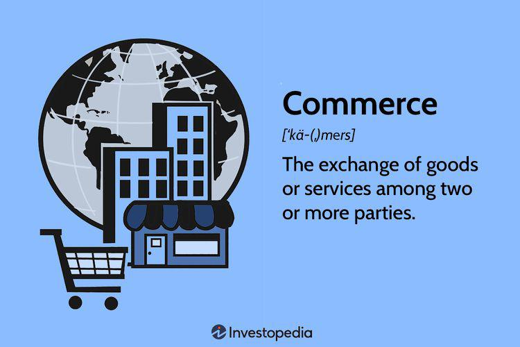

In recent years, algorithmic trading, often referred to as 'algo trading', has significantly transformed trade and commerce. This transformation is especially apparent in how financial markets operate today—marked by high-speed transactions and increased market volatility. Algorithmic trading involves using computer algorithms to automatically execute trades based on specific, predefined criteria. This technology-driven approach seeks to optimize the speed and efficiency of trading processes by capitalizing on market inefficiencies that human traders may miss due to slower reaction times or emotional biases.

The rise of algo trading aligns with the technological advancements that have pushed businesses to reevaluate how they engage in trade. As the pace of global markets accelerates, the ability to execute transactions within fractions of a second offers a competitive edge. By relying on algorithms, businesses improve precision and can reduce the time taken to execute trades, thereby minimizing costs and increasing profits.



Moreover, algorithmic trading presents an opportunity for businesses to focus on high-level strategic decision-making by automating the operational aspects of trading. This shift is paramount in a business environment where time is a critical factor in gaining or losing a financial edge. As algorithms handle the execution, firms can allocate resources to developing and refining trading strategies.

However, while algorithmic trading offers numerous benefits, it also presents challenges and risks. The dependence on sophisticated technology can lead to potential system failures, and the reliance on speed can exacerbate market situations during periods of high volatility, sometimes leading to phenomena like flash crashes. Companies must navigate these risks by ensuring their strategies are robust and compliant with evolving financial regulations.

In this article, we will explore the intricate intersection of trade, commerce, and algorithmic trading, underscoring its critical role in the modern financial landscape. We will discuss how algo trading functions, its benefits and limitations, and its impact on the business world.

## Table of Contents

## What is Algorithmic Trading?

Algorithmic trading, commonly known as 'algo trading', refers to the use of computer algorithms to execute trading orders based on a set of predefined instructions or criteria. This approach involves leveraging mathematical models, statistical analysis, and high-speed data processing capabilities to make trading decisions in financial markets.

The fundamental aspect of [algorithmic trading](/wiki/algorithmic-trading) lies in its ability to minimize the time required for executing trades. It achieves this through automated systems that can process information and execute transactions with speed and accuracy that surpasses human capabilities. This swift execution enables traders to capitalize on short-lived market inefficiencies, such as [arbitrage](/wiki/arbitrage) opportunities or discrepancies in pricing.

Algo trading is designed to remove emotional biases from the trading process, ensuring that decisions are driven by data and logical criteria rather than human emotions. For instance, an algorithm might be programmed to buy a security when its price reaches a certain level or sell it when specific market conditions are met. These algorithms can operate continuously and consistently in various market conditions.

Despite its inherent complexity, algorithmic trading provides an efficient mechanism for trade execution. It combines elements of computer science, financial theory, and quantitative analysis, making it a sophisticated tool used predominantly by institutional investors and brokerage firms. Algorithms can also execute trades multiple times in milliseconds, a process known as high-frequency trading ([HFT](/wiki/high-frequency-trading-strategies)), further pushing the boundaries of trade execution speed.

In practice, algorithmic trading can be represented in code, such as Python. Below is an illustrative example of a simple trading algorithm that executes a buy order when a stock's moving average price is below its current price:

```python
def moving_average(values, window):
    """Calculate moving average using a sliding window."""
    weights = np.repeat(1.0, window) / window
    smas = np.convolve(values, weights, 'valid')
    return smas

def trade_signal(prices, window):
    """Determine buy/sell signal based on moving average strategy."""
    moving_avg = moving_average(prices, window)
    signal = []
    for i in range(1, len(moving_avg)):
        if prices[i] > moving_avg[i]:
            signal.append('buy')
        else:
            signal.append('hold')
    return signal
```

In this example, the code computes a simple moving average of past prices and generates a 'buy' signal when the current price exceeds the moving average. This exemplifies how specific conditions can be codified into an algorithm to automate trading decisions, illustrating the application of algorithmic trading in practical scenarios.

## The Role of Algorithmic Trading in Modern Commerce

Algorithmic trading has become an essential component of modern commerce, transforming the mechanics of trading by leveraging technology to execute transactions with exceptional speed and precision. The automation of trading processes, made possible by sophisticated algorithms, enables businesses to conduct transactions at volumes and speeds unattainable by traditional manual methods.

At its core, algorithmic trading uses computer algorithms to execute buy and sell orders automatically based on pre-defined trading strategies. These strategies can involve intricate mathematical models that exploit market inefficiencies, detect trading signals, or follow specific trading rules. The ability to execute trades rapidly is crucial in contemporary markets where opportunities may only exist for fractions of a second.

The integration of algorithmic trading into commerce alleviates the need for manual intervention, which traditionally encompassed labor-intensive tasks prone to human error. By automating the execution process, businesses can focus on higher-level strategic decision-making, such as crafting trade strategies and managing risks, rather than concentrating on the operational details. This shift allows companies to optimize resource allocation and improve overall efficiency.

Moreover, the precision afforded by algorithmic trading minimizes slippage—where the actual execution price differs from the expected price due to rapid market movements—and improves the accuracy of trades. This precision is vital for businesses engaging in high-frequency trading, where even minor delays can result in significant financial discrepancies.

In sum, algorithmic trading serves as an integral facet of modern commerce by revolutionizing how trading operations are conducted, offering businesses a method to significantly enhance their trading capabilities, all while allowing them to concentrate on strategic development and market position enhancement.

## Benefits of Algorithmic Trading for Businesses

Algorithmic trading presents numerous advantages for businesses, crucially by enhancing the speed and efficiency of transactions. In contemporary financial markets, where timing is key, the ability of algorithms to execute trades within microseconds provides a decisive competitive edge. This high-speed execution is achieved through the deployment of sophisticated algorithms that scan multiple markets and execute orders instantaneously, minimizing market impact and reducing the likelihood of price slippage.

Furthermore, the implementation of algo trading significantly reduces transaction costs. By automating the trading process, businesses eliminate the need for manual intervention, thereby decreasing labor costs associated with trading operations. Additionally, automated systems are less prone to human errors, such as calculation mistakes or delayed decision-making, which can lead to costly trade missteps.

Another critical advantage of algorithmic trading is the ability to backtest trading strategies against historical data. Backtesting involves simulating a trading strategy on past market data to evaluate its potential performance. This process allows firms to optimize their trading decisions, improving the effectiveness of their strategies before they are deployed in live markets. By adjusting parameters and testing various models, businesses can refine their algorithms to better adapt to market conditions, thus enhancing their strategic approach.

Python, a popular programming language in algorithmic trading, offers libraries such as pandas and numpy for data manipulation and quantitative analysis, facilitating the [backtesting](/wiki/backtesting) process. For example, a simple Python script to backtest a moving average crossover strategy could involve calculating the short-term and long-term moving averages of a stock price and generating buy or sell signals based on their crossover points.

In summary, the adoption of algorithmic trading equips businesses with the tools to execute trades rapidly and efficiently, reduce associated costs, and optimize trading strategies through backtesting, thereby reinforcing their competitive position in dynamic financial markets.

## Challenges and Limitations

Algorithmic trading, while offering significant efficiencies, comes with its own set of challenges and limitations. One major challenge is the heavy reliance on technology. Algorithmic trading systems depend on sophisticated hardware and software to function effectively. A failure in any component of these systems could lead to significant financial losses. For example, network latency or server outages can disrupt the timely execution of trades, resulting in missed opportunities or unintended financial exposure.

Furthermore, algorithmic trading systems are susceptible to errors like bugs in the trading code. Such errors can lead to incorrect trading signals, potentially causing substantial monetary losses. Regular maintenance and rigorous testing of these systems are crucial to mitigate such risks.

Market [volatility](/wiki/volatility-trading-strategies) presents another significant challenge. Algorithms programmed to react to specific market conditions may intensify market fluctuations, resulting in phenomena like flash crashes. During these events, trading algorithms can trigger a sudden and severe drop in asset prices, which may lead to a cycle of selling that further amplifies the volatility. A notable example is the Flash Crash of May 6, 2010, when the US stock market briefly plummeted due to automated trading strategies interacting in unforeseen ways. To minimize such risks, traders often incorporate circuit breakers and safe-guards within their algorithms to pause trading if abnormal activity is detected.

Regulatory compliance is another challenge facing algorithmic trading. Financial markets worldwide are subject to local and international regulations, which are continually evolving. Traders must ensure their algorithms comply with these regulations to avoid penalties. This requires constant updates to their systems to reflect the latest regulatory changes. For instance, markets may impose restrictions on high-frequency trading (HFT) practices that could necessitate a redesign of existing algorithms to align with new trading rules.

Moreover, regulatory bodies like the U.S. Securities and Exchange Commission (SEC) and the European Securities and Markets Authority (ESMA) closely monitor algorithmic trading activities. They implement guidelines to prevent market manipulation and ensure fairness and transparency in the marketplaces. This regulatory oversight demands businesses engaged in algorithmic trading to maintain comprehensive records of their trading activities and demonstrate accountability and adherence to all relevant compliance requirements. 

The balancing act of maintaining efficient algorithmic systems while safeguarding against these technological, market, and regulatory challenges requires strategic investments and a deep understanding of both the technical and legislative frameworks underpinning financial markets.

## Case Studies: Algorithmic Trading in Action

Algorithmic trading has been pivotal in transforming the strategies and financial outcomes of numerous companies worldwide. Several companies have successfully integrated these automated systems into their trading routines, achieving improved results as a consequence. Below are some notable case studies that illustrate the impact and lessons learned from implementing algorithmic trading strategies.

### Goldman Sachs

Goldman Sachs, a leading global investment banking and securities firm, is a prominent example of successful algorithmic trading integration. The firm has developed a robust suite of proprietary algorithmic trading strategies that account for a substantial portion of its equity trading [volume](/wiki/volume-trading-strategy). These algorithms have been designed to execute trades at optimal times to minimize market impact and maximize returns.

#### Impact on Business Objectives and Market Positioning

The algorithmic trading strategies adopted by Goldman Sachs have significantly enhanced their market competitiveness. These strategies have allowed the firm to execute trades with precision and speed, thereby enabling it to capitalize on fleeting market opportunities and maintain a dominant position in the financial markets. The firm's ability to process vast amounts of data quickly and act on it has led to improved trading performance and profitability.

#### Lessons Learned

1. **Importance of Data-Driven Decision Making**: The success of Goldman Sachs underscores the critical role of data in driving trading decisions. Businesses that wish to emulate this success should prioritize the development of infrastructures capable of processing large datasets efficiently.

2. **Technological Investment**: Heavy investment in technology is crucial for developing and maintaining advanced trading algorithms. Companies must commit resources to build robust systems and infrastructure.

### Renaissance Technologies

Renaissance Technologies, a quantitative [hedge fund](/wiki/hedge-fund-trading-strategies), is another example that highlights the power of algorithmic trading. Founded by Jim Simons, Renaissance is famous for its Medallion Fund, which has delivered unprecedented returns using complex mathematical models for trading.

#### Impact on Business Objectives and Market Positioning

Renaissance Technologies' algorithmic strategies allow it to analyze patterns in financial markets that are imperceptible to human traders. This advanced pattern recognition capability has enabled the fund to achieve consistent returns, far outstripping those of traditional hedge funds. Consequently, Renaissance has positioned itself as a market leader in the use of [quantitative trading](/wiki/quantitative-trading) models.

#### Lessons Learned

1. **Leveraging Mathematical Expertise**: Renaissance illustrates how deep mathematical expertise can be leveraged to create competitive advantages in trading. Firms engaging in algorithmic trading should consider hiring specialists in mathematics and data science.

2. **Continuous Innovation**: The sustained success of Renaissance emphasizes the need for continual research and innovation to adapt to ever-changing market conditions.

### Citadel Securities

Citadel Securities, a market maker and trading firm, showcases another successful application of algorithmic trading. The firm uses sophisticated algorithms to provide [liquidity](/wiki/liquidity-risk-premium) and facilitate trading on a global scale.

#### Impact on Business Objectives and Market Positioning

Algorithmic trading at Citadel Securities has enabled the firm to maintain tight bid-ask spreads and offer competitive pricing to clients. This capability has bolstered its reputation as a trusted liquidity provider, strengthening its position as a major player in the global markets.

#### Lessons Learned

1. **Efficiency in Trade Execution**: Citadel demonstrates the importance of algorithmic trading in improving trade execution efficiency, which benefits both the firm and its clients.

2. **Market Flexibility**: Algorithms provide the flexibility needed to respond swiftly to market changes, allowing Citadel to maintain its competitive edge.

### Conclusion

The integration of algorithmic trading has proven highly beneficial for companies like Goldman Sachs, Renaissance Technologies, and Citadel Securities. These case studies reveal that successful implementation requires a deep commitment to technological advancement, data analytics, and continuous innovation. Other businesses considering algorithmic trading can draw valuable insights from these examples, learning the importance of infrastructure investment, leveraging expert knowledge, and maintaining adaptability in an evolving market landscape.

## The Future of Algorithmic Trading in Trade Commerce

Algorithmic trading is poised to undergo significant transformations, driven by the increasing adoption of [artificial intelligence](/wiki/ai-artificial-intelligence) (AI) and [machine learning](/wiki/machine-learning) technologies. These advancements allow for the development of more sophisticated trading strategies that can analyze and adapt to market conditions in real-time. AI-driven algorithms can process vast datasets more efficiently, enabling traders to uncover complex patterns and make more informed decisions. As AI technology continues to evolve, algorithmic trading is expected to become even more precise and effective.

Emerging markets present a fertile ground for the expansion of algorithmic trading. As these markets develop, the integration of advanced trading technologies could play a crucial role in enhancing market efficiency and liquidity. This adoption could lead to a more interconnected global trading environment, where information and execution speed are paramount. For instance, as infrastructure and regulatory frameworks in emerging economies mature, there is potential for a significant uptake in high-frequency trading, which could further integrate these markets into the global trading system.

Evolving technologies such as quantum computing and blockchain also hold promise for the future of algorithmic trading. Quantum computing could vastly increase the speed at which algorithms process information, potentially revolutionizing the way trades are executed. Meanwhile, blockchain technology could provide enhanced transparency and security, addressing some of the regulatory and ethical concerns associated with algorithmic trading. This combination of speed and security may enable traders to execute more complex strategies with reduced risk.

Additionally, the integration of Internet of Things (IoT) devices and real-time data analytics into trading ecosystems may provide traders with unprecedented levels of market insight. For example, IoT devices could offer real-time updates on supply chain conditions or market demand fluctuations, allowing algorithms to adjust trading strategies accordingly. This integration is likely to enhance decision-making processes and create opportunities for traders to capitalize on new market trends quickly.

As algorithmic trading continues to evolve, the industry must also navigate challenges such as regulatory compliance and ethical considerations. With the rapid pace of technological advancements, regulatory bodies face the task of adapting existing frameworks to address potential systemic risks. Ensuring that algorithmic trading practices align with ethical standards will be crucial in maintaining market integrity and investor trust.

Overall, the future of algorithmic trading in trade commerce appears promising, driven by technological innovations and expanding market opportunities. Businesses that adapt to these changes are likely to gain significant competitive advantages, benefiting from increased efficiency and better strategic positioning in an ever-evolving global marketplace.

## Conclusion

Algorithmic trading stands as a revolutionary force in modern commerce, fundamentally changing how transactions are executed across various markets. Its introduction has led to unprecedented levels of transaction speed and accuracy, allowing businesses to capitalize on fleeting opportunities that would otherwise be missed due to human limitations. By automating the trade execution process, algorithmic trading minimizes human intervention, thus reducing emotional biases that can often influence trading decisions adversely.

The businesses leveraging algorithmic trading gain a significant edge through enhanced efficiency and strategic insights. By utilizing algorithmic systems, firms can not only execute trades swiftly but also manage large volumes of transactions without the manual oversight that was traditionally necessary. This efficiency is crucial in the digital age, where the ability to respond rapidly to market changes can dictate competitive success. Moreover, the insights gained from algorithmic analyses allow companies to refine their strategies continually, ensuring they remain competitive in a landscape characterized by rapid technological advancement and evolving market dynamics.

As technology continues to advance, the role of algorithmic trading in trade commerce is expected to expand even further. Emerging technologies, such as artificial intelligence and machine learning, promise to enhance the capabilities of algorithmic systems, potentially allowing them to predict market trends more accurately and optimize trading strategies in real time. This progression not only heralds improved efficiency but also necessitates that businesses adapt and evolve continuously. Firms must invest in these advanced technologies and integrate them into their trading frameworks to maintain their competitive edge and meet the demands of a progressively digital market environment.

In conclusion, while algorithmic trading undoubtedly presents challenges—particularly related to technological dependencies and regulatory compliance—the benefits it offers are transformative. Businesses that effectively harness these technologies can achieve unprecedented levels of operational efficiency and strategic depth, positioning themselves for success in an increasingly competitive and technologically-driven marketplace. As the integration of algorithmic trading within trade commerce becomes ever more pronounced, the imperative for firms to embrace and evolve with these innovations only intensifies.

## References & Further Reading

[1]: Bergstra, J., Bardenet, R., Bengio, Y., & Kégl, B. (2011). ["Algorithms for Hyper-Parameter Optimization."](https://papers.nips.cc/paper/4443-algorithms-for-hyper-parameter-optimization) Advances in Neural Information Processing Systems 24.

[2]: ["Advances in Financial Machine Learning"](https://www.amazon.com/Advances-Financial-Machine-Learning-Marcos/dp/1119482089) by Marcos Lopez de Prado

[3]: ["Evidence-Based Technical Analysis: Applying the Scientific Method and Statistical Inference to Trading Signals"](https://www.amazon.com/Evidence-Based-Technical-Analysis-Scientific-Statistical/dp/0470008741) by David Aronson

[4]: ["Machine Learning for Algorithmic Trading"](https://github.com/stefan-jansen/machine-learning-for-trading) by Stefan Jansen

[5]: ["Quantitative Trading: How to Build Your Own Algorithmic Trading Business"](https://www.amazon.com/Quantitative-Trading-Build-Algorithmic-Business/dp/1119800064) by Ernest P. Chan