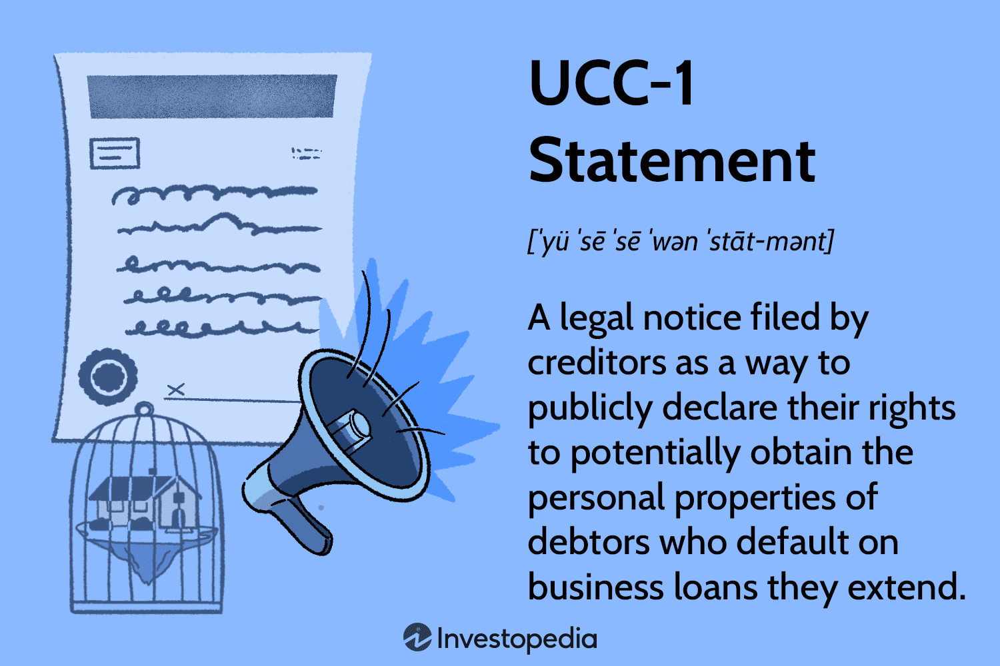

Commercial codes play a pivotal role in shaping business law by providing a standardized framework that governs commercial transactions. These codes aim to reduce uncertainty and complexity in business dealings, thereby promoting fairness and efficiency. Among the most influential codifications is the Uniform Commercial Code (UCC) in the United States, which serves as a comprehensive set of laws governing all aspects of commerce, from sales to secured transactions. The adoption of uniform standards such as the UCC has significantly facilitated interstate trade and helped in resolving disputes by providing clear guidelines that all parties must follow. This harmonization fosters smoother economic interactions and contributes significantly to the robust functioning of the business environment.

Algorithmic trading is a technological advancement that has revolutionized financial markets. It involves the use of computer algorithms to automatically execute trades based on predefined criteria. These algorithms can process vast amounts of data at speeds far beyond human capability, enabling market participants to make informed trading decisions rapidly. The benefits of algorithmic trading include increased market efficiency, narrower bid-ask spreads, and reduced transaction costs. It has become an integral part of modern finance, affecting everything from equities to commodities trading.



This article aims to explore the interaction between commercial codes, specifically the UCC, and algorithmic trading. The integration of these two domains highlights the need for an adaptive legal framework capable of accommodating rapid technological advancements without compromising legal standards. By examining their intersection, this article seeks to provide insights into how business law adapts to and governs evolving trading practices, ensuring that markets remain fair, efficient, and compliant with established commercial principles.

## Table of Contents

## Understanding the Commercial Code

A commercial code refers to a set of laws designed to regulate business and commercial transactions. Its primary purpose is to provide a uniform and consistent framework to facilitate commerce and address disputes, thereby promoting legal certainty and economic efficiency. By setting clear rules and standards, commercial codes reduce transaction costs and mitigate the risks associated with commercial activities. Businesses operating under such codes benefit from a predictable legal environment, which enhances trade and investment.

The Uniform Commercial Code (UCC) is a comprehensive set of laws governing commercial transactions in the United States. Developed in the mid-20th century, the UCC was created to harmonize state laws concerning sales, leases, bank deposits, collections, and other business-related matters. Its goal is to provide a standardized set of regulations across all U.S. states, ensuring that interstate and intrastate transactions are conducted under consistent legal standards. The UCC has been widely adopted, with all 50 states, the District of Columbia, and the U.S. territories implementing some or all of its articles, thereby playing a critical role in unifying commercial practices across the nation.

One of the primary roles of the UCC is to facilitate standardized commercial transactions. This is achieved through its detailed provisions covering various aspects of commercial law, including sales of goods, negotiable instruments, secured transactions, and more. For instance, Article 2 of the UCC addresses the sale of goods, defining the rights and obligations of buyers and sellers, warranties, and risk allocation. By establishing a common legal framework, the UCC eliminates discrepancies between state laws, thus reducing legal interpretation conflicts and promoting smoother, more predictable commercial interactions.

Moreover, the UCC plays a pivotal role in resolving disputes that arise in commercial transactions. Its comprehensive nature includes provisions for addressing breaches of contract, remedies, and dispute resolution mechanisms. By outlining clear legal standards and procedures, the UCC offers businesses and legal professionals a reliable basis for resolving conflicts, minimizing litigation costs, and providing swift settlements. This predictability in resolving disputes fosters confidence among parties engaging in commercial transactions and encourages business growth.

In summary, the commercial code serves as a vital tool in regulating commerce by providing a standardized and consistent legal framework for business transactions. The UCC, as a widely adopted model, exemplifies this by unifying commercial law across the United States, thereby facilitating efficient and equitable trade practices while offering robust mechanisms for dispute resolution.

## Overview of Algorithmic Trading

Algorithmic trading refers to the use of computer algorithms to automatically execute trading orders on financial markets with minimal human intervention. These algorithms make decisions based on pre-defined criteria, analyzing various market variables such as price, [volume](/wiki/volume-trading-strategy), and timing to optimize trading outcomes. The essence of [algorithmic trading](/wiki/algorithmic-trading) lies in its ability to process large volumes of data and execute trades at speeds unattainable by human traders. 

One of the main features of algorithmic trading is its speed. These algorithms can monitor multiple markets simultaneously and react to market changes in fractions of a second. This high-speed nature allows traders to capitalize on brief market inefficiencies, a capability that is especially vital in markets characterized by high [volatility](/wiki/volatility-trading-strategies). 

Efficiency is another significant benefit. Algorithmic trading reduces transaction costs by automating repetitive processes and minimizing the need for manual intervention. It enhances market [liquidity](/wiki/liquidity-risk-premium) by increasing the frequency of trades, which can lead to tighter spreads and more accurate prices. Furthermore, the automation of trading reduces the risk of human error, ensuring more consistent and disciplined trading strategies.

Several strategies characterize algorithmic trading, with high-frequency trading ([HFT](/wiki/high-frequency-trading-strategies)) being one of the most notable. HFT involves executing a large number of orders at extremely fast speeds, often exploiting short-lived market opportunities. This strategy relies on sophisticated algorithms to scan the markets and execute trades in milliseconds. Other common strategies in algorithmic trading include quantitative-based trading, such as statistical [arbitrage](/wiki/arbitrage), where traders use statistical models to identify trading opportunities, and [momentum](/wiki/momentum) trading, which seeks to capitalize on existing market trends.

The automation and precision inherent in algorithmic trading have transformed how financial markets operate, streamlining processes and enhancing the overall efficiency of trades. However, these advantages are balanced by challenges such as the need for robust risk management practices and the necessity for continuous updates to trading algorithms to adapt to ever-evolving market conditions.

## The Role of the UCC in Governing Algorithmic Trading

The Uniform Commercial Code (UCC) plays a significant role in governing algorithmic trading by providing a legal framework for ensuring standardized and reliable commercial transactions. In the context of modern trading environments, where electronic and automated systems are prevalent, the UCC's principles are essential for addressing contractual and legal issues that arise with algorithmic transactions. These issues include the formation of contracts, enforceability, and liability, which are critical when trading is conducted rapidly and often without direct human intervention.

Algorithmic trading systems operate based on pre-set rules and conditions, executing trades at high speeds. This automated nature necessitates clarity in contractual engagement to uphold the integrity and reliability of transactions. The UCC, particularly Articles 2 and 2A, which deal with sales and leases of goods, can be extended to cover transactions occurring through algorithmic means, as these trades often involve goods in the form of securities and financial products. The principles of offer, acceptance, consideration, and mutual assent remain foundational, even when algorithms negotiate and execute contracts.

One of the UCC's strengths in addressing electronic transactions is Article 2B, which addresses licensing in digital environments. While formally adopted as the Uniform Computer Information Transactions Act (UCITA) in some states, these provisions offer insight into handling digital contracts and agreements, pertinent to algorithmic trading. These legal structures ensure that the automation aspect doesn’t compromise the legality or the enforceability of contracts.

The UCC also provides guidelines for addressing performance issues and breaches in automated transactions. For instance, if an algorithm executes a trade based on erroneous coding or market data anomalies, the UCC offers mechanisms to resolve disputes, such as determining fair terms and conditions that were mutually understood by the parties involved via standard trade agreements.

Moreover, electronic signatures and records, pivotal in the speed-centric world of algorithmic trading, are recognized under UCC provisions aligned with the Electronic Signatures in Global and National Commerce Act (E-Sign Act). This alignment guarantees that contracts executed electronically have the same validity and enforceability as those executed in traditional paper form.

In summary, the UCC is instrumental in ensuring that the technological capabilities harnessed in algorithmic trading are encapsulated within a legal framework that upholds the traditional principles of contractual engagement and dispute resolution while adapting to the challenges posed by electronic and automated trading transactions.

## Legal Challenges in Algo Trading

Algorithmic trading, while offering numerous advantages in terms of speed and efficiency, also presents significant legal challenges, particularly concerning liability, intellectual property, and regulatory compliance. These challenges necessitate a careful examination to ensure the lawful execution of automated trading strategies.

Liability concerns in algorithmic trading primarily revolve around the enforcement of contracts that are autonomously executed by algorithms. Given that algorithms can execute thousands of trades in mere seconds, determining liability when issues arise can be complex. A primary concern is the identification of responsible parties when an algorithmic malfunction occurs, leading to significant financial losses or market disruptions. For instance, if an error in an algorithm's code leads to unauthorized transactions, the question arises: who bears the liability? Is it the developer, the financial institution deploying the algorithm, or the investor? Traditional contract law usually requires the establishment of intent and agreement between parties, but in algorithmic trading, these concepts need adaptation due to the automated nature of transactions. The Uniform Commercial Code (UCC) has begun addressing such concerns by recognizing electronic records and signatures, offering a legal basis for digital transactions.

Intellectual property (IP) issues are also prominent in algorithmic trading. Proprietary trading algorithms are considered valuable IP assets, and protecting them against unauthorized use or replication is critical for firms investing heavily in developing these technologies. Legal disputes can arise over the originality of algorithms, infringement claims, and the theft of algorithmic code. Companies need to ensure robust IP protection mechanisms, such as patents or trade secret laws, to safeguard their innovations. The dilemma often lies in the balance between sharing algorithms for audit and compliance purposes and preserving the confidentiality that affords competitive advantage.

Regulatory challenges are pervasive as financial markets aim to keep pace with technological innovations. Regulatory bodies, such as the Securities and Exchange Commission (SEC) in the United States, enforce compliance with market regulations through a comprehensive framework that governs algorithmic trading. Key regulations include stringent requirements for transparency, reporting, and monitoring of algorithmic activities to prevent market manipulation and ensure fair trading practices. Algorithmic traders must navigate regulations like the Markets in Financial Instruments Directive (MiFID II) in the European Union, which mandates detailed records of trading activities and the implementation of robust risk management systems. Compliance not only involves adhering to existing laws but also anticipating regulatory changes that accompany technological advancements. Firms must therefore maintain an adaptable compliance strategy that addresses current regulatory standards and prepares for potential future regulations.

In summary, while algorithmic trading continues to revolutionize financial markets, the accompanying legal challenges demand meticulous management. Addressing liability issues, safeguarding intellectual property, and ensuring regulatory compliance are fundamental to fostering a responsible and legally sound trading environment.

## Future Implications and Developments

Predictions about the increasing role of AI and [machine learning](/wiki/machine-learning) in algorithmic trading indicate a significant transformation of the financial markets. As these technologies advance, they enhance the ability to process vast amounts of data rapidly, improve decision-making processes, and foster the development of more sophisticated trading strategies. Artificial Intelligence (AI) and machine learning algorithms are increasingly used to identify patterns, optimize trades, and automate complex decision-making processes, which traditional trading methods might not efficiently handle.

The integration of AI in algorithmic trading could lead to changes in speed and accuracy. Sophisticated algorithms can continuously learn and adapt to new data trends, potentially offering a competitive edge and enabling traders to respond swiftly to market changes. For example, [reinforcement learning](/wiki/reinforcement-learning), a subset of machine learning, can be applied to develop algorithms that learn optimal trading strategies through trial and error interactions with the market environment.

```python
# Example of a simple reinforcement learning pseudo code for trading
import numpy as np

class TradingAgent:
    def __init__(self, n_actions, n_states):
        self.q_table = np.zeros((n_states, n_actions))
        self.learning_rate = 0.1
        self.discount_factor = 0.99
        self.epsilon = 0.1

    def choose_action(self, state):
        if np.random.rand() < self.epsilon:
            return np.random.randint(len(self.q_table[state]))
        return np.argmax(self.q_table[state])

    def update_q_table(self, state, action, reward, next_state):
        q_predict = self.q_table[state, action]
        q_target = reward + self.discount_factor * np.max(self.q_table[next_state])
        self.q_table[state, action] += self.learning_rate * (q_target - q_predict)

# Usage example
action_space = 3  # Buy, Hold, Sell
state_space = 5  # Different market states
agent = TradingAgent(action_space, state_space)
```

Potential legal developments are necessary to address these technological advances, especially considering data privacy, the complexities of autonomous decision-making, and the liabilities associated with algorithm-driven decisions. New regulations may need to focus on algorithm transparency to ensure fair practices, accountability measures to assign responsibility in case of trading malfunctions, and enhanced cybersecurity protocols to protect sensitive financial data.

Ongoing dialogue among legal scholars, practitioners, and regulators is crucial for navigating these changes. Collaborative efforts should aim to balance innovation and regulation, ensuring that advancements in algorithmic trading do not compromise market integrity. By fostering discussions on ethical AI use, data protection, and international regulatory standards, stakeholders can work together to create a resilient legal framework capable of adapting to continuous technological evolution. This dialogue is vital for fostering robust trading ecosystems that support stakeholder interests while maintaining a fair and efficient market landscape.

## Conclusion

The intersection of commercial codes and algorithmic trading highlights a complex yet critical area of modern finance and law. At the heart of this relationship is the need to continuously adapt legal frameworks to accommodate the rapid technological advancements in trading mechanisms. Commercial codes, such as the Uniform Commercial Code (UCC), have long provided a standardized approach to commercial transactions, aiming to simplify and harmonize the legal environment for businesses. As algorithmic trading becomes increasingly prevalent, these codes must evolve to encompass the intricacies of high-speed, automated decision-making processes that define this trading method. 

Algorithmic trading, characterized by its reliance on sophisticated algorithms to execute trades at speeds and scales beyond human capability, presents unique challenges to traditional legal constructs. It necessitates clear guidelines that address the automated nature of transactions, provide clarity on liability and intellectual property issues, and ensure enforcement of contracts formed between machines. The UCC and its principles remain relevant, but they require updates to specifically address these digital interactions, ensuring legal clarity and operational efficiency in the financial markets.

This evolving landscape underscores the necessity for an adaptive legal framework that not only acknowledges technological advancements but also supports innovation. An adaptive approach will aid in fostering a business environment where new technologies can thrive while maintaining rigorous compliance with established legal standards. This adaptation must be proactive, anticipating future developments such as the integration of [artificial intelligence](/wiki/ai-artificial-intelligence) and machine learning in trading algorithms, which will further test the robustness and flexibility of existing laws.

Moreover, effective and equitable markets will rely heavily on collaboration among legal scholars, practitioners, regulators, and industry stakeholders. Such collaboration is crucial for developing consensus-driven solutions and regulations that consider the interests of all parties involved, ultimately promoting transparency, fairness, and efficiency in trading practices. By working in tandem, these stakeholders can identify gaps in the current regulatory frameworks and propose actionable solutions to address future challenges in algorithmic trading.

In conclusion, the relationship between commercial codes and algorithmic trading illustrates both the opportunities and challenges posed by technology in financial markets. An adaptive legal framework, supported by collaborative efforts amongst stakeholders, is essential for balancing the dual objectives of promoting innovation and ensuring compliance, thus securing the integrity of evolving trading environments.

## References & Further Reading

1. **Articles and Books**:
   - "Algorithmic Trading: Winning Strategies and Their Rationale" by Ernest P. Chan. This book provides insights into the principles and strategies behind algorithmic trading, a key area for understanding how commercial codes may apply.
   - "The Uniform Commercial Code: An Overview" by the Legal Information Institute. This article offers a comprehensive overview of the UCC and its role in standardizing commercial transactions across U.S. states.
   - "Markets in Profile: Profiting from the Auction Process" by James F. Dalton. This book combines theories of market auctions with practical strategies, relevant for those analyzing the intersection of trading algorithms and commercial codes.

2. **Research Papers**:
   - "Legal Aspects of Algorithmic Trading and Alternative Trading Systems" by Alex B. Lipton. This paper explores the legal framework applicable to algorithmic trading and alternative trading systems.
   - "High-Frequency Trading and Its Impact on Market Quality" by Jonathan Brogaard. An in-depth examination of the effects of algorithmic trading strategies like high-frequency trading on the transparency and efficiency of financial markets.

3. **Legal Documents**:
   - The Uniform Commercial Code (UCC) text. Available through Cornell Law School’s Legal Information Institute, this is the primary legal document governing commercial transactions in the United States.
   - "Algorithmic Trading Compliance Guide" by the U.S. Securities and Exchange Commission (SEC). This document outlines the regulatory compliance requirements for firms engaged in algorithmic trading.

4. **Regulatory Bodies and Legal Institutions**:
   - U.S. Securities and Exchange Commission (SEC): [www.sec.gov](https://www.sec.gov) - The primary regulatory body overseeing securities markets in the United States, including rules relating to algorithmic trading.
   - Commodity Futures Trading Commission (CFTC): [www.cftc.gov](https://www.cftc.gov) - Responsible for regulating the U.S. derivatives markets, including futures, options, and swaps.
   - National Conference of Commissioners on Uniform State Laws (NCCUSL): [www.uniformlaws.org](https://www.uniformlaws.org) - This organization promotes uniformity of law by drafting model acts like the Uniform Commercial Code.

5. **Online Resources**:
   - Investopedia’s section on Algorithmic Trading: [www.investopedia.com](https://www.investopedia.com) - Provides definitions and explanations of various algorithmic trading strategies.
   - Bloomberg Law: [www.bloomberglaw.com](https://www.bloomberglaw.com) - Offers a comprehensive platform for legal research and developments related to commercial law and financial markets.

These resources provide a foundational understanding of the commercial codes and algorithmic trading while emphasizing the evolving legal landscape governed by these frameworks.

