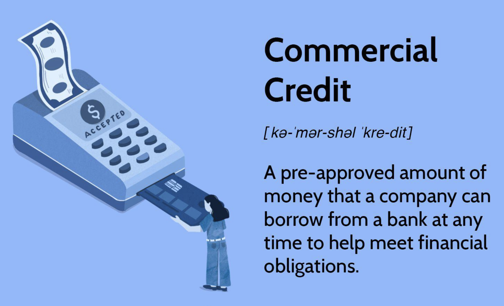

## Table of Contents

## What is commercial credit?

Commercial credit is a type of financing that businesses use to buy goods or services from other businesses. It's like a loan, but instead of getting cash, the business gets the products or services they need right away and pays for them later. This can help a business manage its cash flow better, because they don't have to pay for everything upfront.

Usually, commercial credit comes with terms that say when the business has to pay back the money. These terms can vary, but a common one is "net 30," which means the business has 30 days to pay after getting the goods or services. If the business doesn't pay on time, they might have to pay extra fees or interest. Commercial credit is important for many businesses because it helps them grow and operate smoothly without needing a lot of money right away.

## Why is commercial credit important for businesses?

Commercial credit is really important for businesses because it helps them buy things they need without having to pay right away. This is good because it lets businesses keep their money in the bank longer. They can use that money for other important things, like paying workers or buying more stuff to sell. It's like getting a loan, but instead of cash, they get the things they need to run their business.

Another reason commercial credit is important is that it helps businesses grow. If a business wants to get bigger, they might need to buy more supplies or hire more people. With commercial credit, they can do this without using all their cash. This means they can take on bigger projects or expand their business without worrying too much about money. It's a way for businesses to keep moving forward and getting bigger.

## What are the basic types of commercial credit?

There are a few main types of commercial credit that businesses can use. One type is trade credit, which is when a business buys things from another business and pays for them later. This is common when a business buys supplies or products. The terms of trade credit often say how long the business has to pay, like "net 30" which means they have 30 days to pay.

Another type is business loans, which are like regular loans but for businesses. A bank or another lender gives the business money, and the business has to pay it back over time with interest. Business loans can be used for many things, like buying equipment or expanding the business. The terms of the loan, like how long the business has to pay it back and how much interest they have to pay, can vary a lot.

Lastly, there's business credit cards. These work a lot like regular credit cards, but they're made for businesses. A business can use a credit card to buy things and pay for them later. They usually have to pay the card company every month, but they might not have to pay the full amount. Business credit cards often come with rewards or special deals that can help the business save money.

## How does a business qualify for commercial credit?

To qualify for commercial credit, a business usually needs to show that it's reliable and can pay back the money it borrows. This means having a good credit history, which shows that the business has paid its bills on time in the past. Lenders might also look at the business's financial statements to see how much money it makes and how much it owes. If the business has been around for a while and makes a good profit, it's more likely to get approved for commercial credit.

Different types of commercial credit might have different requirements. For trade credit, a business might need to have a good relationship with the supplier and a history of paying on time. For business loans, the lender might ask for a business plan or collateral, which is something valuable that the business owns and can give to the lender if it can't pay back the loan. Business credit cards might be easier to get if the business owner has a good personal credit score, but the business itself will still need to show that it can handle the payments.

## What are the differences between secured and unsecured commercial credit?

Secured commercial credit is when a business gives something valuable to the lender as a promise that it will pay back the money. This valuable thing is called collateral. If the business can't pay back the loan, the lender can take the collateral to make up for the money they're owed. Because the lender has this extra protection, they might give the business better terms, like a lower [interest rate](/wiki/interest-rate-trading-strategies) or a bigger loan. Common types of collateral include equipment, property, or inventory.

Unsecured commercial credit, on the other hand, doesn't need collateral. The lender gives the business money based only on the business's promise to pay it back. Because there's more risk for the lender, they might charge a higher interest rate or be stricter about who they lend to. Businesses usually need a really good credit history to get unsecured credit. This type of credit includes things like business credit cards and some types of business loans.

Both types of credit have their own benefits and risks. Secured credit can be easier to get and might have better terms, but the business risks losing its collateral if it can't pay back the loan. Unsecured credit is riskier for the lender, so it might be harder to get and more expensive, but the business doesn't have to worry about losing any specific assets if it can't pay.

## How do revolving credit lines work in commercial credit?

A revolving credit line in commercial credit is like a special kind of loan that a business can use over and over again. It's a bit like a credit card. The business can borrow money up to a certain limit, use it to buy things or pay for services, and then pay it back. Once they pay it back, they can borrow the money again. This can be really helpful for a business because it gives them a way to get money quickly when they need it, without having to apply for a new loan each time.

The business only has to pay interest on the amount of money they actually borrow, not the whole credit limit. For example, if they have a $50,000 revolving credit line but only use $10,000, they just pay interest on that $10,000. This can help the business manage its cash flow better, because they can take out money when they need it and pay it back when they have extra money. Revolving credit lines often come with a minimum payment each month, and if the business pays the full amount they borrowed, they can use the credit line again right away.

## What are trade credits and how do they function?

Trade credit is when one business buys things from another business and pays for them later. It's like getting a short-term loan from the supplier. For example, if a store buys products from a manufacturer, the manufacturer might let the store take the products now and pay for them in 30 days. This is called "net 30" terms. Trade credit helps businesses buy what they need without using all their money right away, which can be really helpful for managing cash flow.

The terms of trade credit can be different depending on the agreement between the businesses. Sometimes, if the buyer pays early, they might get a discount. For example, the terms might say "2/10, net 30," which means the buyer can get a 2% discount if they pay within 10 days, but they have to pay the full amount within 30 days. If the buyer doesn't pay on time, they might have to pay extra fees or interest. Trade credit is important because it helps businesses work together smoothly and keep their money flowing well.

## Can you explain the role of commercial credit in supply chain financing?

Commercial credit plays a big role in supply chain financing by helping businesses buy things they need without paying right away. In supply chain financing, a business might need to buy materials or products from a supplier, but they don't want to use all their cash. With commercial credit, the business can get these things now and pay for them later. This helps the business keep their money in the bank longer, so they can use it for other important things like paying workers or buying more stuff to sell.

This kind of financing also helps the whole supply chain work better. When a business uses commercial credit to buy from a supplier, the supplier gets paid faster because a bank or another financier might step in to pay the supplier right away. The business then pays the bank back over time. This makes everyone in the supply chain happier: the supplier gets their money quickly, and the business gets the things they need without using all their cash. It's a win-win situation that keeps the supply chain moving smoothly.

## What are the risks associated with commercial credit for both lenders and borrowers?

For lenders, the main risk with commercial credit is that the business might not pay back the money they borrowed. If a business can't pay, the lender loses money. This is a big problem with unsecured credit, where the lender doesn't have anything valuable from the business to take if they don't get paid. Even with secured credit, where the lender can take the business's collateral, the value of the collateral might not cover the full amount owed. Lenders also have to worry about economic changes that might make it harder for businesses to pay back their loans.

For borrowers, the big risk is that they might not be able to pay back the money they borrowed. If a business can't pay, they might have to pay extra fees or interest, which can make their financial problems worse. With secured credit, the business could lose important things like equipment or property if they can't pay. Using too much commercial credit can also hurt a business's credit score, making it harder to get more credit in the future. It's important for businesses to manage their commercial credit carefully to avoid these risks.

## How do credit ratings affect a business's ability to obtain commercial credit?

Credit ratings are really important when a business wants to get commercial credit. A credit rating is like a score that shows how good a business is at paying back money it borrows. If a business has a high credit rating, it means they have a good history of paying their bills on time. Lenders like banks or suppliers see this and think the business is less risky. Because of this, a business with a high credit rating can often get better terms on their credit, like lower interest rates or bigger loans. It's easier for them to get the money they need to buy things or grow their business.

On the other hand, if a business has a low credit rating, it means they might have had trouble paying back money in the past. This makes lenders worried that the business might not pay them back either. So, a business with a low credit rating might find it harder to get commercial credit. If they do get credit, the terms might not be as good. They might have to pay higher interest rates or only get a small amount of money. This can make it tougher for the business to buy what they need or grow, because they have to be more careful with their money.

## What advanced strategies can businesses use to manage their commercial credit effectively?

One advanced strategy for managing commercial credit effectively is to use a mix of different types of credit. A business can have trade credit for buying supplies, a revolving credit line for quick cash when needed, and a long-term business loan for big projects like expanding the business. By using different types of credit, the business can spread out its payments and keep its cash flow smooth. It's like having different tools in a toolbox – each one is good for a different job. This way, the business can take advantage of the best terms from each type of credit and not rely too much on just one source of money.

Another strategy is to always keep an eye on the business's credit score and financial health. A business should regularly check its credit reports to make sure there are no mistakes and that it's paying its bills on time. It's also smart to keep the business's debt at a level it can handle. If a business uses too much of its credit, it might hurt its credit score and make it harder to get more credit in the future. By staying on top of these things, a business can keep its credit rating high and get better terms on its commercial credit. This helps the business save money on interest and have more options for growing and managing its cash flow.

## How does commercial credit impact a company's financial statements and overall financial health?

Commercial credit impacts a company's financial statements by showing up as both an asset and a liability. When a company uses commercial credit to buy things, like supplies or equipment, it adds those things to its balance sheet as assets. But it also has to show the money it owes as a liability. This means the company's total assets go up, but so do its total liabilities. On the income statement, the cost of the things bought with commercial credit might be spread out over time as expenses, depending on what was bought. If the company has to pay interest on the credit, that interest also shows up as an expense on the income statement, which can lower the company's profit.

The way commercial credit affects a company's overall financial health depends on how well the company manages it. If a company uses commercial credit wisely, it can help the company grow and keep its cash flow smooth. For example, if a company uses credit to buy supplies and then sells those supplies for a profit, that's good for its financial health. But if the company borrows too much and can't pay it back, that's bad. It can hurt the company's credit score and make it harder to get more credit in the future. Plus, if the company has to pay a lot of interest, that can eat into its profits and make it harder to stay healthy financially. So, managing commercial credit well is really important for keeping a company's financial health strong.

## References & Further Reading

[1]: Bergstra, J., Bardenet, R., Bengio, Y., & Kégl, B. (2011). ["Algorithms for Hyper-Parameter Optimization."](https://dl.acm.org/doi/10.5555/2986459.2986743) Advances in Neural Information Processing Systems 24.

[2]: ["Advances in Financial Machine Learning"](https://www.amazon.com/Advances-Financial-Machine-Learning-Marcos/dp/1119482089) by Marcos Lopez de Prado

[3]: ["Evidence-Based Technical Analysis: Applying the Scientific Method and Statistical Inference to Trading Signals"](https://www.amazon.com/Evidence-Based-Technical-Analysis-Scientific-Statistical/dp/0470008741) by David Aronson

[4]: ["Machine Learning for Algorithmic Trading"](https://github.com/stefan-jansen/machine-learning-for-trading) by Stefan Jansen

[5]: ["Quantitative Trading: How to Build Your Own Algorithmic Trading Business"](https://www.amazon.com/Quantitative-Trading-Build-Algorithmic-Business/dp/1119800064) by Ernest P. Chan