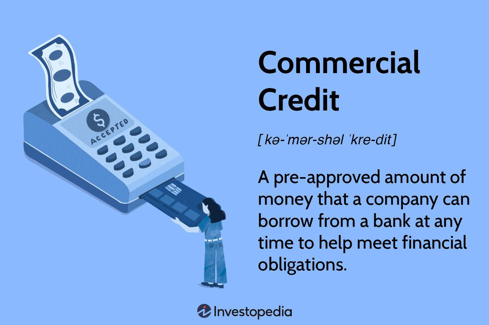

In the world of finance, understanding various credit types and their practical applications is essential for promoting individual and corporate growth. Credit serves as a cornerstone of financial activity, facilitating transactions and enabling both consumers and businesses to access resources beyond their immediate capital. This article examines diverse credit types, with particular attention given to commercial credit and the role of algorithmic trading in contemporary financial practices. 

Commercial credit serves as a critical tool for businesses, providing the liquidity needed to maintain and expand operations without immediate cash requirements. It can be secured by collateral or unsecured, each with distinct implications for both lenders and borrowers. Understanding these nuances allows businesses to leverage commercial credit effectively, optimizing their operational strategies.

Algorithmic trading, on the other hand, represents a sophisticated approach to financial markets, utilizing pre-programmed strategies to execute trades with speed and precision. By integrating algorithmic models, businesses can enhance their credit market operations, optimizing trading outcomes and improving liquidity. This convergence of credit mechanisms and algorithmic strategies exemplifies how advancements in technology can transform traditional financial operations.

This discussion aims to provide clarity on how diverse credit types, including commercial credit and algorithmic trading, contribute to business operations and economic activity. By examining the nature of these credit instruments and their strategic applications, readers will gain insights into how they can enhance both immediate financial needs and future growth potential. Let us commence our exploration by considering what defines a credit type and how it influences broader economic dynamics.

## Table of Contents

## Understanding Credit Types

Credit is essentially a financing arrangement where a borrower gains access to funds with the promise of repayment over time, usually with interest. It plays a critical role in the financial ecosystem by enabling individuals and businesses to leverage future earnings or income streams for current needs. Various credit types exist to cater to different financial requirements, ranging from personal needs to large-scale business operations. Each form of credit serves distinct purposes and comes with specific terms and conditions tied to its usage.

**Personal Loans:** Personal loans are typically unsecured credits extended to individuals. These loans provide flexibility for various personal expenses, such as medical bills, home renovations, or consolidating debt. The borrower agrees to refund the principal amount along with interest over a specified period.

**Mortgages:** A mortgage is a secured loan specifically used for purchasing real estate. The property being purchased serves as collateral, which reduces the risk for lenders and often results in lower interest rates compared to unsecured loans. The borrower is obliged to make regular payments over several years, usually spanning decades, to pay off the loan.

**Credit Cards:** Credit cards offer a revolving credit line that allows consumers to make purchases up to a certain limit. The credit card issuer charges interest on the unpaid balance if it isn't paid in full by the due date. This type of credit offers convenience and flexibility for short-term financial needs but can lead to high costs if used irresponsibly due to typically high-interest rates.

**Commercial Credit:** This credit type is utilized by businesses to meet operational needs and invest in growth opportunities. Commercial credit can be secured, with assets such as inventory or accounts receivable acting as collateral, or unsecured, based on the creditworthiness of the business. It includes lines of credit, trade credit, and commercial loans, each designed to enhance business liquidity and operations.

Understanding these types of credit is crucial for individuals and businesses to select the most suitable option based on their specific financial goals and strategies. Each credit form has unique implications on cash flow, risk, and cost, making it essential to align the choice of credit with one's economic objectives and repayment capability.

## Commercial Credit: Types and Examples

Commercial credit is a critical financial tool for businesses, facilitating their ability to address short-term [liquidity](/wiki/liquidity-risk-premium) challenges and support ongoing operations. This form of credit allows companies to access necessary funds, ensuring smooth business continuity and enabling strategic investments. The primary categories within commercial credit are secured and unsecured credit, each serving distinct purposes based on risk factors and financial strategies.

Secured commercial credit is characterized by the requirement of collateral, which provides lenders with a security interest in the borrower's assets. This collateral reduces the risk for the lender, thereby often resulting in lower interest rates for the borrower. Common types of collateral include real estate, inventory, and accounts receivable. This arrangement is beneficial for businesses seeking lower borrowing costs and willing to pledge assets to secure the loan.

Unsecured commercial credit, unlike its secured counterpart, does not necessitate collateral. This means lenders assume a higher risk, which typically translates into higher interest rates and more stringent approval processes for borrowers. Businesses with strong credit profiles or proven financial stability may often opt for unsecured credit to avoid pledging assets.

A practical example of commercial credit is the use of a revolving line of credit. This facility allows a company to borrow up to a specified limit and replenish the available funds by repaying amounts over time. For instance, a business might use a revolving line of credit to efficiently manage inventory purchases. By accessing funds quickly through this credit line, the company can capitalize on bulk purchase discounts or unexpected market opportunities without disrupting its cash flow.

In summary, understanding the nuances between secured and unsecured commercial credit can significantly impact a business’s financial strategy and cost of capital. These credit mechanisms not only offer flexibility but also support effective risk management and planning within businesses.

## Example of Commercial Credit Utilization

To illustrate the application of commercial credit, consider a manufacturing company that intends to purchase machinery available at a discounted price. This opportunity allows the company to upgrade its production capacity cost-effectively. However, the firm may not have immediate cash to complete the purchase. In this scenario, the company can utilize its commercial line of credit to access necessary funds quickly, demonstrating a strategic use of this financial instrument.

By using its commercial line of credit, the company can acquire the machinery without disrupting its operational cash flow. This approach offers several advantages:

1. **Capital Efficiency**: The company can seize discounted purchase opportunities immediately, avoiding the risk of losing potential cost savings due to capital constraints.

2. **Operational Continuity**: The firm maintains operational processes and cash reserves intact, ensuring continuity and stability in its day-to-day activities.

3. **Repayment Flexibility**: Once the machinery is operational and contributing to production, the company can repay the borrowed amount from its future revenue streams. This repayment strategy aligns the debt servicing with revenue generation, allowing the company to manage its finances efficiently.

The utilization of commercial credit in this scenario exemplifies how firms can enhance operational agility and market responsiveness. By strategically accessing funds, the company can align its financial planning with growth opportunities, ensuring its capacity to adapt swiftly to market demands or technological advancements.

Such strategic applications of commercial credit not only facilitate immediate business objectives but also strengthen the company's competitive positioning in the market. This underscores the importance of having a well-structured credit strategy in place, enabling enterprises to leverage opportunities as they arise.

## Algorithmic Trading and Credit Markets

Algorithmic trading is a sophisticated technique that uses automated systems to execute trades in financial markets. These systems rely on pre-determined instructions, taking into account variables such as timing, price, and [volume](/wiki/volume-trading-strategy). Its significance in large-scale financial markets is due to its ability to operate with unmatched speed and precision, critical factors in today's dynamic trading environments.

In credit markets, [algorithmic trading](/wiki/algorithmic-trading) offers the potential to enhance the way credit instruments are traded. By employing these advanced models, traders can increase market efficiency and liquidity. This improvement stems from the ability of algorithms to process vast amounts of data rapidly, identifying trading opportunities that might be missed manually. Moreover, algorithmic systems can seamlessly execute trades with reduced latency, minimizing price slippage that often occurs in fast-moving credit markets.

One of the notable advantages of algorithmic trading over traditional methods is its capability to manage complex credit risks. By integrating sophisticated risk management algorithms, organizations can better handle fluctuating interest rates and credit spreads. For example, these models can be designed to dynamically adjust trading positions in response to market changes, optimizing the risk-reward balance.

The strategic planning aspect of algorithmic trading in credit markets involves constructing trading strategies that align with organizational objectives. For instance, algorithms can be employed to implement [arbitrage](/wiki/arbitrage) strategies, where the slight price discrepancies between credit instruments in different markets are exploited for profit. These advanced trading techniques provide a competitive edge by allowing firms to capitalize on real-time market movements.

Furthermore, understanding and implementing algorithmic trading in credit markets can transform financial risk management. Traditional manual methods are often constrained by human error and slower execution speeds. In contrast, algorithms provide a disciplined approach to risk, offering tools such as stop-loss orders and automated hedging that can systematically reduce exposure to adverse market conditions.

Overall, the integration of algorithmic trading into credit markets not only exemplifies modern financial innovation but also offers new pathways for strategic financial management. This intersection between technology and finance enables organizations to navigate the complexities of credit markets with increased agility, accuracy, and foresight.

## The Intersection of Commercial Credit and Algo Trading

Combining the capabilities of commercial credit and algorithmic trading can significantly enhance a company's financial management and strategic planning. Algorithmic models enable companies to optimize their credit acquisition strategies by analyzing extensive datasets that forecast [interest rate](/wiki/interest-rate-trading-strategies) trends and market conditions. This optimization can lead to more favorable borrowing terms, timely access to credit, and reduced interest expenses.

Algorithmic trading automation ensures precision in the timing and execution of credit line utilization, reducing both credit risk and costs. By leveraging [machine learning](/wiki/machine-learning) algorithms, companies can predict cash flow needs and align them seamlessly with credit line drawdowns. This strategic alignment minimizes overdraft fees and maximizes the allocation of available funds, which is crucial for maintaining liquidity.

At this intersection, businesses find an innovative frontier, where traditional credit mechanisms meet advanced computational technologies. This synergy allows firms to become more financially resilient and adaptable, fostering competitive advantage in fluctuating markets.

By embracing these technological advancements, businesses can refine their financial strategies, ensuring that credit lines are accessed and utilized effectively, thus sustaining long-term financial health and operational agility. This convergence of traditional commercial credit usage with algorithmic precision reinvents financial strategy and exemplifies the ongoing evolution in financial markets.

## Conclusion

Navigating the complex landscape of credit requires a comprehensive understanding of its varied types, applications, and strategic uses. Commercial credit functions as a vital financial instrument, offering businesses the necessary flexibility to support their operations and manage liquidity efficiently. It facilitates immediate access to funds, enabling companies to seize market opportunities without disrupting cash flow, thereby enhancing operational agility and responsiveness.

On the technological frontier, algorithmic trading injects efficiency and precision into the execution of financial transactions. With its ability to process large volumes of data at high speed and make trades based on pre-defined criteria, algorithmic trading optimizes the management of credit instruments in the financial markets. This not only improves market liquidity but also helps in effectively managing organizational credit risks.

Combining commercial credit strategies with algorithmic trading creates a synergetic advantage. Businesses can refine their credit acquisition strategies using algorithmic models, optimizing interest expenses and enhancing cash flow management. Automation through algorithms allows for better timing and execution, reducing risks and fostering more favorable financial outcomes.

Incorporating insights from both commercial credit practices and trading technologies enables businesses not only to meet their immediate financial obligations but also to strategically position themselves for long-term growth. Staying informed and innovative in the utilization of credit and trading technologies is essential for driving sustainable financial success. This article underscores how important it is to cultivate such expertise in crafting robust financial strategies that thrive in today's dynamic markets.

## References & Further Reading

[1]: Bergstra, J., Bardenet, R., Bengio, Y., & Kégl, B. (2011). ["Algorithms for Hyper-Parameter Optimization."](https://dl.acm.org/doi/10.5555/2986459.2986743) Advances in Neural Information Processing Systems 24.

[2]: ["Advances in Financial Machine Learning"](https://www.amazon.com/Advances-Financial-Machine-Learning-Marcos/dp/1119482089) by Marcos Lopez de Prado

[3]: ["Evidence-Based Technical Analysis: Applying the Scientific Method and Statistical Inference to Trading Signals"](https://www.amazon.com/Evidence-Based-Technical-Analysis-Scientific-Statistical/dp/0470008741) by David Aronson

[4]: ["Machine Learning for Algorithmic Trading"](https://github.com/stefan-jansen/machine-learning-for-trading) by Stefan Jansen

[5]: ["Quantitative Trading: How to Build Your Own Algorithmic Trading Business"](https://www.amazon.com/Quantitative-Trading-Build-Algorithmic-Business/dp/1119800064) by Ernest P. Chan