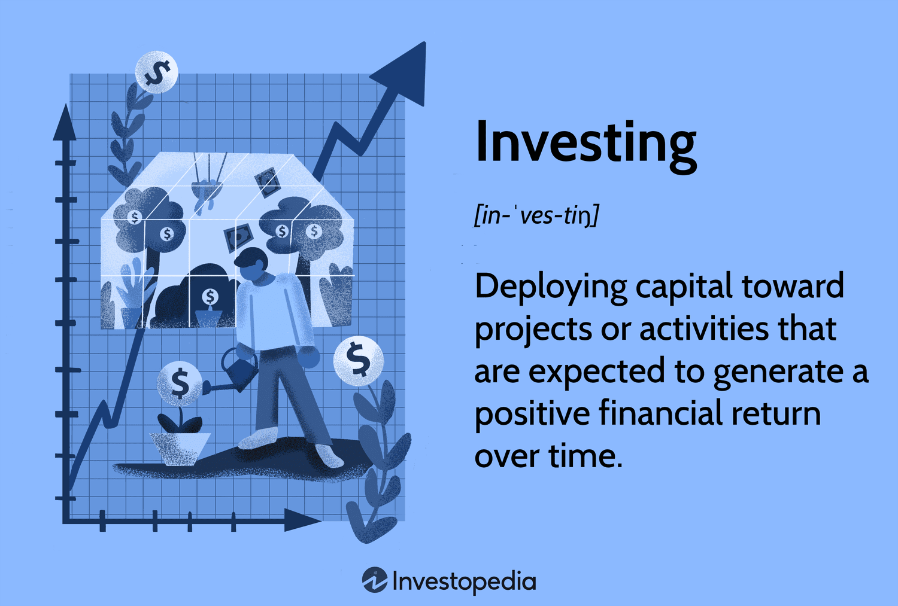

In today’s rapidly evolving financial landscape, commercial investment and algorithmic trading (algo trading) are gaining significant attention. These concepts represent the fusion of traditional financial strategies with modern technological advancements, offering new opportunities and challenges for investors. 

Commercial investment typically involves committing capital to for-profit enterprises, such as businesses or real estate, with the goal of generating ongoing revenue. These investments are designed to provide steady cash flow through the generation and sale of goods and services. As investment strategies evolve, they reflect broader economic trends and respond to changes in market dynamics, necessitating an up-to-date understanding of how commercial investments function and their potential impact on an investor's portfolio.



Algorithmic trading, on the other hand, employs sophisticated algorithms and computer programs to carry out trades in financial markets at high speed and precision. This approach allows traders to process vast amounts of data in milliseconds, optimizing decision-making and execution. As computational technology continues to advance, algo trading becomes more prevalent among both institutional and retail investors due to its efficiency and speed. The intersection of tech and finance through algo trading is reshaping the investment landscape, offering streamlined and potentially more effective methods for trading compared to traditional practices.

Understanding these financial tools is crucial for investors aiming to make informed decisions in pursuit of profitability. A comprehensive exploration of both commercial investment mechanics and algorithmic trading techniques can assist both novice and seasoned investors to navigate the complexities of the current financial ecosystem. By examining the strengths and weaknesses of each strategy, investors can better align their practices with their financial goals, risk tolerance, and the prevailing market conditions, leading to more sustainable and potentially lucrative outcomes.

## Table of Contents

## Understanding Commercial Investment

Commercial investment involves allocating resources to for-profit enterprises, aiming to generate a steady flow of income and potential capital appreciation. Typically, these investments span various sectors such as real estate, business ventures, or other profit-generating initiatives. They operate on the premise of generating revenue through the continuous sale of goods and services, providing investors a possible regular return on their investment.

Investing in commercial endeavors requires an understanding of different elements that influence profitability. For instance, commercial real estate investments, such as office buildings, shopping centers, or industrial properties, generate revenue primarily through leasing space to tenants. In this model, investors earn returns through rental income and potential appreciation of property value over time.

Another prominent area within commercial investments is business acquisitions or startup funding. Here, investors assess business models to predict potential profitability, considering factors like market demand, competitive analysis, and operational efficiency. Such investments necessitate a strategic approach to equity or debt financing, aiming at both short-term revenue and long-term growth.

The mechanics of commercial investments rest on several key principles. First, investors must evaluate the risk versus reward ratio, ensuring that potential returns justify the investment risks involved. This often involves assessing market trends, economic conditions, and financial health of the investment target.

When it comes to how these investments impact an investor’s portfolio, diversification is a crucial aspect. Incorporating a mix of commercial investment ventures can reduce overall portfolio risk by spreading exposure across different asset classes or sectors. For example, combining real estate investments with equity stakes in diverse industries can balance potential losses in one area with gains in another.

Overall, commercial investments are integral to constructing a resilient investment portfolio. By concentrating on assets that deliver regular income and have growth potential, investors can position themselves to capitalize on market opportunities while managing risk effectively.

## Pros and Cons of Commercial Investments

Commercial investments are attractive to many due to their potential to provide a consistent income stream and prospects for property value appreciation. These investments involve acquiring and managing assets like real estate or businesses with the goal of generating regular revenue through sales or rents.

### Advantages of Commercial Investments

One of the primary advantages of commercial investments is the potential for passive income. By investing in commercial properties or enterprises, investors can earn returns without being heavily involved in the day-to-day operations. This can be particularly appealing for those looking to diversify their income sources and achieve financial independence.

Additionally, commercial investments often have the potential for property value appreciation. Over time, as market conditions improve or as strategic enhancements are made to a property or business, the value of the investment can increase, providing equity growth alongside income generation. This dual benefit can lead to significant returns over the long term.

Commercial investments may also offer tax advantages. For instance, property depreciation can be used to offset taxable income, and certain expenses related to property management and operations can be deductible. These tax benefits can enhance the overall return on investment.

### Potential Pitfalls of Commercial Investments

Despite these benefits, commercial investments come with certain risks that must be carefully managed. Market [volatility](/wiki/volatility-trading-strategies) is a key concern, as changes in economic conditions can directly impact the demand for commercial properties or services offered by businesses. During economic downturns, occupancy rates can drop, and businesses may suffer reduced profitability, leading to lower income for investors.

There is also the potential for financial loss. If a commercial property or business underperforms, investors might face reduced income or even capital depletion. Such scenarios necessitate effective risk management strategies and a comprehensive understanding of market dynamics.

Moreover, investors must consider the management of unexpected property issues. Unlike residential investments, commercial properties often require more intensive maintenance and management efforts. Issues such as structural repairs, tenant disputes, and compliance with environmental regulations can arise, incurring additional costs and requiring active oversight.

In summary, while commercial investments offer promising opportunities for income and capital growth, they also demand judicious consideration of associated risks. Investors should thoroughly evaluate market conditions, anticipate potential challenges, and develop strategies to mitigate these risks, ensuring that their investment objectives align with their risk tolerance and financial goals.

 to Algorithmic Trading

Algorithmic trading, commonly referred to as algo trading, involves the use of computer programs and algorithms to automate the process of trading financial securities. Its primary objective is to execute orders at speeds and frequencies that are impossible for human traders. By leveraging mathematical models and complex formulas, these algorithms can make instantaneous decisions based on current market data and trends.

One of the defining characteristics of [algorithmic trading](/wiki/algorithmic-trading) is its ability to process vast amounts of information in milliseconds. This feature enables sophisticated analysis and strategic trade execution that aligns with market fluctuations. Algorithms can scan multiple markets and exchanges simultaneously, allowing for rapid transaction times, increased trading [volume](/wiki/volume-trading-strategy), and improved accuracy.

The workings of algo trading can be illustrated through simple mathematical expressions and programmed strategies. For instance, an algorithm might be designed to buy a stock when its short-term moving average (SMA) exceeds its long-term moving average, a strategy known as a moving average crossover. Mathematically, this can be expressed as:

$$
\text{Buy Signal: SMA}_{\text{short-term}} > \text{SMA}_{\text{long-term}}
$$

Python, a preferred language among quantitative traders, is frequently used for implementing these strategies. A basic example of a moving average crossover strategy can be implemented as follows:

```python
def moving_average(data, window_size):
    return data.rolling(window=window_size).mean()

# Example of moving average crossover strategy
def crossover_strategy(prices, short_window, long_window):
    short_ma = moving_average(prices, short_window)
    long_ma = moving_average(prices, long_window)
    buy_signals = short_ma > long_ma
    return buy_signals

# Assuming 'data' is a pandas DataFrame with stock prices
short_term_window = 40
long_term_window = 100
buy_signals = crossover_strategy(data['price'], short_term_window, long_term_window)
```

The popularity of algorithmic trading has escalated with advancements in technology. High-frequency trading ([HFT](/wiki/high-frequency-trading-strategies)), a subset of algo trading, capitalizes on this capability, executing numerous trades within microseconds. This speed advantage has made algo trading attractive to institutional investors, such as hedge funds and investment banks, as well as retail traders.

While the efficiency and speed offered by algorithmic trading provide significant advantages, they also necessitate advanced technological infrastructure and significant investment in software development. As a result, the adoption of algo trading continues to grow, reshaping trading landscapes by creating more competitive, liquid, and innovative financial markets.

## Pros and Cons of Algorithmic Trading

Algorithmic trading (algo trading) provides numerous advantages to investors, primarily due to its reliance on sophisticated algorithms and rapid computational capabilities. One of the most significant benefits is the improved execution speed. Utilizing high-frequency trading, algorithms can execute trades within milliseconds, capitalizing on minute price disparities that might be imperceptible to human traders. This increased speed directly correlates with reduced trading costs, as it minimizes the duration a trade order is exposed to market volatility, thereby potentially lowering the market impact costs associated with executing large trades.

Another notable advantage of algo trading is the reduction of emotional trading biases. Traditional trading decisions can often be influenced by human emotions such as fear or greed, leading to suboptimal outcomes. Algorithms, however, operate based on predefined criteria, ensuring that trading decisions remain consistent and free from emotional interference. This objectivity can lead to more disciplined execution of trading strategies, improving overall decision-making processes.

Algo trading also facilitates comprehensive risk management by allowing the monitoring and adjustment of positions in real time. With access to vast amounts of data and the ability to process this information rapidly, algorithms are adept at identifying risk factors and adjusting strategies accordingly. This capacity to handle large datasets efficiently enables them to perform complex calculations and analyses that are crucial for managing diversified investment portfolios.

Despite these advantages, algorithmic trading is not without its challenges. Technical glitches present a significant risk. For instance, algorithm coding errors or system failures can lead to erroneous trades or unintended market positions, potentially resulting in substantial financial losses. Moreover, the high initial costs associated with developing and maintaining algorithmic trading systems can be a barrier for smaller investors or firms with limited resources.

Market volatility is another concern. Algorithms, being designed on historical data, might not always successfully predict future market movements, especially in high-volatility segments. Furthermore, during periods of extreme market stress, the lack of human judgment can become a disadvantage if the algorithms fail to adapt promptly to unanticipated changes.

In summary, while algorithmic trading provides clear benefits in terms of speed, cost efficiency, and emotionless decision-making, it also requires significant investment in technology and infrastructure. The potential for technical failures and the unpredictable nature of market conditions are challenges that investors must consider when incorporating algorithmic trading into their strategies.

## The Role of Algo Trading in Commercial Investment

Algorithmic trading plays a crucial role in modern commercial investment by enhancing the efficiency and effectiveness of executing investment strategies. By utilizing complex algorithms and automated systems, investors can systematically manage vast portfolios and execute trades with precision and speed that manual processes simply cannot match. This technological advancement allows for the optimization of trade timing, which is essential in maximizing returns and minimizing risks inherent in market fluctuations.

One of the primary advantages of algorithmic trading in commercial investment is the ability to automate trading decisions based on predefined criteria such as price, timing, or volume. Algorithms can swiftly process market data to find optimal entry and [exit](/wiki/exit-strategy) points, reducing the dependency on human intervention and the potential for emotional biases that can affect decision-making. For example, by setting parameters for when to buy or sell an asset, investors can systematically exploit market opportunities without the constant need for manual oversight.

In the context of managing large commercial portfolios, algorithmic trading is particularly beneficial due to its capacity to handle and analyze substantial volumes of data in real-time. For instance, consider an investment fund that manages a diverse portfolio of real estate assets. Through algo trading, the fund can monitor market conditions and make informed adjustments to its asset allocations, whether to capitalize on rising market trends or to mitigate potential risks.

Python, a popular language in financial technology, is often used for developing trading algorithms. Below is a simplified example of a trading algorithm using Python, demonstrating how one might automate a buy signal based on moving averages:

```python
import pandas as pd
import numpy as np

def moving_average_strategy(data, short_window=40, long_window=100):
    signals = pd.DataFrame(index=data.index)
    signals['price'] = data['price']
    signals['short_mavg'] = data['price'].rolling(window=short_window, min_periods=1).mean()
    signals['long_mavg'] = data['price'].rolling(window=long_window, min_periods=1).mean()
    signals['signal'] = np.where(signals['short_mavg'] > signals['long_mavg'], 1.0, 0.0)
    signals['positions'] = signals['signal'].diff()
    return signals

# Example usage with mock data
dates = pd.date_range('2023-01-01', periods=120)
data = pd.DataFrame(index=dates)
data['price'] = np.random.randn(len(data)) * 20 + 100  # Mock price data

signals = moving_average_strategy(data)
```

In summary, algorithmic trading significantly enhances commercial investment strategies by automating complex trading processes and enabling rapid response to market changes. As these systems continue to evolve, their integration into commercial investments will likely grow, offering sophisticated investors a powerful tool to manage their assets more effectively.

## Conclusion

Both commercial investments and algorithmic trading present investors with unique opportunities and challenges. Commercial investments, such as real estate or business ventures, offer the potential for consistent income and capital appreciation. However, they require careful management to mitigate risks such as market volatility and unforeseen maintenance issues. On the other hand, algorithmic trading provides the advantage of speed, efficiency, and the elimination of emotional biases in trading decisions. Yet, it demands substantial technological investment and poses risks including technical malfunctions and regulatory challenges.

When selecting the appropriate investment strategy, investors must align their financial goals, risk tolerance, and prevailing market conditions. For instance, a conservative investor may prefer the relatively stable returns from commercial investments, whereas a tech-savvy investor might leverage algorithmic trading's capabilities to optimize their trading practices.

The evolving financial landscape suggests that the future of investing likely resides in integrating traditional investment approaches with advanced technological tools like algorithmic trading. This hybrid approach has the potential to enhance portfolio diversification, improve risk management, and maximize returns. As investors increasingly balance these strategies, they may achieve a more robust and adaptive investment framework suited to modern financial markets.

## References & Further Reading

[1]: Pardo, R. (2008). ["The Evaluation and Optimization of Trading Strategies"](https://onlinelibrary.wiley.com/doi/book/10.1002/9781119196969). Wiley.

[2]: Chincarini, L. B. (2010). ["The Crisis of Crowding: Quant Copycats, Ugly Models, and the New Crash Normal"](https://ludwigbc.com/books/crisis-of-crowding/). Wiley.

[3]: Narang, R. K. (2009). ["Inside the Black Box: A Simple Guide to Quantitative and High-Frequency Trading"](https://onlinelibrary.wiley.com/doi/book/10.1002/9781118267738). Wiley.

[4]: Aldridge, I. (2013). ["High-Frequency Trading: A Practical Guide to Algorithmic Strategies and Trading Systems"](https://www.amazon.com/High-Frequency-Trading-Practical-Algorithmic-Strategies/dp/1118343506). Wiley.

[5]: Treleaven, P., Galas, M., & Lalchand, V. (2013). ["Algorithmic Trading Review"](https://dl.acm.org/doi/10.1145/2500117). Communications of the ACM, 56(11), 76-85.