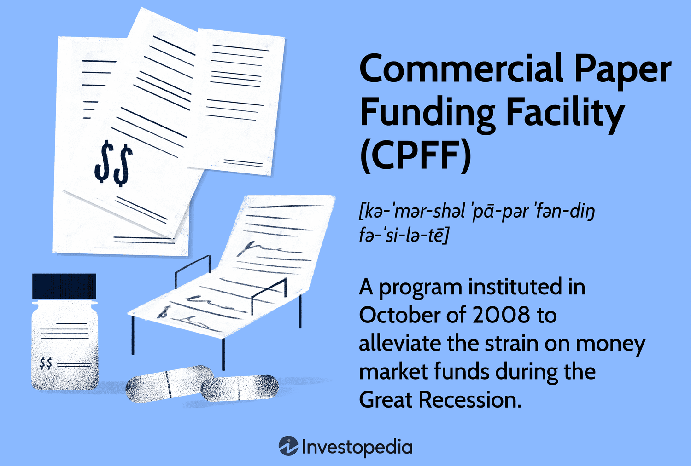

In the complex tapestry of financial markets, the Commercial Paper Funding Facility (CPFF) stands out as a crucial intervention by the Federal Reserve during periods of economic distress. Initially introduced in response to the 2008 financial crisis, the CPFF was designed to provide liquidity to the commercial paper market, which is pivotal for the short-term financing needs of corporations. As firms rely on commercial paper to fund everyday operational costs, the freeze in this market during the crisis threatened to exacerbate financial instability. The CPFF aimed to purchase short-term debt from corporations, thereby restoring investor confidence and ensuring that essential short-term financing remained available.

The reactivation of the CPFF during the COVID-19 pandemic further highlighted its importance in maintaining financial stability. With global economies facing unprecedented disruptions, the Federal Reserve once again employed the CPFF to support the flow of credit to households and businesses, mitigating the financial stresses of the pandemic-inflicted economic downturn. The swift implementation of this facility illustrated its role as a stabilizing force, crucial in safeguarding economic resilience in times of crisis.

This article explores the intersection of the CPFF, its role within the Federal Reserve's monetary policy framework, and the rising influence of algorithmic trading in financial markets. As financial environments grow increasingly complex, understanding these components offers valuable insights into how economic stability is pursued through strategic intervention and advanced trading technologies.

## Table of Contents

## Understanding the Commercial Paper Funding Facility (CPFF)

The Commercial Paper Funding Facility (CPFF) was established by the Federal Reserve as a critical response to the liquidity shortages faced in the commercial paper market. This facility was first introduced during the 2008 financial crisis, where it served as an important mechanism for restoring market functionality. By purchasing short-term corporate debt instruments, the CPFF provided a direct way to stabilize the financial system. This intervention aimed to restore investor confidence and ensure that businesses could maintain access to crucial operational funding.

The CPFF's operational framework involves the use of a Special Purpose Vehicle (SPV), specifically set up for this purpose, which is backed by the Federal Reserve Bank of New York. The SPV purchases commercial paper, thus supplying liquidity to the market. By circumventing traditional banking mechanisms and dealing directly in the commercial paper market, the CPFF effectively reduces the risk of gridlocks in corporate credit flows. This strategic approach not only bolstered market confidence during times of unprecedented stress but also ensured that credit was available to corporations needing to finance day-to-day operations, such as payroll and inventories.

During the 2008 financial crisis, the CPFF was instrumental in mitigating the systemic risks that threatened to cascade through the economy. The Federal Reserve's intervention through the CPFF addressed market anxieties by offering a reliable funding backstop. This involved purchasing commercial paper with high credit ratings from eligible issuers, thereby supporting liquidity and stabilizing issuance rates. As a result, the CPFF continually reassured both issuers and investors, providing them with the necessary confidence to resume normal market activities.

Similarly, the CPFF was reactivated in response to the financial disruptions precipitated by the COVID-19 pandemic in 2020. The pandemic caused substantial disruptions in the financial markets, leading to elevated uncertainty and risk aversion behaviors among investors. The Federal Reserve's swift action in re-establishing the CPFF during this period underscored its effectiveness in preserving financial stability. Through this facility, businesses could maintain access to short-term funding, ensuring the continuity of operations despite the economic challenges posed by the pandemic.

Overall, the CPFF has proven to be a pivotal instrument in the Federal Reserve's toolkit for maintaining financial stability. By ensuring [liquidity](/wiki/liquidity-risk-premium) in the commercial paper market, it plays a vital role in the broader efforts to mitigate financial crises and support the economy during periods of uncertainty.

## Role of the Federal Reserve in Economic Stabilization

The Federal Reserve is essential in stabilizing financial markets, primarily during periods of economic disruption. Its role involves deploying a range of tools, such as the Commercial Paper Funding Facility (CPFF), to maintain liquidity within critical sectors and sustain economic activity. The CPFF, specifically, serves to provide a safety net for the commercial paper market by purchasing short-term debt instruments from corporations, thereby bolstering market confidence and ensuring that businesses can secure necessary funding even during financial turmoil.

In addition to the CPFF, the Federal Reserve's comprehensive monetary policy approach includes mechanisms like [interest rate](/wiki/interest-rate-trading-strategies) adjustments and quantitative easing. Adjusting interest rates influences the cost of borrowing and encourages or discourages spending and investment. For instance, a lower interest rate reduces borrowing costs, which can stimulate economic activity during downturns. Quantitative easing, another significant tool, involves the purchase of longer-term securities to increase the money supply and lower interest rates, further facilitating borrowing and spending.

The proactive measures undertaken by the Federal Reserve, such as the establishment of the CPFF, illustrate its commitment to preventing financial collapse and ensuring economic resilience. By intervening in financial markets to provide liquidity and stability, the Federal Reserve helps mitigate the adverse effects of economic disruptions, striving to preserve the integrity and functionality of the broader economic system. This strategic intervention plays a vital role in nurturing investor confidence and sustaining the foundational aspects of economic growth and stability.

## Commercial Paper and Its Importance in Corporate Finance

Commercial paper is an unsecured, short-term debt instrument issued by corporations to meet immediate financial needs such as payroll and inventory financing. Typically, these instruments have maturities ranging from a few days to under a year, making them a vital component of corporate finance strategies aimed at ensuring liquidity and operational continuity.

As a financial instrument, commercial paper serves as a cornerstone of corporate finance by offering an efficient means of tapping into the capital markets for short-term funding. Companies rely on this form of debt to bridge timing gaps between when income is received and expenses are due, thereby preventing interruptions in business operations. The cost-effectiveness and flexibility of commercial paper make it an attractive option, enabling companies to manage their cash flow without incurring substantial interest costs typically associated with longer-term debt.

Pricing and availability are key factors influencing the use of commercial paper. The interest rates, often reflective of prevailing market conditions and the creditworthiness of the issuing entity, directly affect a company's financial health. During periods of economic stability, commercial paper markets tend to exhibit lower interest rates and higher liquidity, providing an affordable financing solution. Conversely, in times of economic stress or uncertainty—such as financial crises or abrupt market downturns—the commercial paper market can tighten, leading to increased borrowing costs and reduced access to funds.

The robustness of this market is crucial for the smooth operation of corporate America, as disruptions can significantly hinder a company's ability to finance short-term obligations, potentially leading to cascading operational and financial issues. As such, both regulators and market participants place a strong emphasis on maintaining a healthy commercial paper market, supplemented by mechanisms such as the Federal Reserve's Commercial Paper Funding Facility, which acts as a backstop during economic turmoil.

In summary, commercial paper is integral to corporate financial management, serving as a flexible and cost-effective tool for securing short-term funding. Its role is particularly pivotal during economic downturns, where access to inexpensive and reliable financing can determine a corporation's ability to sustain operations and avert financial distress.

## The Emergence of Algorithmic Trading in Financial Markets

Algorithmic trading has fundamentally reshaped financial markets by enabling faster, more efficient, and precise execution of trades. This transformation leverages sophisticated algorithms designed to automate trading processes, reducing human intervention and enhancing decision-making capabilities. Algorithmic trading systems analyze large volumes of data to pinpoint trading opportunities, operating across global markets to optimize portfolio performance.

One of the primary advantages of [algorithmic trading](/wiki/algorithmic-trading) lies in its ability to process and respond to complex market conditions with exceptional speed. During periods of financial instability, such as those when the Commercial Paper Funding Facility (CPFF) was activated, algorithmic systems provide resilience by quickly adapting to rapidly changing market environments. For instance, the turmoil experienced during the 2008 financial crisis and the COVID-19 pandemic demanded quick responses from financial institutions. Algorithms equipped with real-time data analytics and [machine learning](/wiki/machine-learning) capabilities can manage these demands by predicting market trends and executing trades at optimal times.

Algorithmic systems deploy various strategies, such as statistical [arbitrage](/wiki/arbitrage), [market making](/wiki/market-making), and trend-following, to exploit inefficiencies and trends in the market. The power of these algorithms largely stems from their ability to analyze datasets comprising various financial indicators, historical prices, and economic signals to generate actionable insights. Consequently, markets have become more interconnected and fluid, as algorithms facilitate transactions that align with global financial movements.

Despite these benefits, the integration of algorithmic trading also introduces challenges. The rapid execution and high-frequency nature of these systems contribute to increased market [volatility](/wiki/volatility-trading-strategies), especially during stressed conditions. High-frequency trading ([HFT](/wiki/high-frequency-trading-strategies)), a subset of algorithmic trading, is especially noted for exacerbating short-term volatility due to its reliance on minimal price differences and execution speed. This has prompted debates regarding the systemic risks posed by algorithmic strategies, necessitating scrutiny by regulatory bodies.

As markets evolve, algorithmic trading continues to amplify the efficiency and responsiveness of financial systems. However, striking a balance between exploiting market opportunities and managing emerging risks remains a critical focus for financial institutions and regulators.

## Impact of CPFF on Algorithmic Trading Strategies

The introduction of the Commercial Paper Funding Facility (CPFF) significantly influences algorithmic trading strategies by stabilizing the commercial paper market and reducing associated volatility. Commercial paper markets are crucial for corporate short-term financing, and any instability here can ripple across broader financial markets, affecting the pricing and volatility of various financial instruments. The CPFF helps to mitigate these ripple effects by ensuring liquidity and fostering stability. 

Algorithmic traders, adept at capitalizing on high volumes and price fluctuations, may need to adjust their strategies in response to the reduced volatility introduced by the CPFF. These traders rely on historical data and quantitative models to predict price movements and execute trades at optimal times. When market conditions stabilize due to the CPFF, there is typically less volatility for algorithms to exploit, potentially leading to fewer trading opportunities based on rapid price changes.

However, the stabilization created by the CPFF results in a more predictable trading environment, which may benefit algorithmic strategies focusing on different aspects of market behavior, such as arbitrage opportunities or trend-following techniques. These strategies often require a consistent supply of liquidity to function effectively. A stable market ensures that algorithms can rely on steady execution conditions, which is paramount for precision-based trading approaches.

Moreover, understanding the effects of CPFF initiatives is essential for developing robust algorithmic trading models. Traders can incorporate changes in market stability into their algorithms, optimizing their performance across diverse market conditions. For instance, machine learning models might be trained to adjust their decision-making processes according to predefined stability indicators or thresholds evidenced during CPFF interventions.

In conclusion, the CPFF, by stabilizing the commercial paper market, influences algorithmic trading by modifying market volatility dynamics. This necessitates strategic adjustments by traders to maintain effectiveness, compelling them to adapt their algorithms to an evolving market landscape characterized by financial interventions aimed at securing liquidity and predictability.

## Conclusion

The CPFF underscores the Federal Reserve’s commitment to maintaining economic stability through strategic intervention. By providing a liquidity lifeline to the commercial paper market, the CPFF acts as a critical stabilizer during financial disruptions, ensuring that corporations continue to meet their short-term financing needs. This direct intervention demonstrates the Fed's pivotal role in sustaining the flow of credit, thereby maintaining overall economic activity.

The integration of algorithmic trading with such funding facilities marks a significant evolution in financial markets, highlighting the synergy between monetary policy and advanced trading technologies. Algorithmic trading, with its reliance on speed, efficiency, and data-driven strategies, benefits from the predictable environment fostered by interventions like the CPFF. This interplay creates a robust framework for executing trades, mitigating risks, and enhancing market liquidity.

As financial markets grow increasingly complex, the fusion of these elements will shape the future trajectory of economic activity. The evolving landscape demands continuous adaptation and exploration from investors, policymakers, and financial institutions to effectively harness the interplay between regulatory mechanisms and technological advancements. Understanding this dynamic will be crucial for navigating future economic challenges and sustaining market vitality.

## References & Further Reading

[1]: Kacperczyk, M., & Schnabl, P. (2010). ["When Safe Proved Risky: Commercial Paper during the Financial Crisis of 2007-2009."](https://www.nber.org/papers/w15538) Journal of Economic Perspectives, 24(1), 29-50.

[2]: Adrian, T., Kimbrough, K., & Marchioni, D. (2010). ["The Federal Reserve's Commercial Paper Funding Facility."](https://www.newyorkfed.org/medialibrary/media/research/epr/11v17n1/1105adri.pdf) Finance and Economics Discussion Series, Federal Reserve Board.

[3]: Goyenko, R. Y., Subrahmanyam, A., & Ukhov, A. D. (2011). ["The Term Structure of Bond Market Liquidity and Its Implications for Corporate Bond Issuance."](https://www.researchgate.net/publication/386504641_Herding_in_Crisis_Financial_Contagion_and_Collective_Panic_During_Economic_Turmoil) Journal of Financial and Quantitative Analysis, 46(1), 111-139.

[4]: ["Algorithmic Trading: Winning Strategies and Their Rationale"](https://www.wiley.com/en-us/Algorithmic+Trading%3A+Winning+Strategies+and+Their+Rationale-p-9781118460146) by Ernie Chan

[5]: Duffie, D. (2010). ["Presidential Address: Asset Price Dynamics with Slow-Moving Capital."](https://www.darrellduffie.com/uploads/1/4/8/0/148007615/duffieafapresidentialaddress2010.pdf) Journal of Finance, 65(4), 1237-1267.