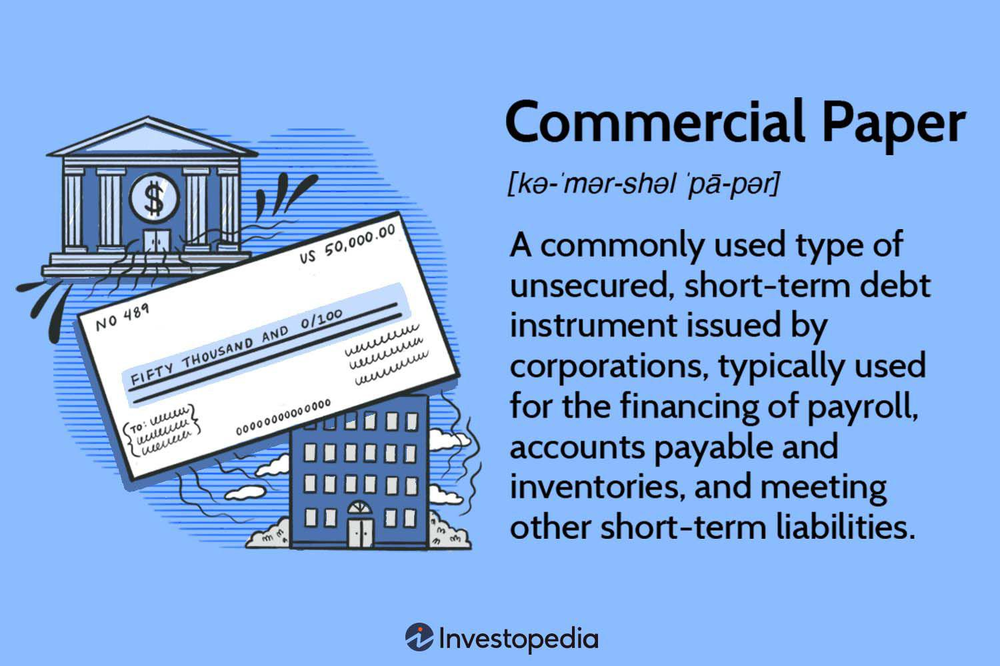

In the fast-paced world of finance, the need for efficient financial management tools is paramount to ensure sustainability and growth within corporations. One such financial instrument that has become integral in corporate finance is commercial paper. As an unsecured, short-term debt instrument, commercial paper provides companies a practical means to fulfill immediate financial obligations such as payroll, inventories, and other short-term liabilities. The ability to quickly raise funds without the extension of collateral offers corporations a distinct advantage, allowing for flexibility and agility in financial management.

Parallel to the utility of commercial paper is the transformative impact of advancements in technology, particularly in algorithmic trading. Algorithmic trading employs sophisticated algorithms to execute trades at optimal conditions, playing a crucial role in revolutionizing financial markets. By enabling the execution of trades at high speed and accuracy, algorithmic strategies enhance market liquidity and identify price inefficiencies, leading to more effective trading practices.

This article explores the synergistic relationship between commercial paper as a fundamental tool for short-term corporate financing and the dynamics introduced by algorithmic trading. It investigates into how these two facets collectively contribute to the evolving landscape of modern finance, emphasizing efficiency, liquidity, and risk management in today’s dynamic financial environment.

## Table of Contents

## Understanding Commercial Paper

Commercial paper is a fundamental financial instrument utilized by corporations to manage short-term funding needs. As an unsecured, short-term debt instrument, it is issued by corporations to cover short-term liabilities such as payroll and inventory costs. This attribute makes it a preferred choice for companies looking for quick access to capital without the prerequisite of collateral.

Typically, commercial papers are issued at a discount to their face value. Investors purchase them for less than their nominal value, with the opportunity to benefit upon maturity when they are redeemed at full face value. This difference between the discounted purchase price and the face value constitutes the investor's profit. The maturity period for commercial paper is characteristically short, often ranging from 1 to 270 days, aligning with the corporate need for prompt financial solutions.

The issuance of commercial paper offers a cost-effective method for raising funds. The main allure for corporations lies in the lower interest rates compared to traditional bank loans. This cost-effectiveness, coupled with the absence of a need for collateral, ensures that commercial paper remains an attractive option for companies with strong credit ratings seeking swift financial relief. Consequently, commercial paper plays a critical role in the spectrum of corporate financing tools, providing a pragmatic solution for addressing immediate financial obligations.

## Types of Commercial Paper

Commercial paper is a versatile financial instrument widely used by corporations to meet their immediate financial needs. Within the broad category of commercial paper, there are several distinct types, each serving unique purposes and structured differently to cater to various financial strategies.

### Promissory Notes
Promissory notes are among the most straightforward types of commercial paper. These are written promises by the issuer to pay a specified amount to the holder at a predetermined future date. Typically, these notes are sold at a discount to their nominal value, meaning that the investor pays less for the note than its payoff value at maturity. The difference between the purchase price and the face value represents the investor's return. A typical equation to calculate the return on a promissory note is given by:

$$
\text{Return} = \frac{\text{Face Value} - \text{Purchase Price}}{\text{Purchase Price}} \times 100\%
$$

### Drafts
Drafts are utilized as instructions for payments made for goods or services. They can be issued as sight drafts, payable upon presentation to the drawee, or as time drafts, payable at a future date. Sight drafts provide immediate payment to the bearer upon presentation, optimizing [liquidity](/wiki/liquidity-risk-premium) for international transactions, whereas time drafts offer the flexibility of future payments, easing cash flow management.

### Bankers’ Acceptances
Bankers’ acceptances represent time drafts that are guaranteed by a bank. These instruments are prevalent in international trade as they provide a reliable and secure promise of payment, backed by the issuing bank. The bank’s guarantee reduces the credit risk involved for the investor, making variations in interest rates and the issuer's creditworthiness less of a concern.

### Certificate of Deposits (CDs)
Certificates of Deposits (CDs) are time deposits offered by banks with a fixed [interest rate](/wiki/interest-rate-trading-strategies) and a specified maturity date. Within the commercial paper context, they are used due to their high liquidity. Banks issue CDs to raise short-term capital, and their predictable returns make them an attractive option for risk-averse investors seeking to incorporate stable income-generating assets into their portfolios.

### Repurchase Agreements (Repos)
Repurchase agreements, or repos, are agreements where the seller of a security commits to repurchasing it at a predetermined future date and price. Repos are effectively collateralized loans, providing short-term liquidity to the seller. They play a critical role in money markets by offering a secure investment avenue with predictable returns. The repo rate, which is the cost of borrowing cash through repos, can be used as a benchmark for other interest rates in financial markets.

These diverse types of commercial paper provide both issuers and investors with flexible, efficient means of meeting short-term financial requirements, catering to varying levels of risk appetite and liquidity needs.

## Advantages of Commercial Paper

Commercial paper serves as a versatile and advantageous instrument for corporate financing, especially for meeting short-term financial commitments. One of its most notable advantages is that commercial paper with a maturity of up to 270 days is exempt from registration with the U.S. Securities and Exchange Commission (SEC). This exemption significantly reduces the regulatory burden on issuers, making it an efficient and streamlined financing option.

This type of financing is a simpler and less expensive alternative compared to traditional bank loans. Issuing commercial paper does not require collateral or the lengthy approval processes often associated with bank loans. As a result, corporations can access needed funds more quickly, which is particularly advantageous during times when fast-paced financial maneuvers are required.

Corporations that issue commercial paper usually benefit from lower interest rates, primarily because the interest rates are often tied to prevailing market rates, such as the London Interbank Offered Rate (LIBOR) or the U.S. federal funds rate. The ability to raise funds at lower interest costs allows these corporations to optimize their capital structures and minimize financial expenses.

From an investor's perspective, commercial paper offers a low risk of default, especially when issued by companies with strong credit ratings. The short maturity period further reduces risks associated with interest rate fluctuations and credit downgrades. As a result, investors can place their funds in commercial paper as a relatively secure short-term investment vehicle.

Additionally, commercial paper provides investors with an opportunity for portfolio diversification. Including short-term debt instruments like commercial paper in an investment portfolio can enhance the overall risk-return profile. It allows investors to spread their risk across different asset types and maturities, contributing to a more balanced and resilient investment strategy.

In summary, the advantages of commercial paper lie in its cost-effectiveness, regulatory efficiency, lower interest rates for issuers, and portfolio diversification opportunities for investors, all while maintaining a low risk of default. These features make commercial paper a favorable choice for corporations seeking quick financing and for investors looking to diversify their portfolios with short-term debt instruments.

## Risks and Challenges

Commercial paper, while a valuable financial instrument for short-term corporate financing, comes with its own set of risks and challenges that must be carefully managed by both issuers and investors.

One significant limitation is that only companies with excellent credit ratings are in a position to issue commercial paper. This requirement stems from the unsecured nature of these instruments, as they do not require collateral. Investors rely heavily on the creditworthiness of the issuing company to ensure that the obligations will be met upon maturity. Therefore, companies without a strong credit rating often find it difficult to participate in this market, which limits the pool of potential issuers.

The use of funds raised through commercial paper is another constraining [factor](/wiki/factor-investing). These funds are typically restricted to financing current liabilities, such as payroll and inventories, and are not suitable for long-term investments. This restriction is due to the short maturity period of commercial paper, which generally ranges from 1 to 270 days. The nature of these funds as short-term liabilities makes them impractical for projects or investments that require a longer timeline to generate returns.

For investors, despite the perceived security in the short lifespan of commercial paper, the returns are generally lower compared to other investment avenues. This is especially true when contrasted with instruments like bonds or equities, which can offer higher potential returns albeit with increased risk. The relatively low yield on commercial paper is primarily a consequence of its lower risk profile and the high credit rating of its issuers.

In conclusion, while commercial paper can be an efficient way for corporations to meet short-term financial obligations, both issuers and investors must be mindful of its constraints. Companies with lower credit ratings are typically excluded from this financing option. Additionally, the funds raised are restricted to short-term uses, and the returns for investors may not be as attractive compared to other financial instruments. These factors necessitate careful consideration and management to effectively utilize commercial paper in financial strategies.

## Algorithmic Trading and Commercial Paper

Algorithmic trading utilizes computer algorithms to execute trades based on pre-defined criteria, optimizing conditions to improve trading performance. This approach significantly enhances market liquidity by automating large-[volume](/wiki/volume-trading-strategy) orders and allowing traders to swiftly react to market dynamics. One of the primary advantages of [algorithmic trading](/wiki/algorithmic-trading) is its ability to identify pricing inefficiencies. By continuously analyzing vast datasets, algorithms can detect at a granular level where prices deviate from expected norms and capitalize on these discrepancies through timely trade execution.

In the context of commercial paper, algorithmic trading facilitates both risk assessment and pricing efficiency. Traditionally, commercial paper involves short-term investments that require precise timing and pricing to optimize returns and manage risks effectively. Algorithms can process historical and real-time data to evaluate market trends and assess the risk associated with particular issuances of commercial paper. They can integrate various financial indicators to develop models that predict market movements, thereby assisting traders in making informed decisions regarding the issuance or acquisition of commercial paper.

The speed and efficiency of algorithms also transform the trading of commercial paper by enabling quicker transactions. This is crucial in the world of commercial paper, where the ability to swiftly execute trades can lead to significant benefits, given the instrument's short-term nature. Automated trading systems can swiftly access and interpret market data, leading to efficient trade execution that minimizes market impact and transaction costs.

Moreover, algorithmic trading supports the liquidity of commercial paper markets. By facilitating the movement of large orders without significant price shifts, algorithms ensure that the market remains fluid, allowing participants to enter and [exit](/wiki/exit-strategy) positions more easily. This reliability attracts a broader range of investors and issuers, further stabilizing and expanding the market.

In summary, algorithmic trading enhances the efficiency and efficacy of commercial paper trading. Through superior risk management, precise pricing, and increased market liquidity, algorithms represent a vital tool in modern financial markets, increasing the attractiveness of commercial paper to both investors and issuers.

## Conclusion

Commercial paper remains a critical tool for short-term corporate financing, providing corporations with a streamlined mechanism to meet immediate liquidity needs without the encumbrances of traditional banking procedures. The synergy between commercial paper and algorithmic trading marks a significant development in the financial landscape, combining traditional financial instruments with cutting-edge technology to optimize outcomes.

Algorithmic trading, characterized by the use of sophisticated algorithms to execute trades at high speed and precision, complements the nature of commercial paper by enhancing both liquidity and market efficiency. It allows for the swift processing of transactions, reducing the time to market for commercial paper and ensuring better pricing through real-time analysis and execution. This increased efficiency benefits both issuers, who can secure funding at favorable rates, and investors, who gain access to timely investment opportunities.

Additionally, the integration of algorithmic trading in the commercial paper market aids in superior risk management. Algorithms are adept at analyzing vast amounts of data, identifying potential risks, and executing trades with calculated precision to mitigate such risks. This capability ensures that both issuers and investors can navigate market volatilities with greater confidence.

By adopting these instruments in tandem, stakeholders can leverage improved market conditions and enhanced liquidity, which are paramount in today's fast-paced financial markets. The competitive advantages offered by the combination of commercial paper and algorithmic trading enable corporations to maintain agility and capitalize on market opportunities, underpinning a robust and dynamic financial ecosystem.

## References & Further Reading

[1]: ["Commercial Paper Markets"](https://www.investopedia.com/terms/c/commercialpaper.asp), Board of Governors of the Federal Reserve System.

[2]: Markus K. Brunnermeier, Stefan Nagel, & Lasse H. Pedersen. (2008). ["Carry Trades and Currency Crashes."](https://www.nber.org/system/files/working_papers/w14473/w14473.pdf) In NBER Macroeconomics Annual, Volume 23.

[3]: ["Algorithmic Trading and DMA: An Introduction to Direct Access Trading Strategies"](https://archive.org/details/algorithmictradi0000john) by Barry Johnson

[4]: ["Using Algorithmic Trading on Corporate Bonds"](https://www.axios.com/2022/01/19/algorithmic-bond-trades-portfolio-trading), a study by Ron Young and Michael F. Shaw

[5]: Campbell R. Harvey, & Yan Liu. (2014). ["Backtesting"](https://papers.ssrn.com/sol3/papers.cfm?abstract_id=2345489). National Bureau of Economic Research.

[6]: ["Principles of Financial Engineering"](https://www.sciencedirect.com/book/9780123735744/principles-of-financial-engineering) by Robert L. Navin