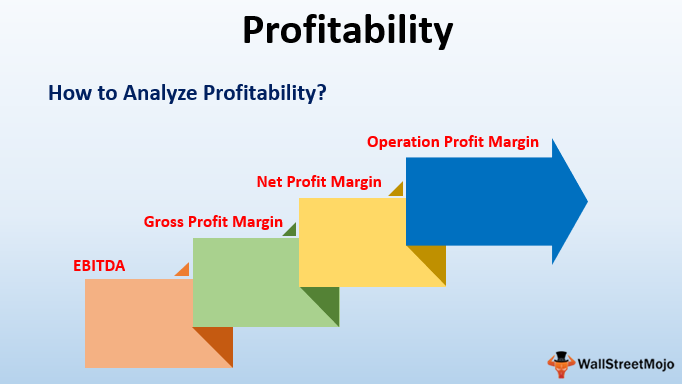

The world of real estate investment is rich with opportunities, and within this vast landscape, the commercial property sector stands out as a particularly lucrative avenue. Commercial properties, which encompass offices, retail spaces, and industrial properties, present investors with unique potential for profitability. Their value is primarily driven by the dual forces of rental income and capital appreciation. These properties often yield higher returns compared to residential investments due to factors such as long-term lease agreements and diverse tenant bases.

In maximizing these returns, sophisticated investment strategies come into play, and technology plays a pivotal role in enhancing these strategies. One such advanced technological approach is algorithmic trading, a method traditionally associated with financial markets but increasingly applied to real estate investments. Algorithmic trading involves using computer algorithms to make data-driven decisions, optimizing investment portfolios by predicting market trends through complex analyses of extensive datasets. Its application in real estate optimizes property profitability by swiftly identifying lucrative investment opportunities and mitigating risks.

The synergy of traditional investment strategies and modern technology is transforming the commercial real estate sector. Investors can achieve substantial benefits by integrating algorithmic trading into their decision-making processes. Notably, this approach provides a distinct advantage through its speed, precision, and ability to handle vast amounts of data, thus offering a significant edge in the highly competitive market.

Key concepts critical to understanding these dynamics include commercial property, property investment strategies, and algorithmic trading. Commercial properties serve as income-producing real estate assets, while property investment strategies such as buy-and-hold, flipping, and leasing focus on maximizing returns through different means. Meanwhile, algorithmic trading, though primarily rooted in financial securities, is increasingly relevant for real estate investors seeking to leverage technology for enhanced investment outputs.

In this rapidly evolving environment, combining traditional and technological investment strategies promises a more strategic and profitable engagement with the commercial property market. The integration of these approaches not only reflects the continuing evolution of the sector but also underscores the importance for investors to adapt to emerging technological advancements.

## Table of Contents

## Understanding Real Estate Investment in Commercial Properties

Commercial real estate encompasses properties that are used strictly for business-related purposes or to provide a workspace rather than a living space. The primary types of commercial properties include office spaces, retail locations, and industrial properties. Office spaces are usually divided into categories like Class A, B, or C, based on location, infrastructure quality, and amenities. Retail spaces consist of shopping centers, malls, and individual stores, while industrial properties include warehouses, manufacturing buildings, and distribution centers.

Investing in commercial real estate offers a profitability potential that often surpasses residential investments due to several factors. First, commercial properties typically provide higher income yields. Rental income tends to be more consistent and larger in [volume](/wiki/volume-trading-strategy), primarily because businesses often require long-term leases. These leases can extend five years or more, providing stability in cash flow. Furthermore, in many cases, commercial leases require tenants to cover additional property expenses such as maintenance and insurance, thereby lowering operating costs for property owners.

The success of commercial property investments is heavily influenced by key factors such as location, market demand, and prevailing economic conditions. A prime location, for example, can attract high-end businesses and ensure a steady demand for space, leading to increased property values and rental rates. Market demand, shaped by industry trends and economic cycles, dictates how appealing a property is to prospective tenants. When economic conditions are robust, businesses expand and demand for commercial spaces increases. Conversely, during economic downturns, businesses downsize or shut down, leading to higher vacancy rates and reduced rental income.

Common strategies for commercial real estate investment include buy-and-hold, flipping, and leasing. In the buy-and-hold approach, investors purchase properties to generate rental income over time, working to increase the property's overall value. Flipping involves buying properties to refurbish or upgrade them and then selling them at a higher price. Leasing strategies focus on setting up flexible lease terms that can attract tenants while ensuring profitability. 

Despite the potential profitability, investors face several challenges. High upfront costs and stringent financing terms often serve as significant barriers to entry. The complexity of managing commercial properties, which can involve dealing with multiple tenants, maintaining property value, and complying with zoning laws and regulations, also adds to the difficulty. Moreover, external economic factors can lead to fluctuations in occupancy rates and thus impact profitability.

In summary, commercial real estate investment remains a robust opportunity for long-term income and capital growth. The interplay of strategic location, market demand, and favorable economic climates can enhance profitability. However, investors must navigate challenges by employing well-thought-out strategies to mitigate risks and leverage opportunities effectively.

## Property Profitability Metrics and Strategies

Property profitability in commercial real estate is determined by several key metrics and strategies that investors use to evaluate and enhance their investments. Understanding these metrics is crucial for making informed decisions and optimizing return on investment (ROI).

### Key Profitability Metrics

1. **Return on Investment (ROI):** This metric indicates the efficiency of an investment. ROI is calculated by dividing the net profit by the total investment cost and multiplying by 100 to get a percentage:
$$
   \text{ROI} = \left( \frac{\text{Net Profit}}{\text{Total Investment Cost}} \right) \times 100

$$
   ROI allows investors to compare the profitability of different investments.

2. **Capitalization Rate (Cap Rate):** This metric provides a quick snapshot of a property's return potential, showcasing the expected rate of return. It is calculated by dividing the Net Operating Income (NOI) by the current market value of the property:
$$
   \text{Cap Rate} = \frac{\text{NOI}}{\text{Current Market Value}}

$$
   A higher cap rate indicates a potentially higher return, though it may also signal increased risk.

3. **Net Operating Income (NOI):** This is the revenue generated from the property, minus all operating expenses, excluding taxes and financing costs. It reflects the earnings generated by the property itself:
$$
   \text{NOI} = \text{Total Revenue} - \text{Operating Expenses}

$$

4. **Cash on Cash Return:** This metric measures the cash income earned on the cash invested in a property. It is calculated by dividing the annual pre-tax cash flow by the total cash invested:
$$
   \text{Cash on Cash Return} = \left( \frac{\text{Annual Pre-Tax Cash Flow}}{\text{Total Cash Invested}} \right) \times 100

$$

### Strategies for Enhancing Property Profitability

- **Buy-and-Hold Strategy:** This involves purchasing properties and holding them for long-term gains. The strategy benefits from property appreciation and rental income over time, providing a steady cash flow and potential for significant capital gains.

- **Flipping:** This strategy comprises buying properties, renovating them, and quickly selling them for a profit. Successful flipping requires a keen eye for undervalued properties and potential for value addition through renovations.

- **Leasing:** Investors can generate consistent income by leasing commercial properties. Effective management and leasing agreements can greatly enhance property value and income over time.

### Evaluating Potential Properties

Accurate evaluation of potential properties is crucial for maximizing returns. Investors must consider factors like location, market trends, and the condition of the property. An adept evaluation strategy includes analyzing comparable properties, understanding zoning laws, and predicting future market developments.

### Examples of Successful Commercial Property Investments

An example of a successful commercial property investment is the transformation of a rundown warehouse into a thriving co-working space. The investors identified the property in a growing urban area, renovated it to meet demand for flexible office space, and created an appealing environment. Through strategic leasing and property management, they achieved high occupancy rates, ensuring steady NOI and a robust Cap Rate.

In conclusion, using the right metrics and strategies, investors can make informed decisions, optimize profitability, and increase the value of their commercial real estate investments.

## Algorithmic Trading in Real Estate Investments

Algorithmic trading, traditionally associated with financial markets, involves the use of algorithms to automate and enhance trading decisions. These algorithms are programmed to analyze vast datasets, execute trades at optimal times, and maximize profitability. Within the context of real estate investments, [algorithmic trading](/wiki/algorithmic-trading) represents an innovative approach that can potentially revolutionize how investors assess and engage with commercial properties.

In real estate, algorithmic trading can inform decision-making through data-driven insights. Algorithms can process a myriad of data points, such as market trends, property values, occupancy rates, and economic indicators, facilitating a granular analysis of potential investments. This ability to swiftly analyze numerous variables helps investors identify lucrative opportunities that may otherwise go unnoticed.

The benefits of implementing algorithmic trading in real estate include speed, precision, and the capability to process extensive datasets. Algorithms can quickly assess and react to market changes, providing investors with precise buy or sell signals. This speed is particularly advantageous in fluctuating markets where rapid decision-making is crucial. Moreover, the analytical precision offered by these algorithms reduces the likelihood of human error, allowing for more accurate forecasting and risk assessment.

Despite its advantages, algorithmic trading also presents challenges. One significant issue is the potential over-reliance on technology. Investors may be tempted to depend solely on algorithmic outcomes without considering qualitative factors that a machine may not account for, such as legal regulations or community sentiments. Additionally, there is the risk of over-optimization, where an algorithm is fine-tuned to perform exceptionally well on historical data but fails when confronted with new, unforeseen market conditions. This can result in suboptimal investment decisions if the algorithm's past performance is mistaken as a guarantee of future results.

In summary, the integration of algorithmic trading in real estate investments offers promising benefits but necessitates a balanced approach to mitigate risks associated with over-reliance and over-optimization. As technology and algorithms evolve, they will likely play an increasingly integral role in how commercial property investors strategize and operate.

## The Synergy between Real Estate Investments and Algo Trading

Algorithmic trading, initially popularized within the stock markets, has found a new frontier in real estate investments. The integration of algorithmic processes allows investors to complement traditional real estate strategies, offering enhanced decision-making capabilities through the processing and analysis of large datasets.

Algorithmic trading systems can manage real estate portfolios by leveraging data-driven insights to predict potential market movements, aligning investments with those trends. For example, these systems can analyze variables such as interest rates, economic forecasts, local market trends, and even consumer sentiment gleaned from social media. By incorporating these diverse data points, realistic predictive models are created, equipping investors with precise insights into optimal buy, hold, or sell actions.

Several case studies illustrate the improved management of real estate portfolios through algorithmic trading. A notable example is a fund that incorporated [machine learning](/wiki/machine-learning) algorithms to assess millions of market data points, leading to optimized purchasing strategies and significant financial gains. By applying these algorithms, the fund achieved greater accuracy in property valuation predictions and managed to decrease operational costs by preemptively identifying underperforming assets.

Looking forward, the future of algorithmic trading in real estate points towards the increasing adoption of AI-driven platforms that offer end-to-end solutions, covering everything from property identification to transaction execution. Predictive analytics, a subset of AI, is becoming crucial for discerning investment opportunities by offering forecasts based on patterns identified in vast datasets. Furthermore, the integration of blockchain technology is proving transformative, offering enhanced transparency and security in property transactions.

Investors can leverage these synergies to secure strategic advantages. By integrating algorithmic trading systems with human insights, they can enhance their portfolio management, identify lucrative investment opportunities faster, and optimize value extraction from their assets. A strategic mix of technology-assisted analysis and traditional market knowledge is key to navigating the complex landscape of modern real estate investment. 

As technological advancements continue, the potential for algorithmic trading to reshape traditional real estate investment strategies will only grow, encouraging a more data-centric approach to property investment.

## Conclusion

The synergy between real estate investment and algorithmic trading holds significant promise for enhancing commercial property profitability. Throughout this exploration, several key points have emerged. Commercial properties such as offices, retail spaces, and industrial facilities present diverse opportunities for investors, often yielding higher profitability than residential properties. This appeal is magnified by factors such as strategic location, market demand, and prevailing economic conditions. Traditional investment strategies, including buy-and-hold, flipping, and leasing, have long been utilized to maximize returns. However, the integration of algorithmic trading introduces a transformative dimension to these strategies.

Algorithmic trading, with its speed and precision in processing vast datasets, can significantly enhance decision-making in real estate investments. By leveraging algorithms, investors can optimize property portfolios with improved accuracy and reduced reliance on subjective judgement. While potential risks such as over-reliance on technology and over-optimization exist, the benefits generally outweigh these challenges when implemented judiciously.

The convergence of traditional investment strategies with the precision of algorithmic trading signifies an evolutionary step in real estate investment. By combining tried-and-tested methods with modern technological innovations, investors can unlock new avenues for profitability and efficiency. This evolution is ongoing, underscoring the crucial need for investors to adapt to technological advancements.

To maximize returns, investors are encouraged to harness both traditional and contemporary strategies. By remaining open to evolving technologies such as AI-driven real estate platforms, predictive analytics, and blockchain, they can gain a strategic advantage. The future of real estate investment lies in the harmonious blend of proven strategies with technological innovation, enabling adaptive and forward-thinking approaches to commercial property profitability.

## References & Further Reading

1. **"Investing in Income Properties: The Big Six Formula for Achieving Wealth in Real Estate" by Kenneth D. Rosen**  
   This book provides insights into strategic commercial real estate investments and profitability optimization. It covers different property types and offers practical guidance for investors. [Link to Amazon](https://www.amazon.com/Investing-Income-Properties-Achieving-Financial/dp/0471781205)

2. **"Real Estate Finance and Investments" by William B. Brueggeman and Jeffrey D. Fisher**  
   A comprehensive guide on real estate finance, this book explains key investment concepts and metrics such as ROI and Cap Rate, vital for real estate investors looking to enhance property profitability. [Link to Amazon](https://www.amazon.com/Real-Estate-Finance-Investments-Brueggeman/dp/1259919684)

3. **"Algorithmic Trading: Winning Strategies and Their Rationale" by Ernie Chan**  
   Offering a deep dive into the world of algorithmic trading, this book covers algorithms' development and application, useful for understanding its potential in real estate investment strategies. [Link to Amazon](https://www.amazon.com/Algorithmic-Trading-Winning-Strategies-Rationale/dp/1118460146)

4. **"The Real Estate Wholesaling Bible: The Fastest, Easiest Way to Get Started in Real Estate Investing" by Than Merrill**  
   This text provides insights into various real estate investment strategies, including wholesaling and flipping, which are essential techniques for maximizing profitability in commercial properties. [Link to Amazon](https://www.amazon.com/Real-Estate-Wholesaling-Bible-Fastest/dp/1118807529)

5. **Investopedia Articles on Real Estate Investment Metrics**  
   Investopedia has several articles explaining profitability metrics like Net Operating Income (NOI), Cash on Cash Return, and Capitalization Rate, crucial for evaluating commercial properties. [Link to Investopedia](https://www.investopedia.com)

6. **"High-Frequency Trading: A Practical Guide to Algorithmic Strategies and Trading Systems" by Irene Aldridge**  
   For investors interested in integrating algorithmic trading with real estate, this book illustrates high-frequency trading's principles and models, which can be adapted to real estate market analysis. [Link to Amazon](https://www.amazon.com/High-Frequency-Trading-Algorithmic-Strategies-International/dp/1118343506)

7. **U.S. Securities and Exchange Commission (SEC) - Algorithmic Trading**  
   The SEC provides ongoing updates and guidelines on algorithmic trading, including its use in financial markets and real estate investments. [Link to SEC](https://www.sec.gov)

8. **"Commercial Real Estate Analysis and Investments" by David M. Geltner and Norman G. Miller**  
   A detailed text exploring various aspects of commercial real estate investment, including market dynamics and property valuation methods. [Link to Amazon](https://www.amazon.com/Commercial-Estate-Analysis-Investments-Geltner/dp/0324305486)

These resources will provide readers with a thorough understanding of commercial real estate investment and algorithmic trading, supporting further exploration into the synergy of these fields.