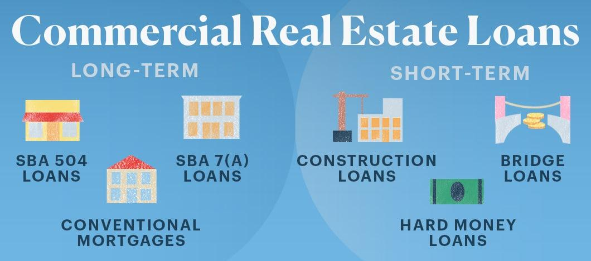

## Table of Contents

## What is a commercial real estate loan?

A commercial real estate loan is a type of loan that businesses use to buy, build, or improve properties they use for their business. These properties can be things like office buildings, stores, warehouses, or hotels. Unlike home loans, which are for people buying houses to live in, commercial real estate loans are for properties that help a business make money.

These loans usually have different terms and conditions compared to home loans. They often have higher interest rates and need a bigger down payment. The loan amount and terms can depend on the property's value, the business's financial health, and how much money the property is expected to make. Lenders look at these things carefully before deciding to give a commercial real estate loan.

## What types of properties can be financed with a commercial real estate loan?

Commercial real estate loans can be used to finance many different kinds of properties that businesses use to make money. These include office buildings where companies have their offices, retail spaces like stores or shopping centers where businesses sell things to customers, and warehouses or industrial buildings where companies store or make products. Hotels and motels, which provide lodging for travelers, are also common properties financed with these loans.

Apart from these, commercial real estate loans can also finance apartment buildings with five or more units, which are considered commercial because they generate rental income. Special purpose properties like hospitals, schools, or churches can also be financed, as they serve specific functions for the community. The key thing is that the property should be used for business or income-generating activities, not for personal use like a family home.

## Who typically qualifies for a commercial real estate loan?

Businesses or investors who want to buy, build, or improve properties for business use usually qualify for a commercial real estate loan. These loans are not for people buying homes to live in, but for properties that help make money, like stores, offices, or warehouses. To get a commercial real estate loan, a business needs to show that it can pay back the loan. Lenders look at the business's credit history, how much money it makes, and its overall financial health. They also consider how much the property is worth and how much money it could make.

Sometimes, the people who own the business need to personally guarantee the loan, which means they promise to pay it back if the business can't. This makes the loan riskier for them but can help them get approved. Lenders might also ask for a bigger down payment than with home loans, often 20% to 30% of the property's price. The terms of the loan, like how long it lasts and the [interest rate](/wiki/interest-rate-trading-strategies), depend on the property and the business's finances. Overall, qualifying for a commercial real estate loan requires a strong business plan and good financial standing.

## What are the common terms and conditions of commercial real estate loans?

Commercial real estate loans come with different terms and conditions compared to home loans. They often have higher interest rates because they are riskier for lenders. The interest rate can be fixed, which stays the same for the whole loan, or variable, which can change over time. The loan term, or how long you have to pay it back, can be short, like 5 years, or longer, up to 20 or 30 years. Lenders might ask for a bigger down payment, usually between 20% to 30% of the property's price. This means you need to pay a large amount upfront before the lender gives you the rest of the money.

Besides the basic terms, there are other conditions to think about. Lenders will want to see a good business plan and proof that the property can make money. They will check your business's credit history and financial health to make sure you can pay back the loan. Sometimes, the owners of the business need to personally guarantee the loan, which means they promise to pay it back if the business can't. This can make it easier to get the loan but also increases the risk for the owners. Overall, the terms and conditions of commercial real estate loans are set up to protect the lender while helping businesses grow.

## How does the loan-to-value ratio affect commercial real estate loans?

The loan-to-value (LTV) ratio is really important when it comes to commercial real estate loans. It's a number that shows how much of the property's price the lender is willing to loan you. For example, if the LTV ratio is 70%, the lender will give you 70% of the property's value, and you need to pay the other 30% yourself. A higher LTV ratio means you get to borrow more money, but it's also riskier for the lender because if you can't pay back the loan, they might not get all their money back when they sell the property.

Lenders look at the LTV ratio to decide if they should give you a loan and what terms to offer. If the LTV ratio is low, like 60%, it's safer for the lender, so they might give you a better interest rate or easier terms. But if the LTV ratio is high, like 80%, it's riskier, so they might charge a higher interest rate or ask for more guarantees. The LTV ratio affects how much you need to pay upfront and how much you can borrow, so it's a big part of getting a commercial real estate loan.

## What are the differences between recourse and non-recourse commercial real estate loans?

Recourse and non-recourse commercial real estate loans are two different ways lenders can get their money back if a borrower can't pay back the loan. With a recourse loan, if you can't pay back the loan, the lender can go after your other assets or even your personal money to get what they're owed. This means if selling the property doesn't cover the full loan amount, you could lose more than just the property. Recourse loans are riskier for borrowers but can be easier to get because they're less risky for lenders.

On the other hand, non-recourse loans are safer for borrowers. If you can't pay back the loan, the lender can only take the property you bought with the loan. They can't go after your other assets or personal money. This means if the property's value drops and you can't pay back the full loan, you won't lose anything else. Non-recourse loans are harder to get and usually have stricter terms because they're riskier for lenders.

## How do interest rates for commercial real estate loans compare to residential loans?

Interest rates for commercial real estate loans are usually higher than for residential loans. This is because commercial loans are riskier for lenders. When a business takes out a loan to buy a property, the lender looks at the business's ability to pay it back, which can be harder to predict than a person's ability to pay back a home loan. Because of this risk, lenders charge higher interest rates on commercial loans to make up for it. Also, commercial loans often have shorter terms, which means businesses need to pay them back faster, adding to the risk.

Residential loans, on the other hand, are for people buying homes to live in. These loans are seen as less risky because people usually put a lot of effort into keeping their homes, and the terms are often longer, like 30 years. This makes it easier for people to pay back the loan over time. Because of the lower risk, lenders offer lower interest rates on residential loans. So, if you're comparing the two, you'll find that commercial real estate loans generally have higher interest rates than residential loans.

## What documentation is required to apply for a commercial real estate loan?

To apply for a commercial real estate loan, you need to gather a lot of documents to show the lender that your business can pay back the loan. You'll need to provide financial statements for your business, like balance sheets, income statements, and cash flow statements. These show how much money your business makes and spends. You'll also need to show your business's tax returns for the last few years. If you're buying a property, you'll need to give the lender information about the property, like an appraisal to show its value and a purchase agreement if you've already made a deal.

Besides these, you'll need to provide a business plan that explains what you'll do with the property and how it will help your business make money. Lenders want to see that you have a good plan. You might also need to give personal financial information, like your personal credit report and tax returns, especially if you're personally guaranteeing the loan. This means you're promising to pay back the loan if your business can't. All these documents help the lender decide if they should give you the loan and what terms to offer.

## How can one improve their chances of getting approved for a commercial real estate loan?

To improve your chances of getting approved for a commercial real estate loan, start by making your business look strong and reliable. This means keeping your business's credit score high by paying bills on time and managing debts well. Also, make sure your financial statements show that your business makes enough money to pay back the loan. Lenders like to see good cash flow and a healthy balance sheet. It can also help to have a solid business plan that explains clearly how the property will help your business grow and make money.

Another way to boost your approval chances is to offer a bigger down payment. This shows the lender that you're serious about the loan and reduces their risk. Sometimes, having a personal guarantee can help, too, because it means you're promising to pay back the loan if your business can't. Lastly, working with a good real estate broker or loan officer can make a big difference. They know what lenders look for and can help you prepare your application to look its best.

## What are the risks associated with commercial real estate loans?

Commercial real estate loans come with some risks that you should know about. One big risk is that if your business can't pay back the loan, you might lose the property you bought with the loan. If it's a recourse loan, you could even lose your other assets or personal money. Another risk is that interest rates might go up, making your loan payments higher. This can be tough on your business's cash flow, especially if you have a variable rate loan.

Another thing to think about is that the property's value might go down. If you need to sell it but it's worth less than what you owe on the loan, you could end up losing money. Also, if your business doesn't make as much money as you expected, it might be hard to keep up with the loan payments. This can put a lot of stress on your business and might even lead to bankruptcy if things get really bad. So, it's important to think carefully about these risks before taking out a commercial real estate loan.

## How do economic cycles impact commercial real estate loan rates and availability?

Economic cycles can really change how easy it is to get a commercial real estate loan and what the interest rates are like. When the economy is doing well, businesses are making more money and lenders feel more sure about giving out loans. This means it's easier to get a loan, and the interest rates might be lower because lenders think the risk is smaller. But when the economy starts to slow down, things can change a lot. Lenders might get worried about businesses not being able to pay back loans, so they might make it harder to get a loan or charge higher interest rates to cover the extra risk.

During tough economic times, like a recession, it can be really hard to get a commercial real estate loan. Lenders are more careful and might only give loans to businesses that they're really sure about. Interest rates can go up because lenders want to make sure they're covered if businesses struggle to pay back the loans. So, knowing where the economy is in its cycle can help you plan when to apply for a loan and what kind of terms you might get.

## What advanced strategies can be used to manage and optimize commercial real estate loan portfolios?

Managing and optimizing a commercial real estate loan portfolio involves smart planning and keeping a close eye on things. One good strategy is to spread out your loans across different types of properties and locations. This way, if one area or type of property has problems, your whole portfolio won't be in trouble. You can also use technology to help you. There are tools that can look at data and tell you which loans are doing well and which ones might need more attention. This helps you make better decisions about where to put your money and how to handle risks.

Another important strategy is to always keep an eye on interest rates and economic trends. If you think rates are going to go up, you might want to lock in fixed-rate loans to keep your payments steady. On the other hand, if rates are going down, variable-rate loans might save you money. It's also a good idea to keep talking to your lenders and maybe even renegotiate your loan terms if it makes sense. By staying flexible and ready to adjust your plans, you can make sure your commercial real estate loan portfolio stays strong and grows over time.

## What is Understanding Real Estate Finance?

Real estate finance encompasses the mechanisms used to acquire land or property for commercial use. It involves various financial structures and instruments specifically tailored to meet the unique needs of the commercial real estate market. A primary instrument in this field is the commercial real estate loan, which differs significantly from residential loans. Understanding these differences is vital for anyone engaged in the acquisition or management of commercial properties.

Commercial real estate loans are characterized by distinct terms that set them apart from residential loans. They often require more substantial upfront investments, which are typically reflected in the larger down payment amounts. Loan terms such as maturity periods, repayment structures, and loan-to-value (LTV) ratios are crucial components that determine the viability and attractiveness of a financial package. The loan-to-value ratio, in particular, is a critical metric that represents the ratio of a loan to the value of the asset purchased. A lower LTV ratio indicates less risk to the lender because lower loan amounts are involved compared to the property’s value.

To further evaluate the soundness of an investment, investors must understand financial metrics such as the Debt-Service Coverage Ratio (DSCR). The DSCR is a measure of the cash flow available to cover debt obligations and is calculated as:

$$
DSCR = \frac{\text{Net Operating Income (NOI)}}{\text{Total Debt Service}}
$$

A DSCR greater than 1 indicates that a property generates sufficient income to cover its debt service, while a DSCR below 1 signifies potential difficulty in meeting debt obligations, making it a key consideration for lenders when assessing loan applications.

Interest rates also play a pivotal role in shaping the landscape of real estate finance. They affect both the cost of borrowing and the overall return on investment for commercial properties. Interest rates can vary significantly based on the borrower's creditworthiness, the type of property, and prevailing market conditions.

In addition to understanding these financial metrics, investors must navigate the prerequisites for securing loans. Credit scores are a vital component, reflecting the borrower’s ability to repay the loan. A higher credit score can result in more favorable loan terms, such as lower interest rates. Collateral requirements are also a major consideration, where the property itself often serves as security for the loan. The valuation of this collateral can significantly impact the terms and availability of financing.

Therefore, a profound understanding of real estate finance mechanisms, financial instruments, and associated metrics is crucial for making informed decisions in the commercial real estate sector. This knowledge not only aids in evaluating investment opportunities but also equips investors with the tools to optimize their financial strategies efficiently.

## References & Further Reading

[1]: Bergstra, J., Bardenet, R., Bengio, Y., & Kégl, B. (2011). ["Algorithms for Hyper-Parameter Optimization."](https://papers.nips.cc/paper/4443-algorithms-for-hyper-parameter-optimization) Advances in Neural Information Processing Systems 24.

[2]: ["Advances in Financial Machine Learning"](https://www.amazon.com/Advances-Financial-Machine-Learning-Marcos/dp/1119482089) by Marcos Lopez de Prado

[3]: ["Evidence-Based Technical Analysis: Applying the Scientific Method and Statistical Inference to Trading Signals"](https://www.amazon.com/Evidence-Based-Technical-Analysis-Scientific-Statistical/dp/0470008741) by David Aronson

[4]: ["Machine Learning for Algorithmic Trading"](https://github.com/stefan-jansen/machine-learning-for-trading) by Stefan Jansen

[5]: ["Quantitative Trading: How to Build Your Own Algorithmic Trading Business"](https://www.amazon.com/Quantitative-Trading-Build-Algorithmic-Business/dp/1119800064) by Ernest P. Chan